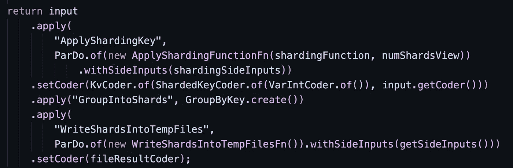
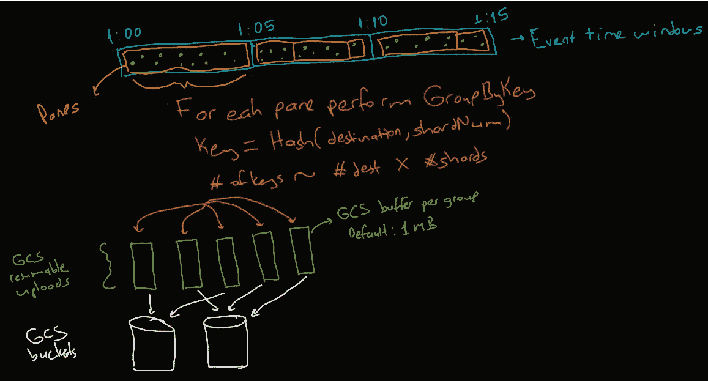
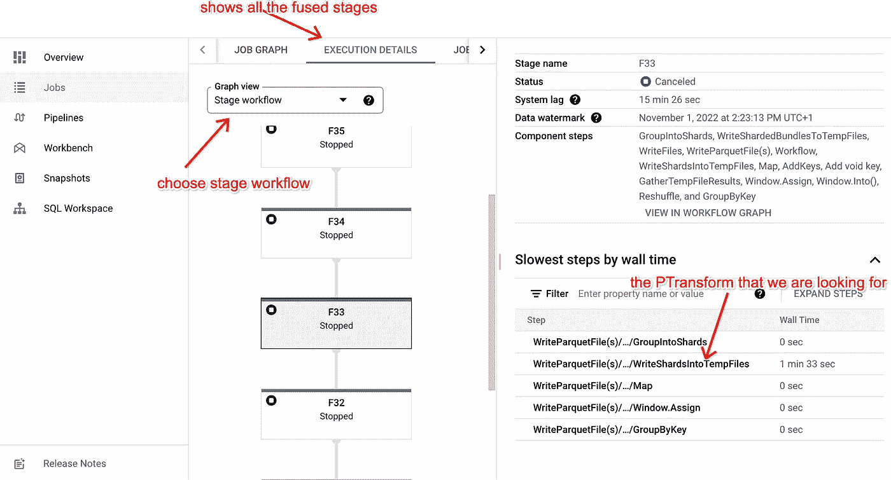
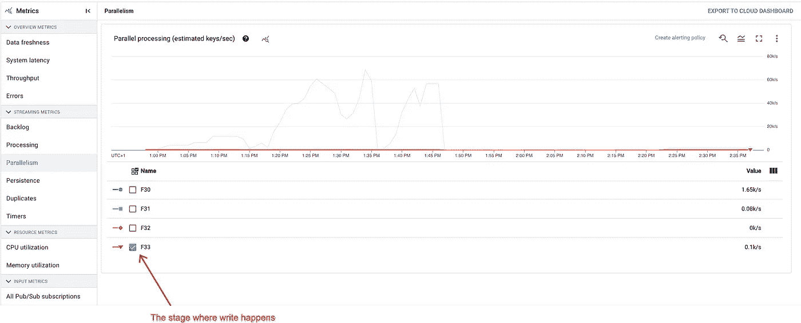
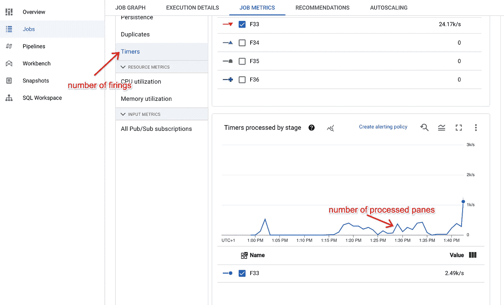
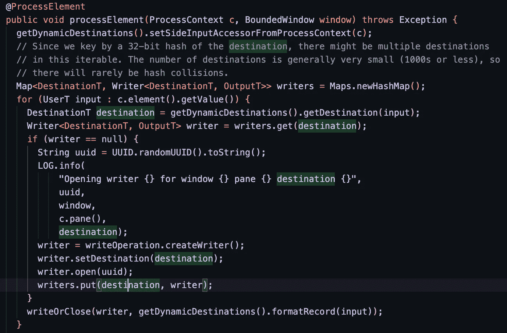

# 如何在通过 Apache Beam/Dataflow 向 GCS 传输数据时防止 OOMs？

> 原文：<https://medium.com/google-cloud/how-to-prevent-ooms-while-streaming-data-to-gcs-via-apache-beam-dataflow-53ec37987626?source=collection_archive---------0----------------------->

让我们承认，当你处理大量数据时，流式传输是一项具有挑战性的任务。我在将数据传输到 GCS 时遇到的一个常见问题是内存不足(OOM)错误。别慌，你不是一个人，每个人都会这样。


不要惊慌，你并不孤单

# 让我们看看后端发生了什么

假设我们有一个包含以下 Java 代码的管道。我们用动态目的地和固定数量的碎片将拼花文件写入 GC。

```
.apply( "WriteParquetFile(s)",
        FileIO.<Destination,GenericRecord>*writeDynamic*()
                .by(new DestinationBuilder())
                .via(ParquetIO.*sink*(schema))
                .to(options.getOutputBucket())
                .withCompression(Compression.*SNAPPY*)
                .withNumShards(options.getNumShards())                .withDestinationCoder(AvroCoder.*of*(Destination.class))
                .withNaming(key-> FileIO.Write.*defaultNaming*(key.getPath(),".parquet") )
);
```

神奇的事情发生在[WriteFiles.java](https://github.dev/apache/beam/blob/master/sdks/java/core/src/main/java/org/apache/beam/sdk/io/WriteFiles.java)梁库中，在我们的例子中是在*WriteShardedBundlesToTempFiles*pttransform 中，代码如下:



数据被分成碎片，然后写入 GCS

那么实际上发生了什么呢？如下所示，对于每个窗口及其窗格(多个，以防您有早/晚触发)，我们应用 GroupByKey。关键是目的地和碎片的组合。它们被散列，但是由于散列有相当大的空间，你可以假设**组数= # keys x # shards** 。分组后，Beam 使用 GCS 连接器进行写入。默认情况下，GCS 连接器为每个组创建 1MB 的缓冲区，并通过 GCS API 执行可恢复的上传。



具有动态目的地和碎片的 FileIO

让我们举几个例子来看看内存影响。

1.  **没有提前点火的窗户**。假设每个窗口平均有 10 个动态目的地，我们有 5 个碎片。如果没有提前触发，窗口触发器将按顺序触发。平行化将受到限制。那么，只有 GCS 缓冲区起作用:1 个窗口 x 10 个目的地 x 5 个碎片 x 1MB 缓冲区= 50MB。在缓冲区之上，我们还有实际的数据。
2.  **有早期点火的窗户。由于我们有早期触发，多个窗口触发器开始并行触发。假设我们当前打开了 10 个窗口，因为我们有未排序的最新数据。目的地和碎片同上。那么我们的 GCS 缓冲区至少消耗 10 个窗口 x 10 个目的地 x 5 个碎片 x 1MB = 500 MB。**

如您所见，当您并行执行许多写操作时，事情可能会突然变得非常糟糕。好的一面是，这些写操作中的每一个都由单个线程处理，并且通过数据流引擎在虚拟机之间进行分配。

# 我们有什么选择来防止 OOMs 并增加吞吐量？

1.  **VM 大小**定义了一台机器上所有线程的共享内存。您应该提供更大的机器(例如，highmem 机器)或使用数据流垂直自动缩放来避免 OOMs。
2.  **number of worker harness threads**参数定义了每个虚拟机的线程数量。默认情况下，流式管道的值为 300。通过降低该限制，我们降低了流水线的并行性，但是我们也限制了内存消耗。总是有权衡的。请注意，数据流具有工作负载重新平衡功能，因此它在机器之间移动工作负载，以避免一台机器过度拥挤。
3.  **numShards** 定义了我们为每个键和窗口创建的碎片数量。一个键的每个窗口/窗格都被分成碎片，以进一步减少每个线程的消息大小，并并行写入 GC。碎片可以帮助你调整在 GCS 中创建的文件的大小，同时也可以并行写入 GCS。如果您发现 GCS 吞吐量很低，增加碎片的数量可能会有所帮助。
4.  **gcsUploadBufferSizeBytes** 定义 GCS 可恢复上传操作的缓冲区大小。无论数据大小如何，每个 GCS 编写器线程都会在开始时分配这个缓冲区。Beam 中默认设置为 [1MB](https://github.com/apache/beam/blob/master/runners/google-cloud-dataflow-java/src/main/java/org/apache/beam/runners/dataflow/DataflowRunner.java#L223) ，而原来的 GCS 连接器使用 [8MB](https://github.com/GoogleCloudDataproc/hadoop-connectors/blob/master/util/src/main/java/com/google/cloud/hadoop/util/AsyncWriteChannelOptions.java#L42) 。光束覆盖这个领域，以避免 OOMs 的情况下，太多的作家开放。
5.  **管道分支**可用于根据高容量主题设置参数。有些主题和分区会生成更多的文件。对于那些人来说，最好提供更多的碎片来划分数据。我们建议[大容量的分支 p 集合](https://beam.apache.org/documentation/pipelines/design-your-pipeline/#branching-pcollections)为它们设置更大的 numShards。

# 如何监控？

数据流作业度量页面允许您查看内存消耗和许多其他度量。如果您启用[数据流分析选项](https://cloud.google.com/dataflow/docs/guides/profiling-a-pipeline#enable_for_pipelines)，那么您甚至可以看到堆空间的使用情况。

一个被忽视但很重要的指标是**并行度**。它帮助我们在写入阶段看到每个窗口的*键数。首先，通过转到“执行细节”选项卡并尝试找到 WriteShardsIntoTempFiles 的 PTransform，找出正确的融合阶段。如下图所示，它处于 F33 阶段。*



数据流将连续的转换融合到一个阶段中。您可以在“执行细节”选项卡中找到写转换的阶段。

发现阶段(在我的例子中为 F33)后，转到作业指标选项卡并选择并行度。在那里你会看到钥匙的数量。我的是 100 (5 个目的地和 20 个碎片)。这表示平均每个窗口的数据分为 100 组。



并行度度量仅适用于启用了流式引擎的管道。它显示了键的数量以及每个阶段的并行度。

如果有更多的窗口/窗格同时被触发，可能会有更多的组。并行度定义了估计的键，而不是实际触发的分组。我们也可以发现这一点！在**计时器**指标下，我们看到所有等待和已处理的窗格/窗口。在我的例子中，我通常有大约 200 个窗格同时启动，最后峰值达到 2.5K。



计时器显示发射的数量。由于我的管道中有早期点火，我看到的点火比并行性更多。

即使有 2.5K 的峰值(每个窗格 1MB 缓冲区 x 2.5K = 2.5 MB)，**我也不应该有任何内存中断。发生了什么事**？

所以我检查了我的输出文件，发现每个 parquet 文件都有几百个字节。**每条消息都有自己的文件！**

以下代码来自 FileIO-WriteShardsIntoTempFilesFn。对于每个输入消息，选择一个目的地写入器。目标编写器是一个哈希映射。你猜怎么着？我还没有为目标类实现我的 Java POJO 的散列函数！这就是为什么对于每一台机器，由于每个对象都有唯一的 java hash，所以会创建一个新的 writer。默认情况下，每个写入器都有自己的 1MB 缓冲区，尽管我只有几百字节大小的消息。结果是数百万条消息和数千兆字节的内存使用。通过在我的 POJO 中添加一个简单的散列函数，问题就解决了。现在，我有几千字节大小的文件。



FileIO—writeshardsintotempfiles fn。每条消息都被发送到一个编写器，编写器是根据消息的哈希来选择的。