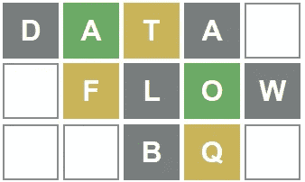
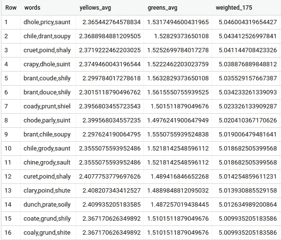
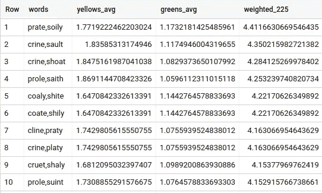
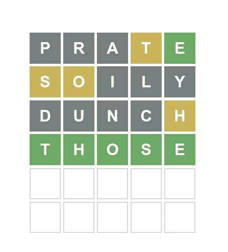

# 如何正确使用数据流和 BigQuery 播放 Wordle？

> 原文：<https://medium.com/google-cloud/how-to-properly-play-wordle-using-dataflow-and-bigquery-825d2f4099ac?source=collection_archive---------0----------------------->



***编辑*** :我正好在 2022 年梁峰会的时候讲过这个。下面是[的演讲](https://www.youtube.com/watch?v=uDdcL7wCXB0)，与文章基本相同，但做了一些额外的优化。如果你想检查代码，它在 [GitHub](https://github.com/InigoSJ/beam-summit/blob/main/2022/wordle.py) 上。

如果你过去几周一直在社交媒体上，你可能知道什么是 **Wordle** 。如果没有，请允许我解释为什么这些随机的人在 Twitter 和 Whatsapp 上分享奇怪的盒子。

**Wordle** 是一个游戏，你有 6 次机会猜测一个 5 个字母的单词，你尝试的每个单词都会告诉你最后一个单词中的字母(黄色)以及它们是否在正确的位置(绿色)。例如，如果最后一个单词是" *hello* "并且您尝试将"*放在*下面"，则子字符串" *el* "将是绿色的(因为它们在正确的位置)，而" *o* "将是黄色的(因为它在最后一个单词中，但是在错误的位置)。

和朋友聊天时，我想出了一个提高胜率的策略。我的想法是从包含最常见字母的 3 个单词开始，然后用它们来猜最后一个单词。不出所料，我的朋友说我的策略很愚蠢，最好用每个新单词给你带来的知识去猜测。尽管我很固执，但我决定证明他们是错的，有志者事竟成，那就是使用我最喜欢的大数据工具，**云数据流**和**大查询**。

还有其他文章讨论最佳起始词(他们通常指向“ *soare* ”)，甚至是使用代码的解决方案查找器，由编码人员和语言学家共同完成。我在这里的目标是找到可以使用的最佳单词集，不管最后的单词是什么，并且会给你(平均)最好的结果。请注意，这种方法并不试图最小化回合，而是最大化胜率。

这里的自然问题是，三个单词的哪个组合是最好的？这可能看起来是一个简单的问题，但是考虑到组合的数量是巨大的，计算实际的最佳组合并不是那么简单。Wordle 字典包含大约 10，000 个单词，所以如果我们天真地想要测试每一种可能性，我们会得到 10 种组合，我们需要比这更聪明。

# **优化和设计**

我们可以进行一些优化:

1.  我们不想要有字母交集的两个单词的组合，我们已经使用前一个收集了关于那个字母的信息。
2.  因为单词之间没有交集，所以不管你按什么顺序玩，最终结果都是一样的(后面会有更多的介绍)。因为我们组合了 3 个单词，所以我们有 3 个！可能的组合，我们只关心其中的一种。因此，我们可以将组合总数减少 6 倍。
3.  我们可以使用类似于(1)的逻辑，取出有重复字母的单词。没错，结尾的单词可能有重复的字母，但同样，我们的目标是用 3 个单词收集尽可能多的信息，不管最终目标是什么。

第一次优化将我们从 10 个组合减少到略少于 8 个 10⁹组合(作为参考，大约 230 GB)。应用第二次优化也将组合减少到预期的 13 亿个单词(前一步的六分之一)。最后，去掉有重复字母的单词，并把它们组合起来，得到不到 6500 万个组合，即 1.8 GB 的数据。我们在西班牙语中说，“大脑比肌肉好”。

好的，这很好，但是我是如何组合的，最好的单词是什么？这是一个高度并行化的任务，所以 Apache Beam 和 T2 数据流非常适合。鉴于我容易出错，而且这是一项繁重的任务，我将把它分成多个**数据流**作业。这不仅有助于我避免因设置检查点而犯的错误，还使本文和代码更具可读性。当然，这可以通过单个管道来实现，但这里我只介绍单个管道。一旦有了结果，我们就使用 **BigQuery** 进行评估。

我分成的任务是:

1.  过滤掉有重复字母的单词。
2.  把单词互相组合，先是只有两个，然后是三个。如前所述，我只在没有交集的情况下进行合并，然后对单词进行去重。
3.  对照可能的答案检查单词组合，数出黄色和绿色。
4.  使用 **BigQuery** 存储并评估结果。

## **删除有重复字母的单词**

过滤掉单词相当容易，数据量相当小，任务也不重，所以这可以用一个标准的 Python 脚本来完成，不需要 **Beam** 也不需要**数据流**。为了保持一致性，我使用 *DirectRunner* 用 **Apache** **Beam** 做了这个，下面是方法:

```
def single_letter(word):
    for i, l in enumerate(word):
        if l in word[i + 1:]:
            return False
    return True(p | ReadFromText(f"gs://{bucket}/allowed.txt")
   | Filter(single_letter)
   | WriteToText(f"gs://{bucket}/no-repeated", 
                 file_name_suffix=".txt",
                 shard_name_template='',
                 num_shards=1)
)
```

**过滤排列**

好了，我们有了需要互相组合的单词，然后去掉互相排列的单词(例如，“ *hello，world*”=“*world，hello* ”)。为此，我们将使用*p transform*[**Distinct**](https://beam.apache.org/releases/pydoc/current/apache_beam.transforms.util.html?#apache_beam.transforms.util.Distinct)，但是我们需要拥有相同的元素，因此我们将在运行**Distinct***p transform*之前对单词进行排序，以便相同的两个单词输出相同的组合，而不管顺序如何。

```
def combine_words_dedup(main, side_words, size=3):
    def _leter_intersection(word1, word2):
        for l in word1:
            if l in word2:
                return True
        return False

    for side in side_words:
        intersection = _leter_intersection(main, side)
        if not intersection:
            if size == 2 and main > side:
                yield f"{side},{main}"
            else:
                yield f"{main},{side}"{..}side_words = p |  "Side Words" >> ReadFromText(f"gs://{bucket}/no-repeated.txt")words = (p | "Main Words" >> ReadFromText(f"gs://{bucket}/no-repeated.txt")
           | "Combine words" >> FlatMap(combine_words_dedup, 
                          side_words=beam.pvalue.AsList(side_words), 
                          size=2)
           | Distinct()
           | WriteToText(f"gs://{bucket}/two-words", file_name_suffix=".txt")
        )
```

对于两个单词的组合，我们可以如上所示将它们就地排序，对于三个单词的组合，我们需要拆分然后排序，因为新加入的单词可能在排序后位于中间(即，" *hello，world* " + " *green* "应该是" *hello，green，world* "而不是" *hello，world，green* ")。因此，我们需要在我们的管道中添加一个步骤，即**排序:**

```
words = (p | "Main Words" >> ReadFromText(f"gs://{bucket}/two-words*")
           | "Combine words" >>  FlatMap(combine_words_dedup, 
                                         side_words=beam.pvalue.AsList(side_words))
           | "Sort" >> Map(lambda x: ",".join(sorted(x.split(",")))) # Only used for size three words
           | Distinct()
           | WriteToText(f"gs://{bucket}/three-words", file_name_suffix=".txt")
        )
```

**对比可能的答案**

很好，现在我们有了两个和三个单词的组合，没有重复的字母，也没有可能排列的重复，现在是时候实际计算这些组合有多好了。

我们正在将这些组合与 Wordle 可能的最终答案进行比较，这比 6300 个组合的 2300 个最终单词多一点，这意味着我们必须进行大约 1.45 * 10 次比较。我很高兴我在用数据流做这件事。

首先，我们需要一种方法来评分，所以我只是简单地计算每个组合在可能的答案中有多少个黄色和绿色，然后我会将它存储到 BQ 中，并在那里进行计算。这就是我正在使用的函数(它依赖于没有重复字母的事实)。

```
class WordleRow(DoFn):
    def process(self, words, answers, num_words=None):
        words_letters = [list(w) for w in words.split(",")]
        greens, yellows, total = 0, 0, 0
        for answer in answers:
            total += 1
            for word_letters in words_letters:
                for i, el in enumerate(word_letters):
                    if el == answer[i]:
                        greens += 1
                    elif el in answer:
                        yellows += 1 
        yield self._format_result(words, yellows, greens, total, num_words)

    def _format_result(self, words, yellows, greens, total, num_words):

        if not num_words:
            num_words = len(words.split(","))

        d = {
            "words": words, 
            "yellows": yellows, 
            "greens": greens, 
            "total": total,
            "yellows_avg": yellows / total,
            "greens_avg": greens / total,
            "amount_words": num_words
        }
        return d
```

如你所见，我还存储了每个组合的总字数以及平均值，只是为了完整。

完整的管道如下所示:

```
answers = (p | "Answers" >> ReadFromText(f"gs://{bucket}/answers.txt")
                      | Map(list))words = (p | "Combinations" >> ReadFromText(f"gs://{bucket}/three-words*")
           | ParDo(WordleRow(), answers=beam.pvalue.AsList(answers), num_words=3)
           | WriteToBigQuery(
               table,
               schema=schema,
               write_disposition=BigQueryDisposition.WRITE_APPEND,
               create_disposition=BigQueryDisposition.CREATE_IF_NEEDED
           )
```

我对这两个词的组合和最初过滤的词做了同样的处理，所以我们在 BigQuery 中也有这些信息。稍后您将会看到为什么这很方便。

**计算分数**

我们现在有一个包含所有组合结果的表，但是我们仍然需要找出哪些组合更好。

这并不像你想的那样是一个直截了当的问题，因为我们如何给这个组合打分呢？很明显，绿色字母应该比黄色字母更有价值，但是价值多少呢？这是不变的还是绿色信在早期更有价值？

为了回答这个问题，我确实检查了数据本身，并与一些人进行了交谈(包括我的朋友，他们不喜欢我的策略，认为这是大材小用)。前三个单词的组合得到大约 2.3 *黄色*和 1.5 *绿色*，所以我不能高估绿色字母。有两个*黄色*和两个绿色使得最终的单词非常明显，添加一个*绿色*或*黄色*在这一点上没有什么区别。所以我决定将绿色的*值为 1.75，黄色的*值为 1。**

当然，第一次尝试得到两个果岭和第三次不一样。我也想知道我应该按照什么顺序来玩单词的组合。因此，我使用绿色的 1.75 值来选择前 50 个单词，并生成可能是该组合一部分的两个单词，然后再次运行查询，根据这些单词进行过滤。在这种情况下，我把*果岭*的价值定为 2.25，因为早点有*果岭*显然更好。

能够快速进行这些计算是我选择 **BigQuery** 来存储结果的主要原因。我知道我需要调查数据，并有一些额外的上下文来找出最佳的可能组合， **BigQuery** 是正确的选择。

但是 inigo，“*你还是没有告诉我们最佳组合*”，你可能在想。嗯，你可能是对的，我没有，原因是我想解释我是如何得到这个答案的，因为“最好”的定义并不像有些人希望的那样清楚，但是不要再等了，它来了:

最佳组合是(按此顺序): **PRATE，SOILY，DUNCH**

理由是这样的:使用三个词的组合，“神奇组合”排名第 14 位，得分(*1.75*绿色*)为 *5.01* ，平均 *1.49* *绿色*和 *2.4 黄色*。排名第一的是“ *dhole，pricy，saunt”*，得分为 *2.365* *yellows* ， *1.53 greens* 和 *5.04* 加权，这是一个非常非常小的改进，但当衡量由这两个单词组成的两个单词组合时，“ *prate，soily”*则好得多(少 0.4 的加权得分*



使用权重 1.75 表示绿色的前 16 个单词

拥有一个强有力的两个单词的组合会给你很大的优势，你甚至不需要第三个单词。" *prate，soily* "使用绿色的权重 *2.25* 排名第六，这是第二个使用更多绿色的组合，但当使用 3 字组合顶部的单词时，它是最好的。



从前 3 个单词组合中生成的前 10 个双单词组合

现在我们只需要检查“prate”是否比“soily”更好，事实就是如此。

出于完整性和好奇心，这里有一些其他指标的琐事:

*   **大多数绿色:**

*(3 个字)布兰特、库德、席利*与 *1.5632* 果岭

(2 个字)*膜，固体*带 *1.205*

*(单字)塞恩*带 *0.666*

*   **最黄:**

*(3 个单词)estro，unhip，yclad* 带 *3.382 黄色*

(二字)*雌鹿，旋覆花*同 *2.652*

*(单字)estro* 带 *1.486*

*   **最佳加权:**

(3 个字，1.75 值) *dhole，pricy，saunt* 用 5.046

(2 个单词，2.25 个值) *clint，soare* 为 4.465

(单字，2.75 值)*等于*等于 2.923

*   **最佳黄色+绿色:**

(3 个单词) *dhole，pricy，saunt*3.897(此处有许多平局，使用绿色作为平局决胜符)， *dunch，prate，soily* 得到相同的和，但绿色更少

*两个字)【irone，索特*3.05(同样，很多领带)

(单字)*用 1.789 烘烤*

你可能会注意到“ *clint，soare* ”有一个很强的两个词的组合和最佳加权的单个词(“ *soare* ”)，但在检查三个词的组合时，这两个词的最佳组合(“ *soare，clint，humpy* ”)排名在第 400 位以上。如果你的目标是减少回合数，这可能是一个不错的组合。

# **注意事项及其他改进**

当然，所有这些计算都依赖于我做的一些假设，比如组合不应该有重复的字母，以及我对绿色和黄色的权重。

此外，英语中可能有一些细微差别，使得一些字母比其他字母更有价值，例如，在西班牙语中，如果你得到一个" *Q"* ，你知道后面会有一个" *U* "。从理论上讲，这应该已经通过平均计算出来了，但可能会有异常值。

我的假设可能导致结果不是最优的，但是我提供的答案应该是最优的一个很好的近似值。

如前所述，可以做许多改进来使管道运行得更快，以及用单个管道代替多个管道。可以做的最大改进之一是计算单个单词的绿色和黄色，然后通过简单地将没有交集的值相加来进行组合，这将避免多次计算单个单词的分数。我一开始没有这样做的原因是这样会使代码更难阅读，设计背后的原因更难理解。此外，这一改进将为我节省大约 30 分钟左右的等待时间，这是我并不真正关心的。

最后，有些人可能会认为，只要没有交集，计算最上面的单个单词并按顺序进行组合会返回最佳的单词组合。不幸的是，这不是真的，这种方法输出的单词远远超出了前 100 个组合。

# **学习**

在进行这些计算时，我想“陷入”天真方法会遇到的大多数问题(除了允许单词交叉)，所以我确实运行了所有没有改进的组合(重复数据删除和过滤有重复单词的单词)，只是为了知道我节省了多少时间。我的估计是，一个天真的方法将需要大约 100 倍以上(和 100 倍以上的成本)。

很明显，在处理这类问题时，有时我们需要后退一步，利用我们对数据的了解来构建我们的代码。

这篇文章的“坏处”是它破坏了我玩 **Wordle** 的乐趣。我一直在反复检查这种方法是否有效，并且我已经平均进行了大约 4 轮来得到正确的答案，我认为这是非常好的(再次注意，本文的目标是帮助获得正确的单词，而不管需要进行多少轮)

(剧透警报)

在这里，你可以用今天的**单词:**来测试我的策略



文字 227 4/6

希望你学到了一些东西，快乐 Wordling！