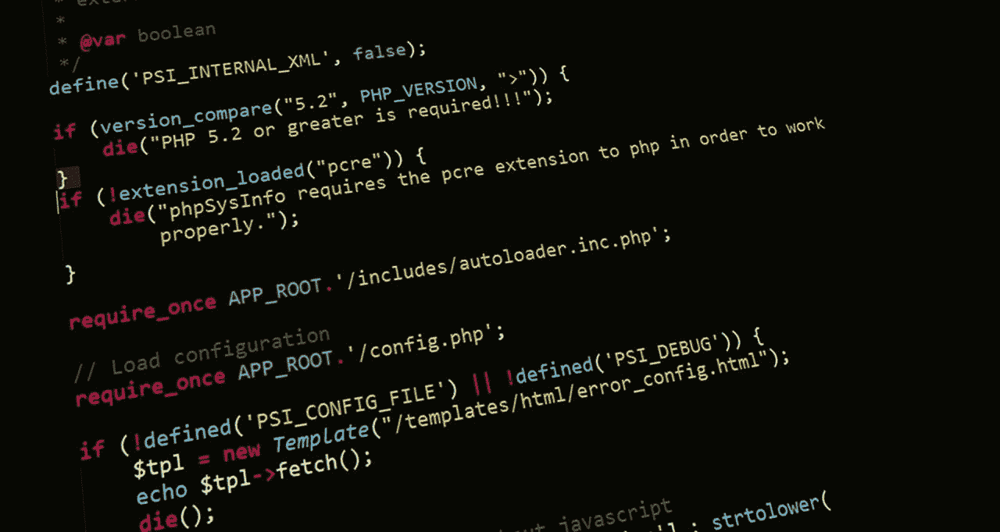
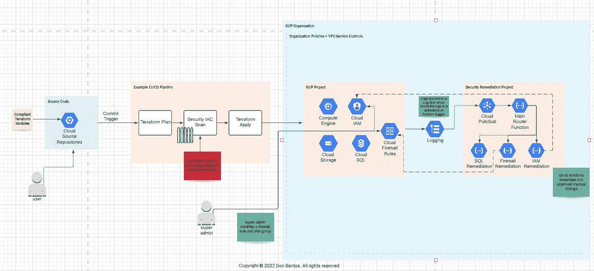
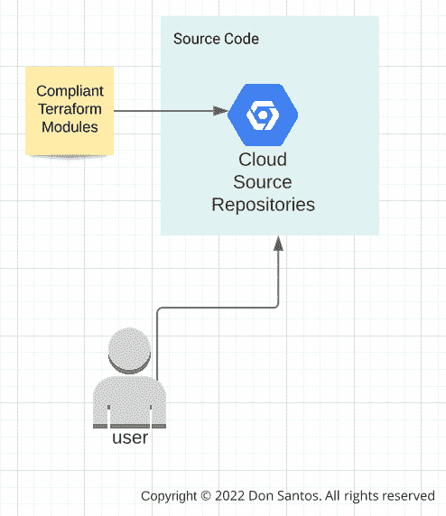
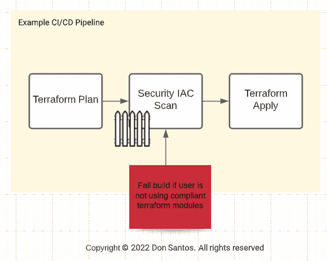
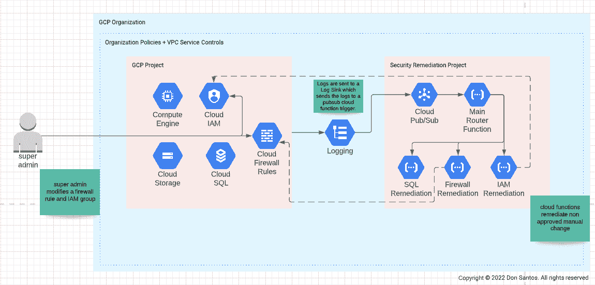

# 如何使用云原生自动补救来保护您的 Google 云组织免受安全错误配置的影响

> 原文：<https://medium.com/google-cloud/how-to-protect-your-google-cloud-org-from-security-misconfigs-using-cloud-native-auto-remediation-4553d878e270?source=collection_archive---------0----------------------->

来自 Pixabay 的标题照片

# 为什么我们需要自动修复？

如今，许多公司都在寻找一种昂贵的方式，即在架构规划过程中应该更加强调安全性。例如，一个 S3 桶暴露了加纳  超过 50 万学生的个人信息。另一个 S3 桶为一家日本医疗保健公司  曝光了 12000 名患者的图像。丝芙兰最近被发现有一个 S3 桶泄露了超过 49 万名顾客的私人信息，包括卡号、全名、电子邮件地址和电话号码  。根据趋势科技的数据，在 2018 年和 2019 年，云错误配置导致的违规行为给公司造成了近 5 万亿美元的损失 [⁴](https://www.trendmicro.com/vinfo/us/security/news/virtualization-and-cloud/the-most-common-cloud-misconfigurations-that-could-lead-to-security-breaches#:~:text=In%202018%20and%202019%2C%20cloud,companies%20almost%20US%245%20trillion.) 。让我们谈谈那个。假设一名开发人员在您管理的 Google Cloud 项目上创建了一个 SQL 实例，而您的组织中有一个安全策略，规定所有流量都应该加密。在这篇文章发表的时候，Google Cloud 还没有办法通过组织策略约束 [⁵](https://cloud.google.com/resource-manager/docs/organization-policy/org-policy-constraints#constraints-for-specific-services) 来强制只针对 SQL 实例的 SSL 连接。微软 Azure 通过 Azure 策略提供了一种在 API 级别实施这一点的方法，亚马逊网络服务(AWS)允许您创建粒度 IAM 策略来拒绝不允许的资源。AWS 还提供了 [AWS 配置](https://aws.amazon.com/about-aws/whats-new/2019/09/use-aws-config-rules-to-automatically-remediate-non-compliant-resources/)，允许您自动修复不符合要求的资源。目前，谷歌云没有任何补救资源的原生服务，如 Azure Policy 或 AWS Config 所以…我们到了。

# 防止错误配置资源的防线

让我们讨论一下可以防止和检测错误配置的资源部署的不同领域。我们称之为你的“防线”。

您的第一道防线是经过安全团队认可的兼容 Terraform 模块。这些模块符合安全团队定义的标准，并且包含基线安全的正确配置。

如果出于某种原因，用户能够签入未经安全部门批准的 Terraform 代码，那么您的下一道防线将是 CI/CD 管道中的安全门。集中运行 Terraform 的位置不仅允许组织控制可以部署的内容，还让他们能够在实际部署之前添加安全检查。在我们的例子中，我们有 IAC(作为代码的基础设施)安全检查，要么使用像 [tfsec](https://github.com/aquasecurity/tfsec) 或 [Snyk](https://snyk.io/product/infrastructure-as-code-security/) 这样的工具，在应用之前扫描我们的 Terraform 代码。

事情变得有点有趣了。我们可以说，下一道防线是您的组织策略和 VPC 服务控制。然而，如果出于某种原因，组织政策或 VPC 服务控制不能涵盖我们试图阻止的事情，我们应该为它建立护栏。

我们可以在这里看两个示例用例。第一个是仅对 SQL 实例实施 SSL 连接，我已经在简介中介绍过了。另一个用例几乎是任何组织都可能发生的场景。超级管理员用户或拥有过多权限的人试图更改您组织中的某些内容。在这种情况下，让我们以 IAM 角色为例。用户为某个人分配整个组织的所有者角色。如果这是一个有效的变化，当然，我们可以让它滑动。但那是另一个不同的讨论。在我们的例子中，这不是一个有效的改变。

这就是护栏出现的地方。我们实际上有一个组织日志接收器过滤 API 调用，例如专门针对 IAM 的具有所有者角色的调用。如果发生这种情况，该日志将被发送到一个发布/订阅主题，并触发云功能删除该更改，并将该更改通知安全团队。这种补救可能只是阻止了某些人访问他们不应该访问的数据。

# 原生修复事物的价值

但是 Don，我们不能用供应商的工具吗？？？是的，当然，但是有了这个原生功能，你只需为你在谷歌云中使用的服务付费。反应和补救接近实时。您不必等待日志转到第三方工具，因为函数在 API 调用时被触发。除了谷歌云中使用的服务成本之外，没有许可成本或其他开销需要担心。您可以看到在您的函数上运行的代码。您有权根据您组织的用例编写自己的函数。

# 关于唐

Don 是埃森哲公司的安全经理，主要负责应用安全、云安全和开发安全。他在财富 100 强公司中担任角色，负责运行云和应用程序安全评估，同时围绕客户的生态系统实施安全测试和控制。有兴趣将其部署到您的环境中吗？让我们[连线](https://linkedin.com/in/donsantos)！

## 免责声明:

我的帖子反映了我自己的观点，不一定代表我的雇主埃森哲的观点。

这篇博文中的信息是一般性的，没有考虑到您的 IT 生态系统和网络的具体需求，这些需求可能会有所不同，需要采取独特的措施。在决定使用上述任何工具时，您应该独立评估您的具体需求。tfsec 和 Snyk 等。工具不是埃森哲的工具。埃森哲不表示其已审查或认可这些工具，埃森哲对这些工具的使用、有效性或因使用这些工具而导致的任何中断或损失不承担任何责任。

【https://www.linkedin.com】最初发表于**。**