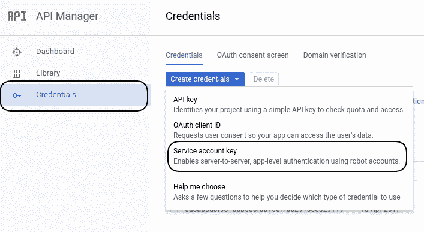
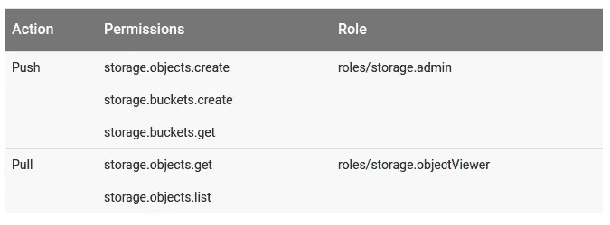
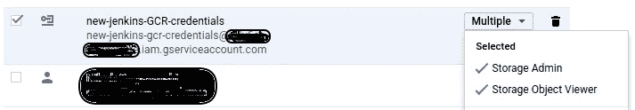
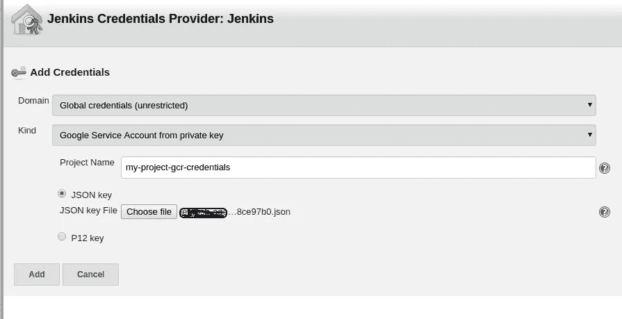
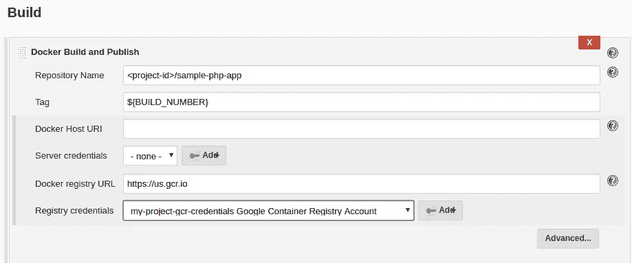

# 如何通过 Jenkins Job 将 Docker 图像推送到 Google 容器注册中心(GCR)

> 原文：<https://medium.com/google-cloud/how-to-push-docker-image-to-google-container-registry-gcr-through-jenkins-job-52b9d5ce9f7f?source=collection_archive---------0----------------------->

我假设您已经运行了容器引擎集群，并将 Jenkins 作为 POD 部署在容器引擎集群上。

**步骤 1)** 安装所需的 Jenkins 插件

*谷歌 OAuth 凭证插件*

*Docker 管道插件*

*谷歌容器注册认证插件*

**步骤 2)** 创建服务帐户。

**附加角色:** *存储- >存储管理员&存储对象查看器*

以 *json* 格式创建**服务账户密钥**。下载的密钥保持安全，我们将需要在进一步的配置。

**步骤 3)** 我们必须添加全局凭证

**詹金斯- >凭证- >全局凭证- >添加凭证**

**从私钥中选择种类** : *谷歌服务账户*

提供**项目名称**(可以是任何东西)并点击 JSON key 单选按钮，然后附上我们在步骤 2 中已经下载的 *json* 文件。

**步骤 4)** 在**詹金斯项目- >配置- >构建- >下选择 Docker 构建和发布’**

必填字段:

**存储库名称**(给出您的 Google 容器存储库名称):<项目 id 或项目名称> /sample-php-app

**标签** : ${BUILD_NUMBER}

**Docker 注册表 URL** (如果您的存储库位置是美国): [https://us.gcr.io](https://us.gcr.io/)

**注册表凭证**(在**步骤 3** 中添加全局凭证时提供的项目名称:<项目名称> Google 容器注册表帐户

`**让我们来试试吧！！！！！！！**