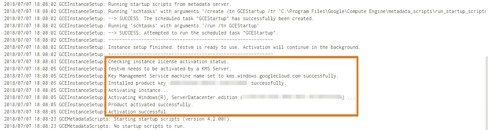
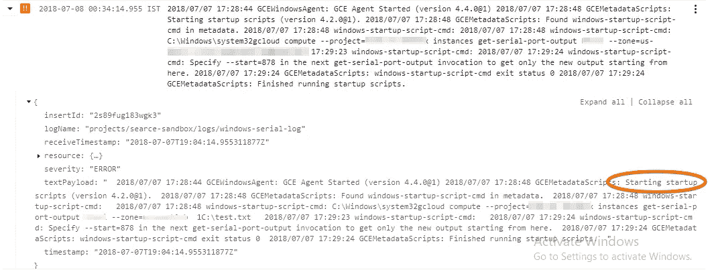
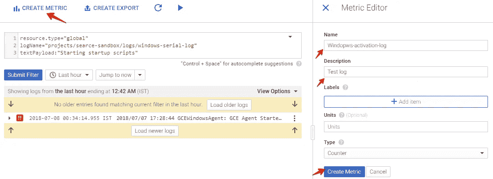

# 如何将串行控制台输出日志推送到 Stackdriver 并在 GCP 设置警报

> 原文：<https://medium.com/google-cloud/how-to-push-serial-console-output-logs-to-stackdriver-and-set-alerts-in-gcp-9c88c6401d2?source=collection_archive---------0----------------------->


GCP 为所有虚拟机提供串行控制台。每个虚拟机都有 4 个串行端口。串行端口类似于终端窗口，支持输入和输出。它完全是基于全文的窗口，没有图形用户界面。这些端口将有助于解决引导管理器或 GRUB 相关问题。

# 我们可以从串行控制台看到哪些日志:

*   操作系统日志(sysprep 期间)
*   基本输入输出系统
*   系统级条目

大多数系统级条目在串行端口 1 中捕获。

要阅读更多关于串行控制台的详细信息，请参考 GCP 的官方文档。

[](https://cloud.google.com/compute/docs/instances/interacting-with-serial-console) [## 与串行控制台交互|计算引擎文档|谷歌云

### 一个虚拟机实例有四个虚拟串行端口。与串行端口交互类似于使用终端…

cloud.google.com](https://cloud.google.com/compute/docs/instances/interacting-with-serial-console) 

# 为什么我们要检查这些日志？

我们正在私有子网中设置一个自动扩展组，并使用 NAT 进行外部互联网通信。在自动缩放期间，将启动 Windows 映像(完全加固)。sysprep 完成后，它将与微软 KMS 服务器通信，获取新的保护密钥并激活 Windows 操作系统。但是在我们的例子中，与 KMS 的通讯失败了，在发射过程中窗户没有被激活。

这些完整的信息将由串行控制台提供。因此，我们决定将日志推送到 StackDriver，并在 windows 未激活时设置警报。



# 获取串行控制台日志的方法

*   GCP 计算引擎页面
*   [获取串行端口输出](https://cloud.google.com/compute/docs/reference/rest/v1/instances/getSerialPortOutput) api
*   gcloud cli

# getSerialPortOutput API 有问题

要调用这个 API，我们应该使用 Oauth。如果我们需要使用 OAuth，那么我们需要创建另一个 API 来生成令牌。仅仅使用由 GCP 凭证生成的 API 密钥是行不通的。您将得到下面的错误。

```
{
  "error": {
    "errors": [
      {
        "domain": "global",
        "reason": "required",
        "message": "Login Required",
        "locationType": "header",
        "location": "Authorization"
      }
    ],
    "code": 401,
    "message": "Login Required"
  }
}
```

# 我们如何实施解决方案:

*   将服务帐户连接到有权查看虚拟机元数据的虚拟机。
*   使用 g cloud CLI[get-serial-port-output](https://cloud.google.com/sdk/gcloud/reference/compute/instances/get-serial-port-output)获取启动中的日志。
*   将这些日志推送到堆栈驱动程序日志。
*   Grep 这个词没有激活。
*   如果发现，发送警报。

在这篇博客中，我们将测试日志是否有启动脚本。

# 创建服务帐户:

进入 IAM & Admin -> [服务账户](https://console.cloud.google.com/iam-admin/serviceaccounts/)

*   创建服务帐户。
*   附加以下角色。

```
Compute Engine -> Compute Instance Admin (v1)
Logging -> Logs Writer
Monitoring -> Monitoring Metric Writer
```

# 添加启动脚本:

虚拟机上安装了 Google Cloud SDK(如果没有，请使用 Google Cloud SDK 创建您的黄金映像)。

**用于获取 Windows 实例的日志:**

在自定义元数据中，添加 Powershell 作为启动。

```
***Key***: sysprep-specialize-script-ps1
***Value***:$msg=gcloud compute --project=your_project_name instances get-serial-port-output vm_name --zone=instance_zone | select-string -Pattern "Starting startup scripts"  -Context 1,10
$log=$msg -replace ">","" -replace "\n"
gcloud logging write windows-serial-log  $log --severity=ERROR
```

如果您想为 Linux 使用捕获一些东西，请在自动化脚本中使用以下云 CLI 命令。

在自动化中添加下面的脚本。

```
gcloud logging write linux-serial-log "$(gcloud compute --project=your_project_name instances get-serial-port-output vm_name --zone=instance_zone | awk '/Checking instance license/ ? c++ : c')" --severity=ERROR
```

# 获取 StackDriver 日志记录中的日志:

*   前往日志[查看器](https://console.cloud.google.com/logs/viewer)。
*   选择资源作为全局资源。
*   将日志分组为 windows-serial-log。
*   对于 Linux，选择 linux-serial-log。


我们将这些日志称为`--ERROR.`

因此，这将显示为橙色标志，如果您选择`— -CRITICAL`，它将显示为红色。

*   展开日志，我们可以看到启动脚本。



# 设置警报:

*   单击文本有效负载，然后单击显示匹配条目。
*   在筛选器框中，键入以下命令。
*   它会显示匹配的日志。
*   然后单击提交过滤器。

```
resource.type="global"
logName="projects/YOUR_PROJECT_NAME/logs/windows-serial-log"
textPayload:"Starting startup scripts"
```


*   然后单击创建度量。
*   给出名称和描述。



**现在是玩 StackDriver 的时候了。**

*   转到警报->创建策略。


*   单击添加条件->指标阈值/费率变化/缺勤。
*   在目标中键入您创建的度量名称。


*   在配置中，根据需要设置阈值。
*   单击保存条件。
*   现在，在通知中添加电子邮件地址。
*   给定一个名称并保存策略。

现在启动一个 VM，它会将日志推送到 StackDriver。如果它发现任何像`Starting startup scripts`一样的匹配模式，它会发送电子邮件。


该是你玩串行控制台日志和 StackDriver 的时候了。希望这对你有所帮助，如果你也打算尝试一下，请在此之前随意鼓掌:)

原载于 2018 年 7 月 08 日 [Searce 工程博客](/searce/how-to-push-serial-console-output-logs-to-stackdriver-and-set-alerts-in-gcp-1a4d61da7c4c)。