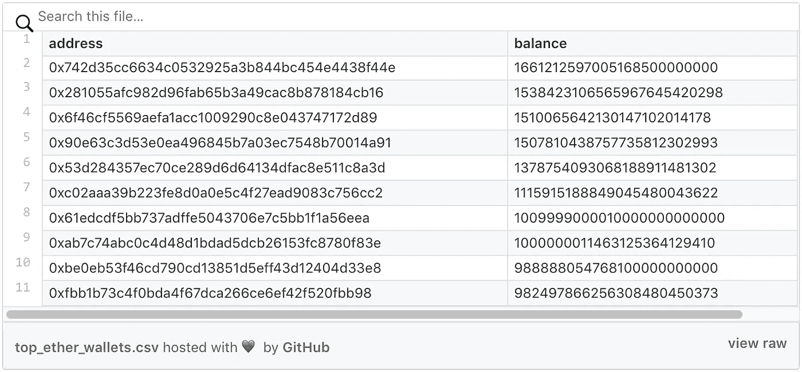

# 如何在 BigQuery 中查询所有以太坊地址的余额

> 原文：<https://medium.com/google-cloud/how-to-query-balances-for-all-ethereum-addresses-in-bigquery-fb594e4034a7?source=collection_archive---------0----------------------->

最近，我们在 big query:[https://big query . cloud . Google . com/table/big query-public-data:crypto _ ether eum . traces](https://bigquery.cloud.google.com/table/bigquery-public-data:crypto_ethereum.traces)的公共以太坊数据集中宣布了事务跟踪(也称为内部事务)的 beta 可用性。他们允许用他们的余额查询所有以太坊地址。

以下查询将为您提供前 10 名余额:

```
#standardSQL
select *
from `bigquery-public-data.crypto_ethereum.balances`
order by eth_balance desc
limit 10
```

`balances`表每天更新。如果您需要实时余额，您可以使用以下查询:

[在 BigQuery 中运行它](https://bigquery.cloud.google.com/savedquery/869804627112:19aa3cfac30743f19c89e3e5c4e86b03)

以下是结果，在写作当天(作为 [csv 文件](https://gist.github.com/medvedev1088/ed32ec9a40a86aff80ecd35a938ca1a3)):



以下是我们用来获得这一结果的工作流程的高级概述:

1.  使用[以太坊 ETL](https://github.com/blockchain-etl/ethereum-etl) 将所有踪迹从奇偶校验节点导出到 BigQuery。
2.  用说明父跟踪失败的状态字段来丰富跟踪。
3.  添加`genesis`和`daofork`痕迹。
4.  编写一个 SQL 来计算余额。

在这个过程中，我不得不解决一些有趣的挑战，我将在下面的章节中揭示这些挑战。

## 计算跟踪状态

如[奇偶校验的跟踪模块 Wiki](https://wiki.parity.io/JSONRPC-trace-module) 中所述:

所有返回踪迹的`traceAddress`字段给出了调用踪迹中的确切位置[根中的索引，第一个`CALL`中的索引，第二个`CALL`中的索引，…]。

即如果轨迹是:

```
A
  CALLs B
    CALLs G
  CALLs C
    CALLs G
```

那么它应该看起来像这样:

`[ {A: []}, {B: [0]}, {G: [0, 0]}, {C: [1]}, {G: [1, 0]} ]`

奇偶校验还为每个跟踪提供一个错误字符串，以防失败。不幸的是，它没有考虑到顶级跟踪失败。例如，如果在上面的例子中对 C 的调用成功了，但是对 A 的顶级调用由于例如气体耗尽错误而失败，那么对 C 的调用的跟踪将不会返回任何错误。这是有问题的，因为呼叫中的任何状态改变，包括以太网传输，都被还原。我们希望过滤掉这样的嵌套调用，它们在跟踪中看起来很成功，但实际上由于顶级跟踪失败而被恢复。

您的第一个想法可能是从奇偶校验返回的平面跟踪中重建调用树，对于每个调用，遍历树并查看是否有任何顶级调用失败，相应地设置每个调用的状态。

我最终使用的另一个解决方案是，首先查询所有失败的跟踪，然后找到它们的所有子跟踪，并将它们标记为失败。这可以在 BigQuery 中用下面的 SQL 轻松完成:[https://github . com/区块链-ETL/以太坊-ETL-air flow/blob/master/DAGs/resources/stages/enrich/SQL/traces . SQL](https://github.com/blockchain-etl/ethereum-etl-airflow/blob/master/dags/resources/stages/enrich/sqls/traces.sql)

当跟踪成功时,`status`字段为`0`,当由于任何操作导致调用本身或任何顶级调用恢复而失败时为`1`。这与交易收据中的`status`字段一致。

## 处理刀叉中不规则的状态变化

如果您只是从奇偶校验返回的跟踪中查询余额，这两个地址将出现在顶部:

*   怀特哈特道—[0xb 136707642 a4 ea 12 FB 4 BAE 820 f03d 2562 ebff 487](https://etherscan.io/address/0xb136707642a4ea12fb4bae820f03d2562ebff487)
*   dark Dao—[0x 304 a 554 a 310 c 7 e 546 dfe 434669 c 62820 b7d 83490](https://etherscan.io/address/0x304a554a310c7e546dfe434669c62820b7d83490)

实际上，在写作的当天，上述地址每个只有 7 个魏。如果你谷歌一下，你会看到维塔利克·布特林[https://blog.ethereum.org/2016/07/20/hard-fork-completed/](https://blog.ethereum.org/2016/07/20/hard-fork-completed/)写的这篇关于刀叉的文章。以下是摘要:

> [块 1920000](http://etherscan.io/block/1920000) 包含一个**不规则**状态变更的执行，该状态变更将约 1200 万 ETH 从“Dark DAO”和“Whitehat DAO”合同转入[撤回 DAO 回收合同](https://etherscan.io/address/0xbf4ed7b27f1d666546e30d74d50d173d20bca754)。

改动的完整说明在这个 EIP[*https://github . com/ether eum/EIPs/blob/master/EIPS/EIP-779 . MD*](https://github.com/ethereum/EIPs/blob/master/EIPS/eip-779.md)*。*

这些不规则的状态变化是不会出现在奇偶校验痕迹中的，所以我只好用这个 SQL 来查询:[https://github . com/区块链-ETL/以太坊-ETL-air flow/blob/master/sqls/Dao fork _ traces . SQL](https://github.com/blockchain-etl/ethereum-etl-airflow/blob/master/sqls/daofork_traces.sql)。然后，结果在以太坊 ETL 工具中被硬编码为[并被摄取到 BigQuery 数据集。](https://github.com/blockchain-etl/ethereum-etl/blob/develop/ethereumetl/mainnet_daofork_state_changes.py)

这些不规则痕迹的`trace_type`栏是`daofork`。我必须添加到表格中的另一种特殊类型的轨迹是`genesis`，它们是[初始乙醚分配](https://github.com/ethereum/ethereumj/blob/develop/ethereumj-core/src/main/resources/genesis/frontier.json)。它们不与任何事务相关联，因此不会在事务或跟踪 API 中返回。

## 限制

来自 [alethio](https://medium.com/u/57ffb51f1e81?source=post_page-----fb594e4034a7--------------------------------) 的 Johannes Pfeffer 帮助识别查询结果中显示的余额与以太坊节点报告的余额不匹配的地址。这是地址列表:

```
[0x4509008d923ef571fc1d29fd66d3135fa02f0b64](https://etherscan.io/address/0x4509008d923ef571fc1d29fd66d3135fa02f0b64)
0xe5449e9a4f31c38d926b76f76571e5d0b143ef5d
0x0000000000000000000000000000000000000001
0x1f78775c8260df084f9a0e5fbdf06487b875ac4d
0x0000000000000000000000000000000000000003
```

可能的根本原因是奇偶校验[https://github.com/paritytech/parity-ethereum/issues/7765](https://github.com/paritytech/parity-ethereum/issues/7765)中的这个问题，它导致 API 结果中缺少对预编译契约的调用。

我们将需要重新同步我们的奇偶校验节点，重新运行 ETL，之后这个问题将得到解决。

## 挑战

可以在每个日期查询每个地址的余额。尝试编写一个查询，返回非零余额的地址数量，并绘制一段时间的曲线图。在评论中发布你的 SQL。([解决方案](/google-cloud/plotting-ethereum-address-growth-chart-55cc0e7207b2))

另请参阅:

*   [如何查询任意日期所有以太坊地址的余额](/google-cloud/plotting-ethereum-address-growth-chart-55cc0e7207b2)
*   [实时以太坊免费通知大家](/google-cloud/real-time-ethereum-notifications-for-everyone-for-free-a76e72e45026)
*   [big query 中的以太坊:我们如何构建这个数据集](https://cloud.google.com/blog/products/data-analytics/ethereum-bigquery-how-we-built-dataset)
*   [如何在 BigQuery 中查询乙醚供应](/google-cloud/how-to-query-ether-supply-in-bigquery-90f8ae795a8)
*   在推特上关注我们:【https://twitter.com/EthereumETL 