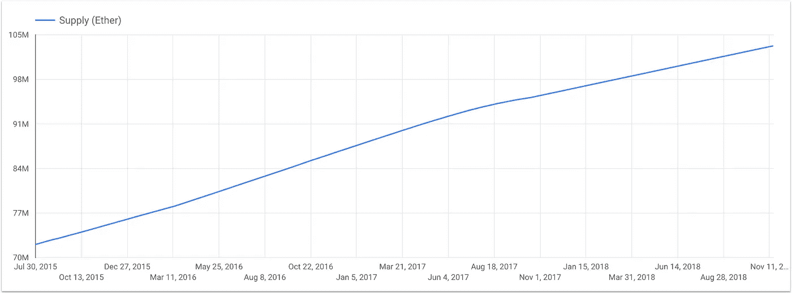

# 如何在 BigQuery 中查询乙醚供应

> 原文：<https://medium.com/google-cloud/how-to-query-ether-supply-in-bigquery-90f8ae795a8?source=collection_archive---------0----------------------->

最近，我们在 big query:[https://big query . cloud . Google . com/table/big query-public-data:crypto _ ether eum . traces](https://bigquery.cloud.google.com/table/bigquery-public-data:crypto_ethereum.traces)(每日更新)的公共以太坊数据集中宣布了交易跟踪(又名内部交易)的 beta 可用性。它们允许查询[所有以太坊地址及其余额](/google-cloud/how-to-query-balances-for-all-ethereum-addresses-in-bigquery-fb594e4034a7)，以及总以太供应量。

以下是检索每天乙醚供应总量的查询:

[在 BigQuery 中运行它](https://bigquery.cloud.google.com/savedquery/610425971344:e5a22205ef8f4007b5af0a8460bb120f)

我只过滤掉类型为`genesis`的轨迹，它包括[块 0](https://etherscan.io/txs?block=0) 中的初始乙醚分配；还有`reward`型，既有块又有大叔奖励。

下面是在 Data Studio 中可视化的查询结果[:](https://datastudio.google.com/embed/reporting/1vTQtXDPGmia_5qTs1EfkFmyRhfZ0Mmu2/page/s8ac)

从图中可以看出，2017 年 10 月 16 日(block [4370000](https://etherscan.io/block/4370000) )乙醚供应量增速下降。这与格挡奖励从 5 以太减少到 3 以太有关，根据这个 EIP[https://github . com/Ether eum/EIPs/blob/master/EIPS/EIP-1234 . MD](https://github.com/ethereum/EIPs/blob/master/EIPS/eip-1234.md)

## 挑战

可以在每个日期查询每个地址的余额。尝试编写一个查询，返回非零余额的地址数量，并绘制一段时间的曲线图。在评论中发布你的 SQL。([解](/google-cloud/plotting-ethereum-address-growth-chart-55cc0e7207b2))

另请参阅:

*   [如何查询所有以太坊地址的余额](/google-cloud/how-to-query-balances-for-all-ethereum-addresses-in-bigquery-fb594e4034a7)
*   [big query 中的以太坊:我们如何构建这个数据集](https://cloud.google.com/blog/products/data-analytics/ethereum-bigquery-how-we-built-dataset)
*   [实时以太坊免费通知大家](/google-cloud/real-time-ethereum-notifications-for-everyone-for-free-a76e72e45026)
*   在推特上关注我们:[https://twitter.com/EthereumETL](https://twitter.com/EthereumETL)