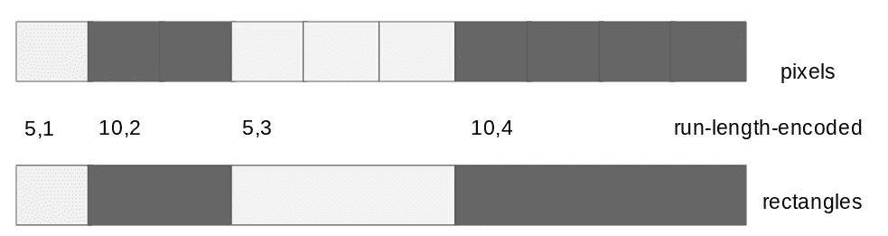

# 如何在 BigQuery 中高效查询地理栅格数据

> 原文：<https://medium.com/google-cloud/how-to-query-geographic-raster-data-in-bigquery-efficiently-b178b1a5e723?source=collection_archive---------0----------------------->

## 将光栅图像加载到 BigQuery 时，对其进行游程编码

几个月前，我写了一篇关于如何在 BigQuery 中查询 GIS 栅格数据的文章。因此，为了处理栅格图像，我展示了可以将栅格的每个像素表示为它自己的多边形，并展示了即使对于分辨率为 30 弧秒(约 0.9 公里)的全球图像，结果查询也是有效的。

但是它一直困扰着我，必须有一种更有效的方式来表示栅格数据。在本文中，我将向您展示一种更有效的方法。对于人口密度数据，存储减少了 3-5 倍，查询速度也相应提高。

## 将数据表示为矩形

最简单的图像压缩方法之一是游程编码。在这里，不是逐个像素地存储图像数据，而是将图像存储为一个像素值，后跟一个游程长度。在地理图像领域，这意味着什么？



GIS 中的游程编码转换为将数据存储为矩形而不是像素

没错！我们不是逐个像素地存储数据，而是简单地将其存储为矩形(假设我们没有从一行绕到下一行)。在 GIS 表单中，一个矩形占用的存储空间与一个像素(4 个顶点)完全相同，因此使用矩形的存储成本将始终与存储单个像素的成本相似或更高。

我的代码是 GitHub 上的[，所以请查看更大上下文的报告—](https://github.com/GoogleCloudPlatform/training-data-analyst/tree/master/blogs/popdensity) [convert_to_rect.py](https://github.com/GoogleCloudPlatform/training-data-analyst/blob/master/blogs/popdensity/convert_to_rect.py) 是使用矩形的新代码，而 [convert_to_geo.py](https://github.com/GoogleCloudPlatform/training-data-analyst/blob/master/blogs/popdensity/convert_to_geo.py) 是使用像素的旧代码。注意，创建矩形实质上是在具有相同值的像素行中向前寻找，并创建端点的 geo。

地理代表是:

这里有一个有趣的区别。在最初的文章中，我使用众所周知的文本(WKT)格式表示了一个像素多边形，并以逆时针顺序遍历像素的顶点:

```
POLYGON((-11.3000 -72.3000, -11.3000 -72.4000, -11.2000 -72.4000, -11.2000 -72.3000, -11.3000 -72.3000))
```

不幸的是，这在表示更大的矩形时会失败，例如:

```
POLYGON((-11.3000 -72.3000, **-11.3000** -72.4000, **169.9000** -72.4000, 169.9000 -72.3000, -11.3000 -72.3000))
```

由于从经度=-11.3 到经度=-169.9 的最短路径不是向东走而是向西走，而且两边其实都是大圆！因为 WKT 格式是在球形地球上定义的，所以没有简单的方法来表示我们想要的多边形——实际的定义变得相当奇怪:


如果我们用 WKT 的球形表示法来表示大的多边形，会产生奇怪的形状

因此，我们应该使用 GeoJSON 写出矩形:

```
SELECT ST_GeogFromGeoJson("{ \"type\":\"Polygon\", \"coordinates\": [ [ [-11.3000, -72.3000], [-11.3000, -72.4000], [169.9000, -72.4000], [169.9000, -72.3000], [-11.3000, -72.3000]]] }") AS geom
```

这提供了我们实际想要的形状(使用 [BigQuery GeoViz](https://bigquerygeoviz.appspot.com/) 来像这样可视化各个形状):


GeoJson 表示法给出了我们想要的结果:南极洲的大片区域具有相同的人口密度，我们可以将其表示为单个矩形，而不是像素。

## 用矩形加载表格

运行程序在 NASA 人口密度数据集上创建矩形后，我将换行符分隔的 JSON 加载到 BigQuery:

```
bq load --replace \
   --source_format NEWLINE_DELIMITED_JSON \
   --range_partitioning=year,1900,2100,5 \
   --clustering_fields tile \
   advdata.${TABLE} $GCSFILE schema.json
```

其中模式指定该列为地理类型:

```
 {
    "description": "polygon representing boundary of rectangle",
    "mode": "REQUIRED",
    "name": "bounds",
    "type": "GEOGRAPHY"
  },
```

我看到存储减少了 5 倍，结果表中的行数减少了 7 倍:

```
 Pixels:      457 MB, 2139k rows
    Rectangles:   96 MB,  319k rows
```

将人口数据集进行游程编码为矩形而不是像素真的很有帮助！

## 查询表

让我们运行一个查询来查找华盛顿州人口最多的城市。我们可以通过将栅格转矩形数据与城市边界的公共数据集关联来实现这一点:

```
WITH urban_populations AS (
    SELECT 
       lsad_name
       , SUM(ST_AREA(ST_INTERSECTION(bounds, urban_area_geom))/1000000) AS area_sqkm
       , COUNT(1) AS num_rectangles
       , AVG(population_density) AS pop_density
    FROM advdata.popdensity_nasa, `bigquery-public-data.geo_us_boundaries.urban_areas`
    WHERE ST_INTERSECTS(bounds, urban_area_geom) 
          AND STRPOS(lsad_name, ', WA') > 0
    GROUP BY lsad_name
)
SELECT 
       *, (area_sqkm * pop_density / 1000000) AS population_millions
FROM urban_populations
ORDER BY area_sqkm DESC
LIMIT 10
```

现在，与基于像素的数据集相比，我们处理了一半的数据(因此是两倍的成本效益),速度提高了 20%。结果是:


如果你与前一篇博客中的结果进行比较，你会注意到西雅图的人口(160 万)比我们上次得到的(300 万)少。那是因为这个查询实际上更准确。

当我们有了逐像素的数据时，我简单地总结了所有与西雅图边界重叠的像素的面积:

```
ST_AREA(bounds)
```

现在矩形可能要大得多，但是，我必须只计算实际相交的面积:

```
ST_AREA(ST_INTERSECTION(bounds, urban_area_geom))
```

显然，这要准确得多，即使在使用逐像素数据时，我也应该这样做。然而，有一个颇具讽刺意味的问题，因为人口密度是在更大的正方形上计算的。对低分辨率数据的更精确的计算将产生具有更大误差的结果！

## 从像素到矩形的 ELT

在上一节中，我重写了 ETL 程序，将人口密度栅格网格转换为 GeoJson 矩形，并将数据重新加载到 BigQuery 中。

我们能避免重新创建 ETL 脚本吗？在上一篇文章中，我将来自 SEDAC 的高分辨率数据作为像素加载到 BigQuery 中——考虑到这是 NASA 数据的 100 倍，如果我可以避免重新加载数据，这将是一个优势。那么……我可以简单地把像素数据转换成矩形吗？

是啊！将像素数据分组成行，并调用 ST_Union。在 BigQuery 中，St_UNION 分解边界，因此最终结果将是一组矩形。

```
CREATE OR REPLACE TABLE advdata.sedac_rectangles AS
PARTITION BY RANGE_BUCKET(year, GENERATE_ARRAY(2000, 2100, 5))
CLUSTER BY tile
OPTIONS(require_partition_filter=True)with dissolved AS (
SELECT 
  year, tile, rowno, population_density,
  ST_UNION( ARRAY_AGG(bounds) ) AS bounds,
FROM advdata.sedac_pixels
GROUP BY year, tile, rowno, population_density
)SELECT *, ST_CENTROID(bounds) AS location
FROM dissolved
```

这将表的存储减少了 3.5 倍，表的数量减少了 9 倍，与 NASA 的数据一样:

```
Pixels:         57.03 GB       223m rows
Rectangles:     17.79 GB        28m rows
```

请注意，许多行是多多边形，这就是为什么存储方面的改进不如行数方面的改进那么显著。这不如从零开始重新加载数据，因为我们得到的将是多多边形(考虑在一个图块中有多个具有相同人口密度的矩形的情况):


当进行 ST_Union 时，您将得到多重多边形，这对于空间查询来说不如在 ETL 程序中进行游程编码时得到的多边形有效

这表明 BigQuery 为决定是否处理某一行而进行的一些空间优化将不适用于这些数据。因此，如果我们有能力这样做，我们应该加载矩形，如果我们能像我对 NASA 数据(前一节)所做的那样，而不是使用 ST_Union 进行事后转换。当我写这篇文章时，我正在家里工作(感谢 cornavirus ),我家的带宽不允许我下载和上传 SEDAC 数据...所以我没有选择… 无论如何，这只是表明 BigQuery 是强大和灵活的，如果你想你可以 ELT 大型栅格网格，如果你需要…

我们可以像以前一样尝试相同的查询，确保指定图块:

```
WITH urban_populations AS (
        SELECT 
           lsad_name
           , SUM(ST_AREA(ST_INTERSECTION(bounds, urban_area_geom))/1000000) AS area_sqkm
           , COUNT(1) AS num_rectangles
           , AVG(population_density) AS pop_density
        FROM advdata.popdensity_sedac_rectangles, `bigquery-public-data.geo_us_boundaries.urban_areas`
        **WHERE** year = 2020 
              AND **tile = 'gpw_v4_population_density_rev11_2020_30_sec_1.asc'**
              AND ST_INTERSECTS(bounds, urban_area_geom) 
              AND STRPOS(lsad_name, ', WA') > 0
        GROUP BY lsad_name
    )
    SELECT 
           *, (area_sqkm * pop_density / 1000000) AS population_millions
    FROM urban_populations
    ORDER BY area_sqkm DESC
    LIMIT 10
```

结果显示结果的更高分辨率(参见 num_rectangles):


该查询处理的数据是相应像素查询的一半(2.6 GB 对 5.4 GB)，但花费的时间是后者的四倍(26 秒对 6 秒)，因为无法过滤掉这么多的多重多边形。

底线:虽然您可以将数据作为像素加载，然后使用 ST_Union 将它们转换成多边形，但这不如在您的 ETL 程序本身中将像素游程编码成多边形有效。

## 后续步骤:

1.  阅读上一篇关于 BigQuery 中的[栅格数据的文章，了解更多内容](/@lakshmanok/querying-geographic-raster-data-in-bigquery-the-brute-force-way-1da46799d65f)
2.  在 GitHub 上浏览[代码](https://github.com/GoogleCloudPlatform/training-data-analyst/tree/master/blogs/popdensity)
3.  按照 README.md 文件中的步骤尝试代码

## 关键点:

1.  将栅格数据加载到 BigQuery 时，将图像表示为一组矩形。这类似于对数据进行游程编码，将降低存储成本并加快查询速度。
2.  与 WKT 制图表达相比，我更喜欢 GeoJson 制图表达，因为 GeoJson 的平面制图表达更加直观
3.  您可以使用 BigQuery GeoViz 快速排除形状故障
4.  您可以将栅格数据作为像素进行 ELT，然后在 BigQuery 中使用 ST_Union 将它们转换为矩形。但是，这不如通过在 ETL 程序中进行游程编码将数据作为矩形加载到 BigQuery 中有效。

鸣谢:感谢我的同事迈克尔·恩廷和埃里克·恩格尔的许多有益的讨论。