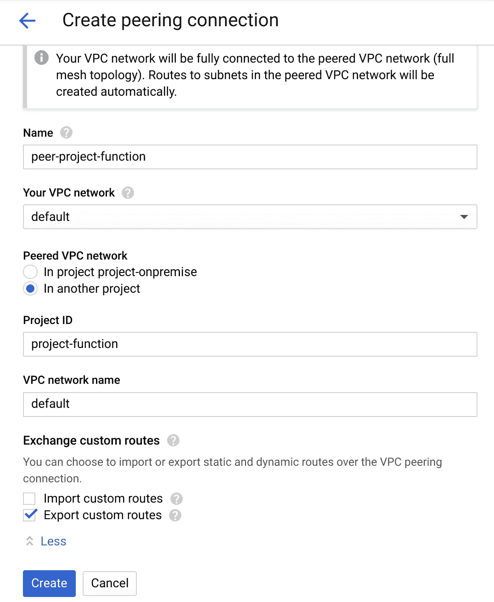
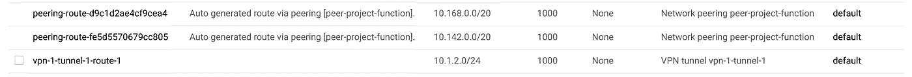

# 如何使用无服务器产品获得内部资源？

> 原文：<https://medium.com/google-cloud/how-to-reach-on-premise-resources-with-serverless-products-747ebd37dc8e?source=collection_archive---------0----------------------->


无服务器太棒了。您只需在它们运行并自动扩展时付费。**无服务器解决了很多问题**。每天都有微批次运行吗？仅在需要时使用资源！你有要处理的事件吗？将它插入到您的代码中并处理它。

当你开始玩无服务器的时候，比如 AppEngine、云功能或云运行，你**想要随时随地使用它**，甚至是你的本地工作负载。然而，有一个主要问题:**您的工作负载必须使用本地数据，而数据不能移动到云中**，因为其他本地工作负载使用它们。

# 将 OnPrem 数据连接到云

为了在云中安全地使用本地数据，您必须保护连接，主要是在不暴露公共 IP 的情况下，并通过加密传输中的数据。

更便宜的解决方案是 [VPN](https://cloud.google.com/vpn/docs/) 。带宽是有限的，但它为您的内部环境提供了一个低投资的安全通道

终极级别是[互连解决方案](https://cloud.google.com/interconnect/docs/)，它在您的内部环境和谷歌光纤网络之间提供直接连接。速度极快(从 10 到 100 千兆位/秒)，具有高 SLA，因此非常昂贵。

最后，中间层是[伙伴互连](https://cloud.google.com/interconnect/partners/)。一家二级公司与 Google 有直接连接订阅，并转售较小的带宽。SLA 比直接互连的低，但价格更适合中小型公司。

*在生产环境中，* ***不要忘记，至少，备份每个环节，以避免 SPOF*** *(单点故障)*

> 我不是网络专家，无法讨论最佳的混合连接解决方案。这里有很多很棒的文章和例子。

因此，连接您的内部环境非常耗时，或多或少都很昂贵，而且您必须加倍提高可靠性。因此，你不希望在你所有的项目中重复这项工作。

解决方案是将所有其他项目连接到这个“本地入口点”项目，从而将其他项目流重新路由到本地环境。**这里是目的** [**VPC 对等**](https://cloud.google.com/vpc/docs/vpc-peering) **解决**。


VPC 对等和混合连接

现在，您有了合适的产品，可以安全地将您的内部环境连接到您所有的 GCP 项目，并且成本和工作量都可以分摊！

# 无服务器到 VPC 连接

S **无服务器意味着没有基础设施来管理**。因此，似乎出现了设计问题

> 如何将非托管服务器和网络连接到特定的托管 VPC？

希望有一个测试版功能可以帮助我们完成这项任务:[无服务器 VPC 连接器](https://cloud.google.com/vpc/docs/configure-serverless-vpc-access)。目前仅适用于云功能和 AppEngine 该团队努力将这一功能提供给其他产品，如 [Cloud Run](https://cloud.google.com/run/) 。

原理很简单:

*   为无服务器服务定义一个 IP 范围(CIDR /28)
*   定义一个名字
*   定义一个位置

然后将此连接器连接到您的无服务器产品，其网络流量将进入 VPC 网络，其中一个 IP 定义在该范围内。**两个世界统一了！**

# 如何进行

现在，我们有了拼图的所有部分，让我们看看如何一步一步地进行。

*我将 VPC 连接到本地环境的项目命名为“project-onpremise ”,将云功能部署到本地环境并必须到达 Oracle DB 的项目命名为“project-function”。*


通过混合连接、VPC 对等和无服务器 VPC 连接器实现内部云功能

## 创建 VPC 对等

*在本部分中，我假设与您的内部环境存在连接(VPN 或互连)。如果你想创建一个虚拟 VPN 连接，* [*这个 Qwiklab 是有据可查的*](https://www.qwiklabs.com/focuses/641?parent=catalog)

为了创建 VPC 对等，您必须在每个项目中创建一个对等连接。让我们从*项目开始吧:*

*   进入*网络，*然后 *VPC 网络对等*


*   点击*创建连接*，然后*继续*
*   填写连接的名称，选择当前项目中你想要使用的 *VPC* (此处*默认为*)
*   在另一个项目中选择*，然后填写*项目 Id* ( **不是这个名字！**)和 *VPC 名称*进入目标项目*
*   **不要忘记点击*交换自定义路由*** ，并选择*导出自定义路由* 以将混合连接路由导出到对等体。
*   点击*创建*



如果您喜欢命令行

```
gcloud beta compute networks peerings create peer-project-function \
    --network=default \
    --peer-project project-function \
    --peer-network default \
    --export-custom-routes
```

在项目功能中执行完全相同的镜像操作。

*   切换项目，进入*网络，*然后 *VPC 网络对等*
*   点击*创建连接*，然后*继续*
*   填写连接的名称，选择当前项目中你想要使用的 *VPC* (此处*默认为*)
*   在另一个项目中选择*，然后填写*项目 Id* ( **不是名称！**)和 *VPC 名称*进入目标项目*
*   **不要忘记点击*上的***交换自定义路由，并选择*导入自定义路由*从对等体导入混合连接路由。
*   点击*创建*


如果您喜欢命令行

```
gcloud beta compute networks peerings create peer-project-onpremise\
    --network=default \
    --peer-project project-onpremise \
    --peer-network default \
    --import-custom-routes
```

很好，现在你的对等物在两个项目中应该是绿色的。


***小心*** ，如果使用项目中自动创建的默认 VPC 网络，它不会工作，因为 IP 范围是重叠的。事实上，**对等从目标项目导入 VPC** 的所有子网。这用所有对等项目的子网构建了一个逻辑*超级 VPC* 。

因此，我建议您创建一个自定义 VPC，或者转而使用*自定义*默认 VPC，并更改/替换两个项目中的当前范围，以避免任何重叠。

现在，看看项目中的网络路线。



使用项目功能对等路由和 vpc 隧道路由进行项目预授权


具有默认路由(自有 vpc)和对等路由的项目功能，包括到 VPN 的自定义 VPC 路由

如您所见，VPN 的自定义 VPC 路由已经导出到对等项目，并正确导入到*项目-功能*中。

项目之间的路线已开通。让我们继续 VPC 连接器。

## 创建 VPC 连接器

无服务器 VPC 连接器在无服务器的"*"野生"*"世界(不可定制或很少可定制)和您的*"内部"*" VPC(完全可定制)之间架起了一座桥梁。让我们在*项目中设置一个功能*:

*   转到*网络，*然后*无服务器 VPC 连接器*
*   *如果被询问，启用 API*
*   点击*创建连接器*(到目前为止，GUI 只允许在*美国中心 1* 区域创建连接器。 *us-east1* 和 *europe-west1* 仅在命令行中可用)
*   填写姓名、(*无法选择地区)*、 *VPC 网*和 *IP 范围(此处举例，请根据您的上下文选择合适的)*。同样，IP 范围不得与现有范围重叠。
*   (可选地，您可以更改*最小/最大吞吐量，这将* [*影响计费*](https://cloud.google.com/vpc/docs/configure-serverless-vpc-access#pricing) )
*   点击*创建*


如果您喜欢命令行(这里有一个关于*欧洲-西方 1* 地区的例子)

```
gcloud beta compute networks vpc-access connectors \
      create function-to-fusion \
      --network default \
      --region europe-west1 \
      --range 172.16.16.240/28
```

太好了，这很有效！


***不要忘记更新本地设备*** *上的路由规则，以便将响应发送回定义的无服务器 VPC 连接器范围*

## 创建云函数

现在，最后一块。但是在创建云功能之前，[角色必须被授予“云功能服务代理”](https://cloud.google.com/functions/docs/connecting-vpc#setting_up_permissions)以允许云功能使用无服务器 VPC 连接器

您可以在 IAM 控制台中手动添加它们:

*   添加*项目查看器*角色
*   添加*计算机网络用户*角色


或者使用命令行

```
PROJECT_NUM=$(gcloud projects describe project-function \
      --format="value(projectNumber)")gcloud projects add-iam-policy-binding project-function \
      --member=serviceAccount:service-${PROJECT_NUM}@gcf-admin-robot.iam.gserviceaccount.com \
      --role=roles/viewergcloud projects add-iam-policy-binding project-function \
      --member=serviceAccount:service-${PROJECT_NUM}@gcf-admin-robot.iam.gserviceaccount.com \
      --role=roles/compute.networkUser
```

现在，让我们在 Go 中部署一个简单的测试连接云功能，用于测试本地开放的端口。(*在我的例子中，我希望到达一个 Oracle 数据库，端口 1521)*

*   转到*云功能*，点击*创建功能*
*   命名你的函数，选择*运行时 Go 1.11*
*   在`function.go`中粘贴这段代码片段

```
package pimport (  
    "fmt"
    "net"
    "time"
    "net/http"
)func Ping(w http.ResponseWriter, r *http.Request) {  
    conn, err := net.DialTimeout("tcp", "10.1.2.2:1521",   time.Duration(10)*time.Second)
    defer conn.Close() if err != nil {
        // Log or report the error here
        http.Error(w, err.Error(), http.StatusNotFound)
        return
    }
    fmt.Fprint(w, "Connexion OK")
}
```

将要执行的功能更改为`Ping`

*   部署章节*环境变量、网络、超时和更多*
*   在下拉列表中选择您的 VPC 连接器的*区域*和您的 *VPC 连接器*
*   然后点击*创建*


如果您喜欢使用命令行部署(在您创建文件的目录中`function.go)`

```
gcloud beta functions deploy test-onpremise \
      --vpc-connector projects/project-function/locations/us-central1/connectors/function-connector
      --runtime go111
      --trigger-http
```

现在，是时候测试你的功能和整体连接性了。

在控制台中，只需点击*测试功能*


或者使用命令行

```
gcloud function call test-onpremise
# result: Connexion OK
```

嘣，成功了！

# **总结**

只需点击几下鼠标或几个命令行，我们就可以:

*   创建一个 VPC 对等体，连接到一个共同项目，作为内部环境的入口点
*   用无服务器 VPC 连接器在无服务器世界和 VPC 网络之间建立一座桥
*   在不暴露任何公共 IP 的情况下，部署安全到达前提服务器的云功能。AppEngine 也是如此，很快 Cloud Run 也是如此

这一功能对于在没有关键工作负载和需要处理的数据很少的情况下启动迁移过程非常有用，尤其是在 VPN 中。事实上，网络延迟和连接可用性避免了所有任务关键型工作负载。

无服务器 VPC 连接器也有助于允许您的无服务器组件访问仅部署在 VPC 的服务，如仅在 VPC 可用的 Memorystore 或 VM(无外部 IP)。

测试愉快！