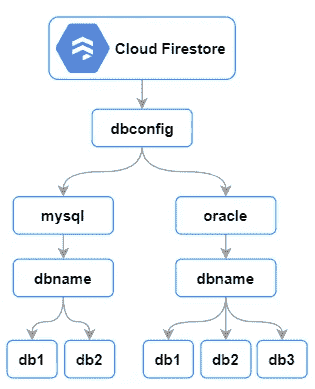

# 使用应用引擎为 Google Firestore 构建 REST API

> 原文：<https://medium.com/google-cloud/how-to-read-google-firestore-data-using-rest-api-1386df45c420?source=collection_archive---------0----------------------->

## 读取存储在 Google Firestore 中的数据库配置参数

配置参数是允许应用程序确定起作用的基本值的设置。配置存储及其管理的确定取决于各种因素，包括环境、部署方法和配置元素的类型。在大规模分布式环境中，除非有一个自动化的配置文件管理系统，否则数据库是必不可少的。

以下因素影响使用 Firestore 作为配置存储的决定:
■可扩展的无服务器文档数据库
■直接连接到 web 和移动应用程序
■通过丰富的安全和数据验证规则进行数据保护
■与 Google 云服务统一集成

## 数据流图

数据流图描述了与多个数据库相关的配置参数设置。Rest-API 调用使用层次结构来读取特定的数据库信息，并作为 JSON 返回。



多个数据库的配置存储

## 源代码

在这篇博客中，Google App Engine 用于在 Google 管理的平台上开发和托管 web 应用程序。App Engine 服务可以用不同的编程语言编写，在这个解决方案中，node.js 用作代码库。

**app.js:** 这个文件包含启动服务器和响应请求的 JavaScript 代码。以下代码通过运行在端口 8080 上的服务器响应来自 web 客户端的请求。

```
'use strict';require('dotenv').config();
const bodyParser = require('body-parser');
const cors = require('cors');
const express = require('express');
const app = express();const fsReadController = require('./controllers/fsReadController');app.use(bodyParser.json());
app.use(cors());app.get('/firestore/:collection/:database/:db', (req, res) => {
    fsReadController.index(req, res);
});const PORT = process.env.PORT || 8080;
app.listen(PORT, () => {
    console.log(`App listening on port ${PORT}`);
});module.exports = app;
```

**fsReadController.js :** 该代码用于根据请求读取输入参数，并检索存储在 Cloud Firestore 中的数据。API 调用的响应是 JSON 字符串格式的。

```
'use strict';const { Firestore } = require("[@google](http://twitter.com/google)-cloud/firestore");
const firestore = new Firestore();async function getFireStoreDocument(docPath) {
    const document = firestore.doc(docPath);
    let doc = await document.get();
    return doc;
}exports.index = async function (req, res) {
    const collection = req.params.collection;
    const database = req.params.database;
    const db = req.params.db;
    const docPath = collection + "/" + database + "/dbname/" + db; try {
        const doc = await getFireStoreDocument(docPath);
        const docData = JSON.stringify(doc.data(), null, 4);
        res.status(200).send(docData);
    }
    catch (err) {
        console.error(err);
        res.status(500).send(err.message);
    }
};
```

## 将应用程序部署到应用程序引擎

1.  从 GitHub 资源库下载源代码
2.  更改到应用程序文件夹[**$ CD cloud-firestore-API**
3.  部署应用程序[ **$ gcloud 应用程序部署**

## 试验结果

**请求:**(用实际 url 替换“targeturl”)

```
curl --request GET '[https://targeturl/firestore/dbconfig/oracle/db1'](https://cloud-firestore-api-dot-eap-lab-06e21a76f78f462a.ue.r.appspot.com/firestore/dbconfig/oracle/db1')
```

**响应:**

```
{
  "SID": "orcl",
  "Password": "password",
  "HostName": "db1.example.com",
  "UserName": "dbadmin",
  "Schema": "dbadmin",
  "PORT": "1531",
  "Version": "12.2.0.3"
}
```

## 源代码库

[https://github.com/soumendra-mishra/cloud-firestore-api.git](https://github.com/soumendra-mishra/cloud-firestore-api.git)