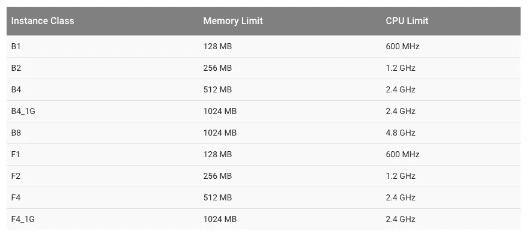

# 如何减少 Google Cloud 端点 API 的延迟

> 原文：<https://medium.com/google-cloud/how-to-reduce-latency-of-your-google-cloud-endpoints-apis-5bbe66385e32?source=collection_archive---------0----------------------->


信用:[汤姆·埃弗斯利](https://unsplash.com/@tomeversley)

我使用[谷歌云端点](https://cloud.google.com/endpoints/)为 Android & IOS 等端点构建强大的 API 已经有两年了。

如果你从来没有听说过谷歌云终端，你可能听说过[谷歌云平台](https://cloud.google.com/) (GCP)，这基本上相当于亚马逊网络服务，由谷歌制造。

因此，Google Cloud Endpoints(GCP 提供的服务之一)帮助你轻松地创建自己的 API，允许你的终端(Android、IOS、Javascript 等)访问你的后端。


然而，**有一些优化**可以充分利用 Google Cloud 端点并提高您自己的 API 的性能。

# 1.保持实例的活力

如你所知，谷歌云端点运行在谷歌应用引擎实例上。因此，当一个实例没有被使用时，它会在一段时间后自动关闭，并在必要时启动(传入的 http 请求等)。

但是 appengine 实例的启动时间可能会很长。我注意到有时候，它会超过 7 秒…

要解决这个问题，一个简单的技巧是创建一个 cron 任务，让 cron.xml: 中的*实例* **保持活动**

```
<cron>
    <url>/Cron/KeepAliveInstance</url>
    <description>Keep alive instance</description>
    **<schedule>every 1 minutes</schedule>**
</cron>
```

此外，如果有太多的请求需要处理，您可以在启动新实例时告诉 Google *，使用 **appengine-web.xml 中的“min-pending-latency”参数。**此值取决于您的*平均延迟时间*，您可以在 API 上注意到:*

```
<automatic-scaling>**<min-pending-latency>3000ms</min-pending-latency>**
</automatic-scaling>
```

# 2.小心使用 Memcache

我强烈推荐阅读这篇解释如何使用 Memcache 的文档。过去，我在 Memcache 中设置我的每个数据存储实体，告诉自己这样会更快…#失败

基本上，如果您提供从不(或很少)改变的数据，请对这些数据使用 Memcache。否则，不要。

例如，在我的应用程序 CookMinute 上，每个食谱都是每天下载并存储在用户的手机中的(感谢[领域](https://realm.io/))。所以*我只设置了* **实体**作为Memcache 的一部分。

# 3.提高实例性能(不需要)

如果您的 API 具有高处理能力，您可以增加 appengine 实例的实例类[。然而，这也会增加成本。](https://cloud.google.com/appengine/docs/about-the-standard-environment#instance_classes)



```
<appengine-web-app>
    <application>${app.id}</application>
    **<instance-class>F2</instance-class>**
</appengine-web-app>
```

# 结果

我已经用为我的应用注册新用户的 *API 测试了这些优化。使用 stack driver Trace(Console =>stack driver =>Trace)生成统计信息，并且**实例类是 F1** 。*

## 优化前


## 优化后


正如您所看到的，延迟已经减少并且更加平滑，特别是因为**总是有一个实例可以处理请求。**

哦，关于费用，嗯，我还没有支付任何费用，因为我从来没有超过免费配额

如果你有一些关于 Google Cloud 端点 API 的建议或提示，请在评论中告诉我！

**菲尔，方正@**[**cook minute**](http://www.cookminute.com/?utm_source=Medium&utm_medium=Article&utm_campaign=Medium)**兼手机发烧友。**