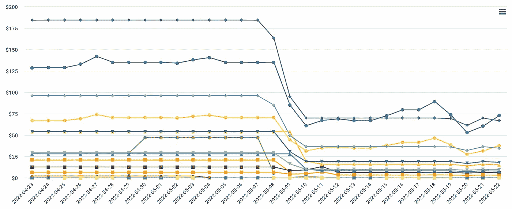

# 如何在 Google Cloud 上降低你的 ML 模型推理成本

> 原文：<https://medium.com/google-cloud/how-to-reduce-your-ml-model-inference-costs-on-google-cloud-e3d5e043980f?source=collection_archive---------0----------------------->

## 降低你的最大似然推理成本很容易。我经常向公司推荐的 4 个步骤。

在本文中，我将介绍最常见的节约成本的方法。其中一些只是应用常识，一些是利用另一种服务的好方法，而另一些则需要更多的技术知识。

