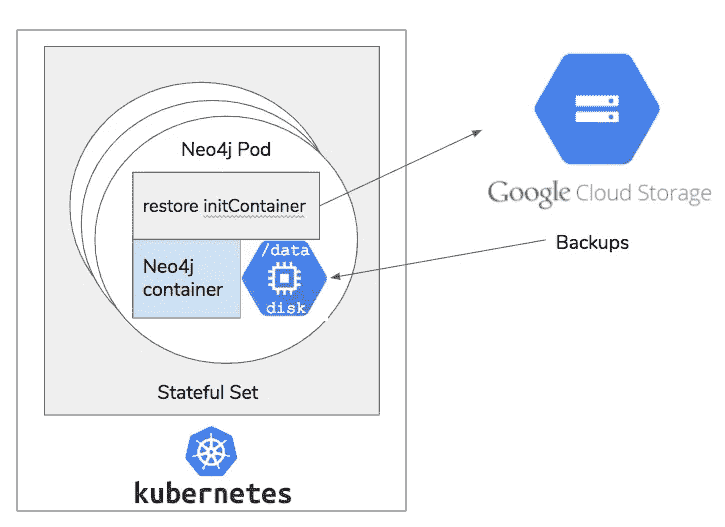
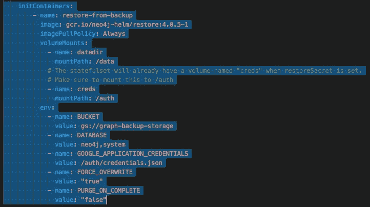

# 如何在 Kubernetes 上恢复 Neo4j 备份

> 原文：<https://medium.com/google-cloud/how-to-restore-neo4j-backups-on-kubernetes-and-gke-6841aa1e3961?source=collection_archive---------0----------------------->

这篇文章是它的姐妹，[如何备份运行在 Kubernetes](/neo4j/how-to-backup-neo4j-running-in-kubernetes-3697761f229a) 的 Neo4j。因此，如果您首先在寻找创建备份集的资源，那就从这里开始吧。

维护一个在 Kubernetes 上运行的 Neo4j 集群通常意味着要有一个备份时间表，以防出现问题。所以那件事现在出了问题。你将如何恢复？这篇文章将带你一步一步地去做。

如果你之前没有尝试过 Neo4j，你可以[用 Neo4j 舵轮图](https://github.com/neo4j-contrib/neo4j-helm)启动它。这应该适用于大多数 Kubernetes 发行版，但是我们将以 GKE 为例。

# 方法

为了在 Neo4j 中恢复备份，我们使用标准的 [neo4j-admin restore](https://neo4j.com/docs/operations-manual/current/backup/restore-backup/) 工具，只是在 Kubernetes 环境中，我们是在一个容器内完成的。通常，备份集存储为. tar.gz 文件或原始目录。在进行备份时，neo4j-admin 工具将其写入文件目录，但人们通常会压缩这些文件集并将其上传到云存储。



使用 initContainer 将数据恢复到 Neo4j

我们将使用带有 neo4j-admin 工具的专用 Docker 容器作为 kubernetes 中的 pods 的 initContainer。init 容器的任务很简单:

*   将数据驱动器安装到 Neo4j 希望找到其数据的位置(`/data`)
*   从 google 云存储中下载备份集，如果需要的话，将其解压缩
*   使用 neo4j-admin 将图形数据库恢复到`/data`

通过这种方式，当 Neo4j docker 容器启动时，[它会在预期的地方找到它的图形数据库](https://neo4j.com/docs/operations-manual/current/installation/docker/)，并且 Neo4j 容器本身保持不变。

我实现的方法假设备份集存储在 Google Storage 上，但是通过一些简单的修改，该脚本可以在任何云存储提供商上运行。

# 还原容器

本节描述的代码和更多文档可以在 Neo4j 舵图的[工具/恢复目录中找到。](https://github.com/neo4j-contrib/neo4j-helm/blob/master/tools/restore/README-RESTORE.md)

它需要几个环境变量作为参数:

*   `GOOGLE_APPLICATION_CREDENTIALS` —可以找到 JSON 服务密钥的磁盘上文件的路径，允许访问备份集。
*   `BUCKET` —备份集的 google 存储桶位置，可以包含路径。例如，`gs://my-bucket/graph-cluster/`
*   `DATABASE` —要恢复的数据库的逗号分隔列表，例如`neo4j,system`。恢复容器将在存储桶中寻找带有日期戳的备份
*   `TIMESTAMP` —可选。如果您不提供这个，恢复容器将寻找最新的备份，它将被命名为`gs://my-bucket/graph-cluster/DATABASENAME-latest.tar.gz` —这是备份文章中描述的备份容器创建的格式。

这就是全部要求。您可以在恢复容器的自述文件中了解一些可选参数。它们允许您控制一些行为，例如在压缩集中的何处找到备份，以及如果找到了，是否强制覆盖现有的数据库。

# 配置恢复容器

为了实现 initContainer 功能，我们需要两部分:initContainer 规范本身和一个额外的共享卷。您可以在[这个部署场景中看到一个完整的示例，它从备份](https://github.com/neo4j-contrib/neo4j-helm/blob/master/deployment-scenarios/single-instance-restore.yaml)中恢复一个单实例 Neo4j 机器。通过将该部署场景作为一组参数传递给 helm chart 安装流程，它可以使用正确的 bucket &凭证工作。

**初始化容器**



如果您正在您的环境中运行，您将希望自己构建恢复容器，并将这里的`image`引用更改为您选择的容器注册表。这样做的目的是创建恢复容器，将 Neo4j 容器的/数据装入其自身(这允许它操作 Neo4j 使用的持久卷)，然后指定一些环境变量来配置恢复过程。

**服务账户密钥**

这里非常重要的一点是`/auth`映射。这就是我们将 google 应用程序凭证放入恢复容器的方式。应用程序凭证本身是一个[生成的谷歌云服务密钥](https://cloud.google.com/iam/docs/creating-managing-service-account-keys)，我们以 JSON 的形式下载了它。当然，在创建服务密钥时，我们必须授予它从存储备份集的存储桶中读取的权限。我们将创建一个包含 auth 密钥的 kubernetes secret，如下所示:

```
MY_SERVICE_ACCOUNT_KEY=$HOME/.google/my-service-key.jsonkubectl create secret generic restore-service-key \
   --from-file=credentials.json=$MY_SERVICE_ACCOUNT_KEY
```

这创建了一个名为“restore-service-key”的 kubernetes 秘密，您将看到它被安装到 restore 容器内的`/auth`。当我们挂载它的时候，这个驱动看起来会有一个名为`credentials.json`的文件，里面有我们本地密钥的内容。最后需要做的是将这个秘密作为一个卷添加到核心容器中，就像这样:

```
volumes:
  - name: "restore-service-key"
    secret:
      secretName: "restore-service-key"
```

有了这个卷，当 initContainer 将这个秘密挂载到/auth 时，它就可以看到服务密钥的内容，从而保护对备份集的访问。

# 运行还原容器

有了 initContainer，您的 Neo4j 集群现在可以在多种意义上进行自我修复——如果一个 pod 崩溃或死亡，它当然会由 Kubernetes 重新启动，initContainer 会将它恢复到您指定的最后一个备份。

作为一个好的维护程序的一部分，你可以在 Google Storage 上的一个已知位置有一个“最新的备份”，并且总是将 initContainer 指向那个最新的备份集。如果发生崩溃，节点将立即恢复运行，并提供您期望的数据。

本文中描述的备份容器已经提供了“最新备份”功能。每次你做备份的时候，它只是上传一个有时间戳的备份，和一个“最新”的指针。因此，对于还原容器要定位的最新备份集，总是有一个稳定的 URL。

# 恢复注意事项

**Neo4j 因果集群**

部署 Neo4j 一种常见方式是在容器初始化时从上次备份中恢复。这对于集群来说是个好消息，因为它可以最大限度地减少节点启动时的追赶。最后一次备份和集群其余部分之间的任何差异都将通过补充来提供。

**Neo4j 的单节点安装**

对于单个节点， ***在这里照顾*** 。如果某个节点崩溃，而您自动从备份中恢复，并强制覆盖磁盘上以前的内容，您将丢失数据库在上次备份和崩溃发生之间捕获的所有数据。因此，对于 Neo4j 的单节点实例，您应该在需要时手动执行恢复，或者应该保持非常有规律的备份计划，以最大限度地减少这种数据丢失。如果数据丢失在任何情况下都是不可接受的，就不要对单节点部署进行自动恢复。

**授权文件**

**从 Neo4j 3.4 和 3.5 系列**开始，数据备份不包括集群的授权信息。也就是说，与图形关联的用户名/密码不包括在备份中，因此在您恢复时也不会恢复。这是需要注意的事情；当启动一个集群时，通常你需要提供启动认证信息和单独的配置。如果您创建了用户、组和角色，您可能希望单独获取 auth 文件的副本，以便在集群启动时可以恢复它们。

**从 Neo4j 4.0 开始** —有一个包含相同信息的系统数据库。注意您正在备份的内容:如果您希望您的细粒度权限、用户和密码随身携带，您必须备份/恢复系统数据库。

或者，用户可以[配置他们的系统使用 LDAP 提供者](https://neo4j.com/docs/operations-manual/current/security/authentication-authorization/ldap-integration/)，在这种情况下，不需要备份任何身份验证信息。