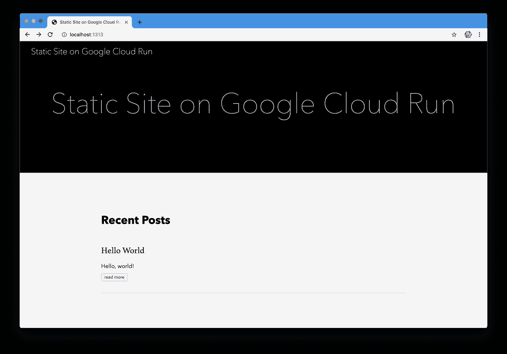
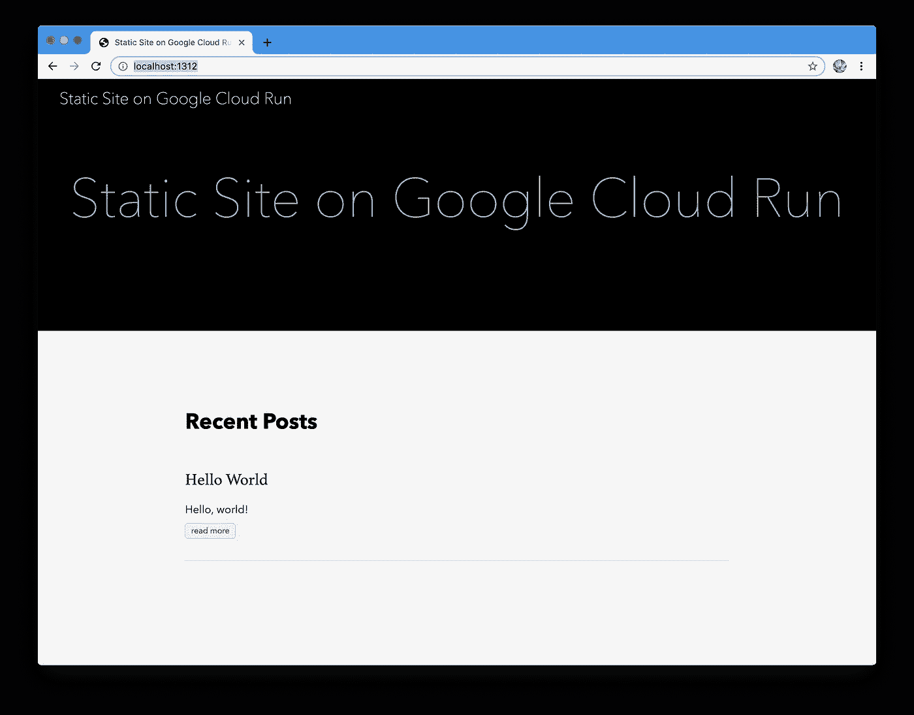
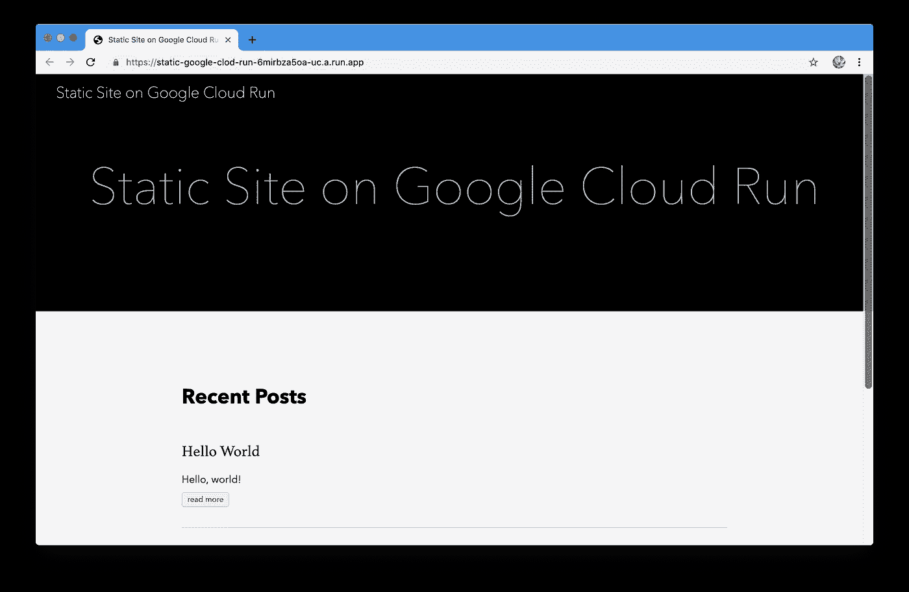

# 在谷歌云上运行一个静态网站

> 原文：<https://medium.com/google-cloud/how-to-run-a-static-site-on-google-cloud-run-345713ca4b40?source=collection_archive---------0----------------------->


那是我们。

Google Cloud Run 是新宣布的 Google 云服务。想法很简单:它是无服务器上的 **Docker。Google Cloud Run 类似于 Google Cloud 的功能:你写代码不用担心基础设施。**

它的独特之处在于 **Google Cloud Run 直接与 Docker 容器**一起工作，公开`Dockerfile`，支持任何编程语言，自定义域，并且超时时间长得多(15 分钟)。GKE 上运行的 Google Cloud 还支持 Websockets 和 GPU/TPUs，这使得它成为机器学习等资源密集型应用程序的有趣选择。

在本指南中，我将向你展示如何使用一个简单的命令，在几分钟内运行一个简单的静态站点，从而进入 Google Cloud Run。一句话，你自己的穷人的生活。这是最容易得到平台味道的方法之一，即使肯定有更好的用例。(请先熟悉一下[的定价](https://cloud.google.com/run/pricing)，但不要担心:由于免费层，你可能一毛钱都不用付。)

让我们从实际构建一个静态网站开始。从从头创建一个到使用一个框架，一个静态的站点生成器，像 [Jekyll](https://jekyllrb.com/) 或 [Hugo](https://gohugo.io/) 这样的选项很少。我会选择后者，因为我喜欢它，但它们都是有效的选择。我想委婉地请你先熟悉一下 Hugo 的快速入门:

```
$ brew install hugo
$ hugo new site static-google-cloud-run
$ cd static-google-cloud-run
$ git init
$ git submodule add https://github.com/budparr/gohugo-theme-ananke.git themes/ananke
$ echo 'theme = "ananke"' >> config.toml
$ hugo new posts/hello-world.md
```

现在，使用您最喜欢的编辑器，通过添加一些内容并删除有效发布它的`draft: true`行来编辑`content/posts/hello-world.md`:

```
---
title: "Hello World"
date: 2019-06-18T03:15:54+02:00
---Hello, world!
```

此外，编辑`config.toml`并通过更改`title`和从`baseURL`中移除`example.org`来自定义站点配置:

```
baseURL = ""
languageCode = "en-us"
title = "Static Site on Google Cloud Run"
theme = "ananke"
```

我们现在可以生成 HTML 并运行服务器:

```
$ hugo
$ hugo server
```

默认的 URL[http://localhost:1313/](http://localhost:1313/)应该向我们显示以下内容:



它并不漂亮，但是，嘿，我们在这上面只花了一分钟，对吧？

让我们对一个静态站点进行 dockerize。使用 Hugo 作为静态站点生成器和服务器的问题是性能和缺乏好的 Docker 图片。Nginx 是最快的网络服务器之一，提供标准的 Docker 镜像，性能影响很小。

这是我们的`Dockerfile:`

```
# Use a nginx Docker image
FROM nginx# Copy the static HTMLs to the nginx directory
COPY public /usr/share/nginx/html# Copy the nginx configuration template to the nginx config directory
COPY nginx/default.template /etc/nginx/conf.d/default.template# Substitute the environment variables and generate the final config
CMD envsubst < /etc/nginx/conf.d/default.template > /etc/nginx/conf.d/default.conf && exec nginx -g 'daemon off;'
```

这是我们的`nginx/default.template`:

```
server {
    listen       ${PORT};
    server_name  localhost; location / {
        root   /usr/share/nginx/html;
        index  index.html index.htm;
    }
}
```

`Dockerfile`的前两行非常明显。但是，我们为什么要使用配置模板呢？[谷歌云运行容器运行时合同](https://cloud.google.com/run/docs/reference/container-contract)规定:

> 容器必须在由`PORT`环境变量定义的端口上监听`0.0.0.0`上的请求。

清楚了吗？

如果是，让我们构建并运行映像:

```
$ docker build -t static-google-cloud-run .
$ docker run -p 1312:1312 -e PORT=1312 static-google-cloud-run
```

[http://localhost:1312/](http://localhost:1312/) 应该会返回与上面相同的结果:



仍然不漂亮，但是，嘿，我们只花了两分钟，对吧？

**让 Google Cloud 运行我们的静态站点 Docker 映像吧！这是最后一步。我假设你已经安装了 [Google Cloud SDK](https://cloud.google.com/sdk/) ，[启用了 Google Cloud Run](https://console.cloud.google.com/marketplace/details/google-cloud-platform/cloud-run) ，并且熟悉 [gcloud CLI 工具](https://cloud.google.com/sdk/gcloud/)。我的谷歌云项目名称是`maurycy-sandbox`，所以请用你正在使用的名称替换它。**

首先，让我们使用 [Google Cloud Build](https://cloud.google.com/cloud-build/) 构建图像:

```
$ gcloud builds submit --tag gcr.io/maurycy-sandbox/static-google-cloud-run
```

几分钟后，您可以部署服务:

```
$ gcloud beta run deploy static-google-clod-run --image gcr.io/maurycy-sandbox/static-google-cloud-run
```

控制台将输出:

```
Allow unauthenticated invocations to [static-google-clod-run] (y/N)? yDeploying container to Cloud Run service [static-google-clod-run] in project [maurycy-sandbox] region [us-central1]
⠶ Deploying new service... Creating Resources.
  ⠶ Creating Revision...
  . Routing traffic...
Done.
Service [static-google-clod-run] revision [static-google-clod-run-00001] has been deployed and is serving traffic at [https://static-google-clod-run-6mirbza5oa-uc.a.run.app](https://static-google-clod-run-6mirbza5oa-uc.a.run.app)
```

最后一行最重要。这将是不同的，但这是网站托管的地方，除非我们设置一个自定义域:



不漂亮，但是，嘿，只有三分钟，对吧？

万岁！我们完成了:我们在 Google Cloud Run 上有了一个非常可扩展的静态网站。你现在甚至可以绘制自己的领域地图。

PS。请不要忘记停止服务，无论是使用[控制台 UI](https://console.cloud.google.com/run) 还是`gcloud`:

```
$ gcloud beta run services delete static-google-cloud-run
```