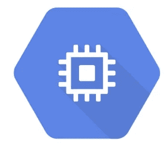

# 如何在 GCE 虚拟机中运行容器化的工作负载

> 原文：<https://medium.com/google-cloud/how-to-run-containerized-workloads-in-gce-vm-7ae99d5e0975?source=collection_archive---------0----------------------->

虽然无服务器平台和长时间运行工作负载的想法起初看起来有些“不自然”，但聪明人已经在努力了(看看你的 [@Knative](http://twitter.com/KnativeProject) 社区)。与此同时，有时你可能只需要一个简单的方法。



在这篇文章中，我将阐述如何使用谷歌计算引擎(GCE)容器执行选项来运行可变持续时间的工作。这种方法支持定制虚拟机、GPU/TPU 加速器和 VPC 网络…因此可能是 GCP 上其他计算选项的便捷替代方案。我还将演示如何在容器完成时自动终止创建的 VM，这样您就不必为空闲的 VM 时间付费。

最后，在这个例子中，我将解析来自 Google Cloud Storage (GCS)的小 gzip 文件，但是由于这种方法不受客户端超时的限制，所以您可以使用它来做几乎任何事情……对较大文件的转换、轻量级 ETL 或媒体格式编码。您甚至可以将它与 [GCP 任务队列](https://cloud.google.com/appengine/docs/standard/python/taskqueue/)结合起来，用于更复杂的管道。

# 先决条件

如果你还没有，创建新的 GCP 项目并配置 [Google Cloud SDK](https://cloud.google.com/sdk/docs/) 。

# 设置

首先，克隆此存储库，并导航到该目录:

```
git clone [https://github.com/mchmarny/long-running-job.git](https://github.com/mchmarny/long-running-job.git)
cd long-running-job
```

此外，为了简化后续命令，我们将导出几个变量:

```
export PROJECT=$(gcloud config get-value project)
export APP_NAME="my-long-job"
export SA_NAME="${APP_NAME}@${PROJECT}.iam.gserviceaccount.com"
```

# 服务帐户

要执行此示例，您需要一个 [GCP 服务帐户](https://cloud.google.com/iam/docs/creating-managing-service-accounts)。你可以在 UI 中或者使用`**gcloud**` SDK 来完成。

```
gcloud iam service-accounts create **$APP_NAME** \
  --display-name "Service Invoker Account for **${APP_NAME}**"
```

我们还必须为该帐户分配必要的 IAM 角色:

```
gcloud projects add-iam-policy-binding $PROJECT \
  --member "serviceAccount:${SA_NAME}" \
  --role **roles/logging.logWriter**gcloud projects add-iam-policy-binding $PROJECT \
  --member "serviceAccount:${SA_NAME}" \
  --role **roles/cloudtrace.agent**gcloud projects add-iam-policy-binding $PROJECT \
  --member "serviceAccount:${SA_NAME}" \
  --role **roles/monitoring.metricWriter**gcloud projects add-iam-policy-binding $PROJECT \
  --member "serviceAccount:${SA_NAME}" \
  --role **roles/storage.objectViewer**gcloud projects add-iam-policy-binding $PROJECT \
  --member "serviceAccount:${SA_NAME}" \
  --role **roles/pubsub.editor**gcloud projects add-iam-policy-binding $PROJECT \
  --member "serviceAccount:${SA_NAME}" \
  --role **roles/compute.instanceAdmin**
```

最后，为了使我们的演示能够模拟该帐户，我们需要为该帐户提供一个密钥，该密钥将保存在您的主目录中。您应该保护该密钥，或者在演示结束后将其删除。

```
gcloud iam service-accounts keys create \
  --iam-account $SA_NAME **"${HOME}/.${APP_NAME}-sa.json"**
```

# 容器图像

本例中的工作负载单位是容器映像。在本演示中，要从源代码创建映像，首先需要供应商提供所有的依赖项:

```
go mod tidy
go mod vendor
```

然后将映像构建请求提交给云构建:

```
gcloud builds submit --tag **"gcr.io/${PROJECT}/${APP_NAME}:0.0.1"**
```

如果成功，您应该会看到一个确认，其中包含创建的映像的完全合格的 URI。

# 将容器部署到虚拟机

现在启动一个新的虚拟机，并配置它运行上面构建的映像。该示例将使用位于公共 GCS bucket(long-running-job-src-files)中的 gzipped CSV 文件(100-Sales-Records.csv.gz)。如果你愿意，你可以用你自己的文件替换它们。

```
gcloud compute instances create-with-container **$APP_NAME** \
  --container-image=**"gcr.io/${PROJECT}/${APP_NAME}:0.0.1"** \
  --machine-type=**n1-standard-1** \
  --zone=**us-central1-c** \
  --image-family=cos-stable \
  --image-project=cos-cloud \
  --maintenance-policy=MIGRATE \
  --scopes=cloud-platform \
  --container-privileged \
  --container-env=**"GOOGLE_APPLICATION_CREDENTIALS=/tmp/sa.pem,BUCKET=long-running-job-src-files,OBJECT=100-Sales-Records.csv.gz,TOPIC=${APP_NAME}"** \
  --container-mount-host-path=**mount-path=/tmp,host-path=/tmp,mode=rw**
```

现在没有办法在同一个命令中上传文件，所以之后，您需要将上面创建的服务帐户密钥复制到新的虚拟机。容器被设置为在出现故障时重启，因此当密钥在连接到我们的虚拟机的已挂载卷中可用时，它将自动使用该密钥。

```
gcloud compute scp **"${HOME}/.${APP_NAME}-sa.json"** \
  **"${APP_NAME}:/tmp/sa.pem"** --zone=**us-central1-c**
```

# 集装箱日志

一旦 VM 启动，您就可以监控从容器到 [Stackdriver](https://cloud.google.com/stackdriver/) 的日志输出。为此，我们需要首先捕获虚拟机实例 Id:

```
export VM_INSTANCE_ID=$(gcloud compute instances describe \
  **$APP_NAME** --zone=**us-central1-c** --format="value(id)")
```

一旦我们捕获了 VM 实例 ID，我们现在可以查询 [Stackdriver](https://cloud.google.com/stackdriver/) 来获取容器输出的日志:

```
gcloud logging read "resource.type=gce_instance AND \
  logName=projects/${PROJECT}/logs/cos_containers AND \
  resource.labels.instance_id=**${VM_INSTANCE_ID}** AND \
  **jsonPayload.message:\"[LRJ]\""** \
  --order="asc"
```

> *注意，该命令将只打印用户代码在容器中输出的日志(内部的日志记录器在所有日志条目前加上前缀“[LRJ]”)。您可以通过移除* `*jsonPayload.message:"[LRJ]"*` *过滤器来查看日志条目的完整列表。*

容器存在后，VM 将自动关闭，但日志仍然可以在 Stackdriver 中进行取证分析。

# 结论

我希望你能发现这个对你 GCP 计算机工具箱有帮助的补充。你可以在 https://github.com/mchmarny/long-running-job 的[网站](https://github.com/mchmarny/long-running-job)找到源代码和更容易执行的脚本