# 如何用 6 个步骤在 Google 云平台上运行深度学习模型？

> 原文：<https://medium.com/google-cloud/how-to-run-deep-learning-models-on-google-cloud-platform-in-6-steps-4950a57acfa5?source=collection_archive---------0----------------------->

*使用深度学习虚拟机*

谷歌云平台是谷歌提供的一个工具，人们可以利用它来构建大规模的解决方案。这个平台最近很受欢迎，因为它们很容易访问 GPU。此外，他们还免费给你价值 300 美元的信用额度，有效期为一年，根据你需要做的处理类型，有效期可长达一年。

然而，由于没有合适的图形用户界面或者许多软件包无法安装，一些实例会变得非常具有挑战性。在这篇博客中，我将谈论一种部署市场解决方案来运行深度学习模型的简单方法。此外，这还将创建一个 Jupyter 笔记本 GUI，可用于快速查看结果。

## 第一步:建立一个谷歌云账户

你需要做的第一件事是设置一个谷歌云账户。

前往 https://cloud.google.com/[使用您的 Gmail 帐户登录。如果你有一个学校或组织的帐户，这可能会导致将来的一些合作问题，所以我强烈建议你使用你的个人 Gmail 帐户创建一个帐户。如果你没有 Gmail 帐户，现在也许是创建一个的好时机。](https://cloud.google.com/)

登录时，Google 会要求您分享您的信用卡信息。你可以把它们放进去，但是你的信用卡不会收费，除非你用完了你所有的 300 美元的信用，所以你不必担心。

## 步骤 2:创建项目

一旦你登录，它会带你到一个控制台屏幕，看起来应该是这样的。

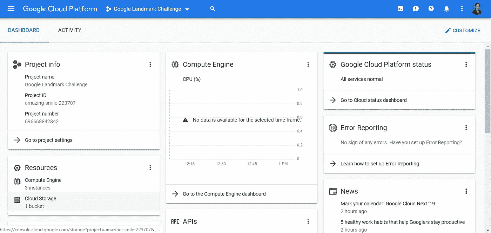

项目控制台

如果您没有获得项目的自动分配，您应该继续创建一个。单击“创建新项目”图标和横幅，创建一个新项目。项目 ID 是自动分配的，但是您可以随意更改。我决定继续使用分配给我的默认项目 ID。

## 第三步:部署深度学习虚拟机

现在您已经有了一个客户和项目，您可以部署一个市场解决方案了。

> 只有在您部署解决方案后，才会开始向您收费。

要建立深度学习市场解决方案，请在搜索栏中搜索“深度学习虚拟机”。这将带您进入“深度学习虚拟机”的登录页面。

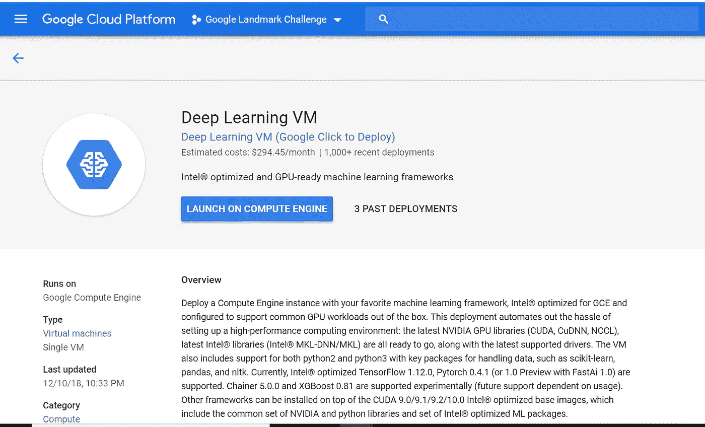

深度学习虚拟机登录页面

使用深度学习 VM 的优势在于，我们不必安装 python 或 tensorflow，因为它是 Google 开发的预打包映像的一部分。一旦你进入这个页面，你只需点击“启动计算引擎”按钮。此页面还显示了此引擎过去的部署次数。对我来说是 3。

启动计算引擎后，您将进入配置页面，在这里您可以为环境设置一个名称，为机器选择区域，并选择您想要的 CPU 和 GPU 数量。

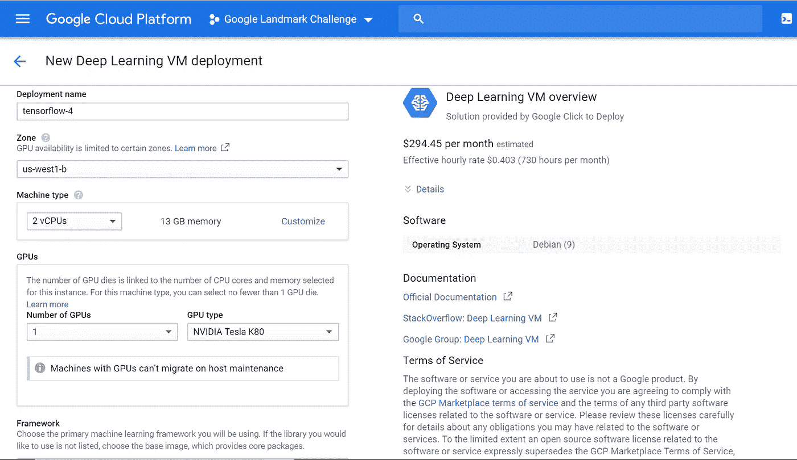

新的深度学习虚拟机部署页面

注意您为部署选择的**区域**很重要，因为您选择的机器配置将取决于它。例如，在某些区域中，您可以访问的 CPU 和 GPU 的数量可能有限制。

根据您选择的机器类型，您可以在右侧看到相应的账单金额变化。

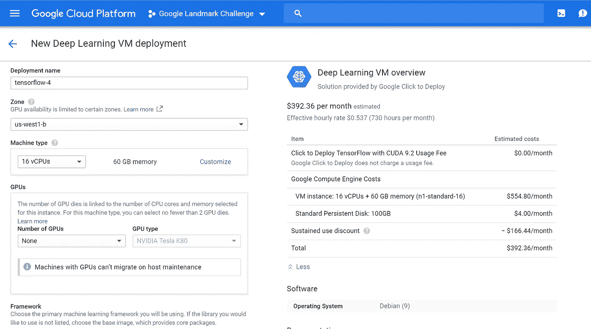

深度学习虚拟机的计费

比如你选择 16 个 CPU，0 个 GPU，你可以看到，如果你每月使用 730 小时，你每月将被收取 392.36 美元。如果您点击“详细信息”,将会显示账单的明细。一般 GPU 比 CPU 贵，如果不需要 GPU，不如干脆跳过。您还需要在您的部署区域中请求 GPU 配额(我将在步骤 6 中详细讨论)。

目前选择 Zone: us-west1-b，16 个 CPU 和 GPU 为“无”。接下来要选择的是你硬盘的大小。“标准持久磁盘”应该对任何项目都有好处，但如果你有很多数据，你可以扩展内存。请记住，更大的磁盘大小将导致更大的账单，所以最好对需求保持节俭。如果需要，可以随时修改它们(在步骤 5 中介绍)。

选择配置后，点击“部署”。根据您的选择，部署设置可能需要 5 到 10 分钟。如果部署后出现错误，请检查您是否错误地选择了 GPU。如果在没有分配配额的情况下选择 GPU，可能会导致错误。只需创建另一个没有任何 GPU 的部署，就可以了。

现在有 3 种不同的方式在这个虚拟机上运行代码。最简单的方法是使用 Jupyter Notebook 的 GUI，它在本地主机 8080 上运行。要访问这个，您需要安装 Google SDK 来 SSH 这个虚拟机。

你可以在这里安装谷歌 SDK [。初始化 Google SDK 并连接到您创建的 Google 帐户和项目。初始化选项应该在安装后自动显示，如果没有，你可以运行命令:gcloud init，并确保你使用相同的电子邮件和项目 ID 连接。](https://cloud.google.com/sdk/install?)

一旦安装并配置了 Google SDK，您只需复制显示在部署页面上的 SSH 链接，并将其粘贴到 Google SDK 上。SSH 链接将位于标题“创建到您的机器的 SSH 连接”下(见下图)

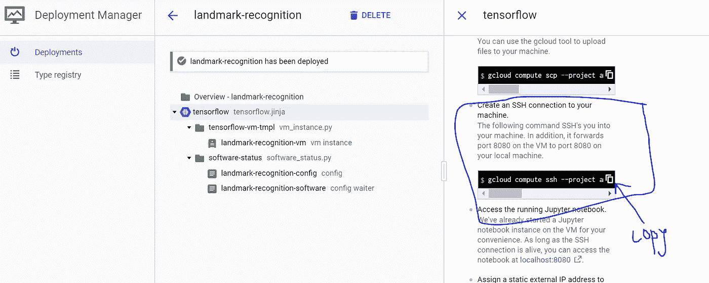

SSH 到深度学习虚拟机

如果您已经成功创建了一个 SSH 连接，将会弹出一个 PuTTY 屏幕(下图)

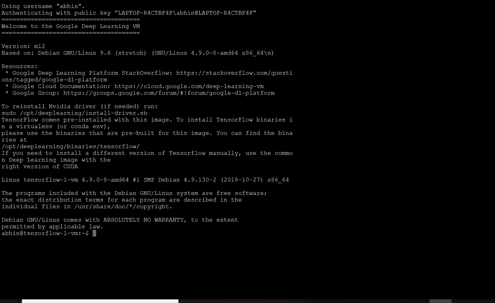

SSH 中的 PuTTY

## 步骤 4:访问 Jupyter 笔记本 GUI

一旦你设置好了 SSH，你只需点击一下 Jupyter GUI。回到部署管理器，点击 localhost:8080 按钮

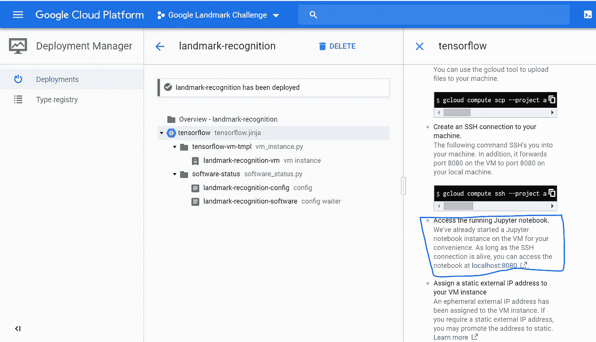

瞧啊。！这将带您到部署在 16 个 CPU 上的 Jupyter 笔记本实例。你可以像使用任何机器一样使用它。

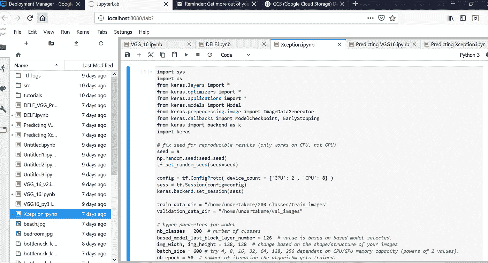

云 Jupyter GUI

此外，您还可以在 PuTTY 终端上运行 python 批处理作业，或者在计算引擎虚拟机中点击 SSH 终端。下一步会有更多的介绍。

## 步骤 5:向虚拟机添加 GPU

在添加 GPU 之前，我们需要在部署实例的同一个区域中请求 GPU 配额。

只需在搜索栏中搜索“配额”,就会进入“IAM & admin”下的配额页面。

首先在“指标”下，选择“无”，然后搜索 GPU。根据您所在区域的 GPU，您可以选择 GPU 的名称，我们还需要选择“GPU(所有区域)”。例如，由于我们的区域是美国西部 1-b，您可以选择“NVIDIA P100 GPU”和“GPU(所有地区)”

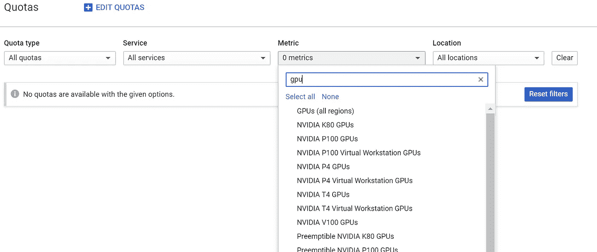

一旦你选择了两个 GPU，你点击顶部的“编辑配额”按钮。

> 确保您选择的 GPU 与您的实例位于同一区域，否则您的部署将无法访问它。

这将生成一个表格，您需要在其中分享您的个人电话号码和此请求的原因。一旦您提交此表格，您将会收到一封来自 Google 的电子邮件，告知您的请求正在处理中，需要 2-3 个工作日。

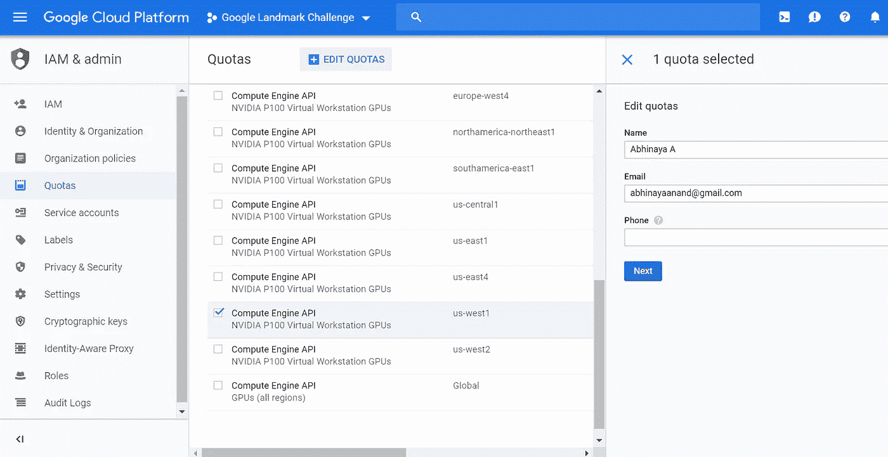

虽然他们的电子邮件说 2-3 个工作日，但申请在几个小时内就被批准了。一旦您的配额请求获得批准，您就可以编辑虚拟机以包含更多 GPU。

## 步骤 6:更改虚拟机配置

要添加请求的 GPU，您需要编辑在计算引擎页面上创建的实例。转到谷歌控制台上的菜单，然后点击“计算引擎”。

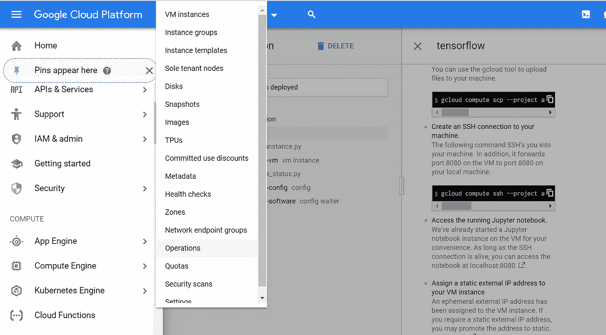

计算引擎->虚拟机实例

虚拟机实例页面列出了我们在 google 云平台的各种解决方案中安装的虚拟机。这里需要注意的重要一点是，如果我们不想为这些机器付费，我们应该**停止所有实例。**即使我们不运行任何代码，谷歌也会向我们收取实例费。

> 因此，当我们没有运行任何东西时，停止所有实例是很重要的。

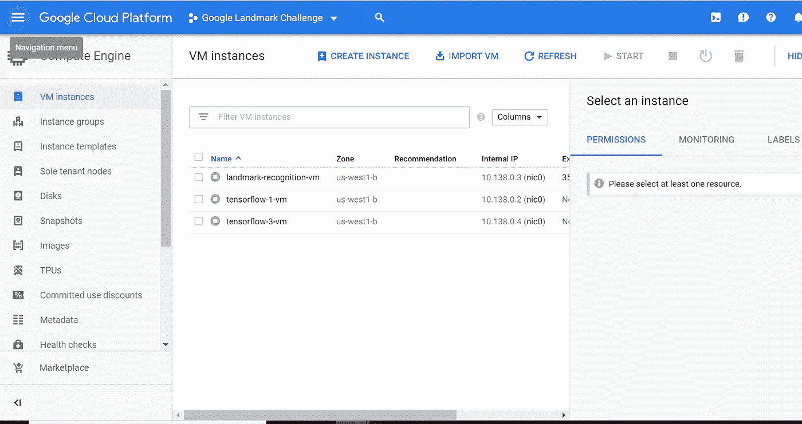

虚拟机实例页面

一旦停止了实例，就可以对其进行编辑。如果您的配额请求获得批准，您应该能够立即添加更多 GPU 并再次部署解决方案。

另一个巧妙的技巧是“启用到串行端口的连接”和“允许对云 API 的完全访问”(在访问范围之下)，以使您的实例能够与桶对话，反之亦然。

一旦通过添加另一个 GPU 修改了您的配置，您就可以在 Jupyter Lab UI 或 PuTTY 终端上运行深度学习模型。你会注意到它会快得多，因为我们在系统中添加了 GPU。这也意味着我们的账单更高了，所以请确保继续查看“账单”页面，以确保您不会用完信用点数。

下面是一个关于我如何在云上访问 Jupyter 笔记本 GUI 来运行模型的简短视频。

# 其他黑客

## 将数据从存储桶移动到虚拟机

您可以使用 GCP 的“gsutil”特性将数据从 bucket 复制到刚刚创建的实例中。

您可以使用 PuTTY 终端或计算引擎上的 SSH 来编写这个命令。

更多关于 gsutil 的细节请点击这里。

## 清除 jupyter 笔记本内存中的垃圾

有时，我们最终会在虚拟 jupyter 笔记本上存储大型文件或对象。这可能会导致内存限制。然而，仅仅删除它们并不能释放内存。相反，我们需要手动清除虚拟机中 jupyter 位置的垃圾来释放内存。

要检查可用内存运行，可以在 PuTTY 终端中使用 du -sh *。在 PuTTY 中导航到 jupyter 文件夹后，可以强制删除它以释放内存。在我的例子中，命令:

**rm -rf /home/jupyter/。本地/共享/回收站**

奏效了。通过再次运行 du -sh*，我可以观察到 dev/sda1 环境中的可用内存在运行该命令后增加了。

## 结论

我确信有许多其他方法可以在谷歌云平台上运行深度学习模型，而无需在设置环境上投入太多时间。

你在 GCP 有什么经历？请分享您的评论，并让我知道我是否能以任何方式帮助解决您的疑问。