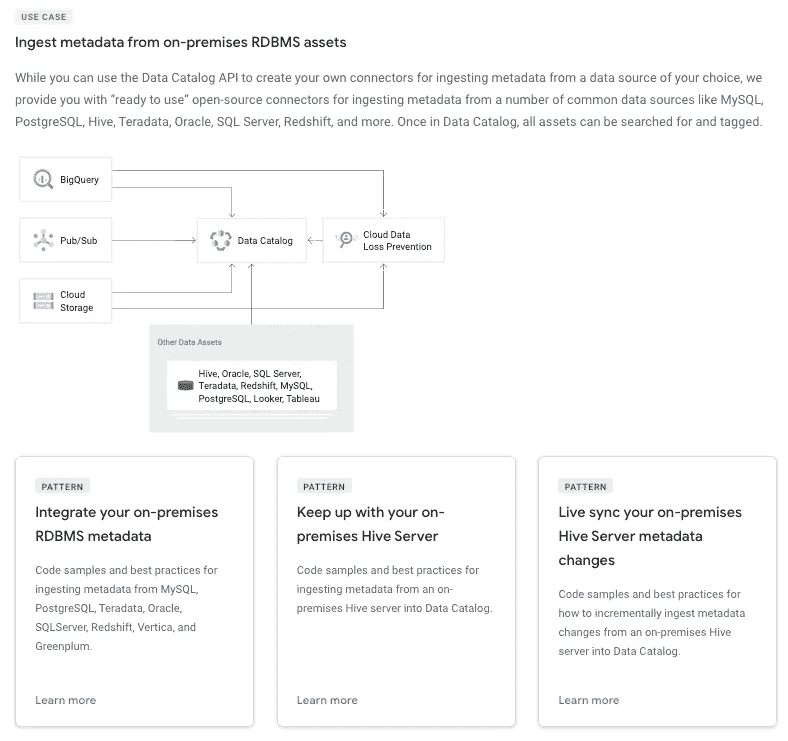

# 如何在生产中运行 Google 数据目录连接器——云功能与 Kubernetes

> 原文：<https://medium.com/google-cloud/how-to-run-google-data-catalog-connectors-in-production-cloud-functions-vs-kubernetes-9c8f9bb4edda?source=collection_archive---------1----------------------->

## 两种方法的最佳实践，带有代码示例！

> ***声明:所表达的所有观点均为本人观点，仅代表本人……****。* ***他们来自参与开发完全可操作的示例连接器的经验，可在:***[***GitHub***](https://github.com/GoogleCloudPlatform/datacatalog-connectors)***获得。***

如果您想了解更多有关数据目录连接器用例的信息，请查阅官方文档:

数据目录连接器用例，来自[官方文档](https://cloud.google.com/data-catalog)。

简而言之，数据目录连接器是 Python[CLI](https://en.wikipedia.org/wiki/Command-line_interface)的，用户可以运行它将他们的源系统元数据与 Google 数据目录连接起来。

通常一个 [CLI](https://en.wikipedia.org/wiki/Command-line_interface) 都是靠手动执行，生活教会我们，任何事情在某个时间点不自动化都会失败。

为了更好地理解这一点，让我们快速回顾一下 SmartTechnologies 公司正常的一天:

音乐:[https://www.bensound.com](https://www.bensound.com)和歌曲:[https://freesound.org](https://freesound.org/)

> 啊…对不起，乔，我忘记连接了。

如果找不到我们的表定义还不够，我们可能遇到的下一个问题是在安全领域。就像任何需要凭据才能连接到源系统的 CLI 一样，我们正在处理敏感数据。

如果我们手动运行它，很容易出错并暴露这些凭据。在生产环境中工作可能会导致不可修复的损害，甚至可能导致一些法律费用。

为了说明这一点，看看 SmartTechnologies corporation 第二天的结果:

音乐:[https://www.bensound.com](https://www.bensound.com)歌曲:[https://freesound.org](https://freesound.org/)

总之，在这个简短的故事中，我们了解到首先自动化我们的工作负载是关键，然后我们需要保持我们的凭证安全。**但是** **使用一些** [**的 GCP 产品**](https://github.com/gregsramblings/google-cloud-4-words) 怎么才能实现呢？

在这个帖子系列中，我们将探讨两种方法来回答这个问题。

> SmartTechnologies 公司团队非常兴奋地了解到这一点，并度过了平静的一天。

我们将处理的两种方法是:

*   **带云调度器和云功能的无服务器**。
*   使用 Kubernetes 管理工作负载(Anthos Ready)。

通常，我会选择无服务器的，因为它设置起来更简单，而且在大多数情况下，它会更便宜。但是如果你已经在使用 Kubernetes 并开始你的混合云之旅，那么第二个肯定会有所帮助。

事不宜迟，让我们看看一些行动！

## 具有云调度程序和云功能的无服务器

数据目录无服务器云功能架构。

在这个 [GitHub repo](https://github.com/mesmacosta/google-datacatalog-postgresql-connector-serverless) 中，我们有样本代码和一个 [deploy.sh](https://github.com/mesmacosta/google-datacatalog-postgresql-connector-serverless/blob/master/deploy.sh) 脚本，用户可以运行和设置上面的架构。接下来，我们将检查每个组件:

*   **云调度器**

云调度器将帮助我们创建一个无服务器的 cron 作业，这样我们就可以**自动化我们的工作负载。**

创建它非常简单:

来自 [Github](https://github.com/mesmacosta/google-datacatalog-postgresql-connector-serverless/blob/master/deploy.sh) 。

我们基本上需要设置 PubSub 主题名称和`CRON_SCHEDULE`，如果我们想要每 30 分钟运行一次，那么应该是:`”30 * * * *”`。

*   **PubSub**

图片:[王国](https://icons8.com/illustrations/style--kingdom)作者[娜塔莎·雷马克](https://icons8.com/illustrations/author/5e7e24ce01d0360013bb7479)

为什么我们甚至需要 [PubSub](https://cloud.google.com/pubsub/) ？为什么不直接调用云函数呢？

云调度程序能够调用以下类型:

*   HTTP/S 端点
*   [Pub/Sub 话题](https://cloud.google.com/pubsub/docs)
*   [App 引擎应用](https://cloud.google.com/appengine/docs)

由于 Cloud Scheduler 支持 HTTP/s 端点，您可以认为将 PubSub 添加到解决方案中是不值得的，并且会增加成本和 it 的整体管理。

如果我们想直接调用云函数，[使用 HTTP 调用](https://cloud.google.com/scheduler/docs/http-target-auth)，简而言之，我们需要使用一个只有触发服务器知道的安全令牌。我们还需要应用一些安全最佳实践，并考虑如何轮换令牌，相信我，这不值得头痛。

有了 PubSub，在这个用例中，我们甚至不会接近[计费额度](https://cloud.google.com/pubsub/pricing#:~:text=The%20first%2010%20gigabytes%20of,the%20encoded%20message%20body%20string)。因此，我们将让 GCP 使用 PubSub 为我们处理云函数调用的安全性。

*   **云功能**

该组件将作为[数据目录连接器](https://github.com/GoogleCloudPlatform/datacatalog-connectors)顶部的门面。

首先，快速浏览一下 [deploy.sh](https://github.com/mesmacosta/google-datacatalog-postgresql-connector-serverless/blob/master/deploy.sh) 脚本的这一部分:

[GitHub 回购](https://github.com/mesmacosta/google-datacatalog-postgresql-connector-serverless)的一部分。

上面的代码设置了连接器所需的环境变量，然后创建了云函数。

在 [GitHub repo](https://github.com/mesmacosta/google-datacatalog-postgresql-connector-serverless) 上，有关于如何使用的示例值说明:

来自 [GitHub repo](https://github.com/mesmacosta/google-datacatalog-postgresql-connector-serverless) 的部署指令。

图片:[王国](https://icons8.com/illustrations/style--kingdom)作者[娜塔莎·雷马克](https://icons8.com/illustrations/author/5e7e24ce01d0360013bb7479)

又是你？你可能想知道`DB_CREDENTIALS_USER_SECRET`和`DB_CREDENTIALS_PASS_SECRET`是什么，对吗？

你还记得我们需要以某种方式保持我们的凭证安全吗？

我们可以将凭证值存储为[环境变量](https://cloud.google.com/functions/docs/env-var)，但是这将带来我们在 PubSub 组件中讨论过的同样的挑战。

因此，为了处理这个问题，我们将使用 GCP 的无服务器[机密管理器](https://cloud.google.com/secret-manager)，为我们存储凭证。

> 如果你有更强的安全需求，比如管理自己的密钥，考虑使用[谷歌 KMS](https://cloud.google.com/security-key-management) 。

在 GitHub repo 上有一个[助手脚本](https://github.com/mesmacosta/google-datacatalog-postgresql-connector-serverless/blob/master/create_secret.sh)来处理它:

来自 [GitHub repo](https://github.com/mesmacosta/google-datacatalog-postgresql-connector-serverless) 的秘密助手。

你只需要执行一次，每当你想轮换你的秘密。确保当您运行它时，您处于一个**安全**和**审计**的环境中。

接下来，我们来看看云函数[代码](https://github.com/mesmacosta/google-datacatalog-postgresql-connector-serverless/blob/master/cloud-function/main.py):

[GitHub 回购](https://github.com/mesmacosta/google-datacatalog-postgresql-connector-serverless)的一部分。

基本上，它只是在以下函数中检索机密值后，启动[Google-data catalog-PostgreSQL-connector](https://pypi.org/project/google-datacatalog-postgresql-connector/):

部分 [GitHub 回购](https://github.com/mesmacosta/google-datacatalog-postgresql-connector-serverless)。

> 我们在示例中使用了`latest`属性来总是选择最新的版本，以防我们已经旋转了秘密。

最后，我们来看一个**无服务器 PostgreSQL 数据目录连接器**执行 **:** 的演示视频

音乐:[https://www.bensound.com](https://www.bensound.com)和歌曲:[https://freesound.org](https://freesound.org/)

就是这样！

# 结束语

在本文中，我们讨论了在处理命令行界面和数据库凭证时遇到的一些挑战，以及 SmartTechnologies 公司是如何应对这些挑战的。

我们解决了两个主要挑战:

*   **手动执行**

首先，通过使用一些 GCP 无服务器产品自动执行，我们不再需要手动运行它。

*   **证件曝光**

其次，我们通过将凭证存储在 secrets manager 产品中来降低暴露凭证的风险。智能技术公司终于有了平静的一天😄。

请继续关注我的下一篇文章，在那里我将展示如何使用 Kubernetes 的托管工作负载来做同样的事情。干杯！

# 参考

**数据目录无服务器连接器 Github Repo**:[https://Github . com/mes macosta/Google-Data Catalog-PostgreSQL-Connector-server less](https://github.com/mesmacosta/google-datacatalog-postgresql-connector-serverless)