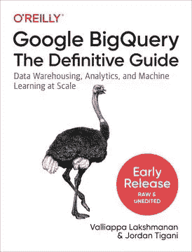

# 如何在 BigQuery 表上运行 Python 代码

> 原文：<https://medium.com/google-cloud/how-to-run-python-code-on-your-bigquery-table-1bbd78c69351?source=collection_archive---------2----------------------->

## 使用 Python 3 Apache 射束管道

您可以用 SQL 做很多事情，SQL 无疑非常方便，但是偶尔您会发现自己需要在 BigQuery 表上运行 Python 代码。如果您的数据很小，您可以使用 Pandas(和 BigQuery 客户端库)，但是如果您的数据很大，最好的方法是使用 Apache Beam，并通过云数据流以无服务器、自动缩放的方式执行它。

下面是 GitHub 中示例的[完整代码。它来自我们即将出版的关于 BigQuery](https://github.com/GoogleCloudPlatform/bigquery-oreilly-book/blob/master/05_devel/statfit.ipynb) 的[书。](https://www.oreilly.com/library/view/google-bigquery-the/9781492044451/)



这里的代码来自我们关于 BigQuery 的新书的第 5 章。您可以在 Safari 上的早期访问中阅读它。

## Python 3 Apache Beam + BigQuery

下面是从 BigQuery 读取并写入 BigQuery 的关键 Beam 代码:

```
with beam.Pipeline(RUNNER, options = opts) as p:
    (p 
      | 'read_bq' >> beam.io.Read(beam.io.BigQuerySource(query=query, use_standard_sql=True))
      | 'compute_fit' >> beam.FlatMap(compute_fit)
      | 'write_bq' >> beam.io.gcp.bigquery.WriteToBigQuery(
          'ch05eu.station_stats', schema='station_id:string,ag:FLOAT64,bg:FLOAT64,cg:FLOAT64')
    )
```

本质上，我们在 BigQuery 表上运行查询，运行 Python 方法 compute_fit，并将输出写入 BigQuery 表。

这是我的 compute_fit 方法。如您所见，这只是普通的 Python 代码:

```
def compute_fit(row):
  from scipy import stats
  import numpy as np
  durations = row['duration_array']
  ag, bg, cg = stats.gamma.fit(durations)
  if np.isfinite(ag) and np.isfinite(bg) and np.isfinite(cg):
      result = {}
      result['station_id'] = str(row['start_station_id'])
      result['ag'] = ag
      result['bg'] = bg
      result['cg'] = cg
      yield result
```

确保在 requirements.txt 中指定需要安装在数据流工作器上的 Python 包:

```
%%writefile requirements.txt
numpy
scipy
```

尽情享受吧！