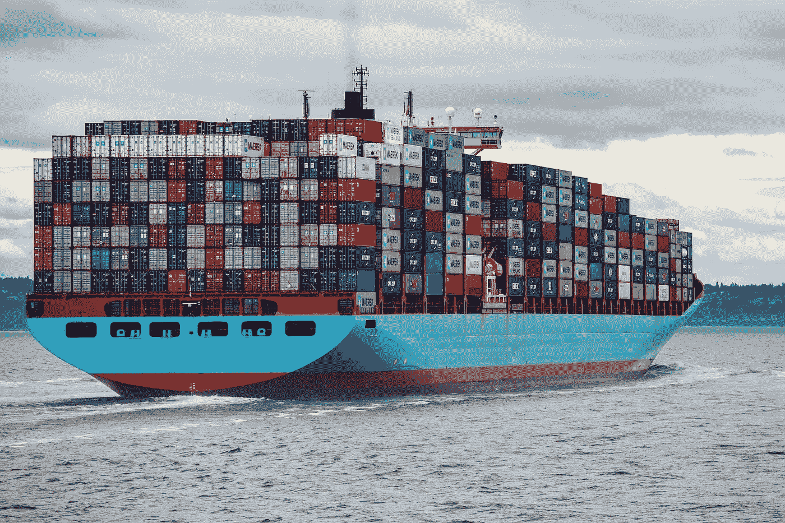

# GitLab CI 中的 Vertex AI 自定义培训作业

> 原文：<https://medium.com/google-cloud/how-to-run-vertexai-custom-jobs-in-gitlab-ci-b986e6ebed89?source=collection_archive---------0----------------------->

## 如何为 MLOps 管道设置容器



照片由[伊恩·泰勒](https://unsplash.com/@carrier_lost?utm_source=unsplash&utm_medium=referral&utm_content=creditCopyText)在 [Unsplash](https://unsplash.com/s/photos/docker?utm_source=unsplash&utm_medium=referral&utm_content=creditCopyText) 上拍摄

这篇博文是关于我的团队最近在一个 **MLOps** 项目范围内处理`gcloud beta ai`和`docker`相关任务时所面临的一个挑战。这些任务包括为[定制培训应用](https://cloud.google.com/vertex-ai/docs/training/create-python-pre-built-container)开发轻量级集成测试。我们使用[Google Cloud Vertex AI unified ML platform](https://cloud.google.com/vertex-ai)，因此我们可以利用`[gcloud beta ai custom-jobs local-run](https://cloud.google.com/sdk/gcloud/reference/beta/ai/custom-jobs/local-run)`在开发机器和 CI/CD 管道的早期阶段进行“本地”测试。

在定制培训应用程序上工作的机器学习工程师成功地在他们的开发环境中运行了测试，其中 Cloud SDK 和 Docker 守护程序是可用的。一旦本地开发完成，就该建立持续集成环境了，它运行在 GitLab 上。

# Docker 图像设置

如文档中所述，`gcloud beta ai custom-jobs local-run` *将你的训练代码打包成 Docker 镜像，并在本地执行*。在引擎盖下，它似乎调用了`docker build`和`docker run`，所以我们的第一个动作是学习在 GitLab CI 容器内运行 Docker 命令(我们的运行人员使用 [Docker 执行器](https://docs.gitlab.com/runner/executors/docker.html))。幸运的是， [GitLab 提供了大量关于它的文档](https://docs.gitlab.com/ee/ci/docker/using_docker_build.html)！

如果你阅读 GitLab 的文档，你会注意到大多数例子使用下面的`image`和`services`设置:

对于 Docker(又名 *DinD* )用例中的各种 Docker 来说，这应该没问题，但对于我们的用例来说就不行了。我们不仅需要 Docker 守护进程，还需要 CI 容器中的 Cloud SDK。

所以我们决定构建一个自定义映像，从`docker:19.03.12`开始，并在其中安装云 SDK，如下所示。

需要记住的几件事:

1.  `[docker:19.03.12](https://github.com/docker-library/docker/blob/86f7f4b563c7c6fe4620c5a8d82694a78f41989f/19.03/Dockerfile)`[镜像建立在](https://github.com/docker-library/docker/blob/86f7f4b563c7c6fe4620c5a8d82694a78f41989f/19.03/Dockerfile) `[alpine:3.12](https://github.com/docker-library/docker/blob/86f7f4b563c7c6fe4620c5a8d82694a78f41989f/19.03/Dockerfile)`之上，所以我们使用了基于 Alpine 的方法将 Cloud SDK 安装到容器中，并参考了[官方 Cloud SDK Alpine Dockerfile](https://github.com/GoogleCloudPlatform/cloud-sdk-docker/blob/a1754f1ccfa47c4cc5bd218a592d7df1051aaad6/alpine/Dockerfile) 。
2.  Cloud SDK 的 Alpine 映像是建立在`alpine:3.13`之上的，所以我们预计在`docker:19.03.12 / alpine:3.12`之上使用相同的命令时不会出现兼容性问题。
3.  Cloud SDK 的 Alpine 映像不包含额外的组件，我们需要`gcloud beta`。因此，我们安装了组件，正如您在上面的`Dockerfile`的第 28 行中看到的。

# 演示

我已经建立了一个 git 存储库来演示自定义图像的运行:[gitlab.com/ricardomendes/docker-cloud-sdk-sample-repo](https://gitlab.com/ricardomendes/docker-cloud-sdk-sample-repo)。

`[.gitlab-ci.yml](https://gitlab.com/ricardomendes/docker-cloud-sdk-sample-repo/-/blob/main/.gitlab-ci.yml)`文件带来了一个简短的 CI 管道，由两个步骤组成。首先，它构建自定义 Docker 映像并将其推送到 repo 的容器注册中心。然后，它提取图像并运行几个命令，以确保`gcloud beta`和`docker`启动并运行，如下面的代码片段所示:

结果是:

```
$ gcloud --versionGoogle Cloud SDK 361.0.0
beta 2021.10.15
bq 2.0.71
core 2021.10.15
gsutil 5.4$ docker --versionDocker version 19.03.12, build 48a66213fe$ docker run hello-worldUnable to find image ‘hello-world:latest’ locally
latest: Pulling from library/hello-world
...
Status: Downloaded newer image for hello-world:latest
Hello from Docker!This message shows that your installation appears to be working correctly.
To generate this message, Docker took the following steps:
1\. The Docker client contacted the Docker daemon.
2\. The Docker daemon pulled the “hello-world” image from the Docker Hub. (amd64)
3\. The Docker daemon created a new container from that image which runs the executable that produces the output you are currently reading.
4\. The Docker daemon streamed that output to the Docker client, which sent it to your terminal.
```

完整的构建日志可从[这里](https://gitlab.com/ricardomendes/docker-cloud-sdk-sample-repo/-/jobs/1718577368)获得。

这就是我们如何用运行`gcloud beta ai custom-jobs local-run`所需的服务建立一个映像，并在我们正在处理的 MLOps 管道中启用集成测试。

# 最终考虑

在同一个 Docker 容器中运行不同的工作负载并不总是那么简单。因此，我们考虑使用定制映像来运行其他类型的集成测试，例如一些基于 Python 的测试。

虽然定制映像拥有基本的 Python 3 资源，这是`gcloud`所需要的，但是我们意识到它不适合运行基于 Python 的测试。在基于 Alpine 的容器中安装 Python 依赖项很麻烦(请查看这些链接来理解我的意思:【pythonspeed.com/articles/alpine-docker-python 和[python.org/dev/peps/pep-0656](https://www.python.org/dev/peps/pep-0656/))，这就是为什么我们也考虑了基于 Debian 的方法而不是 Alpine。为此，我们从基于`debian:buster-slim`的`google/cloud-sdk:361.0.0`开始，然后尝试在里面安装 Docker，但是[至今没有成功](https://gitlab.com/ricardomendes/docker-cloud-sdk-sample-repo/-/jobs/1718917675)。

也就是说，团队同意在多个容器中运行集成测试，这些容器可以并发运行，利用每个映像提供的特性，避免越来越多的定制。

希望有帮助，随时欢迎反馈！

最好的，