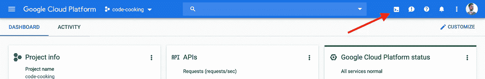

# 如何在谷歌云壳中运行 Visual Studio 代码

> 原文：<https://medium.com/google-cloud/how-to-run-visual-studio-code-in-google-cloud-shell-354d125d5748?source=collection_archive---------0----------------------->

您知道可以在浏览器中运行 Visual Studio 代码吗？太酷了，它甚至可以和扩展之类的东西一起工作。我将用[github.com/cdr/code-server](https://github.com/cdr/code-server/)给你看一个例子

*   前往[console.cloud.google.com](https://console.cloud.google.com/)打开云壳



*   启用加速模式以加快速度


*   安装代码-服务器

```
curl -fsSL [https://code-server.dev/install.sh](https://code-server.dev/install.sh) | sh
```

*   启动服务器

```
./code-server --no-auth --port 8080
```

> 请注意，您不需要身份验证，因为 Google Cloud Shell 代理已经为您处理了。

*   点击网络预览-> 8080 端口预览


> 如果你得到一个 404，从 url 中删除`?authuser=0`。所以比如说，就用
> `[https://8080-dot-YOURID-dot-devshell.appspot.com/](https://8080-dot-YOURID-dot-devshell.appspot.com/)`
> 代替
> `[https://8080-dot-YOURID-dot-devshell.appspot.com/?authuser=0](https://8080-dot-YOURID-dot-devshell.appspot.com/?authuser=0)`

## 就这样，现在您的浏览器中运行了一个 IDE！

