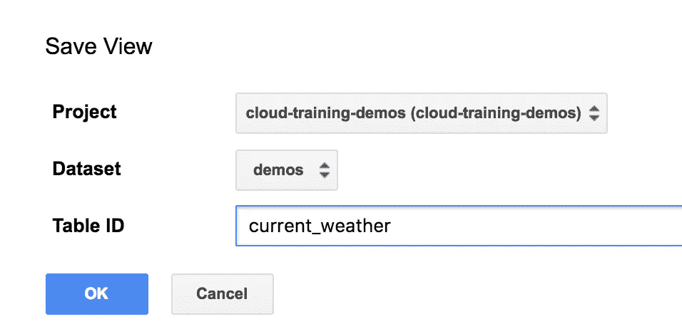
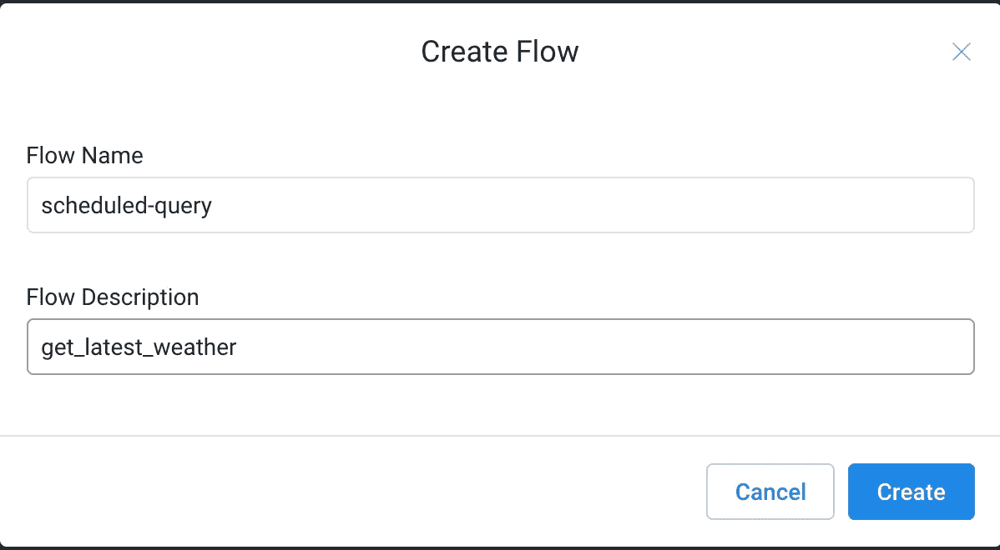
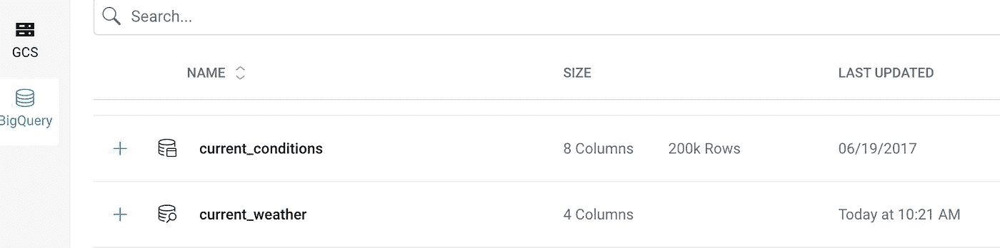
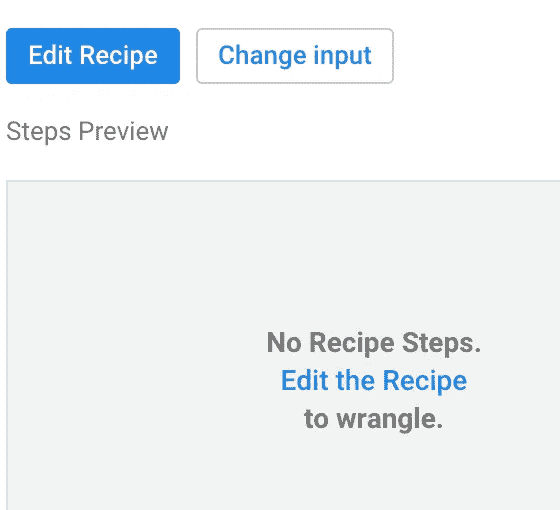
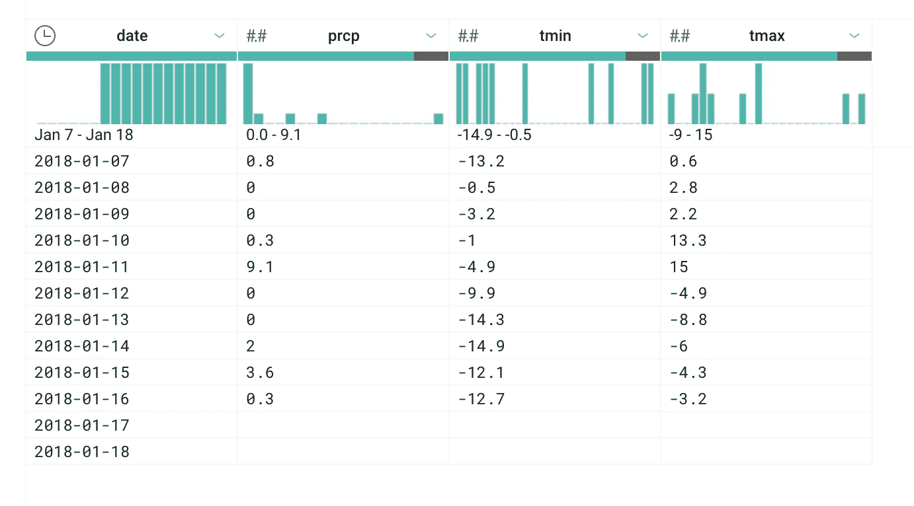
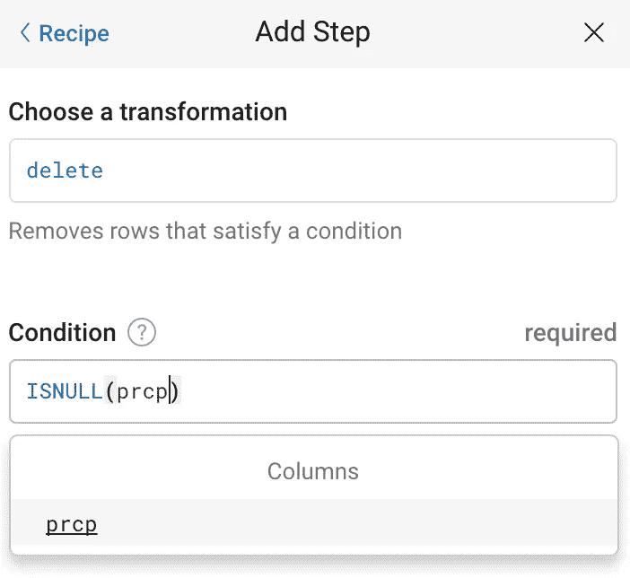
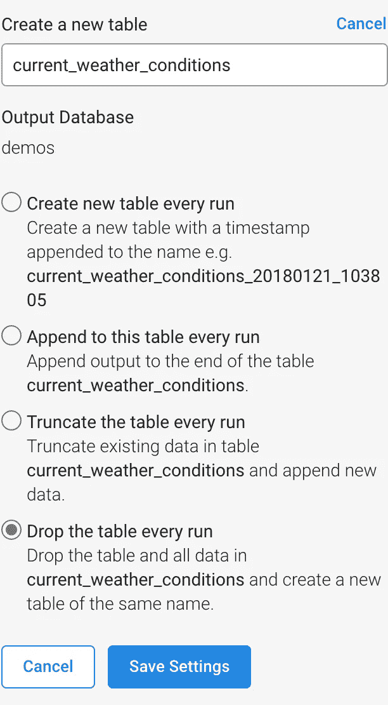
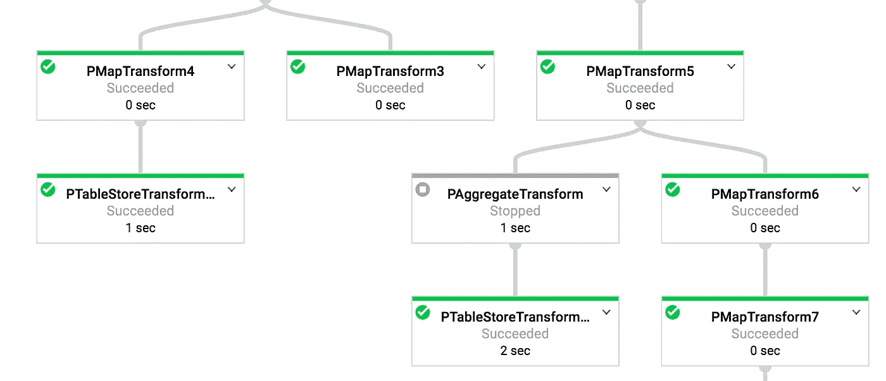
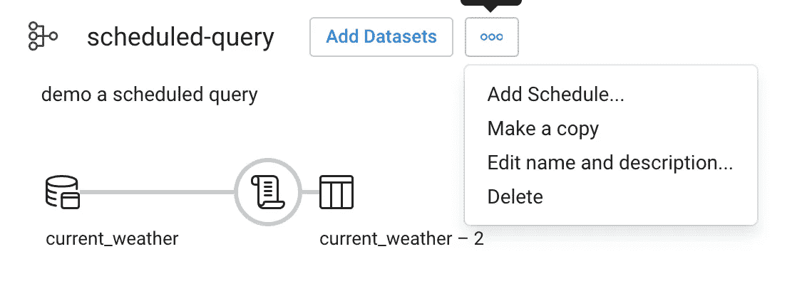
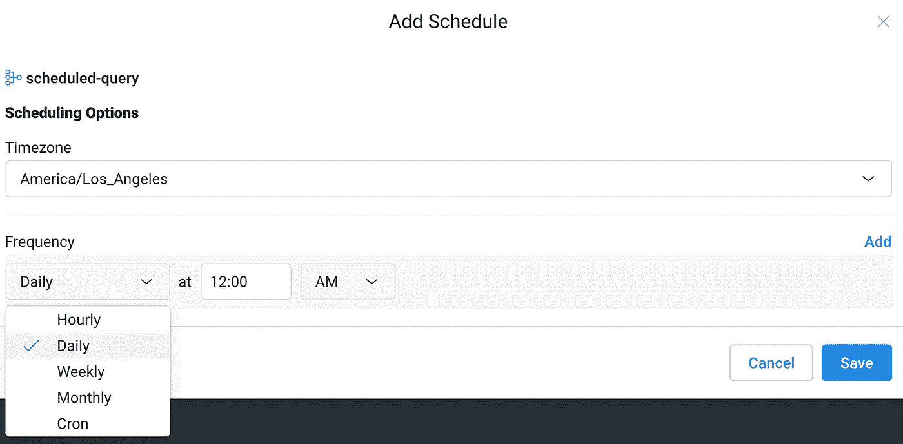

# 如何用 Dataprep 调度 BigQuery ETL 作业

> 原文：<https://medium.com/google-cloud/how-to-schedule-a-bigquery-etl-job-with-dataprep-b1c314883ab9?source=collection_archive---------0----------------------->

BigQuery 用户界面允许您执行各种操作——运行交互式查询、另存为表格、导出到表格等。—但是没有办法(目前还没有！)安排查询在特定时间或周期运行。Graham Polley 最近运气很好，想出了四个解决办法，都是无服务器的，并且涉及其他 GCP 产品。但是在我看来，他错过了 ETL 工作的明显赢家——它灵活、强大、不涉及编码，并且即使在 BigQuery 团队推出了运行预定查询的能力之后，您也可能希望它出现在您的工具包中。

**注意:BigQuery 现在有调度查询，所以请使用它，这样您可以将数据保存在 BigQuery 中，并利用它的规模和功能。**

本文中的方法只有在您进行转换(ETL 中的 T)时才有用:

1.  在 BigQuery UI 中，将所需的查询保存为视图。
2.  在 Cloud Dataprep 中，用 BigQuery 源代码编写一个新的配方。可选地，向您的配方添加一些转换。例如，您可能想要添加一些公式、去重复、转换等。
3.  将转换结果导出到云存储上的 BigQuery 表或 CSV 文件
4.  安排 Dataprep 流定期运行

如果当您尝试复制这些步骤时，UI 有所不同，只需稍微搜索一下。功能可能就在那里，只是在不同的地方。


实际上，安排一个定期运行的查询很容易。

# 1.将 BigQuery 查询另存为视图

我将演示如何使用一个从公共天气数据集中提取最近天气的查询，因此将它输入到 BigQuery UI 中，然后另存为视图:

```
#standardSQL
SELECT
  date,
  MAX(prcp) AS prcp,
  MAX(tmin) AS tmin,
  MAX(tmax) AS tmax
FROM (
  SELECT
    wx.date AS date,
    IF (wx.element = 'PRCP',
      wx.value/10,
      NULL) AS prcp,
    IF (wx.element = 'TMIN',
      wx.value/10,
      NULL) AS tmin,
    IF (wx.element = 'TMAX',
      wx.value/10,
      NULL) AS tmax
  FROM
    `bigquery-public-data.ghcn_d.ghcnd_2018` AS wx
  WHERE
    id = 'USW00094846'
    AND DATE_DIFF(CURRENT_DATE(), wx.date, DAY) < 15 )
GROUP BY
  date
ORDER BY
  date ASC
```



将查询另存为视图

# 2.在 Cloud Dataprep 中，编写一个新的配方


步骤 1:从 GCP web 控制台启动 Dataprep

## 创建新流程



食谱是流程的一部分

## 将 BigQuery 视图作为 Dataprep 数据集导入

单击 Import Datasets，按照 UI 流程进入 BigQuery 数据集，并将新创建的 current_weather 视图作为 Dataprep 数据集导入。



将 current_weather BigQuery 视图作为 Dataprep 数据集导入

## 添加新配方并编辑它



向配方中添加步骤

## 添加配方步骤以进一步转换数据

点击“Edit recipe”后，Dataprep 将取出数据集的一个样本，并向您显示列、它们的分布等。



点击蓝色加号按钮，向配方添加一个步骤。我们将删除数据列为空的所有行:



编写删除转换来删除符合条件的行

注意，当您编写公式时，Dataprep 会向您显示哪些行/列会受到影响。

# 3.运行作业以导出数据

点击“运行作业”。默认情况下，在云存储上创建一个 CSV 文件，但是我们可以通过单击铅笔(“编辑”)图标将其更改为 BigQuery:



在 BigQuery 中将作业的输出更改为写入数据集

单击“运行作业”运行一次。这里，我们要求作业在每次运行时删除并替换表，但是正如您所看到的，还有其他选项。这作为数据流作业运行，即规模化和分布式。



Dataprep 流作为数据流作业运行！使用数据流不需要写 Java/Python。

# 4.安排作业定期运行

转到 Dataprep UI 的“流”部分，并点击您的新流旁边的三个按钮。您将看到一个添加时间表的选项:



选项包括每日、每周等。而且还支持 crontab 格式，以获得更大的灵活性:



安排作业定期运行

就是这样！