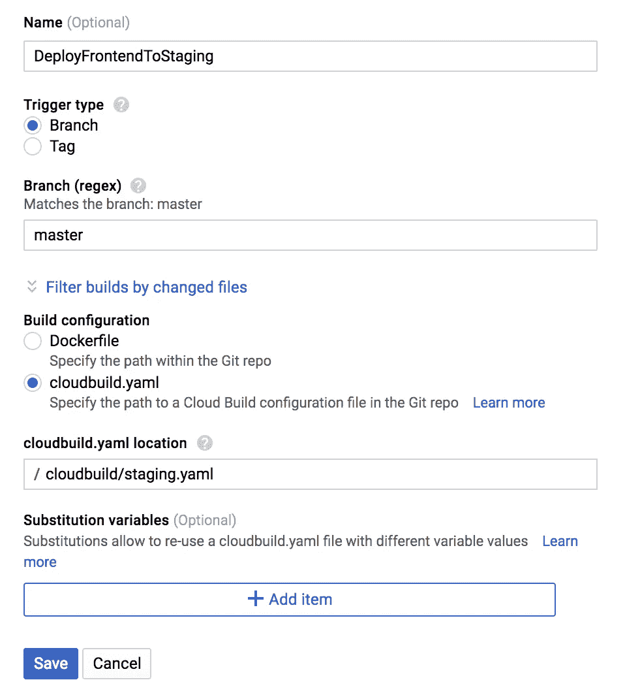

# 如何为 Firebase 云功能设置云构建

> 原文：<https://medium.com/google-cloud/how-to-set-up-cloud-build-for-firebase-cloud-functions-cffcf2812302?source=collection_archive---------0----------------------->

在 [Soru](http://soru.ai) ，我们系统的一部分运行在 Firebase 云功能和 Firebase 主机上。我们的设置由各种环境组成，如 staging 和 prod。我们需要一个简单的 CI/CD 解决方案，所以我们决定使用 Google Cloud Build。

在这篇文章中，我们将讨论如何通过云构建配置来部署云功能。我们的渐进式 web 应用程序是使用完全相同的原则构建和部署到 Firebase 主机的。

请注意，这些内容大部分存在于谷歌官方文档中，即这里的[和这里的](https://cloud.google.com/cloud-build/docs/configuring-builds/build-test-deploy-artifacts)和[和](https://cloud.google.com/cloud-build/docs/securing-builds/use-encrypted-secrets-credentials)，但也有一些问题。我们想给你一个经过测试和部署的工作示例。

# 构建 Firebase SDK

首先，您需要为您的项目构建 firebase SDK，这样您就可以从云构建配置中调用`firebase deploy`。这是你需要做的一次性事情，所以如果你愿意，你可以把它放在一个单独的回购中。

以下是 Dockerfile 文件:

```
# Node 6
FROM node:boron
# install Firebase CLI
RUN npm install -g firebase-toolsENTRYPOINT ["/usr/local/bin/firebase"]
```

如果您对 firebase 函数使用 Node8 运行时，在部署过程中使用 await/async 或其他 Node 8 特定特性时会出现语法错误。原因是我们在上面的 docker 文件中使用的节点版本实际上是节点 6。这在 Google Cloud 文档中并没有明确说明，所以它可能会派上用场。节点 8 的正确 Dockerfile 应该是:

```
# Node 8
FROM node:carbon
# install Firebase CLI
RUN npm install -g firebase-toolsENTRYPOINT ["/usr/local/bin/firebase"]
```

这里有 config.yaml

```
steps:
- name: 'gcr.io/cloud-builders/docker'
  args: [ 'build', '-t', 'gcr.io/[PROJECT_ID]/firebase', '.' ]
images:
- 'gcr.io/[PROJECT ID]/firebase'
```

然后你跑

```
gcloud builds submit --project [PROJECT_ID]--config=config.yaml .
```

这将在 Google 的私有容器注册表中构建并存储图像，以备后用。

# 糟糕的解决方案

为了从服务帐户运行`firebase deploy`,我们需要生成一个访问令牌。运行以下命令并记下令牌。

```
firebase login:ci
```

此时，编写我们将在构建触发器中使用的云构建配置非常简单。

```
steps:
  - name: 'gcr.io/cloud-builders/npm:node-6.14.4'
    args: [ 'install' ]
  - name: 'gcr.io/[PROJECT_ID]/firebase'
    args: [ 'deploy', '--project', [PROJECT_ID], '--token', '[TOKEN]']
```

运行 npm 安装时，请注意`node-6.14.4`标记。我不断得到以下错误，因为默认使用的`node-8.12.0`与我的设置不兼容。

```
Step #1: Error: Error parsing triggers: Failed to load gRPC binary module because it was not installed for the current system
Step #1: Expected directory: node-v48-linux-x64-glibc
Step #1: Found: [node-v57-linux-x64-glibc]
```

正如你所看到的，如果你想检查上面的配置，这是一个明显的问题。永远不要让您的访问标记出现在源代码管理中。因此，我强烈建议不要使用上面的脚本。相反，您可以将您的令牌存储在 Google 云密钥管理服务中，并将其作为一个秘密环境变量放入您的云构建配置中。

# 好的解决方案

首先，我们需要创建一个钥匙链和一把钥匙。

```
gcloud kms keyrings create [KEYRING_NAME] \
  --location global \
  --project=[PROJECT_ID]gcloud kms keys create [KEY_NAME] \
  --location=global \
  --keyring=[KEYRING_NAME] \
  --purpose=encryption \
  --project=[PROJECT_ID]
```

现在，我们需要使用由`firebase login:ci`生成的令牌，并将它赋给一个环境变量。

```
export FIREBASE_TOKEN=[TOKEN]
```

如果您错误地登记或分发了令牌，您总是可以通过执行`firebase logout --token [TOKEN]`来撤销它。否则，这些令牌没有过期时间，因此它们永远有效。

最后，您需要加密令牌，以便我们可以在配置中使用加密版本。

```
echo -n $FIREBASE_TOKEN | gcloud kms encrypt \
  --plaintext-file=- \
  --ciphertext-file=- \
  --location=global \
  --project=[PROJECT_ID] \
  --keyring=[KEYRING_NAME] \
  --key=[KEY_NAME] | base64
```

不要忘记将项目 id 放在加密脚本中。如果您只有一个项目，默认设置将会起作用。然而，如果不同的环境有不同的项目，事情可能会变得混乱。

此时，您有了一个可以安全分发的加密 base64 字符串。

云构建的新配置如下所示:

```
steps:
- name: 'gcr.io/cloud-builders/npm:node-6.14.4'
  args: [ 'install' ]
- name: 'gcr.io/[PROJECT_ID]/firebase'
  args: [ 'deploy', '--project', '[PROJECT_ID]']
  secretEnv: ['FIREBASE_TOKEN']
secrets:
- kmsKeyName: projects/[PROJECT_ID]/locations/global/keyRings/[KEYRING_NAME]/cryptoKeys/[KEY_NAME]
  secretEnv:
    FIREBASE_TOKEN: [ENCRYPTED_TOKEN]
```

我在编写如下部署步骤时遇到了一个问题:

```
- name: 'gcr.io/[PROJECT ID]/firebase'
  args: [ 'deploy', '--project', '[PROJECT ID]', --token, '$$FIREBASE_TOKEN']
  secretEnv: ['FIREBASE_TOKEN']
```

我的配置是基于[文档](https://cloud.google.com/cloud-build/docs/securing-builds/use-encrypted-secrets-credentials#example_build_request_using_an_encrypted_variable)的，但是由于某种原因，这种传递令牌的方式不起作用，但是简单地设置环境变量`$FIREBASE_TOKEN`就足够了，所以您可以删除`--token`参数。(我还是不知道为什么这样不行。)

在结束之前的最后一句话:确保服务帐户`<id>@cloudbuild.gserviceaccount.com`具有`roles/cloudkms.cryptoKeyDecrypter`(云 KMS 密钥解密器)角色，以便它可以解密令牌。

# 设置构建触发器

好了，现在你已经得到了你需要的一切。为了完整起见，我还将展示如何在控制台上设置构建触发器。

*   转到 GCP 控制台并搜索构建触发器
*   添加触发器并选择您的存储库托管选项。我们的是 GitHub。
*   认证后，您将看到以下配置页面。



也就是说，当我们将代码合并到`master`分支时，repo 中的配置`/cloudbuild/staging.yaml`触发并将服务部署到登台环境。

您可以配置您的代码，以便任何检入到任何分支的代码也可以启动测试管道。我们将在另一篇博文中向您展示如何将云构建结果与 GitHub repo 挂钩，这样您就可以在构建/测试失败时阻止合并。

我希望这有所帮助，并随时建议改进。

编码快乐！