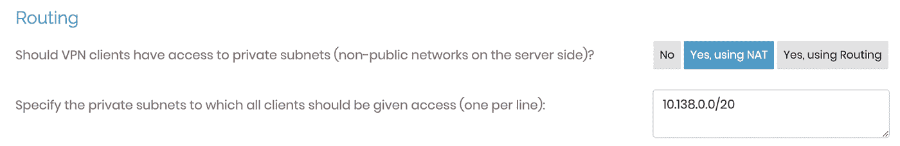

# 如何使用 OpenVPN 在谷歌云中建立点对点 VPN

> 原文：<https://medium.com/google-cloud/how-to-setup-point-to-site-vpn-in-google-cloud-using-openvpn-66f642ba08c9?source=collection_archive---------0----------------------->

如果您正在寻找一种在 GCP 的点对点 VPN 设置，通过安全连接从客户端设备访问 GCP 资源，您可以利用像 OpenVPN 这样的第三方网络设备。尽管可以利用云高可用性虚拟专用网服务来建立站点到站点的虚拟专用网隧道，但 GCP 到目前为止还没有提供托管的站点到站点虚拟专用网服务。但是什么是开放虚拟专用网？为什么？

## **什么是 OpenVPN？**

OpenVPN 是一种免费的开源虚拟专用网(VPN)软件，它使用 OpenSSL 库来加密和保护网络连接。它是创建虚拟专用网络的流行选择，因为它可靠、安全，并且易于设置和使用。

OpenVPN 允许用户通过互联网连接到远程网络，并像直接连接到网络一样访问该网络上的资源。这对于从远程位置访问专用网络上的资源或在两个网络之间创建安全连接非常有用。

OpenVPN 使用 OpenSSL 库来加密网络流量，这使得任何人都很难拦截和读取通过 VPN 传输的数据。它还使用安全的身份验证方法来确保只有授权用户才能访问 VPN。

OpenVPN 提供两种类型的服务，OpenVPN 云，一种托管解决方案和自托管解决方案，也称为 OpenVPN 访问服务器。我们将在这篇博客文章中使用自托管解决方案(OpenVPN Access Server)。

## **先决条件**

1.  工作的 GCP 项目
2.  具有用于 OpenVPN 访问服务器虚拟机的子网的 VPC

## **设置**

在本指南中，我们将介绍谷歌云的设置和配置。我们将使用云控制台，使用计算引擎服务来设置 OpenVPN 网络设备。

首先，登录谷歌云控制台，跳进 GCP 市场。搜索 OpenVPN 访问服务器。

从结果中选择 **OpenVPN 接入服务器**，点击**启动**按钮。


如果尚未启用，则启用所需的 API。点击**使能**按钮，从部署体验中使能。


一旦启用了 API，部署体验将带您进入新的 OpenVPN 访问服务器部署页面。根据您的需要填写并更新所有要求的详细信息。

选择要在其中部署网络设备的适当 VPC。该部署还将创建 OpenVPN 访问服务器运行所需的防火墙规则。


部署完成后，您可以找到**管理员 URL** 、**客户端(站点)URL** 和**管理员**凭据。我们将更改管理凭据，因为它们在部署管理器中可见。


部署之后，我们必须更新 OpenVPN 访问服务器配置和 GCP 资源配置。我们将执行以下配置更改:

1.  保留外部 IP
2.  更改管理员密码
3.  更新时区
4.  安装 NTP 客户端进行自动时间同步(可选)
5.  更新操作系统
6.  更新 OpenVPN 访问服务器
7.  更新路线
8.  用户管理
9.  使用客户端连接到 VPN
10.  添加主机名和 SSL(可选)

**1。预留外部 IP**

如果您已经使用默认配置部署了 OpenVPN 访问服务器，那么连接到计算引擎的外部 IP 可能是短暂的。在我们进行任何更改之前，首先保留连接到计算引擎的现有外部 IP。您可以按照下面的步骤来完成:

从**云平台**进入网络部分的 **IP 地址**。

在**外部 IP 地址**选项卡中找到连接到 OpenVPN 访问服务器虚拟机的 IP，点击**保留**将类型更改为静态分配。这将防止在 OpenVPN 访问服务器虚拟机重启/关闭期间发生 IP 更改。


一旦您点击**保留**，它将要求提供外部 IP 的名称和描述。


**2。更新管理员密码**

OpenVPN 访问服务器的部署已生成管理员密码，该密码在部署管理器中可见。我强烈建议改变这一点。为此，单击 **SSH** 按钮通过 SSH 访问实例，并使用下面的 cmd 更新 openvpn 用户的密码。

```
sudo passwd openvpn
```

**3。更新默认时区**

使用 below cmd 更新时区。默认时区设置为 PST。如果你住在别的地方，你需要使用下面的命令来更新时区。您需要 SSH 到虚拟机来运行以下命令:

```
sudo dpkg-reconfigure tzdata
```

**4。安装 NTP 客户端(可选)**

安装 NTP 客户端进行自动时间同步。这是推荐的，但特别是如果你使用谷歌认证 MFA。您需要 SSH 到虚拟机来运行以下命令:

```
sudo apt-get install ntp
```

**5。更新操作系统**

如果你通过 Google Cloud Marketplace 部署 OpenVPN Access Server，那么它使用 Ubuntu 作为操作系统。建议在开始使用之前更新操作系统。您需要 SSH 到虚拟机，并使用以下命令来更新操作系统:

```
sudo apt-get update
sudo apt-get upgrade
```

6。更新 OpenVPN 接入服务器

当您更新操作系统时，OpenVPN 访问服务器不会被更新，因为它被固定为在操作系统更新期间跳过更新，以避免任何更改。您必须使用下面的 cmd 显式地做到这一点。您可以使用下面的 cmd 检查当前版本。您需要首先通过 SSH 进入虚拟机来运行 cmds。

```
cat /etc/issue
```

预期输出类似于下图:

```
vikask@openvpn-access-server-1-vm:~$ cat /etc/issue
OpenVPN Access Server Appliance 2.8.5 \n \l
```

在写这篇博文的时候，OpenVPN 接入服务器的当前版本是 2.11.1。要更新版本，请在 cmd 下运行:

```
sudo apt upgrade openvpn-as
```

更新 OpenVPN 访问服务器后，建议重启服务器。

```
sudo reboot
```

重启完成后，验证 OpenVPN 访问服务器版本。

```
vikask@openvpn-access-server-1-vm:~$ cat /etc/issue
OpenVPN Access Server Appliance 2.11.1 \n \l
```

您也可以从 OpenVPN 的管理用户界面验证版本。使用管理 URL 登录到管理用户界面:

[https://【外部](https://[External) IP 地址/主机名】:943/Admin

如果您是第一次登录，请阅读免责声明并单击同意。


**7。更新路线**

默认情况下，OpenVPN 访问服务器将拥有一个路由，用于部署它的自己的子网。要访问其他子网或该子网的资源，您需要在路由中通告这些子网。

为此，您需要登录 OpenVPN 访问服务器的管理用户界面。登录后，进入**配置**，选择 **VPN 设置**选项。

如果您希望允许来自 OpenVPN 的访问，请在路由部分添加其他子网。



在本例中，我添加了 10.128.0.0/20 子网，其中有需要从 OpenVPN 客户端访问的工作负载。

添加路线，保存设置并点击更新运行服务器。


确保在 GCP 为附加子网添加防火墙规则，以允许来自 OpenVPN 访问服务器子网或 OpenVPN 访问服务器虚拟机的流量。默认情况下，OpenVPN 访问服务器通过使用 NAT 方法(网络地址转换)为 VPN 客户端提供对您的 VPC 的访问。使用这种方法，来自 VPN 客户端的流量将看起来像是来自访问服务器的本地 IP 地址。


另外，看看 VPN IP 网络部分。确保本节中定义的 IP 地址不会与您现有的 CIDRs 冲突。


**8。用户管理**

现在我们已经配置了 OpenVPN 访问服务器，我们可以创建更多可以访问客户端的用户。默认情况下，openvpn 用户已经可以访问服务器，但我建议创建没有管理员权限的其他用户。

要管理用户，请转到用户管理，选择用户权限。根据需要添加其他用户，然后单击保存设置。


点击更新运行服务器以更新 OpenVPN 访问服务器。

**9。使用客户端**连接到 VPN

现在，我们已经创建了用户，我们可以使用客户端连接到 OpenVPN。用户可以通过登录客户端 URL(OpenVPN 接入服务器的 IP 地址)来下载 OpenClient。

[https://【外部](https://[External) IP 地址/主机名】


输入用户名和密码登录。登录后，您可以下载客户端(如果您已经有客户端)或配置文件。

我已经安装了客户端，所以下载配置文件。导入配置文件后，输入用户密码，就可以开始了。


现在，让我们测试从本地计算机到计算引擎虚拟机的连接。让我们尝试使用私有 IP Ping OpenVPN 访问服务器。


正如您在上面的快照中所看到的，我能够使用私有 IP 地址 Ping OpenVPN 访问服务器。现在，让我们尝试 ping 我们在“Routes”部分添加的不同子网的虚拟机。


Ping 也适用于另一个子网。注意—确保防火墙规则配置为允许流量流向其他子网。

10。添加主机名和 SSL

OpenVPN 访问服务器的网络服务在默认的公共 IP 地址上可用，但是当你每次尝试访问它时，它都会抛出一个警告。建议将 FQDN 与来自 CA 的签名 SSL 一起使用，以避免这些警告。此外，FQDN 很容易记住。

按照这个[文档](https://openvpn.net/vpn-server-resources/installing-a-valid-ssl-web-certificate-in-access-server/)来设置主机名和 SSL。

## **发牌**

OpenVPN 免费提供两个并发连接。如果您正在寻找更多的并发连接，那么您可以直接从 OpenVPN 购买额外的许可证。