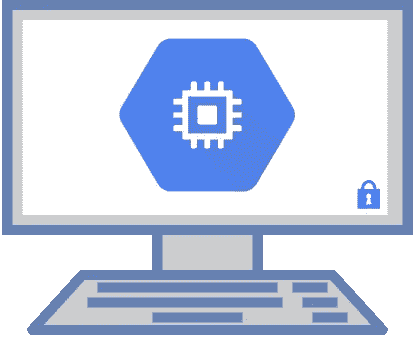
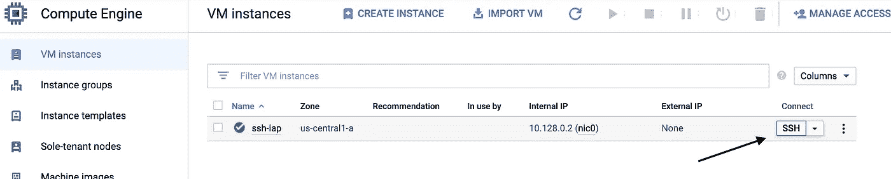
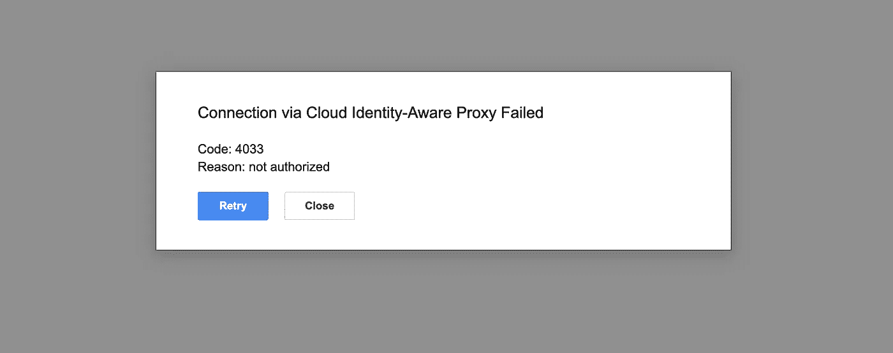
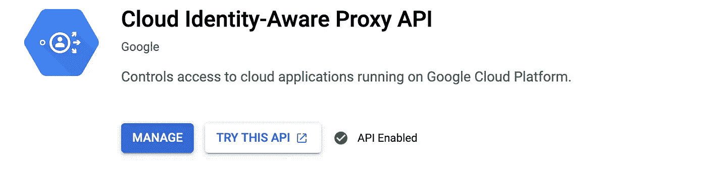
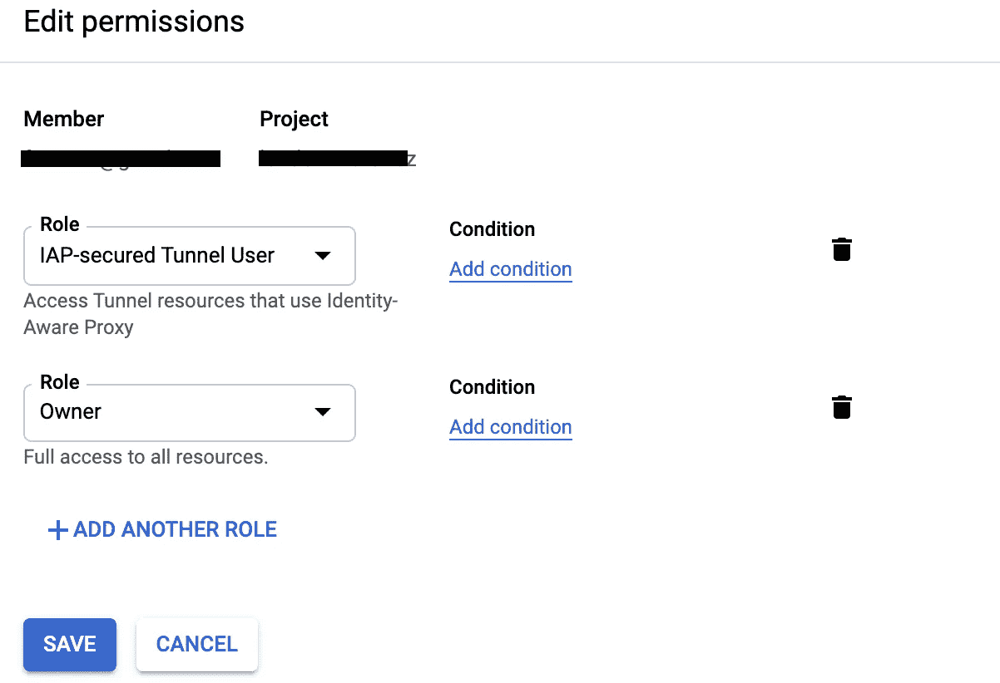
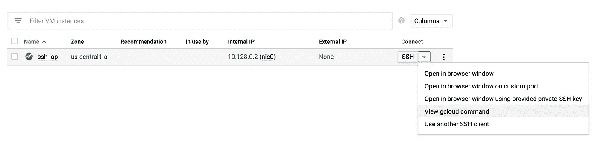
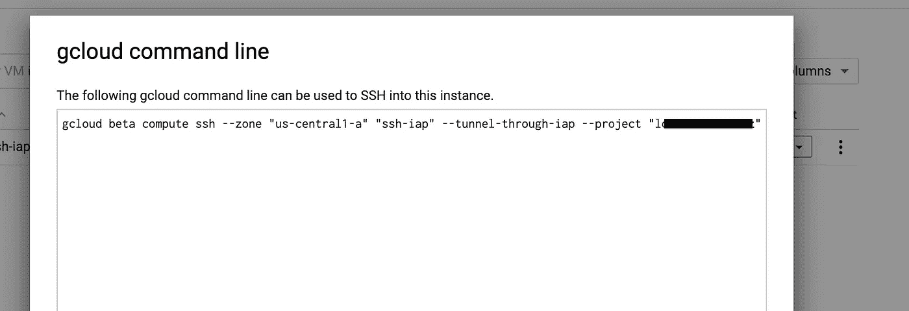

# 如何在没有公共 IP 的情况下 ssh 到您的 GCE 机器

> 原文：<https://medium.com/google-cloud/how-to-ssh-into-your-gce-machine-without-a-public-ip-4d78bd23309e?source=collection_archive---------0----------------------->

# 介绍

在本文中，我将向您展示如何在没有公共 IP 的情况下，仅使用内部 IP 通过 ssh 访问您的计算引擎机器。

# 在我们开始之前…

在开始之前，我将补充几个重要的概念，说明我们如何实现这一目标。

如今，越来越多的公司使用额外的 VPN 层、MFA、安全流程、防火墙、路由器等，以验证谁需要访问服务器或应用程序。

Google 在 GCP 创建了包含几个安全产品的 BeyondCorp 实现，我们在这里使用的是 T2 的身份识别代理 T3(IAP)。

## **博彦科技**

> BeyondCorp 是 Google 对零信任安全模型的实现，它建立在 Google 八年零信任网络的基础上，结合了来自社区的想法和最佳实践。通过将访问控制从网络边界转移到个人用户和设备，BeyondCorp 允许员工、承包商和其他用户从几乎任何位置更安全地工作，而不需要传统的 **VPN** 。
> 
> BeyondCorp 最初是谷歌的一项内部举措，目的是让每一名员工都能在不使用 VPN 的情况下，在不受信任的网络上工作。大多数谷歌员工每天都在使用 BeyondCorp，为谷歌的核心基础设施提供基于用户和设备的认证和授权。

## 身份感知代理

> IAP 允许您为 HTTPS 访问的应用程序建立一个中央授权层，因此您可以使用应用程序级访问控制模型，而不是依赖网络级防火墙。
> 
> IAP 政策可在您的组织中扩展。您可以集中定义访问策略，并将其应用于所有应用程序和资源。当您指派一个专门的团队来创建和实施策略时，您可以保护您的项目免受任何应用程序中不正确的策略定义或实现的影响。

Max Saltonstall 写了一个非常好的帖子，解释了关于 IAP 和 BeyondCorp 的更多细节，你可以在这里查看。

# 履行

## 开始前

你将需要一个 GCP 项目，所以如果你还没有创建，你可以按照以下步骤:

1.  转到云控制台中的**管理资源**页面。
    [转到管理资源页面](https://console.cloud.google.com/cloud-resource-manager)
2.  在页面顶部的**选择组织**下拉列表中，选择要在其中创建项目的组织。如果您是免费试用用户，请跳过这一步，因为此列表不会出现。
3.  点击**创建项目**。
4.  在出现的**新项目**窗口中，输入项目名称并选择适用的计费账户。项目名称只能包含字母、数字、单引号、连字符、空格或感叹号，并且必须在 4 到 30 个字符之间。
5.  在**位置**框中输入上级组织或文件夹。该资源将成为新项目的分层父项目。
6.  当您输入完新项目的详细信息后，点击**创建**。

## 创建您的 GCE 实例

1.  在 Google Cloud 控制台中，转到**虚拟机实例**页面。
2.  [转到虚拟机实例页面](https://console.cloud.google.com/compute/instances)
3.  选择您的项目并点击**继续**。
4.  点击**创建实例**。
5.  为实例指定一个**名称**。
6.  为您的实例选择一个**机器配置**。我建议您使用 [*f1-micro* 实例，这样您就可以使用您的自由层](https://cloud.google.com/free)
7.  在**引导盘**部分，我们将使用默认的 Debian。
8.  在**联网**部分，确保将**外部 IP** 更改为**无**并点击完成。
9.  **不要**点击允许 HTTP 流量或允许 HTTPS 流量
10.  将所有其他参数保留为默认值。
11.  点击**创建**按钮，创建并启动实例。

## 嘘嘘

您可以使用下面的按钮尝试 ssh，但是您将面临未授权的*即使您是项目的**所有者***

ssh 按钮

发生这种情况是因为**所有者**角色没有***IAP . tunnelinstances . accessviaiap***权限，所以让我们为我们的用户添加这个权限。

## **启用 IAP**

首先，确保您启用了 IAP API

1.  转到云控制台 **API** 库。
2.  从项目列表中，选择要使用的项目。
3.  在 **API** 库中，选择**云身份感知代理 API**
4.  在 **API** 页面，点击**启用**如果仍然没有。

## 向您的用户添加 IAP 角色

1.  转到 IAM
2.  授予角色 **IAP 安全隧道用户**

→您也可以在此页面 e 上检查所有 [IAP 角色。](https://cloud.google.com/iap/docs/managing-access#roles)

## 再唱一遍，检查一下魔术！

你可以试着点击按钮 *ssh* 并在浏览器中使用终端…

…或者您可以在终端上使用 *gcloud* 命令

> ***g cloud compute ssh—zone "<region>【ssh-IAP】—tunnel-through-IAP—project "<project _ ID>***

如果您喜欢复制和粘贴，也可以在 UI 中看到这个命令

# 打扫

1.  删除实例
2.  如果您不想再使用该项目，请将其删除。

# 结论

IAP 使我们能够将实例放在离互联网很近的地方，并且仍然以安全的方式 ssh 到其中。

使用 *gcloud* 命令，我们甚至不需要创建自己的公钥/私钥，因为该工具完成了创建新的

您可以在 *~/登记您的机器。ssh* 文件夹通常称为 *google_compute_engine* ，也在 *GCE - > metadata - > ssh 键上。*

如果有任何问题，请告诉我！