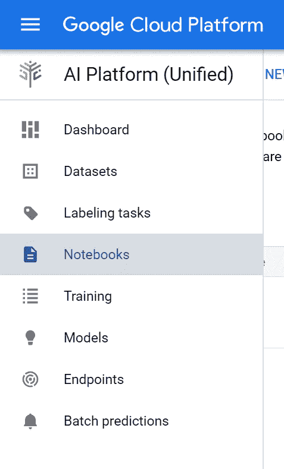
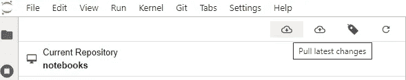

# 如何为您的数据科学团队使用 Google AI 平台笔记本

> 原文：<https://medium.com/google-cloud/how-to-use-google-ai-platform-notebooks-for-your-data-science-team-26d9eefc8ce0?source=collection_archive---------1----------------------->


Kumparan x 谷歌

在这篇文章中，我想分享我个人关于如何使用 Google AI 平台笔记本来降低成本和提高数据科学家生产力的经验。

# 背景

Jupyter 笔记本是我团队的必备工具之一。90%的项目始于 Jupyter 笔记本中的原型。

以前，我们运行一台 Jupyter 笔记本服务器来满足我们的需求。

这种方法有一些缺点:(1)由于资源限制，我们不能并行运行多个训练过程(2)备份过程复杂(3)维护和加强 jupyter 笔记本服务器的安全性是一项艰巨的任务。

使用谷歌人工智能平台笔记本，我团队中的每个人都可以根据项目需求轻松生成新的实例。

为了降低成本，实例是临时的，它可以被删除而不会丢失数据。所有笔记本数据都存储在 gitlab 存储库中。对于大数据，我们存储在谷歌云存储中。

# 一个向导

以上是使用 Google AI 平台笔记本的一步一步。

## 创建新的 Git 仓库

在 Github 或 Gitlab 上创建新的 git 存储库。我们将使用它来存储您所有的团队笔记本。您还可以使用组织中现有的 git 存储库。

## 启动新实例

前往[谷歌人工智能平台](https://console.cloud.google.com/ai/platform)仪表盘。

在工具条中选择**笔记本**。



点击**新建实例**


根据项目需求选择实例类型


按照说明启动实例。

## 打开并设置 JupyterLab

单击打开 Jupyterlab


您将被重定向到如下所示的唯一 URL:

```
https://RANDOM_STRING-dot-asia-southeast1.notebooks.googleusercontent.com/lab
```

别担心，默认情况下是安全的。

只有经过认证的用户才能进入 Jupyter 实验室。

下一步是设置 Git 存储库。

选择 **Git** → **克隆库**克隆 Git 库。


点击**克隆一个库**。

输入 gitlab/github URL。

如果您使用的是`https`，则输入您的 gitlab/github 帐户电子邮件&密码。

对于`ssh`,您需要首先设置 SSH。

您可以在文件资源管理器中访问您的存储库:


然后创建新的笔记本，继续您的项目。

要备份您的笔记本，请参见下面的内容。

## 备份您的笔记本

选择 **Git** ，然后先拉最新的变更。



参见**未跟踪**，例如:


将光标悬停在文件名上，点击“ **+** ”图标，即可跟踪您的笔记本文件。

忽略不想备份的文件。

写下提交信息，然后点击**提交**。

## 删除您的实例

如果您已经完成了项目，最好立即删除您的实例。

所有笔记本都存储在 Git 中，可以用于任何实例。所以，不要担心，您可以生成新的实例并使用现有的笔记本。

# 结论

使用我们上面描述的方法，你将只支付你所使用的，你的实验/原型被安全地存储在 Git 存储库中。

您可以轻松地生成新的实例，并使用 Git 存储库中现有的笔记本。

祝你好运。