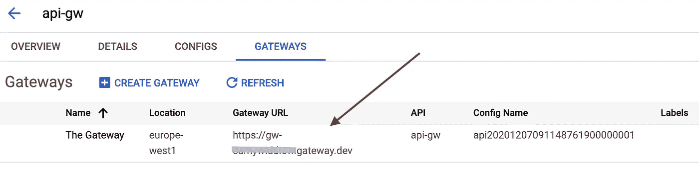

# 如何将 Google API Gateway 与云运行结合使用

> 原文：<https://medium.com/google-cloud/how-to-use-google-api-gateway-with-cloud-run-60698959b342?source=collection_archive---------0----------------------->


## 创建一个 API 网关，与您的云运行后端服务进行交互。

> ***声明:*** *所表达观点仅代表作者本人。*

# 介绍

在本文中，您将看到 API Gateway 是如何工作的，了解它的所有组件，以及如何创建您的第一个与云运行服务集成的部署。

# TLDR；

您可以查看这个报告，了解如何使用 Terraform 创建 API 网关和部署云运行 hello world 实例。

# 为什么我应该使用 API 网关？

在这里你可以找到一些你应该使用它的理由:

*   这是将前端和后端分离的好方法。
*   它可以将前端请求分成几个服务。
*   它可以帮助您将 monolith 后端迁移到微服务架构中。
*   为您的 API 集中认证访问。
*   API 监控、指标、配额和分析
*   集中管理 API 版本

# 要求

1.  已激活计费的 GCP 帐户。如果你还没有，你可以用 300 美元的[免费层创建一个新的。](https://cloud.google.com/free)

## 开始之前:创建你的 GCP 项目

你将需要一个 GCP 项目，所以如果你还没有创建，你可以按照以下步骤:

1.  转到云控制台中的**管理资源**页面。
    [转到管理资源页面](https://console.cloud.google.com/cloud-resource-manager)
2.  在页面顶部的**选择组织**下拉列表中，选择您想要在其中创建项目的组织。如果您是免费试用用户，请跳过这一步，因为此列表不会出现。
3.  点击**创建项目**。
4.  在出现的**新项目**窗口中，输入项目名称并选择适用的计费账户。项目名称只能包含字母、数字、单引号、连字符、空格或感叹号，并且必须在 4 到 30 个字符之间。
5.  在**位置**框中输入上级组织或文件夹。该资源将成为新项目的分层父项目。
6.  当您输入完新项目的详细信息后，点击**创建**。

# 启用所需的 API

API Gateway 要求您启用以下 Google 服务。你可以通过菜单-> API & Services-> Library 来启用它们。


# API 网关

Google Cloud API Gateway 仍处于 *Beta* 阶段，但我相信它已经足够成熟，可以进行简单的使用/调查。

作为一项托管服务，它可以与云运行、AppEngine、计算引擎和 GKE 轻松集成。它还可以使用 API_KEY、OAuth2 和 JWT 来管理身份验证。

> API Gateway 使您能够通过定义良好的 REST API 提供对服务的安全访问，该 API 在您的所有服务中都是一致的，与服务实现无关。一致的 API:
> 
> —让应用程序开发人员能够轻松使用您的服务
> 
> —使您能够在不影响公共 API 的情况下更改后端服务实现
> 
> —使您能够利用谷歌云平台(GCP)内置的扩展、监控和安全功能


此图显示了一些客户端向不同的后端服务源发出请求:[此处](https://cloud.google.com/api-gateway/docs/about-api-gateway)


这张图片显示了一些客户端通过 API 网关向您的后端服务发出请求。来源:[此处](https://cloud.google.com/api-gateway/docs/about-api-gateway)

## 规格

API 网关是使用 OpenAPI spec 2.0 配置的。下面您将看到启动和运行所需的最小版本。

你可以查看完整的 OpenApi 2.0 规范[这里](https://github.com/OAI/OpenAPI-Specification/blob/master/versions/2.0.md)和[这里](https://cloud.google.com/endpoints/docs/openapi/openapi-overview)。

## 组件

> API Gateway 上定义的 API 由两个主要组件组成:
> 
> **API 配置**:上传 **API 定义**时创建的 API 配置。对于测试版，您将 API 定义创建为 OpenAPI 规范。每次上传 API 定义时，API Gateway 都会创建一个新的 API 配置。也就是说，您可以创建 API 配置，但不能在以后修改它。如果您稍后在 OpenAPI 规范中编辑 API 定义，然后上传编辑后的 API 定义，您将创建一个新的 API 配置。
> 
> **网关**:基于[特使](https://www.envoyproxy.io/docs/envoy/latest/)的高性能、可伸缩代理，托管已部署的 API 配置。将 API 配置部署到网关会创建面向外部的 URL，您的 API 客户端使用该 URL 来访问 API。
> 
> 被部署到特定的 GCP [地区](https://cloud.google.com/about/locations/)。区域是 GCP 上可以部署资源的特定地理区域。
> 
> 必须承载 API 配置。您不能创建空网关，即没有 API 配置的网关。但是，创建网关后，您可以更新网关，用一个 API 配置替换另一个 API 配置。
> 
> 只能承载一个 API 配置。您不能将多个 API 配置部署到同一个网关。

# 使用地形

首先，您需要确保 Terraform 会接收您的凭证。有几种方法可以做到这一点，最简单的方法是使用 [*应用程序的默认凭证*](https://cloud.google.com/sdk/gcloud/reference/auth/application-default/login) 。您可以使用下面的命令轻松设置它:

```
gcloud auth application-default login
```

该命令将创建*。config/g cloud/application _ default _ credentials . JSON*terra form 无需任何额外配置即可自动读取。

*我们目前没有使用任何* [*Terraform 后端*](https://www.terraform.io/docs/backends/index.html) *，但是我真心建议你设置一个后端来管理你的 TF 状态。* [*下面是你如何使用谷歌云存储*](https://www.terraform.io/docs/backends/types/gcs.html) *创建后端。*

## 我们的云运行 hello world 服务

首先，我们需要创建云运行服务，以便获得 URL 并在以后更新我们的 API 网关规范。您可以从 terraform 完成后打印的输出中获得 URL。

您需要从`terraform/cloud-run` [文件夹](https://github.com/femrtnz/google-cloud-api-gateway/tree/main/terraform/cloud_run)中运行上面的代码。

*   `terraform init`
*   `terraform apply`

## 使用 Terraform 实现我们的 API 网关

API 网关资源最近(2020 年 11 月 2 日)被添加到谷歌测试版提供商中。API 网关包含 3 个主要资源(与我们刚才看到的不同):

*   `google_api_gateway_api`装箱 API 网关本身。
*   `google_api_gateway_api_config`在上面的 API 网关中创建开放 API 规范。
*   `google_api_gateway_gateway`创建链接到 API 配置的网关(特使代理)。

您将需要包含来自`terraform/api-gateway` [文件夹](https://github.com/femrtnz/google-cloud-api-gateway/tree/main/terraform/api-gateway)的云运行 Run。

*   `terraform init`
*   `terraform apply`

## 检查入口

现在你可以去[https://console.cloud.google.com/api-gateway](https://console.cloud.google.com/api-gateway/api/)点击“API 网关”…


然后，单击网关选项卡…


现在，您将看到我们将用来调用 API 的网关 URL。



您需要在最后将我们创建的 API 路径包含到 API 网关规范`/v1/hello`中。它应该类似于:

```
{gatewayId}-{hash}.{region_code}.gateway.dev/v1/hello
```

…结束就是这样！


## 打扫

*   用`terraform destroy`摧毁所有地形资源
*   如果您不再使用该项目，请将其删除。

# 结论

您可以在几分钟内创建一个 API 网关，并且很容易与您的 GCP 产品集成。

一些缺点是:

*   对所有产品使用一个 API 网关可能很难管理和扩展，因为 OpenAPI 规范非常庞大。
*   您不能在网关中设置自己的域/DNS。
*   在网关更新期间，您将有**停机时间**，因为 Terraform 将首先尝试删除网关，然后用新配置重新创建它。使用地形`lifecycle`块也没有帮助，因为网关抱怨说`gateway alreay exists!`。一种解决方法是在运行 terraform 后，使用命令`gcloud beta api-gateway gateways update`强制更新当前网关。

## 参考

*   [https://cloud.google.com/api-gateway/docs/about-api-gateway](https://cloud.google.com/api-gateway/docs/about-api-gateway)
*   [https://cloud.google.com/api-gateway/docs/deployment-model](https://cloud.google.com/api-gateway/docs/deployment-model)
*   [https://github . com/OAI/open API-Specification/blob/master/versions/2.0 . MD](https://github.com/OAI/OpenAPI-Specification/blob/master/versions/2.0.md)
*   [https://cloud . Google . com/endpoints/docs/open API/open API-概述](https://cloud.google.com/endpoints/docs/openapi/openapi-overview)
*   [https://www . red hat . com/en/topics/API/what-do-an-API-gateway-do](https://www.redhat.com/en/topics/api/what-does-an-api-gateway-do)