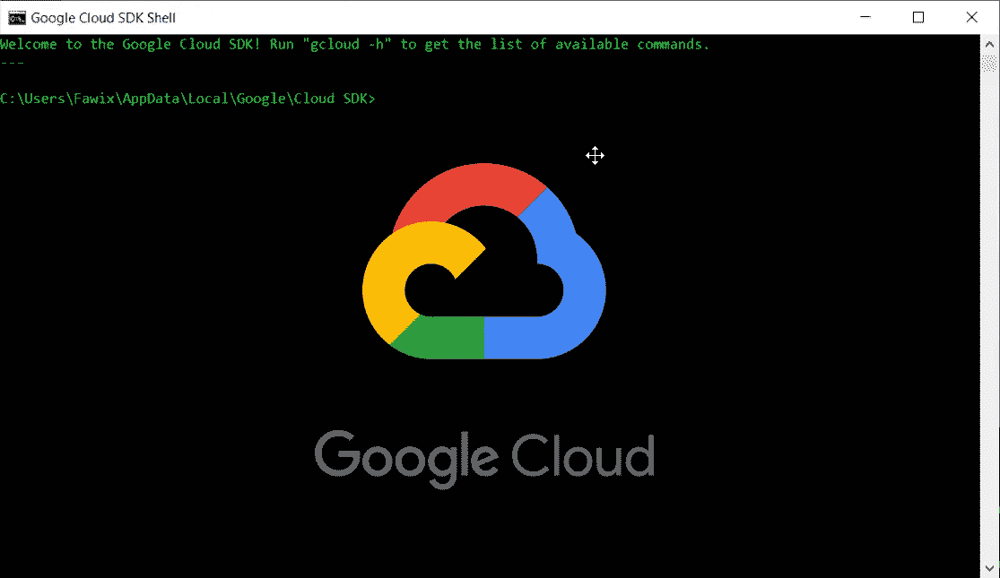

# 如何通过 gcloud 使用多个帐户

> 原文：<https://medium.com/google-cloud/how-to-use-multiple-accounts-with-gcloud-848fdb53a39a?source=collection_archive---------0----------------------->

## GCP 提示

## 了解如何使用 gcloud 轻松切换上下文。



你想知道如何在保持头脑清醒的同时在 *gcloud* 中与多个账户和组织合作吗？让我和你们分享一下 *gcloud* 中一个鲜为人知的功能。

# gcloud config 配置

在 *gcloud config* 中有一个子模块可以让你将一组*配置*分组并给它命名。然后，您可以按需激活它！这意味着无论何时你需要在不同的账户或组织之间切换都变得非常容易。换句话说，上下文切换。

这是你如何使用它:

```
gcloud config configurations activate config-name
```

在配置之间切换非常简单，它会携带您创建时设置的所有信息，这意味着即使您使用不同的凭据，也不必再次登录。只需键入上面的命令*就可以了。*

在我们详细讨论如何创建它们之前，让我举几个有用的例子:

*   在具有不同地区和区域的环境之间切换。
*   在不同的凭证之间切换，尤其是为了测试。
*   在完全不同的组织之间切换。


gcloud 配置示例。来源:我的终端

请注意上面的截图，我有不同组织、项目、计算区域和计算区域的帐户，这些只是[可能设置](https://cloud.google.com/sdk/gcloud/reference/config/set)的一个子集。

当然，要使用*配置*，您必须首先创建它。这一步需要一点输入，但这是一次性的工作，从长远来看会节省很多时间。这是创建新配置的方法:

给配置取一个好记的名字，然后至少添加*项目 id* 和*账户*。我通常还设置计算区域和区域，因为我经常使用它们。对于开发，您可能还想添加一个服务帐户。

顺便说一下，你有没有注意到我在创建上面的配置时不需要登录？这是因为该帐户已被另一个配置使用。是的，很简单！

如果您确实需要添加一个新帐户，只需调用以下命令:

```
gcloud auth login
```

用这一招会节省你很多时间，让你在 *gcloud* 的体验更好！如果您使用多种上下文，那么学习和配置是非常值得的；

准备好创建您的第一个配置了吗？让我知道进展如何！