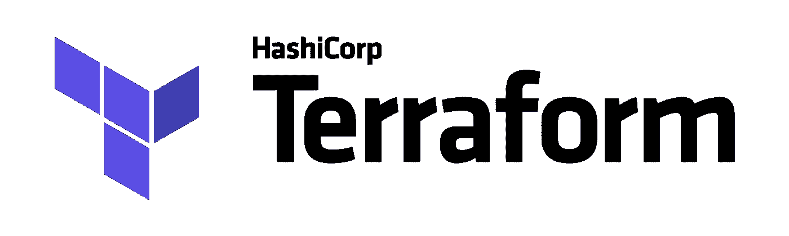
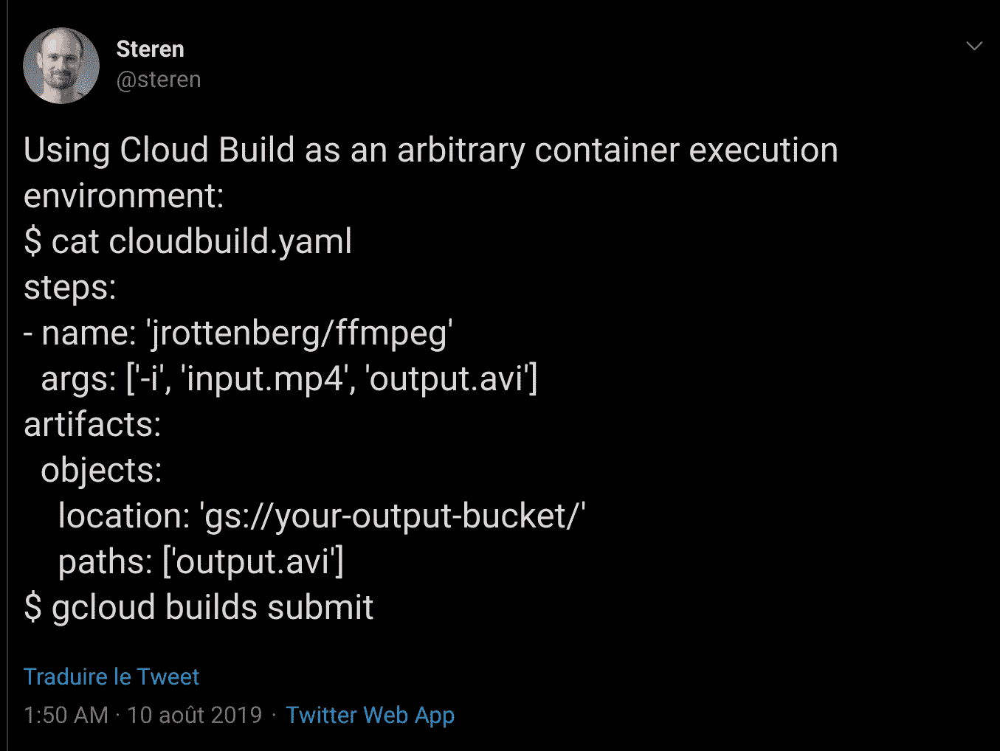
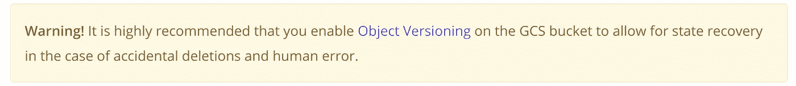

# 没有服务器如何使用 Terraform？

> 原文：<https://medium.com/google-cloud/how-to-use-terraform-without-server-976d922f3f72?source=collection_archive---------1----------------------->



Terraform 很时髦。很多运营都用它:多云支持、最新、大型社区和模板……它的优势是多方面的。然而，我是无服务器的忠实粉丝，我更喜欢[部署管理器](https://cloud.google.com/deployment-manager/)。我的行动没有，因为它粘着 GCP。他们是对的。

事实上，我从来不喜欢 Terraform，因为这种无休止的循环:

> 对于服务器的干净部署，请使用 Terraform 来部署此服务器。Terraform 必须安装在服务器上；使用 Terraform 部署此服务器...

因此，我从来没有使用过 Terraform…直到这个 [Steren](https://medium.com/u/ef2e4caf305a?source=post_page-----976d922f3f72--------------------------------) 的*无关*帖子



> **什么？使用云构建不构建容器？太聪明了！**

由于这条推文，我想到了一个惊人的想法: ***通过云构建在无服务器模式下使用 Terraform！***

# 第一个(坏)主意

从哪里开始？我需要执行 Terraform，尽管我(不)了解 Terraform，但我需要保存 tfstate 文件。

> 第一步:docker 形象存在吗？

是的， [Terraform 安装包装在一个容器中，可在 Docker Hub](https://hub.docker.com/r/hashicorp/terraform/) 上获得。因此，将它与云构建一起使用将会很容易。

> 第二步:如何管理 tfstate 文件？

Steren tweet 展示了如何在过程结束时[将文件从云构建环境推送到 Google 云存储](https://cloud.google.com/cloud-build/docs/configuring-builds/store-images-artifacts#storing_artifacts_in)。为了一开始就从存储中获取它们，使用[云构建器](https://cloud.google.com/cloud-build/docs/cloud-builders) [图像](https://github.com/GoogleCloudPlatform/cloud-builders)。**大功告成！**

我将测试并深入研究 Terraform 机制和文档… **糟糕的第一种方法！**

# Terraform 已经成熟

其实 **Terraform 远比我预期的成熟**。我发现[后端定义](https://www.terraform.io/docs/backends/types/gcs.html)存在。它允许远程检索和存储部署状态。

存在一个 GCS 实现，它非常容易使用。只需在您的`[main.tf](https://github.com/guillaumeblaquiere/terraform-serverless-cloudbuild/blob/master/main.tf)`文件中定义后端存储桶和路径。

```
terraform {
  backend "gcs" {
    bucket  = "my-state-bucket"
    prefix  = "terraform/state"
  }
}
```

我的第二步是通过 **4 行配置解决的！太完美了！**

现在，让我们关注 Terraform 命令。**在** `[**cloudbuild.yaml**](https://github.com/guillaumeblaquiere/terraform-serverless-cloudbuild/blob/master/cloudbuild.yaml)`文件中只有 2 步定义:

*   运行`init`命令来设置云构建短命环境

```
- name: 'hashicorp/terraform'  
  args: ['init']
```

*   运行`apply`命令，在自动批准模式下执行部署/更新

```
- name: 'hashicorp/terraform'
  args: ['apply','-var=PROJECT_ID=$PROJECT_ID','-auto-approve']
```

`apply`命令要求知道`PROJECT_ID`。诀窍是用云构建环境变量`PROJECT_ID`来评估地形变量。Terraform 的`[main.tf](https://github.com/guillaumeblaquiere/terraform-serverless-cloudbuild/blob/master/main.tf)`文件是这样处理`PROJECT_ID`变量的:

```
variable "PROJECT_ID" {
  type        = string
}provider "google" {
 //credentials = NOT NEEDED, use Cloud Build service account permissions
 project     = var.PROJECT_ID
 region      = "us-central1"
}
```

# 利用云构建

云构建和 Terraform 的结合**产生了比我最初期望的更多的东西**:*在我不必管理的服务器上运行 Terraform。*

## 证明

这是另一个以前没有提到的棘手问题，也是困扰我的运营部门的问题:安全性。事实上，在一个托管服务器上，专门用于部署几个不同的项目，您必须管理不同的服务帐户，对这些不同的项目有不同的权限。

为此，您必须存储不同的 JSON 安全密钥文件。您必须轮换这些 JSON 密钥文件，以确保它们在虚拟机上的机密性/访问权限……大量的手动工作非常耗时，而且并不总是最先进的安全最佳实践。

云构建解决了这一点。您只需为项目使用云构建服务帐户的权限。**安全性现在由平台**来保证。

## 自动化

对于专用于部署的服务器，您必须连接到它，获取代码更新，并启动正确的命令来应用更改。*无人工失误。*

云构建伴随着[自动化并触发](https://cloud.google.com/cloud-build/docs/running-builds/automate-builds)。因此，对基础设施定义文件进行简单的**提交，几分钟后就会自动完成更新。**

## 历史

对于服务器上的本地执行，您只有一个历史文件(`terraform.tfstate.backup`)。而且，这个文件在 1 台服务器上的恢复能力如何？如何防止误删除/更新？

这也是该解决方案的另一个优势，这要归功于 Terraform 后端功能。tfstate 文件存储在 **Google 云存储中，具有高弹性和持久性**。为了保存更改的历史，Terraform 文档建议在专用于状态存储的存储桶上激活版本控制



您可以**拥有不止一个备份文件**，从而更好地控制变更和历史。*这与云构建无关，您可以独立使用该功能*

## 便携性和技能

今天，许多团队已经使用 Terraform，因为它的质量。团队有他们的过程，他们的技能，他们在产品上受过训练。

在这里，产品组合不会改变团队组织。从一个解决方案(需要管理的服务器)切换到另一个解决方案(采用云构建的无服务器)非常简单。Terraform 脚本非常相似；团队中的地形技能仍然需要，内部定义的流程可以保留。

## 版本管理

版本管理也是一个挑战。在向后不兼容的情况下，同一服务器上可能同时需要几个版本，这增加了管理成本和问题概率(副作用或人为错误)

使用云构建，您可以指定想要使用的 Terraform 构建版本。执行是隔离的(版本之间没有副作用),版本更新就像改变`cloudbuild.yaml`文件中的版本号一样简单。

## 定价

一次又一次，成本是一个重要的决策因素。云构建为每个项目提供**每天 120 分钟的免费构建，以及多达 10 个并发构建**。

此外，您没有任何平台管理成本:服务器更新/补丁、Terraform 版本管理、要轮换的 JSON 关键文件等等

## 还有更多…

我肯定我错过了一些关键的优势。如果你有，分享一下！

我可以添加[云构建缓存](https://cloud.google.com/cloud-build/docs/speeding-up-builds#using_kaniko_cache)，它只在第一步下载`hashicorp/terraform`映像，并在第二步重用它，而不需要另外下载。

另一个特性是添加其他步骤的能力，由于云构建器，可以在基础设施上部署特定的组件。在缺少可作为 gcloud CLI 命令使用的 Terraform 功能的情况下，此功能尤其有用。**这是一个很好的变通方法，直到 Terraform 实现了这些功能(尤其是针对 Alpha/Beta 服务)**。

此外，云构建者仍然有能力在使用秘密 作为地形变量之前 [**解密秘密。**](https://cloud.google.com/cloud-build/docs/securing-builds/use-encrypted-secrets-credentials)

最后， [**通知特性**](https://cloud.google.com/cloud-build/docs/send-build-notifications) 允许推或拉构建状态，并对该事件执行后处理。

# 云构建+地形:终极组合

毫无疑问，Terraform 的基础设施自动化和管理与云构建的灵活性和构建自动化相结合，产生了一个强大的产品组合**，我想向每个团队推荐这个产品组合**。

这是简单、实惠、快捷的；最重要的是，**无服务器！**

我是 Terraform 世界的新手，如果您有不适合此设置的特定/复杂用例，我希望了解更多并讨论这些。同样的事情，如果我是不正确的，或者如果有更好的做法。

我的示例项目在这里可用[。](https://github.com/guillaumeblaquiere/terraform-serverless-cloudbuild)`[README.md](https://github.com/guillaumeblaquiere/terraform-serverless-cloudbuild/blob/master/README.md)`帮助你测试它，并破坏你的部署。