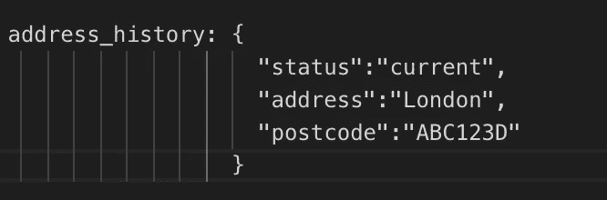
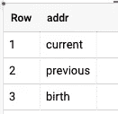
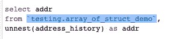
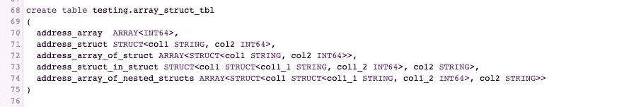

# 如何在 Google BigQuery 中使用数组和结构

> 原文：<https://medium.com/google-cloud/how-to-work-with-array-and-structs-in-bigquery-9c0a2ea584a6?source=collection_archive---------0----------------------->

如果您曾经对如何在 BigQuery 中选择或创建*数组*或*结构*感到困惑，那么您就在正确的地方。*数组*和*结构*令人困惑，我不会就此争论。但在我进入令人困惑的部分之前，让我先告诉你一点它们到底是什么，以及它们有什么不同。

# 什么是数组，在 BigQuery 中如何使用数组:

与任何其他语言一样，BigQuery 中的数组是同一数据类型的元素的集合。

例如，*数组* **address_history** 可能是这样的:

> id:“1”，
> 姓名:“abc”，
> 年龄:“20”，
> **地址 _ 历史:[“当前”、“以前”、“出生”]**

# **什么是结构，如何在 BigQuery 中使用它们:**

struct 是一种具有键值对属性的数据类型，就像 Python 中的字典一样。

在每个记录中，多个属性都有自己的值。这些属性既可以被称为键，也可以被称为*结构*列。

> id:“1”，
> 姓名:“abc”，
> 年龄:“20”，
> **地址 _ 历史:{
> “状态”:“当前”，
> “地址”:“伦敦”，
> “邮编”:“ABC 123d”
> }**

*结构*可以有更多的属性，每个属性都有自己的值，与一个键/ID 相关。例如，在下图中，**行 1 在一个 address _ history*Struct***中有 3 个属性(“状态”、“地址”、“邮政编码”)。

鉴于*数组*在**一列 address_history** 中可以有多个元素，针对每个 key/ID，*数组*中没有配对，它基本上是一个列表或集合。

> **地址 _ 历史:【“当前”、“以前”、“出生”】**

# **注意**大括号、*结构*有花括号{}，而*数组*有方括号[]

# **什么是结构数组，我们如何在 BigQuery 中使用它们:**

顾名思义，如果我们想要针对每个键/ID 存储多个*结构*，那么*结构数组*就是选项。

例如:Address_history 是一个*数组*列，在[]内有 3 个{} *结构*。

> id:"1 "，
> 姓名:" abc "，
> 年龄:" 20 "，
> **地址 _ 历史:[
> { "状态":"当前"，"地址":"伦敦"，"邮政编码":" ABC123D" }，
> { "状态":"以前"，"地址":"新德里"，"邮政编码" }，
> { "状态":"出生"，"地址":"纽约"，"邮政编码"**

**注意:您可以使用 SQL 文件末尾的以下代码，供您复制和尝试。**

# 通过查看模式，我如何知道它是数组/结构/结构数组:

一个*数组*是一个列表，这意味着它有嵌套的值。如果您曾经在模式中看到一个“重复”模式的数据类型，那么它就是一个*数组*。

创建数组 _ 演示

数组演示模式

另一方面，*结构*有许多值，如果我们想选择一个值，我们需要使用‘点’。如果您曾经在模式中发现一个数据类型为“RECORD ”,那么它就是一个具有可空模式的*结构*。

创建结构演示

结构演示模式

结构的*数组是一个嵌套记录。因此,“记录”数据类型具有“重复”模式，然后是一个*数组的结构*。*

创建数组结构演示

数组结构演示模式

现在，通过查看模式或数据，您就知道区别了。

# **如何查询 array/struct/array _ of _ struct？**

一个*数组*是一个嵌套的列，如果我们想要一个分组的值，那么我们不需要去嵌套它。但是为了将它展平成多个记录，我们需要使用 *unnest* :

正如您在上面所看到的，如果您不在来自关键字的*之后*取消嵌套*并原样选择*数组的*列，查询结果将只有一行。*

但是下图这里，在 *address_history* 的 *unnesting* 之后，输出是 BQ 已经把行展平为三行。

*Struct* ，作为*记录*的数据类型，不需要嵌套。

如上所述， *address_history* ，一个 *Struct* 数据类型，被直接选中，产生三列。但是如果你想从 *Struct* 数据类型中选择部分值，你可以使用“.”如 *address_history.status*

在结构的*数组的情况下，可以直接选择列，它将只产生一行:*

如上所述，每个 *Struct* 键只有一行有多个值。比如 *address_history.status* 有三个值[“当前”、“以前”、“出生”]。但如果需要选择部分 *Struct* 键，肯定需要先 *unnest* 将其展平成多行，否则 BQ 会抛出这个错误:

> 无法访问数组类型为<struct string="" address="" postcode="">>的值的字段状态</struct>

只有未嵌套的*结构数组* ( *记录，重复的*)才会产生包含所有*结构*键值对的多行。

您也可以通过使用 *unnest* 并使用“.”选择那些特定的列，从结构的*数组中选择一些列*

对于*嵌套的结构*，例如*数组*在另一个*结构*内有一个*结构*，使用多个 unnests。下面是一个*数组*的基本示例，在另一个*结构*中有一个*结构*，比如(Array[Struct <列，Struct < >)。

这是另一个*数组*在*结构*内有另一个*数组*和*结构*的例子，比如(Array[Struct<Struct<>，Array[] >)。

现在你可能有进一步的问题，所以继续阅读。

# 如何为数组和结构创建模式:

下面是可以包含在模式的 DDL 中的所有类型的*数组*和*结构*数据类型的简单示例:

这里是供您在 BigQuery 中尝试的 SQL 文件。快乐查询:)

**如需更多参考，请阅读以下内容:**

*   [https://cloud . Google . com/big query/docs/reference/standard-SQL/arrays # query _ structs _ in _ an _ array](https://cloud.google.com/bigquery/docs/reference/standard-sql/arrays#query_structs_in_an_array)
*   [https://cloud . Google . com/big query/docs/nested-repeated # python](https://cloud.google.com/bigquery/docs/nested-repeated#python)
*   [https://cloud . Google . com/big query/docs/reference/standard-SQL/data-types](https://cloud.google.com/bigquery/docs/reference/standard-sql/data-types)