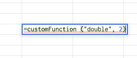
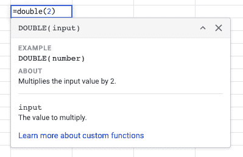

# 如何为 Google Sheets 编写自定义函数库

> 原文：<https://medium.com/google-cloud/how-to-write-a-custom-function-library-for-google-sheets-87f62729e684?source=collection_archive---------1----------------------->

在本文中，我将展示一种定制 Google Workspace 环境的方法。我们将在 Google Sheets 中实现两个自定义函数。以这些函数为例，我将演示如何使用 Google Apps 脚本库来组织和分发您的解决方案。有多种方法可以在 Google Workspace 中分发您的应用程序脚本代码，本文将帮助您决定这种库方法是否适合您。

Gabriel Sollmann 在 [Unsplash](https://unsplash.com?utm_source=medium&utm_medium=referral) 上的照片

自定义函数是解决 Google Sheets 中特定用例的好方法。在这种情况下，我将关注如何维护函数，而不是函数本身，因此我的示例函数基于[快速入门:菜单和自定义函数|应用程序脚本](https://developers.google.com/apps-script/quickstart/custom-functions)中的示例。

# 容器绑定脚本

Google Sheets 使用[容器绑定脚本| Apps 脚本](https://developers.google.com/apps-script/guides/bound)。这意味着脚本与工作表一起提供，如果您制作工作表的副本，您将自动获得脚本的副本。这使得在脚本中维护自定义函数变得困难。

将函数转移到库中解决了维护问题。然而，它引入了一个新的问题。一旦函数在库中，它们在 Google 表单上就不可见了。为了解决这个问题，我们需要将函数放回 Google Sheet 的容器绑定脚本中。

# 为什么要使用库来分发你的函数

通过图书馆，您将获得:

*   代码的版本控制
*   对开发或生产版本的控制
*   轻松分发您的代码

对于库，你也要在易用性和维护性之间做出权衡。这些解决方案的主要缺点是:

*   不太直观的函数名
*   帮助信息获取很难实现

[库|应用程序脚本](https://developers.google.com/apps-script/guides/libraries)描述了如何创建库。下面的示例代码使用了本文中描述的构造[结构，并简化了你的 Google Apps 脚本(用)V8](/swlh/structure-and-simplify-your-google-apps-script-with-v8-37e29d3e1edf) 。

在本例中，我们将两个自定义函数移动到 custom functions 对象中。这些函数放在 allFunctions 对象中。

getFunctions 函数根据名称返回一个函数，并将参数传递给自定义函数。

下一步是添加库。在下面的示例中，库的名称是 sheetFunctions。一旦库可用，我们就可以使函数可用。

在上面的例子中，我们用两种方式实现了这个功能。第一到第七行支持自定义函数的这种用法:

第九行到第十八行将提供帮助信息。这消除了使用库的缺点，但是它使得引入新函数或改变函数的参数变得困难。该函数的实现保留在库中。

在本文中，我展示了如何将自定义函数移动到库中。

在 Google Sheet 中维护定制功能还有其他方法，实现一个附加组件([用附加组件扩展 Google Workspace | Google Workspace 附加组件](https://developers.google.com/gsuite/add-ons/overview))也是维护和分发定制功能的一个好方法。当您不想使用附加组件，但仍然希望能够在发布后维护您的代码时，使用库会有所帮助。

如果你想更深入地了解这些函数和库，请阅读 Google Sheets | Apps 脚本和[库| Apps 脚本](https://developers.google.com/apps-script/guides/libraries)中的指南[自定义函数。](https://developers.google.com/apps-script/guides/sheets/functions)

**资源**:

[Google Sheets | Apps 脚本中的自定义功能](https://developers.google.com/apps-script/guides/sheets/functions)

[快速入门:菜单和自定义功能|应用程序脚本](https://developers.google.com/apps-script/quickstart/custom-functions)

[使用 V8 构建并简化您的 Google Apps 脚本](/swlh/structure-and-simplify-your-google-apps-script-with-v8-37e29d3e1edf)