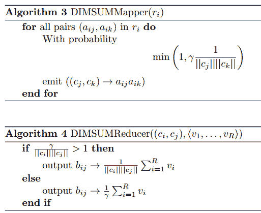
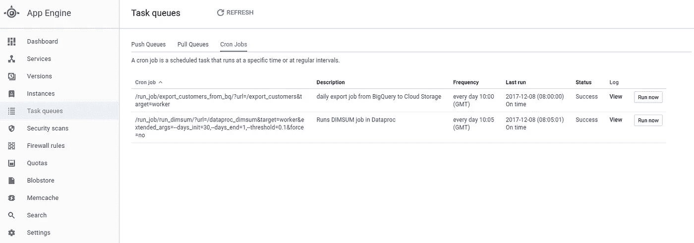

# 我们如何使用 GCP 实现一个完全无服务器的推荐系统

> 原文：<https://medium.com/google-cloud/how-we-implemented-a-fully-serverless-recommender-system-using-gcp-9c9fbbdc46cc?source=collection_archive---------0----------------------->

就在最近，我们公司面临着一个非常令人兴奋的挑战，我想借此机会写下这个挑战以及我们在这个过程中学到的东西。

我们的主要目标是与我们在 [GFG 集团](http://global-fashion-group.com/)的核心团队合作，为我们的不同企业开发一个能够与我们的客户有效互动的推荐系统，只有一个条件:它应该建立在 [Apache-Spark](https://spark.apache.org/) 之上；原因是该团队已经掌握了 Spark 系统及其在生产环境中的管理的专业知识。

所以，在这篇文章中，我想写一下我们实现了什么。我们有两个月的时间来实现一些东西，最终的解决方案是建立在谷歌云平台(GCP)之上的一个完全无服务器的系统。

最终实现的算法被称为“DIMSUM ”,也是 Twitter 目前运行的算法。以下是我们将在本帖中讨论的已实现架构的概述:


简而言之:AppEngine 编排调用(由 crons 触发),将数据加载到我们的云存储中，构建 Dataproc 集群，处理我们的主算法，再次将结果保存到存储中，最后我们有一个数据流管道执行，将结果加载到数据存储中，以便 Appengine 可以直接访问并向我们的客户提供建议。

好吧，这是相当地狱的坚果壳。

现在不要担心所有这些操作，请注意，我们有不同的颜色连接不同的元素，这些将单独讨论，因为它们构成了我们系统的主要模块。本帖涵盖的主题将是:

1.  理解算法
2.  获取数据
3.  AppEngine 中的 Cron 作业
4.  Dataproc 执行
5.  具有数据流的流水线过程
6.  提出建议
7.  成本估算
8.  未来的工作
9.  结论

事不宜迟，我们走吧！

# 1.理解算法(DIMSUM)

我们的第一个方法是尝试实现[邻域算法](http://yifanhu.net/PUB/cf.pdf)，这是一个非常成功的实现，在推荐系统文献中非常流行，特别是在[协同过滤](https://en.wikipedia.org/wiki/Collaborative_filtering)领域。

它的工作原理基本上是找到不同项目之间的相似性分数(这里的项目可以是产品、客户、音乐，任何可以提取元素之间某种相关性的东西)，并使用这些分数来预测客户对每个项目的喜爱程度。

在电子商务中，在很大程度上，我们并不确切知道一个给定的客户是否喜欢某个商品；这意味着我们所能做的就是计算来自客户的一般交互，例如“他或她访问该产品多少次？他把这个放进篮子里了吗？她买了吗？如果是这样的话，我们会尝试添加一些值来表示对该特定项目的某种喜爱感，尽管这可能是隐含的，但我们仍然会尝试从这些行为中提取信号。

更清楚地说，假设我们观察了 4 个客户以及他们与 2 个不同产品的交互(1 表示客户浏览了产品页面):


为了找出这两只鞋之间的相关性，我们使用由以下公式给出的余弦相似性:


这个等式说的是，相似性度量是每个客户的产品之间的交集的总和，通过这些交互来标准化。

比方说，如果每个客户都与这两种产品交互，那么结果将正好是 1，这意味着这两种产品 100%相似。喜欢一种产品的顾客会同样喜欢另一种产品；如果他们只与其中一个 SKU 交互，而不与另一个 SKU 交互，那么最终结果将是 0，这导致了一个概念，即如果客户喜欢一个 SKU，就不能期望他或她会喜欢另一个 SKU。

在前面的示例中，我们有:

**A** = [1，0，1，1]； **B** = [0，0，1，1]

应用相似性得分等式，我们得到:

*相似度*=(1 * 0+0 * 0+1 * 1+1 * 1)/√( 1+0+1+1)* √( 0+0+1+1)≈0.82

如您所见，这实际上是对产品之间的交集的提取，由该产品上的所有值进行标准化。

有了这些相似性分数，我们就可以预测顾客会有多喜欢那些看起来不那么遥远的商品。让我们以之前的例子为例:如果我们知道红色鞋子和米色鞋子的相似度是 82%，假设我们知道一位顾客喜欢其中一款；我们可以推断，鉴于他们的相似性得分，他有 82%的可能性会喜欢对方。我们可以用数学方法表达对新项目进行预测的概念:


是时候介绍一些符号了:在上面的等式中，“u”标识我们网站上的一个给定客户；“I”和“j”是项目的标识符,“r”是一个度量，它告诉我们用户 *u* 如何与项目交互，所以在我们之前的示例中，它是 1 和 0。“s”是我们刚刚计算的相似性，因此“s_ij”是项目“I”与“j”之间的相似性(在我们的示例中，“I”可能是红色的鞋子，“j”可能是米色的鞋子)。

所以所有的公式都在说:为了预测用户“u”会有多喜欢项目“I”，由带有“^”符号的“r”表示，我们观察他或她与之交互的所有项目；我们观察这些和我们想要预测的那个之间的相似性，将所有的相互作用乘以相似性，然后将所有的事情加起来(除法是一种使方程标准化的方法，在实践中我们并不像文献中建议的那样应用它)。我知道这听起来令人困惑，但鉴于一张图片胜过千言万语，以下是对其工作原理的描述:


在这种情况下，我们的客户与第一个 sku 互动了“1.5”分，与第二个 SKU 互动了 2 分，与第三个 SKU 互动了 2.5 分。那些相同的产品和我们想要预测的产品之间的相似度分别是 56%，21%和 67%。因此，为了预测这位顾客对第四件产品的喜爱程度，我们将我们了解的顾客的每个 sku 的互动和相似性相乘，将所有东西相加，并通过相似性得分标准化，结果为 2.42。这是我们预测顾客会喜欢这件商品的程度。

差不多就是这样了！总之，neighborhood 观察客户和商品的所有互动，并提取它们之间的相似性指标，这使我们能够预测客户将如何喜欢新商品。

但有一个问题，这就是挑战的开始:在达菲提(GFG 的一家合资企业)，我们每天都有数百万客户访问我们的网站，他们可能会与其他数十万种可用产品进行互动。

如果你利用 Dafiti 的数据，试图找到客户和商品的所有互动，然后试图建立所有产品之间的所有相似性，你会发现你的计算机/集群在几秒钟后爆炸并燃烧成火焰。如果你在某个共享集群中这样做，确保尽快离开大楼(在这样做之前删除数码照片*)。

事实证明，有更聪明的方法可以做到这一点，这就是我们开始在挑战中取得一些重大进展的地方。

## 1.1 dim sum 方法

由于使用 Spark 是这个项目的强制要求，我们寻找如何以 MapReduce 方式实现余弦计算的方法；我们发现，该框架基本上是一个步骤管道，您可以将输入值映射到新值，并减少它(如果您需要的话)以将结果聚合到某个最终指标中。因此，主要思想是:应用映射来转换数据，如果你需要一些聚合(你通常这样做)，然后使用一些减少操作。

如果你仔细思考，你会发现在 MapReduce 框架中实现某种邻域方法其实很简单:我们有训练数据，其中包含用户及其与产品的交互(我们将在后面详细讨论)，所以我们可以这样安排:

```
{“user”: “user_0”, “items”: [{“sku”: “sku_0”, “r”: 1},
                             {“sku”: “sku_1”, “r”: 2}]}
{“user”: “user_1”, “items”: [{“sku”: “sku_0”, “r”: 2},
                             {“sku”: “sku_2”, “r”: 1}]}(...){“user”: “user_m”, “items”: [{“sku”: “sku_0”, “r”: 2},
                             {“sku”: “sku_n”, “r”: 1}]}
```

换句话说，我们可以将它安排给 *m* 个用户和他们潜在的 *n* 个条目的交互(请记住，我们不保存“零”值，因为这会不必要地消耗大量内存)。

由于余弦指标在客户层面上寻找产品之间的相关性(如果客户与两个项目都有交互，那么它们的交集就会增加)，我们可以使用这个简单的算法来提取相似性:


请注意，该算法没有提取余弦相似度，因为它没有按照每个 sku 交互向量的规范进行归一化；在实践中，我们仍然需要进行这种规范化(这非常简单，我们将向您展示我们是如何做到的)。视觉上，大概是这样的:


对于每个客户，我们有两个“For ”,对应于每个“ai”和“aj ”,我们通过向量发射 ai * aj 进行扫描。

我们从[雷扎·扎德讨论 Twitter 上 DIMSUM 实现的论文](https://stanford.edu/~rezab/papers/dimsum.pdf)中获得了这个算法(这是一篇非常令人惊讶的文章，如果你是一名数据科学家或者喜欢计算机科学的这个领域，我强烈推荐这本书，它当然值得一读)。

嗯，这个算法被称为“NaiveMapper”(理由很充分)。对于代表一个客户的每一行，我们在所有项目之间做一个叉积。比方说，一个给定的客户与 skus 0、1 和 2 交互；我们最终可能会得到(只是一个例子，数字是随机写的):

[((sku0，sku0)，1)，
((sku0，sku1)，2)，
((sku0，sku2)，0)，
((sku1，sku0)，2)，
((sku1，sku1)，2)，
((sku1，sku2)，1)，
((sku2，sku0)，0)，
((sku2，sku1)，1)，
((sku2，sku2)，1)]

为每个客户提取所有这些相关性的步骤是我们的映射阶段(或"*洗牌阶段"*)，其 BigO 是*O*(mL)(“L”是客户在我们整个训练集中的最大交互次数)。好吧，如果你是一个开发者，你肯定已经知道当我们在 waaaaateeeer 上有*O*(n):smoooke 时会发生什么…

不太好。不一定不可行，但主要不是…酷。正如在达菲提 *L* 可能有数千个 SKU，而 *m* 是数百万个，你看我们手中的问题。嗯，DIMSUM 是通过实现这个新算法将这个问题分解成一个更容易处理的问题的方法:



这是一个相同的想法，但有一个聪明的变化:现在我们有了这个标量“γ”,它作为洗牌阶段相关性发射的采样率。但这不仅仅是添加一个简单的标量和“瞧”，它已经完成了！我们需要一些严格的数学分析来理解进行这种采样的利弊！

现在我将花时间进一步解释它是如何工作的，但下一个小型会议是完全“可以跳过”的。

(我会完全遵循雷扎布的纸上批注)。正如我们已经讨论过的，假设 **A** 是一个矩阵，它的行是客户，列是产品，每个单元格中的值对应于某种隐含的度量，即我们的客户对某个给定商品的喜爱程度(比如说，他每浏览一个产品，我们就加 1 分)。

如前所述，对于每一行，我们迭代所有产品交互，构建组合并将这些值发送到 Reduce 阶段。既然我们有了排放的取样率，那么它必须适用于每个交叉路口:


并且:


「‖ci‖」是乘积向量「I」的范数。这意味着一个产品的交互越多，我们就越不可能释放它的价值；原因是我们已经有了很多关于它的信息，所以我们可以发出少一点的信息，并且仍然在有限的误差内收敛到真正的相似性值。

**X** 是一个[随机变量](https://www.khanacademy.org/math/statistics-probability/random-variables-stats-library/random-variables-discrete/v/random-variables)，因为它现在遵循一个概率分布，并且最终的相似性得分是这些 X 的归一化总和，这给出了我们:


好吧，我承认，我只是不明白“γ”是从哪里来的；事实证明，这很简单:相似性是由每个乘积向量的范数归一化的“X”的总和(正如我们在本文开始时讨论的)。但是假设我们以一个给定的概率发出这些值，期望值也会乘以这个概率。

这意味着，如果我们不对这种影响进行校正，我们最终会得到类似“p *相似性”的结果。在这种情况下，我们需要除以“p ”,以便期望值收敛到真实值。但是考虑到我们的概率公式，如果我们将余弦除以“p ”,我们就抵消了 SKU 的范数,“γ”将保留在分母中。

可以推导如下:如果γ=ω(n/ε)(即，采样率与训练数据中的乘积量除以真实值和估计值之间的预期相对误差的平方成比例)，则:


至少有 50%的可能性。 **B** 是我们的相似矩阵，而 **D** 是一个对角矩阵，其对角线上的每个值都是相应产品的范数。这种推导有些广泛，我们在这里就不赘述了，但本文对每一步都有详尽的推导。

这个公式还使我们得出以下结论:如果对于给定的α ∈ ℝ，γ ≥ α/ε，则:


并且:


这给了我们一个上限和下限，在给定γ值的情况下，我们的计算可能会有多大的误差。对于给定的有界误差ε，α越大，计算值与真实值相差太远的可能性越低。

这一切的美妙之处在于:我们的洗牌阶段最终得到了 *O* (nLγ/H)，其中“H”是在我们将其缩放到 0 和 1 之间之后 **A** 中最小的非零条目。

这就是该算法被称为“DIMSUM”的原因，它使用 MapReduce 扩展为“**维度独立矩阵平方”:请注意，以前，该值是 *O* (mL)，现在它与我们的训练数据中有多少客户完全无关！“m”消失了，现在我们基本上有了一个线性的 *O* ，它允许我们处理大量的数据，构建我们的相似性矩阵，并在一定程度上保证获得的值在给定的边界内收敛到真实值。**

Reduce 阶段只是一个求和阶段，因此这里的最佳策略是避免向该阶段发出太多值。

希望这足够好地介绍了我们如何使用 MapReduce 框架计算这些算法。这背后肯定有一些繁重的数学计算，但它仍然允许我们尽可能有效地在矩阵上进行各种线性代数运算，给定我们要权衡的有界误差。

因此，变化如下:还记得我们之前关于每个客户排放的例子吗？如果我们举同样的例子，现在用 DIMSUM，我们可能会得到这样的结果:

[((sku0，sku0)，1)，
，
((sku0，sku2)，0)，
，
，
((sku1，sku2)，1)，
((sku2，sku0)，0)，
，
((sku2，sku2)，1)]

缺失的值不再被发出，因为现在我们有了发出每个相关的概率。

在实现算法时，我们将对映射阶段做一个小的调整，如下所示:


这不仅减少了排放，而且减少了所需的计算，因为只有在采样方案中接受了第一“aij”时才计算第二“aik”。

差不多就是这样了！我们基本上需要为每个客户提取产品之间的相关性，但在大数据中这样做在很大程度上是不可行的。因此，我们使用采样技术将 *O* 带到更低的值范围，这样我们就可以对数据执行各种线性代数运算。

嗯，我们已经准备好开始实施 DIMSUM 了！

有点…

我们仍然需要数据来支持算法！数据是新的黄金，所以…让我们挖掘它！

# 2.给我看看数据

这就是我们现在要讨论的:


我们用来实现无服务器应用的第一批工具是 AppEngine、BigQuery 和云存储。

[BigQuery](https://cloud.google.com/products/big-data/?hl=pt-br&utm_source=google&utm_medium=cpc&utm_campaign=latam-BR-all-pt-dr-bkws-all-all-trial-b-latam-1002243-LUAC0000358&utm_content=text-ad-none-any-DEV_c-CRE_204833483167-ADGP_BKWS+%7C+Multi+~+Bigquery+Google-KWID_43700022301561115-kwd-302438885959-userloc_1001773&utm_term=KW_%2Bbigquery%20%2Bgoogle-ST_%2Bbigquery+%2Bgoogle&dclid=CL_tiJTPgNgCFQcchwodeagASQ) 基本上是一个数据库新概念的天才实现，旨在尽可能轻松地处理大数据。没有索引，也没有任何基础设施需要你去照顾。你只需将数据加载到那里，它就会处理你需要的一切，按需、即时、超赞。

我们使用 BQ 将我们的数据从 [Google Analytics](https://support.google.com/analytics/answer/3437719?hl=en) 转换成一种我们在 Spark 中的算法可以处理的格式；当我们与 GFG 的中心团队合作时，我们使用了与他们相同的生产环境输入模式。以下是我们为算法提供的数据示例:

```
user,productSku,type
95106786645166913,AG672APF78UCF,1
8897887309145128270,FI911APF10HUZ,2
1153521620412862249,CO515APM42GTT,2
1819629928011287314,FI911SHM06PUF,1
1133082218947946503,JO546APM50KFT,3
```

需要指出的几点:还记得我们之前的讨论吗，我们跟踪顾客的信号来间接推断给定顾客对给定商品的喜爱程度？所以，我们是这样做的:“1”表示客户浏览了给定的产品；“2”产品被添加到购物篮，最后“3”:产品被购买。

因此，我们推断用户`95106786645166913`浏览了产品`AG672APF78UCF`，用户`8897...`将`FI911APF10HUZ`添加到购物篮，等等。

目前，这对我们来说只是一个提示。顾客浏览一件商品并不意味着他或她喜欢它。但这也是我们不想摆脱的一个隐含信号；如果同一个顾客将同样的商品添加到购物篮中，我们就有了比“浏览”更有意义的东西，购买也是如此。请注意，顾客购买产品并不意味着他或她喜欢它。也许这是给别人的礼物，也许他后来归还了物品，也许他很着急，不得不先买他发现的东西...这是我们运行来提取这些值的查询:

到目前为止一切顺利！但是如果我们想要一个无服务器的解决方案，我们需要自动触发这个查询的执行，而不需要运行 cron 服务的机器。

这就是 [AppEngine](https://console.cloud.google.com/appengine?src=ac) 发挥作用的地方。

# 3.保佑克朗斯

简单地说，Google AppEngine 是一个[的无服务器 WSGI](http://wsgi.readthedocs.io/en/latest/what.html) 服务器，你可以在那里上传路线、相关功能和指令规则；只需构建与每条路由相关的代码，并部署到 GAE，它就会工作:自动缩放、流量分配、日志记录、身份验证、memcache 和许多其他功能。

我想现在就向你们展示一个例子，它是我们为管理 crons 而部署的代码之一，我们很快就会谈到。这就是我们的 **main.py** 服务:

注意这是一个指定了一个路由规则的 [Flask](http://flask.pocoo.org/) 应用程序:对于具有模式为`/run_job/job_name/`的 URL 的请求，将触发`run_job()`函数(稍后我们将在 GCP 调度我们的任务)。这基本上是您部署到 GAE 的代码，它会处理其余的事情。

如果你阅读 GAE 文档，你会注意到有两种类型的环境可以上传你的代码:标准与灵活。

主要区别是:Standard 运行在一个[沙盒](https://en.wikipedia.org/wiki/Sandbox_(software_development))环境中，该环境阻止了一些事情，例如运行用户 C 代码、多线程/处理、写入磁盘等等。你得到的回报是缩减到零台机器的可能性，以及一套只在这个选项中可用的工具，如 [NDB](https://cloud.google.com/appengine/docs/standard/python/ndb/) 库(由 BDFL·吉多·范·罗森设计)。

另一方面，Flexible Environment 接收一个 Docker 映像，您可以在其中公开一个端口，将流量路由到一个内部 WSGI 服务器(对于 Python， [gunicorn](http://gunicorn.org/) 非常流行，将在本文后面使用),这保证您可以安装几乎任何东西。这种灵活性的缺点是为自动伸缩创建一个新的实例更加耗时，而且由于这一点，始终至少有一台机器在运行，也就是说，在这个选项中，您不能将实例缩减到零。

所以我们使用的一个好的经验法则是:如果我们正在设计的东西会有长时间的不活动(没有请求),那么我们使用标准；如果需要更高级的编码(比如多重处理和基于 C 的处理)并且总是不停地接收请求，那么就用 Flexible。

那么，您可能会问:“这与我们能够为 BigQuery 中的查询运行 cron 作业有什么关系”？

别担心。我们来谈谈这个吧！

这就是我们现在要讨论的:


GAE 拥有对无服务器 CRON 触发器的本地支持。您所要做的就是指定一个将接收 GET 请求的 URL，然后在该 URL 中编写您需要的任何代码。您必须部署一个指定路线和规则的 [cron.yaml](https://cloud.google.com/appengine/docs/standard/python/config/cronref) 文件；这里有一个来自官方文件的例子:

```
#cron.yaml
cron:
- description: "daily summary job"
  url: /tasks/summary
  schedule: every 24 hours
```

这意味着每 24 小时就会向 URL `/tasks/summary.`发出一个 GET 请求

在 GAE 有一个重要的要求:请求必须在 60 秒的时间内完成，否则你将不得不安排操作加入一个[队列](https://cloud.google.com/appengine/docs/standard/python/taskqueue/)，并且任务将作为一个后台任务处理，在输入请求之外。

我们希望我们的 cron 在 BigQuery 中运行查询，然后将结果导出到 GCS 这可能需要 60 秒以上的时间，因此我们为 cron 创建了一个[调度器](https://cloud.google.com/appengine/docs/standard/python/taskqueue/)，以便在指定的时间触发发生时启动。

基本上，接下来发生的事情是:我们的 cron 向我们的主路由器发出一个 GET，然后主路由器向我们的调度器添加一个任务，调度器由(在本例中，我们使用了[推送队列](https://cloud.google.com/appengine/docs/standard/python/taskqueue/push/)的概念):

到目前为止，我们有:一个 cron 向`/run_job/job_name`发出一个 GET 请求，它依次向我们的任务队列添加一个与 URL `/export_customers`相关联的作业，该作业依次运行我们的查询和提取操作。天哪，真让人困惑！也许一张照片会有所帮助:


我们的主要服务由这个 [yaml](https://cloud.google.com/appengine/docs/standard/python/config/appref) 文件定义:

这就是我们关于标准与灵活的讨论发挥作用的地方:我们不需要那些机器一直运行。仅当他们正在处理计划任务时；如果我们没有在这个 ymal 文件中指定环境，那么默认情况下会部署 standard。

因此，现在我们可以设置一个 cron 来查找服务“dataproc-twitter ”,并在处理程序定义中找到将请求重定向到哪里，也就是说，在名为“main.py”的文件中找到名为“app”的应用程序。这是我们对将在后台运行我们的计划流程的工作人员的 yaml 定义:

我们还需要定义我们的[队列](https://cloud.google.com/appengine/docs/standard/python/config/queueref)将被处理的速率。这很简单，对于我们的项目，我们是这样做的:

最后，我们的 cron:

部署到 GAE 非常简单；需要安装 gcloud ，之后我们只需运行:

`gcloud app deploy main.yaml worker.yaml`

仅此而已。另一种部署是这样的:

```
gcloud app deploy queue.yaml
gcloud app deploy cron.yaml
```

在 GCP 仪表板上，所有正在发生的事情都有更新:


以及关于我们刚刚安装的 crons 的信息:



(cron“run _ dimsum”将在后面解释)。

现在我们已经知道了如何在 GCP 运行无服务器 cron 作业。那我们去 Spark 实现吧！

# 4.天堂之火

简而言之，Dataproc 是一个 Google 完全管理的集群，它已经有了 Spark 内置功能。基本上，您可以指定需要多少工作人员，然后点击 play，等待几分钟来创建集群。

如前所述，我们的目标是在 Spark 中实现 DIMSUM 算法。我们创建的第一个东西是一个基于 cron 的触发器，它在启动时为我们构建一个完整的集群，处理 Spark 作业，并在结束时删除集群。这是为什么呢？所以成本直线下降。我们实际上为我们使用的东西付费，仅此而已。

所以，让我们开始吧！我们现在要讨论的是:


我们已经有了 cron 作业接收器和调度器工作器。这是我们用来运行所有这些操作的[代码](https://github.com/WillianFuks/example_dataproc_twitter/blob/master/gae/worker.py):

这里发生的事情是:首先，我们的 cron 作业将向 URL `/run_job/run_dimsum/.`发送一个 GET 请求，这又将调度一个由运行函数`dataproc_dimsum().`的 URL `/dataproc_dimsum`触发的任务

这个函数的作用是:

1.  创建火花簇
2.  将运行作业所需的 PySpark 文件上传到 GCS
3.  运行 PySpark 作业
4.  删除集群
5.  安排一个任务，启动从 GCS 到数据存储的数据流提取。

考虑到这一点，我们可以深入了解 PySpark 工作。

## 4.1 PySpark

以下是我们使用 Dataproc 的方式。首先，我们通常用`n1-standard-1`机器和[脚本](https://github.com/WillianFuks/example_dataproc_twitter/blob/master/dataproc/bin/create_cluster.sh)创建一个非常小的集群，并像这样运行它

`./create_cluster -n=cluster_name -b=bucket_name`

这里重要的一点是:如果你仔细观察`gcloud`命令，你会看到有一个`jupyter.sh`初始化动作。这样做的目的是为我们的集群准备一个 J [upyter-notebook](http://jupyter.org/) 服务，准备使用它来创建一个 ssh 隧道(你可以在文件 [utils.sh](https://github.com/WillianFuks/example_dataproc_twitter/blob/master/dataproc/bin/utils.sh) 和 [launch_jupyter.sh](https://github.com/WillianFuks/example_dataproc_twitter/blob/master/dataproc/bin/launch_jupyter.sh) 中的[文件夹](https://github.com/WillianFuks/example_dataproc_twitter/tree/master/dataproc/bin)中看到我们是如何做的)。

[这是我们完成实施后笔记本电脑的外观示例](https://github.com/WillianFuks/example_dataproc_twitter/blob/master/dataproc/notebooks/df_naive.ipynb):


在作为本文基础的主存储库上，你可以在文件夹“dataproc”中看到文件夹“notebooks”。最酷的是，您可以看到在使用 PySpark 时这个工具是多么有用。我真的打开 pyspark 笔记本，开始测试一切可能的东西:所有的测试、问题、观察，一个接一个地同时进行。

这最终成为开发时的一个巨大的时间救星，因为您可以非常容易和快速地进行动态测试。如果你检查我的笔记本，你会发现我甚至没有跟着台词，我从一行开始，然后跳到底部，然后回到开头。这真的不重要，重要的是快速测试，尽可能快地构建原型，然后相应地构建最终代码(仍然要注意，我们所有的工作都经过单元测试，所以我们有一些代码工作的保证)。

考虑到这一点，下面是我们如何为 DIMSUM 算法进行作业开发的。首先，我们创建了一个带有通用助手函数的[基础](https://github.com/WillianFuks/example_dataproc_twitter/blob/master/dataproc/jobs/base.py)文件；以下是其中的一部分:

当使用 Spark 时，你通常从创建一个`SparkContext`开始，它设定了关于 Spark 应该如何运行工作的一般准则。注意方法`process_day_input`中发生的 MapReduce 操作；首先，我们从`textFile`源读取，然后是一组映射和归约操作。

还记得我们将客户行为映射为“1”表示浏览给定的 sku，“2”表示当它被添加到购物篮时，“3”表示购买发生时吗？在这里，我们将这些数字转换成最终得分，这暗示了给定顾客对某件商品的喜爱程度。

为此，我们做了这样的映射:`{"browsed": 0.5, "basket": 2., "purchase: 6.}`(在达菲提的生产中，我们有不同的值，这些值是通过[贝叶斯黑盒优化](https://en.wikipedia.org/wiki/Bayesian_optimization)获得的；因为讨论这些不是这篇文章的主要焦点，我们可能会在另一个机会讨论。

顾客每浏览一件商品，我们就加 0.5 分；如果它被添加到篮子，然后 2 点和 6 点，如果购买。这是我们得到的输出示例:


```
{“user”:”8291743389332496534",”interactions”:[{“item”:”RE499APM08ZTZ”,”score”:0.5},{“item”:”RE499APM85DGC”,”score”:0.5}]}{“user”:”5843584611541988560",”interactions”:[{“item”:”SA232SHF47ZZO”,”score”:0.5},{“item”:”SA232SHF89GXI”,”score”:1.0}]}{“user”:”6935962925703084781",”interactions”:[{“item”:”DE996ACF83KYE”,”score”:0.5},{“item”:”CR177ACF76BIH”,”score”:0.5},{“item”:”MA318ACF62LRP”,”score”:0.5},{“item”:”DE996ACF23CIQ”,”score”:0.5},{“item”:”QU097ACF76IKL”,”score”:0.5},{“item”:”QU097ACF44IPN”,”score”:0.5},{“item”:”QU097ACF77IOG”,”score”:0.5},{“item”:”DE996ACF50CHP”,”score”:1.5}]}
```

这个过程完成后，我们就可以最终运行 [DIMSUM](https://github.com/WillianFuks/example_dataproc_twitter/blob/master/dataproc/jobs/dimsum.py) 实现了:

这个脚本基本上扫描了我们在上一步中计算的所有中间数据，将所有客户交互聚合到一行中(这是我们在开始时讨论的矩阵 **A** )，然后执行`run_DIMSUM`方法。首先注意`pq.`的广播，这是对每个产品的概率和它们的归一化因子的计算，用于相关性的发射(ai * bi)。当我们在 Spark 中广播一些东西时，对象被序列化并通过 workers 网络传播，这样他们就可以在内存中直接访问该对象；我们广播一个包含每个 sku 信息的字典来提高性能。

请注意，DIMSUM 脚本基本上遍历我们客户的所有交互，并在这样做的概率超过生成随机数的概率时发出关联(想法是掷骰子，看看是否发布该数字)。

基本上就是这些了。尽管所有的方程都很复杂，但最终的实现非常简单。之后，结果被上传到 GCS 快速示例:


```
{“item”:”LO611APF49EBY”,”similarity_items”:
    [{“item”:”DI944APF23XPS”,”similarity”:0.017922988},
     {“item”:”ME700ACF75HAQ”,”similarity”:0.035410713},
     {“item”:”LO611APF47ECA”,”similarity”:0.1254363},
     {“item”:”TR943APF03NGY”,”similarity”:0.024296477},
     {“item”:”CA700APF63DSU”,”similarity”:0.044455424},
     {“item”:”LO611APF43ECE”,”similarity”:0.33709994},
     {“item”:”LO611APF41ECG”,”similarity”:0.07137738},
     {“item”:”LO611APF80EAT”,”similarity”:0.02228836},
     {“item”:”LO611APF84EAP”,”similarity”:0.03180418},
     {“item”:”DE234APF58ION”,”similarity”:0.013907681}]}
```

请注意，这里我们没有按照相似性度量对结果进行排序。这是在我们的数据流管道中完成的，说到这…

# 5.把他们都传送出去！

在将结果保存到 GCS 之后，会安排一个新任务将这些数据检索到数据存储中。这就是我们现在要讨论的:


[Datastore](https://cloud.google.com/datastore/) 是谷歌的一个 NoSQL 数据库，它与 AppEngine 直接集成，使事情变得简单快捷 100 倍。我们现在要做的是以键值的方式上传结果，这样当我们的系统收到一个请求，询问“我应该向喜欢这双红色鞋子的顾客推荐什么？”我们的系统可以查询数据存储，并检索所有需要的相似性，以得出答案。

但是有一个问题:如何将结果从 GCS 保存到 Datastore？

这就是[数据流](https://cloud.google.com/dataflow/)发挥作用的地方！Dataflow 是一个无服务器的框架，可以通过运行统一的数据处理模型来计算一般的 ETL 任务(这意味着它有一个“引擎”或“运行器”的概念，您可以选择运行哪个引擎:Dataflow、Apache Spark、Flink 和任何其他遵循统一模型的工具)。

[阿帕奇波束](https://beam.apache.org/)是创建流水线作业所需的工具。这是一个开源项目，目前支持 Java 和 Python SDKs(尽管不幸的是 Python 的实现落后于 Java，但它仍然提供了很多特性)。

我们现在要做的是实现一个管道过程，读取保存在 GCS 中的 DIMSUM 的结果，对其进行相应的处理，并将结果保存到数据存储中。这是我们的管道[实现](https://github.com/WillianFuks/example_dataproc_twitter/blob/master/dataflow/build_datastore_template.py):

这里我们使用了[模板化数据流](https://cloud.google.com/dataflow/docs/templates/overview)的概念:基本上它所做的就是创建必要的代码和 json 元数据，并将其导出到 GCS 中的位置路径；这样做的好处是，任何其他客户端在任何时候都可以运行该模板，只需发出一个指向模板位置的 HTTP 请求。这意味着不需要重新编译代码或设置整个环境。这对我们来说很有价值，因为我们是在标准 GAE 中工作的(记住，到目前为止所有的东西都是由 crons 激活的)，沙箱环境不允许我们在那里运行 beam 管道。

有了模板，什么样的环境和限制真的无关紧要，我们只需向作业执行发出 GET 请求，它就会自动发生；这是我们处理过的管道的一个例子。


值得注意的是:我们将管道执行设置为最多 2 个工人；数据流自动知道何时产生更多的工人，以便在可行的时间框架内优化总成本。

不过，您可能会注意到，将实体写入数据存储时会消耗相当长的时间。我不知道为什么会发生这种情况，幸运的是这对我们来说不是问题，因为这个过程在晚上运行，但我希望编写步骤比现在快得多(如果你知道如何提高性能，请告诉我们:)！).也许我们错过了一些优化步骤，但是随着我们交付产品的最后期限临近，这就是我们目前交付产品的方式。

随着我们的数据准备就绪，是时候提供建议了。我们快到了。

# 夫人，先生，塞西是为你们。

(我不会说法语，所以我只希望翻译没弄错)下面是我们现在要讨论的内容:


所以，让我们来推荐！

请记住，在我们的简介中，我们是这样计算最终建议的:


在实践中，我们不像文献中建议的那样进行归一化(分母中的相似性求和)。

这意味着，我们可以获得客户与商品的所有互动，得出一个隐含的得分指标“r ”,并乘以商品与这些得分之间的相似性，以预测给定客户对我们可能推荐的给定产品的喜爱程度。查看代码可能会使这更容易可视化。这是我们的第一个[实现](https://github.com/WillianFuks/example_dataproc_twitter/blob/master/gae/main.py)来完成:

并且`process_recommendations`由下式给出:

它是这样工作的:我们接收这样的输入请求:

```
/make_recommendation?browsed=CA278SHF46UJH
```

意思是:“我有一个顾客浏览了 CA278SHF46UJH 商品，你有什么推荐吗？”

然后，我们通过循环遍历 CA278SHF46UJH 作为 DIMSUM 输出的所有相似性来实现该等式，并从最好到最差排序，仅选择顶部的“n”。

这一切表示，这就是我们所得到的:


是的，没错。一场离奇的灾难...处理这些建议几乎花了整整 1 秒钟。从那 1 秒开始，**仅用一种方法就完成了 800 毫秒！** `process_recommendations`这里最终变成了一场灾难。

不要误会，这是一个很大的失败。如果你开发了一个推荐系统，它需要 1 秒的时间来回应，你就不会吸引那么多顾客，也不会让他们因为等待而高兴；这是丑陋和无效的。

嗯，那意味着我们所有的努力都失败了。但是我们还有最后一个锦囊妙计:我们一直使用标准环境，因为它简单，而且如果需要的话，可以缩减到零个实例。但这一次，沙盒功能可能弊大于利，现实是推荐系统很可能总是收到请求；对于达菲提和我们的许多企业来说都是如此，所以继续使用标准版没有多大意义。

我们的时间很短，所以我们很快迁移了环境，并开始使用灵活的环境，同时玩了另一个大把戏:我们决定[将](http://cython.readthedocs.io/en/latest/)操作`process_recommendation`化。

嗯，这就是 Python 的妙处:*《过早优化是万恶之源》*。这是代码开发中的一个基本事实。到目前为止，Python 为我们提供了很大的帮助，它让我们尽可能地多产。但是在这种特殊的方法中，它肯定没有做得很好，所以一个解决方法是使用 Cython 来获得一些性能提升；Cython 基本上是一种能够混合 Python 和 C/C++的语言。

这里的优点是，在很大程度上，Python 将每个对象都视为…嗯，一个对象。这意味着“int”的概念在 Python 中并不存在。实际上，int 是由包含 int 的对象封装的。这很神奇也很糟糕，只是取决于你如何看待它(或者说你如何使用它)。这给了 Python 所有的灵活性和编码实现速度，但代价是性能。但是在 Cython 中我们能做的是去掉 Python 必须对每个对象提出的那些问题，比如“ok object，你是什么？”我们可以事先说:“这是一个整型数组，你不必再问它们是什么了”。

[这就是我们在 Cython 中实现的](https://github.com/WillianFuks/example_dataproc_twitter/blob/master/gae/cythonized/c_funcs.pyx):

下面是 Cython 对 Python-API 请求的分析:


嗯…有点……好吧。

这段代码已经让我们在本地计算机上的处理速度提高了 7 倍。那是相当酷的！但是请注意分析中的黄线:它越强，对 Python-API 的请求就越多。因为我们的输入是一个字典列表，所以 Cython 不能将其直接转换成任何 C 结构。这意味着这些对象在 Cython 中仍然被如此对待，我们没有获得成功转换后可能获得的性能提升。

不过，别担心。然后，我们为推荐创建了一个单独的[服务](https://github.com/WillianFuks/example_dataproc_twitter/blob/master/gae/recommender.py)，这次是在灵活的环境中:

注意`cy_process_recommendations.`这是我们调用 Cython 脚本的地方。

在我们的案例中，部署到灵活就像标准一样简单。我们已经定义了我们的 [requirements.txt](https://github.com/WillianFuks/example_dataproc_twitter/blob/master/gae/requirements.txt) 文件，所以我们只需运行:

`gcloud app deploy recommender.yaml`

现在，这些是新的结果:


整个处理时间从 1 秒到**104 毫秒。**这是一个相当昂贵的请求，需要输入多个 SKU。我们得到更简单的输入:


大约在**20 毫秒**左右(需要注意的是，响应时间的数据存储标准偏差相当大，但平均值和中间值仍在此值附近)。

现在的主要瓶颈是从数据存储中检索密钥，由于消耗的时间是完全可以接受的，我们可以认为我们的任务现在已经完成了(哦耶！！！)

这里发生的一件事是从数据存储中获取实体的时间变得更长了；发生这种情况是因为我们必须更改客户端来建立连接，它使用 HTTP 而不是 [gRPC](https://grpc.io/) ，这意味着我们可以使用更合适的客户端来缩短时间。

这是我们从输入`/make_recommendation?browsed=DA923SHF25QXA`中得到的结果示例:


# 7.给我钱！(费用)

成本很重要，但实际上真正重要的是成本收入比，而不仅仅是成本。

虽然我不能公开 Dafiti 的数据和成本，但让我们看看这样一个模拟电子商务系统的成本。

首先，我们有标准的 AppEngine cron 服务。这笔费用基本上可以忽略不计，大概会是每月 1 美元。现在我们让 BigQuery 进行数据处理，假设每天处理 100 GB 的数据，那么每个月的查询量会增加 15 美元。让我们模拟一个 Dataproc 集群，每天运行大约 2 小时，3 台 n1-standard-4 类型的机器，每月增加 36 美元。我们也有数据流机器，但由于瓶颈是写入操作，我们可以使用非常基本的 n1-standard-1 实例，假设两个工人工作 3 小时，每月加起来就是 9 美元。现在我们有了数据存储。由于每 100k 次写入是 0.18 美元，假设 300k 最终大约是每月 16 美元。现在，假设电子商务规模很大，每天有大约 500 万次请求。那就是每月 90 美元。存储也是有价格的。如果我们消费 5 英镑，那么到月底就只有 1 美元了。最后，我们有灵活的环境机器。在这里，我们选择了一个非常基本的机器，因为我们看到主要的瓶颈是数据存储。考虑到我们将使用 1 个 vCPU 和 2GB 内存，这给了我们大约 46.8 美元。

对于一个每天接收 500 万次请求的电子商务来说，这些加起来就是每月 214 美元。

有一点非常重要:该系统是完全无服务器的，这意味着我们没有基础架构团队或开发人员的费用。我们实际上只为我们使用的东西付费，仅此而已；这里没有额外的费用。

# 8.现在我们改进了

嗯，我们仍然可以做一些改变来改进这个系统。在达菲提，我们在生产中不使用 Spark。我们相似性是通过 BigQuery 查询提取的，该查询已经为我们计算了所有的相关性。

此外，使用 Python 进行推荐最终并不十分有效。更好的选择是在这里使用 [GoLang](https://golang.org/) 。这可能导致不必将数据导出到数据存储，并且每个实例将文件从 GCS 加载到自己的本地内存。在这种架构下，我们的模拟商店的成本可能会比**100 美元**低得多。

由于我们必须交付，我们不能进一步探索这种方法，但它肯定是我们将很快测试的东西。

# 9.就是这样！

多好的旅程啊…

当我们开始实施这个系统时，我们无法想象它最终会有多么具有挑战性和苛刻。这让人筋疲力尽，痛苦不堪，我们每天都要在紧迫的期限内面对一个又一个 bug；这非常非常具有挑战性。

我记得看到过这句话“最好的水手不是风平浪静的大海造就的”。我承认，这个版本的“不劳无获”让我重新考虑继续经历这个项目实施过程中出现的所有障碍。我很高兴我们成功地解决了这个问题，因为我们在整个过程中学到了很多。

我们设法让它工作，并及时交货。我们对取得的成绩感到非常高兴，也很期待接下来会发生什么。

现在，我们已经掌握了一些知识，知道如何在生产环境中使用一个完整的无服务器架构来实现要求相当高的系统，这种架构既便宜又有效。希望这将为我们打开大门，让我们能够快速、简单、无服务器地构建更复杂的系统，并随时准备好与客户互动。

就在不久前，我们还认为不可能建立一个完全无服务器的推荐系统，因为每个请求中的计算可能相当苛刻，但正如我们可以证实的那样，这是完全可能的，也应该是我们作为开发者的主要目标。

如果你通读了所有这些，天哪，这是你应得的！希望它值得一读，你可以从中学习到一些东西。如果您有任何建议或意见，请告诉我们！

全部代码可在[这里](https://github.com/WillianFuks/example_dataproc_twitter)获得。

好吧，我们期待着我们的下一个任务(你现在可以播放[超级银河战士结局](https://www.youtube.com/watch?v=KWdRKZ6QgcU)原声带，这将是史诗，保证)。

非常感谢！
(光束开火。阿帕奇-梁，也就是*)