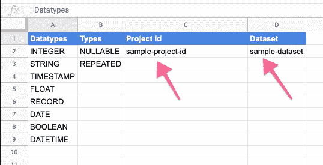
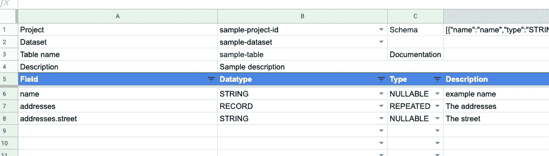
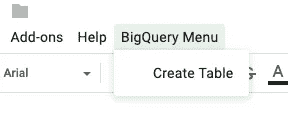

# 用 Google Sheets 和 Apps 脚本创建 BigQuery 表

> 原文：<https://medium.com/google-cloud/https-medium-com-duizendstra-create-bigquery-tables-with-google-sheets-and-apps-script-a0751b43a952?source=collection_archive---------0----------------------->

使用标准 GUI 创建 BigQuery 表可能会很麻烦。本文描述了使用 **BigQuery 表构建器表**创建 BigQuery 表的另一种方法。这个 Google 电子表格自动创建 BigQuery 表，记录这些表，并支持围绕表模式设计的协作。

# 图纸的设置和配置

假设对 Google 云平台、项目、支持 API 和 BigQuery 有基本的了解。此表仅适用于启用了 BigQuery API 的项目。如果你遇到困难，请在下面留下评论，我会帮助你设置表格。

首先创建一个 [2019 BigQuery 表构建器表](https://docs.google.com/spreadsheets/d/1mYftiWPLmACPTXv-M4RrfcFeMCQ-HP62tAYbj8bggMA/copy)的副本。将出现一个新的菜单项“BigQuery menu”。这可能需要最多 30 秒。create table 菜单选项将激活 BigQuery 表的创建。第一次运行此操作时，您需要授权将创建表的脚本。

接下来，在 config 选项卡中添加您想要使用的项目 id 和数据集

电子表格中的每个选项卡代表一个表格。对于多个表，创建现有选项卡的副本并用新的替换字段定义。

在 B 列中，选择正确的项目 id、数据集和表名。描述字段是可选的，它将被复制到表的描述字段。对于每个字段，填写名称、数据类型和类型以及可选的描述。重复字段使用点符号。

完全填充的表的示例

一旦建立了表并定义了表，就可以创建表了。为了防止删除现有的表，工作表永远不会覆盖表，如果表已经存在，工作表将抛出一个错误消息。

# **它是如何开始的**

我创建这个表是为了加快创建 BigQuery 表的过程。它从一个简单的工作表开始，包含一些标准函数，这些函数产生了 JSON 模式。可以将该模式复制到 GUI 中来创建表。这工作得很好，我开始对所有的 BigQuery 表使用这个表。一个好处是在一个地方记录和创建表格。

下一步是在团队中分享工作表。Google sheets 非常适合协作，并为我提供了一种与其他团队成员共享表格设计的方式。关于字段名的争论被移到了评论中，每个人都在使用同一个版本。

该表的附加值是显而易见的，我开始寻找一些优化。自动创建表，支持记录和重复字段会很好。

# 床单的工作原理

当你想到 G Suite 中的自动化时，你会想到 Google Apps 脚本。从网站:

> Apps Script 是一个快速的应用程序开发平台，使得创建与 G Suite 集成的业务应用程序变得快速而简单。

我使用 apps 脚本在生成 JSON 模式的工作表中创建了一个[自定义函数](https://developers.google.com/apps-script/guides/sheets/functions)。一个[定制菜单](https://developers.google.com/apps-script/guides/menus)被添加到运行创建表格的函数的表单中。该函数使用 Apps 脚本中的[高级 Google 服务](https://developers.google.com/apps-script/guides/services/advanced)来调用 [BigQuery API。](https://developers.google.com/apps-script/advanced/bigquery)

自定义菜单是通过 onOpen 功能添加的。

该函数在工作表加载时被调用，它会将菜单项添加到菜单栏。

菜单项调用 *createTable* 函数。 *createTable* 函数从工作表中收集数据并调用 BigQuery API。根据设计，如果表已经存在，它将失败。这是为了防止用数据替换现有的表。

bqShema 函数用于创建 BigQuery 模式。该函数使用递归在 bq 模式中创建记录。