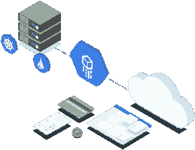
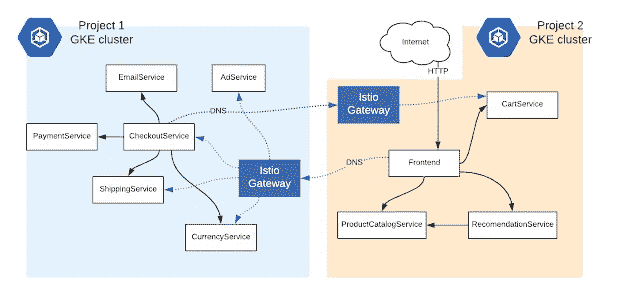

# 混合云—将 GCP 与内部数据中心联系起来

> 原文：<https://medium.com/google-cloud/hybrid-cloud-linking-gcp-with-on-premise-datacenters-b106dbdfa8c8?source=collection_archive---------0----------------------->

这一周非常忙碌；然而，对于我们的团队来说，这是值得的，因为我们通过将公共云工作负载与本地工作负载联系起来，成功地为客户实施了 Google 混合云。为了保持简短，我将这篇博客分成两部分(第一部分是解决方案概述，第二部分是实现细节)。在这篇博客中，我将写下我对采用云的主要障碍以及混合云如何解决它的想法。

# 是什么阻碍了公共云的采用？

每种技术都有其优缺点。我们都知道使用公共云的好处。那么，为什么企业应用程序仍然停留在内部数据中心呢？让我们来看看双方的主要因素。

**对公共云的偏好**

1.  最新的硬件和软件
2.  利用可快速轻松部署的资源降低 IT 成本
3.  数据分析
4.  自动缩放
5.  高可用性(跨多个地区/区域)

**对内部部署的偏好**

1.  传统位置
2.  传统硬件
3.  网络连接性差
4.  数据限制(数据保护法)

行业需要公共和内部数据中心的优势。这种必要性导致了混合云的发展！

让我们看看我们是如何为客户实施混合云的

# 第 1 天:内部设置

我们的客户在其内部数据中心托管了一个微服务应用程序，并希望利用 Google Cloud 的功能。他们的应用程序有一个基于 web 的前端和一个 MySQL 后端，要求如下

**前端服务**

1.自动扩展(根据工作负载无缝扩展)

2.高可用性(美国、欧洲、APAC 客户的多区域部署)

3.无操作(快速简单的管理)

**后端服务**

1.遵守数据保护法

2.到数据库的本地连接

后端要求非常适合本地设置，而前端需要公共云来克服资源限制。

# 混合云架构

我们必须找到一种解决方案来拆分微服务应用，将前端组件迁移到 GCP，同时保留连接到私有数据中心 MySQL 的本地后端服务。我们通过 [Istio](https://preliminary.istio.io/docs/concepts/what-is-istio/) ( [网关连接集群](https://preliminary.istio.io/docs/concepts/multicluster-deployments/#multiple-control-plane-topology)特性)将两个独立的 Istio 服务网格合并为一个逻辑混合网格来实现这一目标。如果你不知道[伊斯蒂奥](https://preliminary.istio.io/docs/concepts/what-is-istio/)和 [GKE](https://cloud.google.com/kubernetes-engine/) ，我会在[极客角落](http://www.priyasaxena.co.uk/p/geeky-corner.html)的一个独立博客中谈到这些基础知识。

*请注意，该混合云解决方案仅适用于在 Kubernetes 上运行的容器化微服务。*

Megan O'Keefe 的潮人商店微服务应用的多集群演示

**实施**

**步骤 1** :在 GCP 为前端服务创建了一个 [GKE](https://cloud.google.com/kubernetes-engine/) 集群
**步骤 2** :为后端服务创建了另一个 [Kubernetes](https://kubernetes.io/) 本地集群
**步骤 3 :** 为两个集群(本地和云)设置单独的 Istio 控制平面。
**第四步:**配置了 KubeDNS 与 Istio 的 CoreDNS 对话。这是连接两个集群的关键。它允许一个集群中的服务引用另一个集群中的服务，就像它们是自己的网格的一部分一样。
**第五步:**部署微服务应用，配置 Istio 入口网关，让两个集群相互通信。

我们的解决方案类似于下图所示(除了下图显示了 GCP 上的两个集群；而我们的解决方案是针对混合云的)。

在我的下一篇博客中，我们将深入探讨这些步骤中的每一步(使用支持脚本)来为微服务演示应用实施混合云。此外，看看谷歌的混合和云计算产品 [Anthos](https://cloud.google.com/cloud-services-platform/) ，它可以让你跨环境构建和管理现代混合应用。

目前就这些。我们将在下一篇博客中深入探讨实现。我还会把我的项目上传到 GitHub 上，让你实现自己的混合云。看好这个空间！

Priya Saxena

谷歌战略云工程师

*原载于 2019 年 4 月 5 日*[*【www.priyasaxena.co.uk*](http://www.priyasaxena.co.uk/2019/04/hybrid-cloud-linking-gcp-with-on.html)*。*