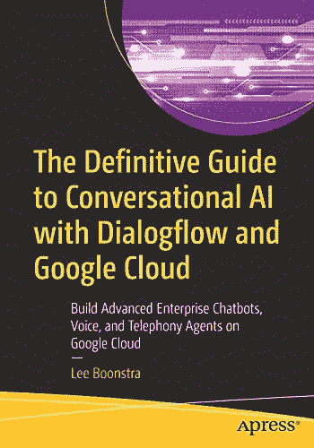

# 我写了一本书！对话流和谷歌云对话式人工智能权威指南

> 原文：<https://medium.com/google-cloud/i-wrote-a-book-the-definitive-guide-to-conversational-ai-with-dialogflow-and-google-cloud-941a26991e59?source=collection_archive---------2----------------------->

在我写了我的第一本书(手把手的 Sencha Touch 2——O ' Reilly)之后，人们总是问我是否会再写一本书。尤其是，当我开始获得对话式人工智能的专业知识时。我从没说过“永远不会”，但我知道这可能会占用我很多时间。快进到 2020 年 2 月，整个世界看起来大不相同，由于新冠肺炎，我不得不取消所有的旅行。突然，我有了很多额外的时间，写一本关于聊天机器人的书的计划变成了现实！所以我开始写…

市场上没有多少关于技术从业者的对话式人工智能的书籍，我想特别为企业用户写这篇文章。因此，UX 的设计师/语言学家、网络/对话机器人工程师、聊天机器人建筑师，还有从事复杂对话项目的后端开发人员、项目经理和业务决策者。远远超出了“hello world examples”，因为这些是我在日常生活中看到的真实世界的用例，同时作为一名开发者倡导者和应用人工智能工程师，专注于对话式人工智能。

今天，我很兴奋地向大家宣布我的书:

**[Apress](https://www.apress.com/gp/book/9781484270134)/[Springer](https://www.springer.com/gp/book/9781484270134)本周发布了对话式人工智能与谷歌云** *(在谷歌云上构建高级企业聊天机器人、语音和电话代理)*！

ISBN 978–1–4842–7014–1 和 ISBN 978–1–4842–7013–4

这本书涵盖了谷歌云和谷歌的所有对话式人工智能技术。比如， **Dialogflow Essentials** ， **Dialogflow CX** ，**谷歌助手**和**联络中心 AI** 。但它也涵盖了谷歌云技术，如用于高级聊天机器人分析的 **BigQuery** ，如何构建自己与**云运行**、 **GKE** 、**计算引擎**或**云功能**的集成通道。并且涵盖了其他机器学习 API 如**自然语言处理**。

阅读本书时，读者将学到以下内容:

*   什么是 Dialogflow，Dialogflow Essentials，Dialogflow CX，以及如何使用机器学习
*   如何创建供个人和企业使用的 Dialogflow 项目
*   学习 Dialogflow 基本概念，如意图、实体、自定义实体、系统实体、复合以及如何跟踪上下文
*   如何使用预建代理、聊天模块和常见问题知识库快速构建机器人
*   Dialogflow 如何提供现成的代理审查
*   如何为网络和社交媒体渠道部署文本对话用户界面
*   如何为语音助手(Google Assistant)和电话网关/带有联络中心人工智能的联络中心构建语音代理
*   如何构建多语言聊天机器人
*   了解如何协调许多(子)聊天机器人，以建立一个更大的对话平台
*   如何使用聊天机器人分析以及如何测试您的 Dialogflow 代理(机器学习模型)的质量
*   了解 Dialogflow CX 如何适应、Dialogflow CX 有何不同以及 Dialogflow CX 新概念

这些主题更面向开发人员和工程师，包含更高级的用例:

*   了解如何创建以各种方式连接到 web 服务的实施
*   如何从本地/开发机器运行后端代码
*   如何保护你的聊天机器人
*   如何通过创建自己的定制集成，将聊天机器人集成到网站( **Angular** )或本地移动( **Flutter** )应用程序中
*   如何创建全渠道 bot 平台架构
*   如何在定制集成中创建丰富的响应
*   如何在物联网语音应用中流式传输您的语音 ui
*   使用 BigQuery 进行高级聊天机器人分析

它包含处理复杂用例的提示、技巧和代码示例。这是一本我经常用来快速查找的书，比如:*“哦，我该如何再次用 Dialogflow CX 创建一个谷歌助手操作呢？*”，*“如何测试底层 bot 模型才能获得最佳性能？”*、*“mTLS 如何保护我的机器人实现？”*。换句话说，这是我为对话聊天机器人&语音社区写的一本书！

你们中的一些人可能知道，我在怀孕期间写了这本书，当时世界陷入了封锁。回到原点，我选择了一个非盈利组织来捐赠我所有的版税，那就是荷兰的[“Meer Dan gew enst”](https://www.meerdangewenst.nl/about-mdg/)基金会，一个帮助 LGBTQ+社区的人成为父母的非政府组织。他们通过提高意识(与媒体、政治家和企业接触)、教育和联系来做到这一点。作为一名 LGBTQ+家长，这个慈善机构是我的最爱，因为我认为每个人都应该有成为家长的愿望。

你可以在亚马逊上找到我的平装本和电子书。

*如果你对这本书有任何评论或反馈，请随时在社交媒体上与我联系。你喜欢我的作品吗？我喜欢收到书评。作为一名开发者倡导者，我喜欢谈论任何与聊天和语音机器人技术相关的话题。我可以应邀去演讲。*