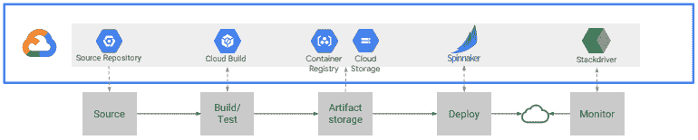
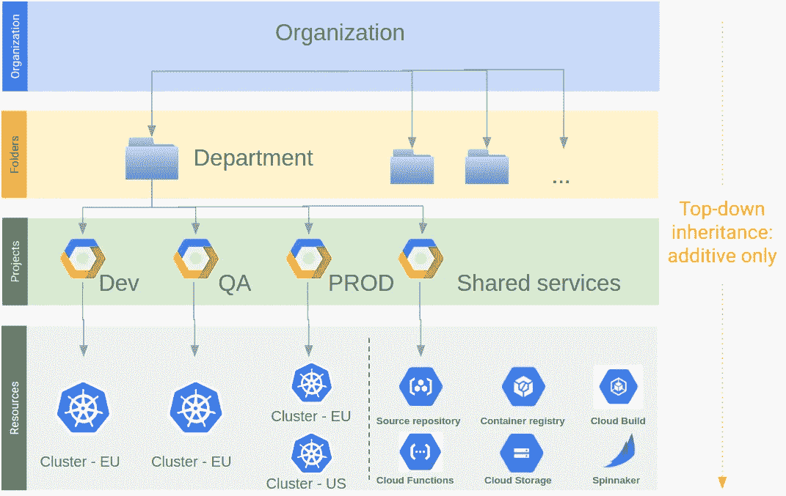
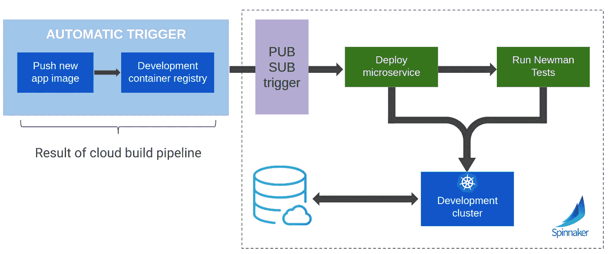
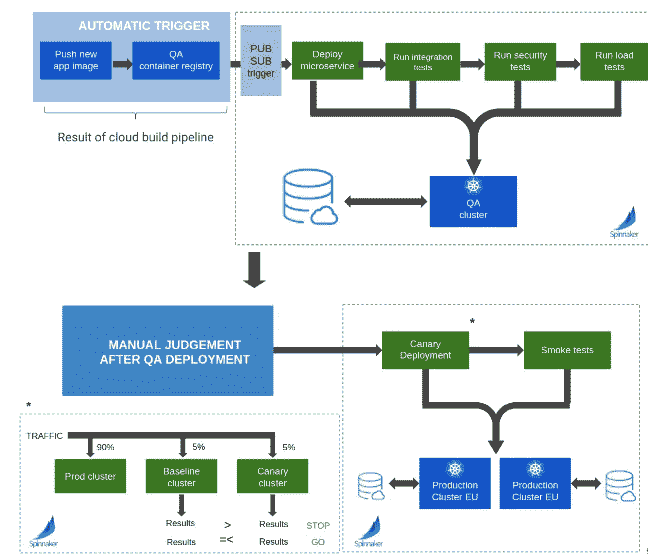
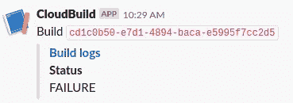

# IaaS/CI /CD 与 GCP 的 Kubernetes

> 原文：<https://medium.com/google-cloud/iaas-ci-cd-with-kubernetes-on-gcp-694905653382?source=collection_archive---------3----------------------->

我们最近在一个客户那里完成了一个项目，我们使用“谷歌部署管理器”、“谷歌云构建”和“Spinnaker”修改了它的整个 devops。虽然这是以 Kubernetes engine 为中心的(如果您希望为您的应用程序充分利用云的优势，这是一种方法)，但该框架可以用于在 VM 上部署 monolith 应用程序，在 app engine 上部署云功能和应用程序。外面有许多工具用于执行 devops 然而，我们确信本文中描述的 GCP 和开源工具的组合是最有效和用户友好的。

让我们首先对所使用的架构有一个高度的概述，一个架构图胜过千言万语。

这一切都从代码库开始，拥有一个全面的 git 策略是先决条件之一。GCP 现在有了自己的版本控制模块，叫做源代码库，它可以即时从 Bitbuckets 和 Github 镜像你的代码。在我们的例子中，客户端的代码在 Bitbucket 上，我们镜像到源存储库。将您的代码库放在 GCP 上可以更容易地与云构建集成，也可以在 Kubernetes 上进行调试。除此之外，它还有一个不错的免费层。

如前所述，在实现 CI/CD 管道之前，您需要有一个 git 策略。外面有大量的文献，对于这个项目，我们选择了[成功的 git 分支模型](https://nvie.com/posts/a-successful-git-branching-model/)和 [git-flow 扩展](https://www.atlassian.com/git/tutorials/comparing-workflows/gitflow-workflow)。接下来是关于你的团队应该如何合作的争论(他们需要改变基础、快速合并、挤压等等)。).这真的取决于你的团队的规模以及他们过去是如何工作的。我们的方法是:

*   一个特征-一个分支
*   特征完成→挤压所有提交
*   拉取请求
*   管理员将该功能合并到开发分支

有了基于源代码库的代码库和定义好的 git 策略，您现在可以启动 CI/CD 管道，让您的开发人员只关注编码，并能够在几分钟内测试和部署他们的应用程序。所使用的工具也促进了您的 devops 团队的生活，因为他们的工作从手动步骤、调试和热修复的混合变成了监控和确保不同工具顺利工作的工作。

> 这个框架将您的开发人员从无附加值的任务中解放出来，并赋予您的 devops 团队更多有趣和战略性的任务。

在深入研究 CI 和 CD 工具之前，让我们先讨论一下项目架构，因为这对于客户来说是一件很有附加值的事情。我们选择将不同的环境分成不同的项目，并为所有共享服务增加一个项目。后一个项目与所有 devops 有关，并将托管容器映像、云构建触发器、K8s 清单、带有 spinnaker 的集群等。这种项目分离和 devops 专用项目允许有非常精细的访问策略，并使每个项目的目的更加清晰。没有什么是混合的，其背后的理念是“一个项目，一个目的”。

现在，让我们关注云构建的持续集成部分。它的唯一目标是

*   在 Google 容器注册表上烘焙一个容器图像
*   在谷歌云存储上复制一次新的 K8s 清单文件

一旦在代码库上完成了特定的推送，这两个动作就会发生，所述推送分别包括应用或 K8s 清单文件中的变化(云构建将通过不同的触发器来监听这些变化)。云构建需要一系列步骤，每个步骤都定义了要完成的操作。遇到的主要步骤是获取代码库、运行单元测试和构建映像。基本上，任何操作都可以通过云构建来执行，因为每一步都是一个独立的容器应用程序。一旦 cloud build 完成了所有步骤，GCR 上的新映像或 GCS 上的新 K8s 文件将向 Pub/Sub 发送一个通知，将 Spinnaker 作为订阅者。

> GCP 面向消息的中间件 Pub/Sub 是 CI 和 CD 部分之间的通信支柱。

2 现在让我们转到部署部分。这是通过部署在共享服务项目集群上的开源软件 Spinnaker 来完成的。部署完成后，您可以轻松地将 UI 配置为可以在公共域上使用 oauth2.0 访问(参见[教程](https://www.spinnaker.io/setup/quickstart/halyard-gke-public/))。一旦您通过了一些配置设置，Spinnaker 用户友好的 UI 使得创建管道和在您不同的 GCP 项目上部署变得非常简单。已开发的两条管道如下:

*   **开发管道**在开发项目的集群上部署您的映像。它还将运行一些集成测试，如果任何测试失败，部署将停止并恢复到以前的映像。

*   **Prod pipeline** 首先在 QA 项目集群上部署的映像上运行大量测试。然后，团队可以手动测试 QA 项目上的应用程序，一旦他们满意，他们可以在 Spinnaker 上手动批准，这将触发 prod 项目集群上的 canary 部署。canary 部署是一种高级部署，它会将 90%的流量发送到您的早期版本，将 5%的流量发送到具有早期版本的全新基准集群，最后将剩余的 5%发送到具有新版本的集群(称为 canary 集群)。创建一个全新的基线集群可以确保所产生的指标不受长时间运行的流程的影响。金丝雀分析然后通过 Kayenta 库分析基线集群和金丝雀集群之间的大量指标。如果结果令人满意，100%的流量被发送到新版本。否则整个流量又回到之前的版本。

*   **特性管道**:来自 K8s 开发者的一个主要抱怨是难以快速测试一个特性。一种解决方案是为推送到特性分支的代码创建 CI/CD 管道。这将在特定的 GCR 子文件夹中烘焙一个映像，然后这个 spinnaker 管道将在 dev 项目的集群上部署该映像，其名称空间为 feature 分支。然后，开发人员可以在开发环境中快速测试他们的更改，而不会影响将在默认名称空间上部署的普通应用程序。

**等等，IaaS 在这一切中处于什么位置，我为什么需要它？**

通过 Google Deployment Manager，IaaS 是一种实践，它通过使用代码来描述基础设施的配置，从而使基础设施的配置可复制、可伸缩且易于审查。基础设施即代码源于对基础设施也是“软件”的认识，对于公共云来说尤其如此。

> 基本上，它会翻译您在 GCP UI 中所做的任何 UI 操作(创建集群、设置 IAM 策略、创建 bucket 等)。)转化成代码。

一旦您的基础设施发生变化，您只需在代码中进行更改，然后通过 gcloud 命令进行更新。

本文档描述了各种工具，如果没有一个通知工具将它们集成在一起，事情会变得很混乱。这就是 Slack 的用武之地，它与本文中提到的所有工具进行了静态和动态集成。从 git 集成通知您可以动态接受的拉取请求，到 Spinnaker 手动判断，您真的可以使用 slack 应用程序和 Google 云功能开发任何类型的通知。

需要帮助您开发 K8s 应用程序的这种改进的 CI/CD 管道吗？我们经验丰富的开发人员将指导您完成所有不同的步骤，咨询可以从简单的架构设计和技巧到完全定制的实施。请随时通过 niels@fourcast.io 或 charles.verleyen@fourcast.io 联系我们。niels 和 charles 是 K8s four cast 和 GCP devo PS tech 的主要开发人员。

请登录 [www.fourcast.io](http://www.fourcast.io) 访问我们