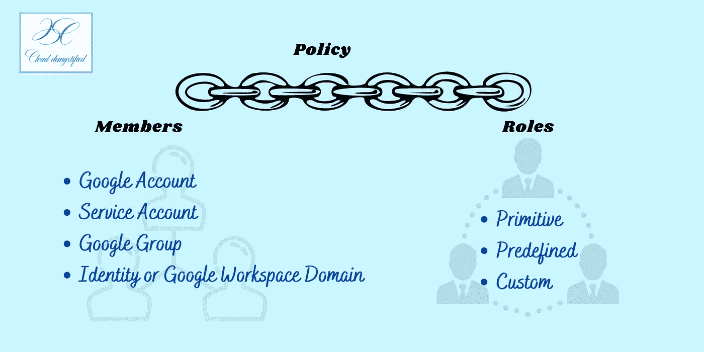
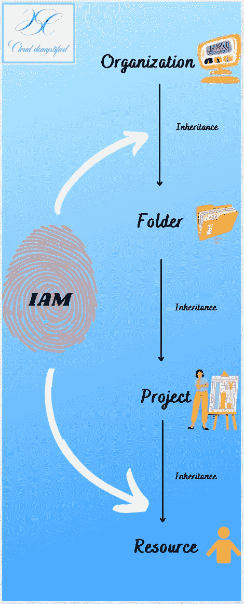
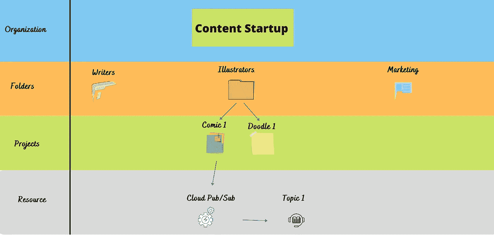
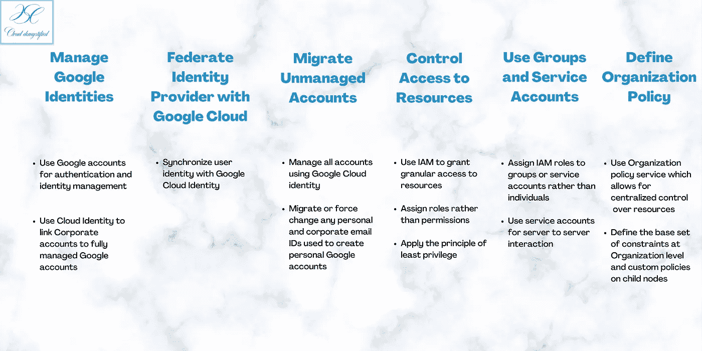

# 我不再神秘

> 原文：<https://medium.com/google-cloud/iam-demystified-e5177ed40dfe?source=collection_archive---------0----------------------->

# 什么是 IAM(身份访问管理)？

IAM 是由云提供商定义的策略和流程框架，旨在确保用户拥有适当的权限来访问云上的资源、应用和数据。这不仅可以保护数据以防止不必要的威胁，还可以确保所有用户都有适当的访问权限来完成他们的工作。

谷歌云平台(GCP)上的身份访问管理(IAM)有三个主要部分。它们是成员、角色和策略。

# 成员

成员是需要访问谷歌云平台上的资源、应用和/或数据的用户。成员可以是最终用户的 Google 帐户、应用程序和虚拟机的服务帐户、云身份域或 Google 组。每个成员都有一个身份，这是 IAM 的“谁”部分。该身份可以是 Google 帐户的电子邮件地址，也可以是与工作区或云身份域相关联的域名。

# 作用

角色只是授予成员访问云上的资源、应用程序或数据的权限的集合。每当我们向成员分配一个角色时，他们就会获得与该角色相关的所有权限。例如，当您将 Google 文档的编辑者角色分配给某人时，他们将获得编辑该文档的权限。谷歌云平台有三类角色。原始、预定义和自定义角色。

## 原始角色

原始角色由所有者、编辑者和查看者这三个基本角色组成。由于这些角色非常宽泛，并且不是细粒度的，因此 Google Cloud Platform 提出了预定义和自定义的角色，以实现更好的访问控制。

## 预定义角色

预定义角色是 Google 基于常见用例定义的更细粒度的角色。这些角色为成员提供特定的服务访问权限，完全由 Google Cloud 管理。例如，***roles/appengine . App creator****赋予成员在 App Engine 上创建应用的权限。这比向他们提供对整个文件夹的编辑访问权限更细粒度。Google 有一个大的[存储库](https://cloud.google.com/iam/docs/understanding-roles)，包含所有预定义的角色及其描述和权限。*

## *自定义角色*

*自定义角色是由用户指定或创建的细粒度角色，为 Google 云平台上的成员提供特定的访问权限。这些角色只有在 Google 没有预先定义的情况下才会被创建，并由用户管理。自定义角色以***service . resource . verb*的格式定义权限。**例如，***Compute . instances . delete***让成员删除计算引擎上的实例。*

*自定义角色包括一个启动阶段，需要由用户来管理。这些阶段是 ALPHA、BETA 和 GA，让用户跟踪角色何时可以启动和使用。保持这些角色的更新是用户的责任，因为它们不是由 Google Cloud 管理的。*

# *政策*

*策略将一个或多个成员绑定到一个角色，并定义谁在 Google Cloud 上拥有何种类型的访问权限。例如，您可以为属于公司人力资源和财务部门的所有用户设置删除发布/订阅主题的策略。下面的信息图展示了这三个部分是如何联系在一起的。*

**

*IAM 策略、成员和角色*

# *资源层次结构*

*谷歌云平台上的所有资源都是分层组织的。它们被分成 4 个部分-组织、文件夹、项目和资源。例如，一家使用 Google Cloud 的公司是顶层节点，后面是文件夹、项目和资源。每个资源只有一个父资源，即计算引擎、应用引擎等。并且只能有一个项目作为父项目。*

*子节点继承其父节点的策略，即，为父节点设置的策略由子节点继承。例如，为特定文件夹设置的策略由该文件夹下的项目继承。因此，默认情况下，在“组织”节点设置的策略会被该组织下的所有文件夹、项目和资源继承。*

**

*资源层次结构*

*我们用一个例子来理解这个。随着内容写作创业公司的成长，它将需要一个作家、插图画家等团队。，他们将依次获得项目工作-托管在谷歌云上运行的某些应用程序或系统。*

**

*组织、文件夹、项目和资源*

*   *在这里，初创公司是组织，各种团队(作家、插图画家、营销)被分组在文件夹下*
*   *每个团队都有不同的项目要做(例如漫画 1、涂鸦等)*
*   *这些项目运行在一个资源上，为了这个例子的目的，我们将在 Cloud Pub/Sub 上运行 Comic1。*
*   *分配给启动的任何策略，如查看特定虚拟机上所有文件的能力，都会自动分配给所有文件夹、项目和资源。*
*   *类似地，分配给插画团队的任何策略由项目 Comic1 和 Doodle1 继承，然后由 Cloud Pub/Sub 上的 Topic 1 继承。*
*   *如果我们为 Comic1 或 Doodle1 指定不同的策略，该策略将覆盖这些项目从 Illustrator 文件夹继承的策略。例如，如果我们想让项目 Comic1 中的成员仅担任特定虚拟机的查看者角色，那么我们为组织设置什么策略并不重要。Comic1 的成员仅具有查看者权限，并将覆盖在父节点或组织节点设置的任何策略。*

# *最佳实践*

*下面的信息图强调了 Google Cloud 为身份访问管理推荐的一些最佳实践*

**

# *想了解更多？*

*   ***谷歌云 IAM 文档**-【https://cloud.google.com/iam/docs/overview *
*   *https://www.qwiklabs.com/focuses/551?parent=catalog 上**云 IAM***
*   ***身份和访问管理(Coursera)**-https://www . Coursera . org/lecture/GCP-fundamentals/Identity-and-Access-Management-iam-1 zsac*