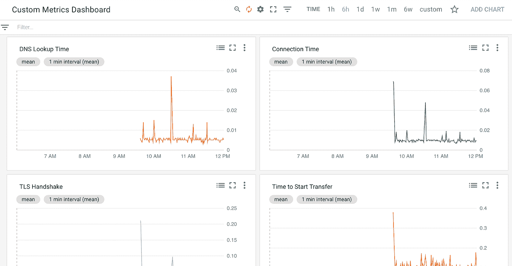

# 识别移动客户端连接失败的原因

> 原文：<https://medium.com/google-cloud/identification-of-sources-of-mobile-client-connection-failure-fec9dad8dd13?source=collection_archive---------1----------------------->

# 目标

这篇文章解释了如何为移动应用程序的开发者找到连接失败的原因，这些移动应用程序有一个提供内容的服务器后端。详细关注这一点对于减少影响用户体验的错误是必要的。

# 摘要

描述了更好地理解客户端错误的想法，包括收集客户端数据、理解负载和往返时间、分布式跟踪和探测。用于检测不同错误条件的 HTTP 探针的示例代码位于 Github gist 中，它已被用于创建下面讨论的原型 Stackdriver dashboard。

# 背景

一些应用程序会看到连接到服务器的移动客户端的客户端失败率，这很难解释。服务器日志会显示错误，但是您可能会发现客户端遇到的错误比服务器的错误率要高。这导致人们相信差异可能是由网络中的某个原因造成的。

可能是试图下载的媒体大小的分布以及安装了该应用的移动设备的群体中的互联网速度的变化使得没有足够的时间来为一定比例的客户端设备下载媒体。另一个原因是，移动应用程序中的请求可能会被取消。例如，用户动作触发了下载，但是当媒体需要时间来下载并且移动到另一个屏幕时，用户失去了耐心。其他潜在的错误原因包括国家或提供商阻止内容，以及用户因位置变化而失去连接。

# 主意

下面列出了一些深入了解这一点的想法。

## 1 错误分析

您应该收集用户遇到的不同错误类别的数据，例如，在 W3C 网络错误日志建议中关于[错误报告](https://www.w3.org/TR/network-error-logging/#reporting)的章节中列出的。这些包括

1.  无法解析 DNS 名称
2.  无法建立 TCP 连接
3.  无法建立安全的 TLS 隧道
4.  由于 TLS 协议错误，无法获取资源
5.  由于 HTTP 协议错误，无法获取资源
6.  由于套接字超时或错误，无法获取资源
7.  由于重定向循环，无法获取资源

错误类型可以按功能或有效负载大小(用于上传)、后端处理程序、设备、地理、协议和互联网提供商进行细分。此外，如果来源是重试或用户取消应该记录的操作。该细分可以洞察地理区域、访问能力差的提供商以及导致错误的用户操作。

收集这些数据可能需要一些额外的日志记录和从客户端收集日志记录错误。Android[HttpURLConnection](https://developer.android.com/reference/java/net/HttpURLConnection.html)对象将返回 HTTP 响应代码， [getResponseMessage()](https://developer.android.com/reference/java/net/HttpURLConnection.html#getResponseMessage()) 获取响应消息，如果连接失败，但服务器仍然发送了有用的数据， [getErrorStream()](https://developer.android.com/reference/java/net/HttpURLConnection.html#getErrorStream()) 方法将返回错误流。如果只是在一个 [URL.openConnection()](https://developer.android.com/reference/java/net/URL.html#openConnection()) 调用中捕获一个异常，那么应该记录 IOException 的特定子类以及消息。

这种方法的一个问题是，Java 没有给出上述 W3C 定义的错误的可见性。但是，其他语言可以提供这些。详见下文。

## 2 往返时间分析

由于慢速边缘网络导致的超时是下载媒体时最常见的问题。这个问题的研究人员大多着眼于往返时间(RTT)。使用 RTT 的原因是应用程序的行为不同。HTTP 请求有不同的负载大小，网页有许多不同的元素必须下载，移动应用程序不同于 web 应用程序。测量 RTT 的方法在 [RFC 2988](https://tools.ietf.org/html/rfc2988) 中描述。Google Cloud Load Balancer (GCLB)服务测量 RTT，并且可以使用[自定义头](https://cloud.google.com/compute/docs/load-balancing/http/backend-service?utm_source=release-notes&utm_medium=email&utm_campaign=2018-april-release-notes-2-en#user-defined-request-headers)为带有 client_rtt_msec HTTP 头的特定请求检索它。

该数据还可以根据有效载荷大小、地理位置和误差进行分解，以寻找在高 RTT 区域中是否存在高误差率。

在不同条件下，可以在 RTT、有效载荷大小和 HTTP 下载时间之间建立关联。例如， [TCP 吞吐量计算器](https://www.switch.ch/network/tools/tcp_throughput/)对稳定吞吐量进行计算。这比 HTTP 下载简单，HTTP 下载由于初始窗口大小和客户端条件的变化(如现有连接是否存在)而变得复杂。因此，稳定下载条件下的吞吐量和下载较小文件的吞吐量会有所不同

RTT 可以与离服务器的地理距离大致相关。Landa (2013b)和其他人讨论了 RTT 的测量、影响它的主要因素，以及他们的数据集的统计建模，该数据集由超过 2 亿个 RTT 样本组成，在他们的研究中有 1900 万个测量值*测量互联网地理和 RTT* ( [链接](http://ieeexplore.ieee.org/stamp/stamp.jsp?arnumber=6614151))。实际数据在 Landa (2013a) *互联网往返时间的大规模地理*中讨论。他们有一些关于 RTT 的重要发现:

1.  RTT 永远比光速慢。在 10，000 km 的路由距离处，中值 RTT 大约为 200 毫秒，但是变化到大约 1，000 毫秒
2.  由于可用的物理连接，路由距离通常比源和目的地之间的大圆距离更长，这在一些偏远地区可能会被夸大，如大洋洲和非洲。
3.  观察到一些不能简单地用地理上的偏远来解释的极端过度布线距离，并导致非常大的 RTT。例如，作者发现东欧/西欧和亚太地区之间的一些交通通过美国进行路由，这意味着路由距离 Dz 为 19，000 km。

## 3 个端到端跟踪采样和探针

使用像 [OpenCensus](https://opencensus.io/index.html) 、 [Jaeger](https://www.jaegertracing.io/docs/) 或 [Zipkin](https://zipkin.io/) 这样的工具来检测移动客户端是一种选择。或者，可以部署从不同云区域或办公室工作站中的虚拟机执行的固定探测器。

httpstat 是包装 curl 的 Python 工具。以下示例显示了 DNS 查找、TCP 连接、TLS 握手、服务器处理和内容传输时间的集合。

```
$ python httpstat.py [https://google.com](https://google.com)
…
DNS Lookup TCP Connection TLS Handshake Server Processing Content Transfer
[ 27ms | 63ms | 165ms | 75ms | 0ms ]
| namelookup:27ms 
|       connect:90ms 
|              pretransfer:255ms
|                       starttransfer:330ms
total:330ms
```

基于上面提到的[要点](https://gist.github.com/alexamies/0d7b393739114ceadfea85257b72fbcd)编写了一个以类似方式包装 curl 的 Python 探针的原型，并使用下面显示的 [Stackdriver](https://cloud.google.com/stackdriver/) 为自定义仪表板收集数据。



Go lang 的 [httptrace](https://golang.org/pkg/net/http/httptrace/) 包中包含了低级别的网络跟踪点，包括 ConnectStart、GotConn、DNSStart、DNSDone、TLSHandshakeStart、TLSHandshakeDone、GotFirstResponseByte 和 WroteRequest ( [blog](https://blog.golang.org/http-tracing) )。

OpenCensus 是一个 OSS 工具，因此应该能够在多个云中使用，并且支持 Java、C++和 Go，因此可以添加到 Android 和 iOS 客户端以及多个后端项目中。OpenCensus 可以执行[分布式跟踪](https://opencensus.io/trace.html)来连接客户端和后端跟踪数据，并且可以对其进行采样，因此对整体性能的影响可以忽略不计。收集的踪迹将由通过唯一踪迹 id 连接的嵌套范围组成。数据可以导出到 Stackdriver 和其他可视化工具。

## 4 面向最终用户的网络故障排除帮助面板

一个高层次的想法是在移动应用程序中有一个故障排除屏幕，当出现网络错误时会显示出来。这将收集有关正在使用的 DNS 服务器、ping、正在连接的 IP 的主机名查找、跟踪路由、互联网速度的统计数据，并在以后连接可用时将数据保存回服务器。这种工具的缺点是，用户可能位于他们已经知道其互联网连接很差的地理位置，而专家小组将确认这一点。

# 资源

1.  [监视 HTTP(S)负载平衡器的度量](https://cloud.google.com/compute/docs/load-balancing/http/#monitoring_metrics_for_https_load_balancers) (GCP 文档)
2.  [支持负载平衡的指标](https://cloud.google.com/monitoring/api/metrics_gcp) (GCP 文档)
3.  [网络错误记录](https://www.w3.org/TR/network-error-logging/) (W3c 工作组)
4.  兰达等人，2013 年 a。[互联网往返时代的大规模地理](http://ieeexplore.ieee.org/document/6663531/)，(IEEE 数字图书馆)
5.  兰达等人，2013 年 b。[测量互联网地理和 RTT 之间的关系](http://ieeexplore.ieee.org/document/6614151/) (IEEE 数字图书馆)
6.  伦纳德等人，2009 年。 [Turbo King:大规模互联网延迟测量框架](http://ieeexplore.ieee.org/document/4509610/)
7.  [公开普查](https://opencensus.io) (OSS 项目)
8.  [领域可靠性监控](https://docs.google.com/document/d/14U0YA4dlzNYciq2ke0StEMjomdBUN6ocSt1kN03HJ0s/pub)(发表于 chromium.org Chrome 项目)
9.  [Istio 遥测](https://istio.io/docs/tasks/telemetry/) (Istio 现场)
10.  负载测试工具(Istio Github 网站)
11.  [Fing](https://itunes.apple.com/gb/app/fing-network-scanner/id430921107?mt=8) (带第三方 ping 的手机应用)
12.  [Android speedtest](https://github.com/liquidlabs/android-speedtest-mapper) (非谷歌 Github 项目)