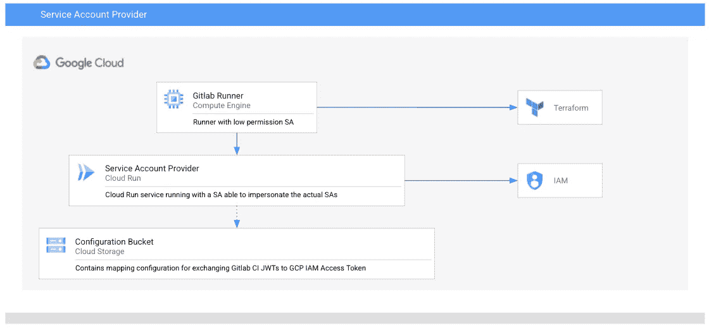

# Gitlab CI 和 Google Cloud APIs 的身份联盟

> 原文：<https://medium.com/google-cloud/identity-federation-for-gitlab-ci-and-google-cloud-apis-33aa4ec6989e?source=collection_archive---------1----------------------->


照片由阿古斯·迪特里希在 [Unsplash](https://unsplash.com/s/photos/passport?utm_source=unsplash&utm_medium=referral&utm_content=creditCopyText) 上拍摄

从您的持续集成(CI)管道中安全地使用 Google Cloud APIs 可能是一个挑战。尤其是当您在 CI 环境中进行基础设施即代码(IAC)时。[Workload Identity Federation](https://cloud.google.com/iam/docs/workload-identity-federation)是一个很棒的解决方案，它支持大多数 OpenID 连接提供商。工作负载身份联合支持应用程序替换服务帐户密钥&使用临时凭证访问 GCP 资源

遗憾的是，在 Gitlab 的 OpenID 连接提供程序的实现中有一个小的差距。颁发者缺少 URL 的模式部分(Gitlab 问题跟踪器中的[标签](https://gitlab.com/gitlab-org/gitlab/-/issues/335186))。Workload Identity Federation 目前也不支持不能从互联网访问的私有 Gitlab 实例。

许多团队试图用不同的方法来解决这个问题。我们见过的最常见的设置是导出服务帐户密钥并将它们存储在 Gitlab 中。你应该尽量避免哪个。

一些 Gitlab 用户开始为每个 repo/team 设置一个基于 GCE VM 的 runner 来分离权限。但是这仍然会导致分支机构的意外部署，并且会导致巨大的成本。

我们观察到的另一种方法，也是使用跑步者的模拟。这通常是通过给予 VM 的服务运行者模拟其他服务帐户的许可来实现的。然后从管道中选择所需的服务帐户。与之前的方法相比，这是一种优化，但仍然不是最佳的。



Sapro 架构的高级概述

[Alex Meissner](https://www.linkedin.com/in/alexmeissner/) 和我决定创建一个简单的解决方案，名为 [**Sapro**](https://github.com/GoogleCloudPlatform/professional-services/tree/main/tools/service-account-provider) (服务帐户提供商的简称)，它为您提供了一个端点，用于根据服务帐户的 IAM 访问令牌交换 Gitlab CI JWTs。Sapro 是一个简单的基于 Golang 的服务，你可以在 Google Cloud Run 上运行。您可以使用存储在 Google 云存储中的 YAML 文件在存储库和分支级别上配置服务帐户的使用。以下是 Sapro 的配置示例:

```
# Configure the issuers and the JWKS that Sapro should accept, the JWKS can either be resolved via HTTP or from the containers filesystem
issuers:
  - name: gitlab.com    
    jwks_url: "https://gitlab.com/-/jwks" # The pipelines and which service accounts they should be able to access 
pipelines:
  - name: "group/repo"
    branches:
      # you can use * to wildcard all branches
      - ref: * 
        service_accounts:
           - desiredsa@project_id.iam.gserviceaccount.com 
```

当然，我们的方法有一些缺点，但我们认为它产生的价值大于缺点。使用 Sapro，您可以使用一组共享的构建运行器节点，这些节点可以用最少的权限运行。这允许您避免空闲的运行器节点，从而提高您的成本效率，并减少您的平均构建等待时间。理想情况下，您可以将 Sapro 与基于 Docker 或 Kubernetes 的 runners 结合起来，以利用动态集群伸缩来获得优势，这通常会增加构建的可重复性。

[repo](https://github.com/GoogleCloudPlatform/professional-services/tree/main/tools/service-account-provider) 包含了一个使用 Terraform 设置的例子，但是基本上你可以使用 *curl* 来获取一个访问令牌，以此来交换一个作业的 JWT 令牌。

```
curl -H "Gitlab-Token: ${CI_JOB_JWT}" "https://sapro.cloudrun/access?sa=${SERVICE_ACCOUNT}"
```

Sapro 将检查 JWT 中引用的分支机构是否受保护，并查找回购、分支机构和服务账户是否有有效的组合。如果有，云运行服务将模拟目标服务帐户并创建访问令牌。然后，您可以使用访问令牌来部署您的基础设施，将您的 Docker 容器映像部署到工件注册表，或者持续交付到云运行和 GKE。

[](https://github.com/GoogleCloudPlatform/professional-services/tree/main/tools/service-account-provider) [## 主要的专业服务/工具/服务客户提供商…

### SAPRO 允许从有限权限环境中为服务帐户请求令牌。Gitlab CI JWT 代币…

github.com](https://github.com/GoogleCloudPlatform/professional-services/tree/main/tools/service-account-provider)