# 使用相机、物联网、机器学习和边缘计算进行资产跟踪。

> 原文：<https://medium.com/google-cloud/image-tracking-using-iot-machine-learning-and-edge-computing-8ad7e298b041?source=collection_archive---------2----------------------->

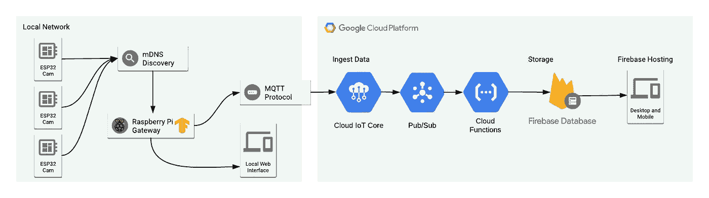

**一项涉及带摄像头的 ESP32 的实验，一个在边缘运行 Tensorflow 推论的 Raspberry Pi，充当云物联网核心网关和云上存储所有数据的无服务器层。**

在本教程结束时，看看我们完成的应用程序是什么样子的:

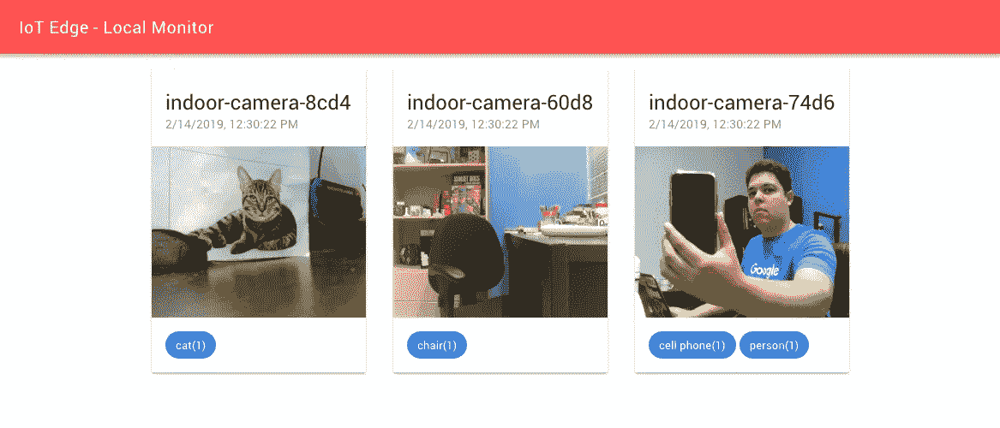

本地 web 界面

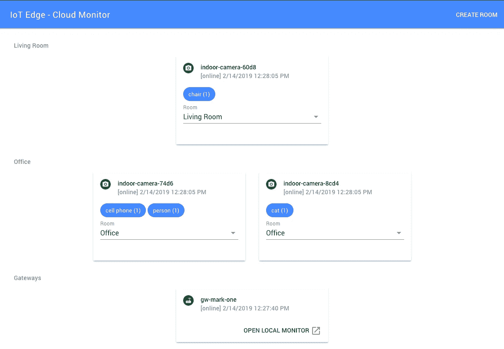

在线 Web 界面

## 什么是边缘计算？

我们从使用运行在中央数据中心的本地服务器转移到处理和存储我们所有数据的远程服务器，我们称之为云计算。迁移到云的一些原因是为了易用性、可伸缩性和降低维护我们服务的所有基础设施的成本。

但在某些情况下，我们仍然需要在事情发生的附近处理数据，这就是我们所说的边缘计算。

使用边缘计算有许多原因，这里我们可以看到一些可以应用边缘计算的场景，本文的示例将介绍其中一些场景:

*   **响应时间和访问系统非常重要，即使在互联网中断的情况下也是如此**:例如，对于家庭自动化而言，当您在室内但互联网中断时无法控制您的房子，但您仍然希望通过云在室外访问您的房子，这是没有意义的。此外，在自动驾驶汽车的背景下，事情需要在本地处理，并有即时响应时间，以可靠地工作并避免重大问题。
*   **使用更少的网络带宽**:这可以在网飞看到，他们使用分布在全球许多城市的本地缓存来降低整体网络传输成本和与视频流相关的负载，也给我们的用户带来了更好的整体体验。
*   **隐私** : 有时，数据应该只靠近用户，将最少量的数据发送到云，目的是改善用户体验，比如让用户能够远程控制。
*   **当在云中处理一切变得过于昂贵时**:如果我们可以在本地处理一些工作负载，然后只将重要数据发送到云中，我们就可以节省大量成本。在云中运行机器学习或处理图像数据可能非常昂贵，无论是在带宽方面还是在处理能力方面，所以如果我们可以在本地运行，我们可以获得很多收益并节省成本。

这里的想法是使用一些廉价的相机，它们为我们提供了一个获取图像的接口，一个本地服务器，它搜索那些本地相机并使用机器学习和计算机视觉处理它们的图像，然后将处理后的数据发送到云端，这样我们就可以通过了解图像的内容来监控相机并将其视为传感器。我们可以用它来跟踪房子或建筑物上的人，如果野生动物出现在我们的房子外面或公共场所，我们就会收到警报，甚至可以训练一个定制模型，只允许授权人员在某个地方走动。将相机用作传感器有许多使用案例。

在本教程中，我们将使用一些带有集成摄像头的 **ESP32 模块作为我们的廉价 wifi 摄像头。使用一个 **Raspberry Pi** 板作为本地服务器(你可以使用你的电脑代替)，它将使用 **Tensorflow** 和一些预制模型运行图像分类，这些模型足以对图像上的对象进行分类和检测。使用**云物联网核心**并利用新的**网关**功能，将分类数据安全地发送到云，因此本地服务器可以代表摄像头模块将数据发送到云。然后，使用 **Firebase 云函数**以基于事件的方式处理数据，这些函数基本上将数据存储在 **Firebase** 上，以便在部署在 **Firebase 主机**上的 web 界面上将数据提供给互联网连接用户。此外，本地服务器将提供本地 web 界面来监控摄像机。**

这里是我们架构的概述:


在简要介绍了边缘计算和我们的项目之后，让我们开始用固件对我们的相机进行编程，以提供图像服务。

## **使用 PlatformIO 闪烁 ESP32 摄像头模块**

现在有很多带集成摄像头的 ESP32 模块，价格从 9 美元到 15 美元不等。在这里你可以看到一些可以用于这个项目的在线销售的模型。我个人用的是 ESP32Cam 和 M5Stack Cam。

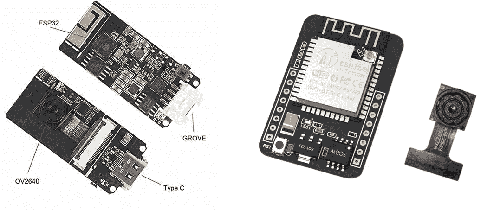

M5Stack Cam 在左侧，ESP32Cam 在右侧

在这个项目中，我使用 Espressif 模块的本地开发框架— **ESP-IDF** 为摄像机编写了固件。我之所以选择这款，是因为它能更好地访问电路板的所有功能，并且有更多如何使用 ESP32 连接摄像机的示例。通常使用 ESP-IDF 有点困难，但是使用 **PlatformIO** 会使开始使用它变得容易得多。

[](https://github.com/espressif/esp-idf) [## espressif/esp-idf

### Espressif 物联网开发框架。ESP32 的官方开发框架。- espressif/esp-idf

github.com](https://github.com/espressif/esp-idf) 

**PlatformIO** 是一套用于嵌入式设备开发的跨平台工具。它支持许多不同的物联网开发平台和框架，也支持社区制作的大量库，可以轻松用于您的项目。

我建议安装 Visual Studio 代码(VSCode) IDE 和 PlatformIO 插件来开始使用它。只需按照下面链接中的步骤操作:

[](https://platformio.org/platformio-ide) [## PlatformIO:面向物联网开发的开源生态系统

### 跨平台构建系统和库管理器。跨平台 IDE 和统一调试器。远程单元测试和…

platformio.org](https://platformio.org/platformio-ide) 

安装 PlatformIO VSCode 插件

这个项目的代码可以在下面的 Github 链接中找到。克隆或下载项目代码，在 IDE 上打开 **esp32-camera-firmware** 文件夹。

[](https://github.com/alvarowolfx/gcloud-iot-edge-tensorflow) [## alvarowolfx/g cloud-IOT-edge-tensor flow

### 使用边缘计算和计算机视觉的资产跟踪。-alvarowolfx/g cloud-IOT-edge-tensor flow

github.com](https://github.com/alvarowolfx/gcloud-iot-edge-tensorflow) 

要设置项目，必须进行一些配置更改。最重要的是 wifi 凭证，可以在 **sdkconfig.h** 文件中找到: **CONFIG_WIFI_SSID** 和 **CONFIG_WIFI_PASSWORD** 。此外，在 **platformio.ini** 文件中，有一个环境配置用于选择您正在使用的主板型号，可以是 ESP32-Cam 或 ESP32 M5Stack。

如果您使用的是 ESP32-Cam 板，您将需要一个 3.3v FTDI 模块来连接到该模块并刷新固件。只需将模块上的 **UOT** 和 **UOR** 引脚连接到 FTDI 模块上的 **RX** 和 **TX** 以及为电路板供电所需的 ping、3.3v 和 GND。然后将引脚 **IO2** 和 **IO0** 连接到 **GND** 上，使电路板进入闪存模式并能够对其进行编程。

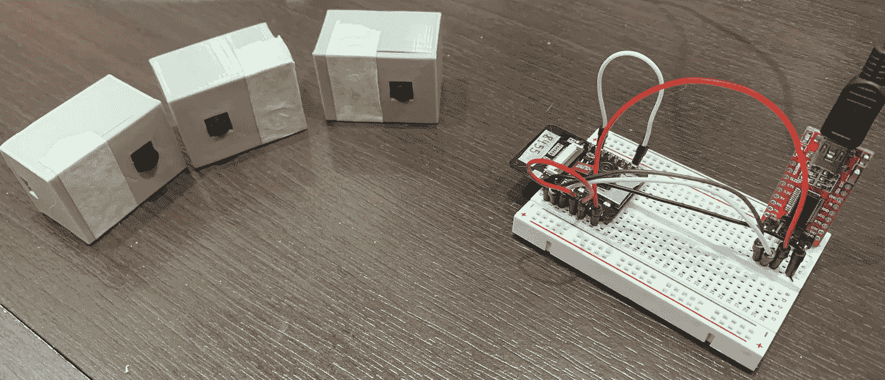

ESP32Cam 通过定制的 3d 打印外壳与 FTDI 模块和其他摄像机连接。

该固件基本上提供了一个 HTTP 端点来从该模块获取图像，并且还为网关发布了一个 mDNS 服务来查询和查找所有可用于处理图像的摄像机。设备发布一个 **_camera** 服务，使用 **_tcp** 协议，每个设备的实例名基于 ESP32 的内部芯片 ID。

要查询 mDNS 服务，我们可以在下面的命令中使用命令 **dns-sd** ，我们可以在输出中看到，它找到了两个运行我们所需服务的相机设备:

```
$ dns-sd -B _camera._tcp .
Browsing for _camera._tcp
DATE: - -Sun 16 Dec 2018 - -
19:55:04.135 …STARTING…
Timestamp A/R Flags if Domain Service Type Instance Name
19:55:04.136 Add 3 6 local. _camera._tcp. indoor-camera-ec5d
19:55:04.137 Add 2 6 local. _camera._tcp. indoor-camera-60d8
```

要查看某些图像，只需访问 **{INSTANCE_NAME}。local/jpg** 在浏览器中查看摄像机图像。以 URL 为例，根据上面的输出，这些 URL 是有效的:

```
[http://indoor-camera-ec5d.local/jpg](http://indoor-camera-ec5d.local/jpg)
[http://indoor-camera-60d8.local/jpg](http://indoor-camera-60d8.local/jpg)
```

现在，我们的摄像机节点已经启动并运行，我们可以前进到我们的网关。

## **使用谷歌云配置网关和设备**

本地服务器将充当网关，并代表传感器节点发送数据。谷歌云刚刚在云物联网核心上推出了一项新功能，使我们能够创建网关来实现这一点，因此这是学习这一点的绝佳机会。

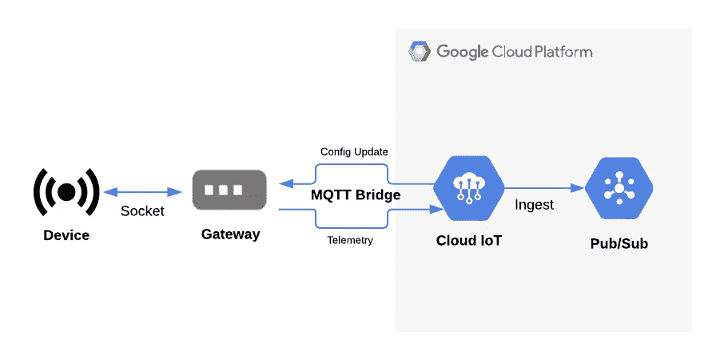

云物联网核心网关架构。

 [## 概述|谷歌云物联网核心|谷歌云

### 谷歌云提供安全、开放、智能和变革性的工具，帮助企业实现现代化，以适应当今的…

cloud.google.com](https://cloud.google.com/iot/docs/how-tos/gateways/) 

但首先，我们需要设置一些资源来开始使用云物联网核心。让我们来看一下在 Google Cloud 上完成这项工作所需的步骤:

*   启用云物联网核心和 PubSub。
*   在 PubSub 上创建遥测和状态主题，用于云物联网核心。
*   出于调试目的，创建对上述主题的订阅。
*   创建云物联网核心注册表，该注册表将包含所有受管设备。
*   为网关生成密钥对证书以连接到云。
*   使用上述密钥注册云物联网网关。

我在项目存储库上提供了一个脚本，我们可以用它来自动化所有这些步骤。这样，我们只需要像这样执行它就可以设置好一切:

```
./setup.sh PROJECT_NAME
```

运行该脚本将创建一些额外的文件， **ec_public.pem** 和 **ec_private.pem** 证书，这些文件将在以后使用。公共证书与网关相关联，并在云物联网核心上注册以验证网关连接，私有证书将由网关用于发送数据。

现在，要在云物联网核心上注册设备并绑定到网关，项目存储库中有一个脚本可用于简化此任务:

```
./register-device.sh PROJECT_NAME DEVICE_ID
```

只有注册的设备才能通过网关发送数据，因此我们需要注册所有的 ESP32 摄像机并将其与网关绑定。之后，我们可以讨论网关的实现。

## **使用 Tensorflow 和 NodeJS 的网关**

该网关基本上必须使用 mDNS 搜索本地摄像头，对图像进行分类，将数据发送到云端，并提供一个 web 接口来本地访问数据。该项目的代码也可以在 Github 的 **edge-server** 文件夹中找到。

[](https://github.com/alvarowolfx/gcloud-iot-edge-tensorflow) [## alvarowolfx/g cloud-IOT-edge-tensor flow

### 使用边缘计算和计算机视觉的资产跟踪。-alvarowolfx/g cloud-IOT-edge-tensor flow

github.com](https://github.com/alvarowolfx/gcloud-iot-edge-tensorflow) 

我选择 **NodeJS** 是因为在我看来这是入门 Tensorflow 最简单的方法之一。有一个名为 **@tensorflow/models** 的 NPM 包，它包含了许多预先制作的机器学习模型，可以用于许多不同的目的和数据类型。你可以看看网站，了解更多信息。

[](https://js.tensorflow.org/#getting-started) [## TensorFlow.js

### 一个 WebGL 加速的、基于浏览器的 JavaScript 库，用于训练和部署 ML 模型

js.tensorflow.org](https://js.tensorflow.org/#getting-started) [](https://github.com/tensorflow/tfjs-models) [## 张量流/tfjs-模型

### TensorFlow.js 的预训练模型。通过在 GitHub 上创建帐户，为 tensorflow/tfjs-models 开发做出贡献。

github.com](https://github.com/tensorflow/tfjs-models) 

这是一个与我之前描述的流程密切相关的项目中可以找到的类的分解。

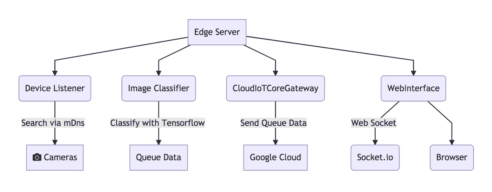

项目架构

*   **DeviceListener:** 负责使用 mDNS 搜索摄像机，维护本地网络上的设备列表，并在设备在线或离线时发出事件。
*   **ImageClassifier:** 接收图像并使用 Tensorflow 检测物体。对于这个项目，我使用了 **CocoSSD** 预训练模型，它可以在 **tfjs-models** 包中获得。
*   **CloudIoTCoreGateway** :处理与云物联网核心的所有通信和认证，并充当云物联网核心网关。
*   **WebInterface** :提供一个 web 服务器，它提供一个 web UI 和一个实时引擎，使用 [socket.io](http://socket.io) 与浏览器同步数据。
*   **EdgeServer** :使用上述所有类，从活动设备获取图像，将这些图像通过分类器，然后将数据发送到云物联网核心，并将数据提供给本地 web 接口。

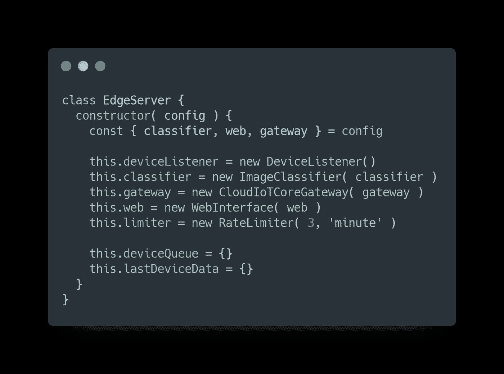

EdgeServer 初始化。

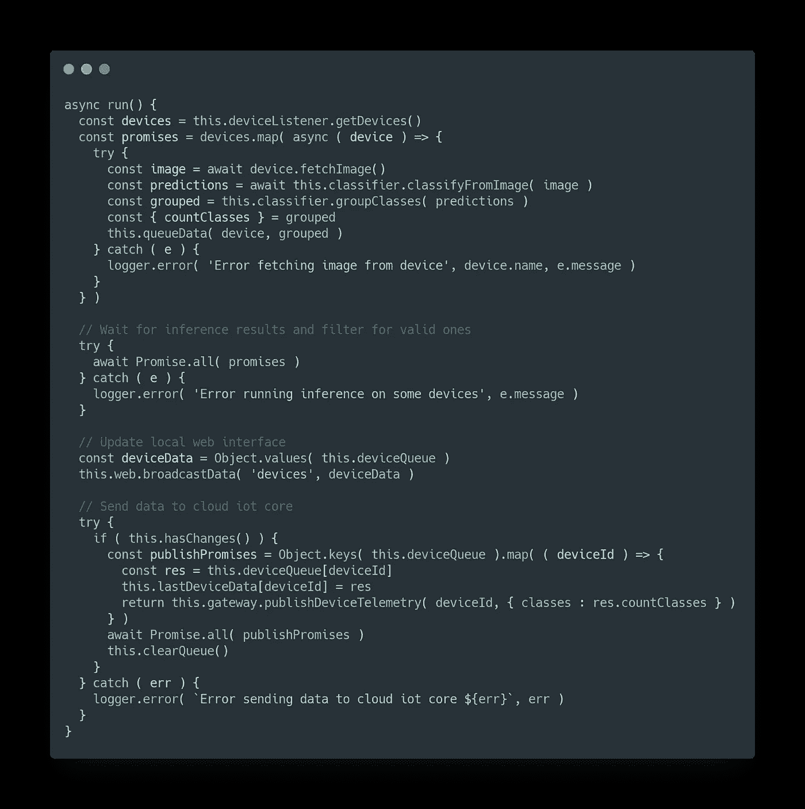

EdgeServer 主循环。

要运行服务器，只需使用 NPM 安装项目依赖项并运行服务器。要在 Linux 上运行，我们需要安装一些 mDNS 依赖项，以便能够在本地发现服务。

```
# Install libavahi to make mDNS work.
sudo apt-get install libavahi-compat-libdnssd-dev# Install dependencies and run the server
npm install
node index.js
```

现在，网关正在从摄像头收集数据，将处理后的数据发送到云，并且还拥有一个本地 web UI，默认情况下运行在端口 3000 上。在 web 界面上，您可以访问以查看摄像机图像和分类结果。下面是它工作的一个例子。


本地 web 界面

## **【额外】使用 Tensorflow.js fork 进行树莓 Pi**

如果您正在您的计算机上使用这个服务器代码，您可以跳到下一节，因为这是特定于 Raspberry Pi 的。有一个额外的步骤要在 Raspberry Pi 上运行，因为 ARM 板没有预构建的本地库可用，只有 Python 绑定可用。实际上，如果没有这个，你也可以在 Raspberry Pi 上运行，但是性能不会和使用本地库一样。因此，我必须从源代码构建 **libtensorflow** 才能进行这些优化。

我做了一个与 Raspberry Pi 兼容的 tfjs-node 的分支，并且我已经向库所有者发送了一个 Pull 请求，但是在我写这篇文章的时候，它还没有被接受。

[](https://github.com/alvarowolfx/tfjs-node) [## alvarowolfx/tfjs-节点

### TensorFlow 支持的 JavaScript 库，用于在 Node.js. - alvarowolfx/tfjs-node 上训练和部署 ML 模型

github.com](https://github.com/alvarowolfx/tfjs-node) 

如果您正在您的计算机上使用这个服务器代码，您可以跳到下一节，因为这是特定于 Raspberry Pi 的。要使用我的 fork，您必须构建库并在本地使用。为此，只需遵循以下说明:

```
# Download source
git clone [https://github.com/alvarowolfx/tfjs-node](https://github.com/alvarowolfx/tfjs-node)
cd tfjs-node
git checkout add-armv7l-binding # branch with fix# Install library dependencies
sudo npm i -g yarn yalc
npm install
npm run publish-local# Now enter the project folder
yalc add [@tensorflow/tfjs-node](http://twitter.com/tensorflow/tfjs-node)
npm install
```

就这样，你现在可以在 Raspberry Pi 上运行网关代码了。

## **使用云功能和在线 web 界面处理数据。**

下一步是通过云物联网核心处理接收到的数据，在这种情况下，我们将使用 Firebase 云功能。

Firebase Cloud Function 是一个在云中执行代码的无服务器解决方案。在这种特殊情况下，由于云物联网核心向 PubSub 主题发送数据，因此我们将部署一个对这些主题的新消息做出反应的功能，并将数据保存在 Firebase 数据库中。云函数的代码也可以在 Github 的**函数**文件夹中找到。

[](https://github.com/alvarowolfx/gcloud-iot-edge-tensorflow) [## alvarowolfx/g cloud-IOT-edge-tensor flow

### 使用边缘计算和计算机视觉的资产跟踪。-alvarowolfx/g cloud-IOT-edge-tensor flow

github.com](https://github.com/alvarowolfx/gcloud-iot-edge-tensorflow) 

信不信由你，下面是用云函数处理输入数据的所有代码。基本上，我们听取云物联网核心上设置的**遥测**和**状态**主题，然后我们更新 Firebase 上的数据。

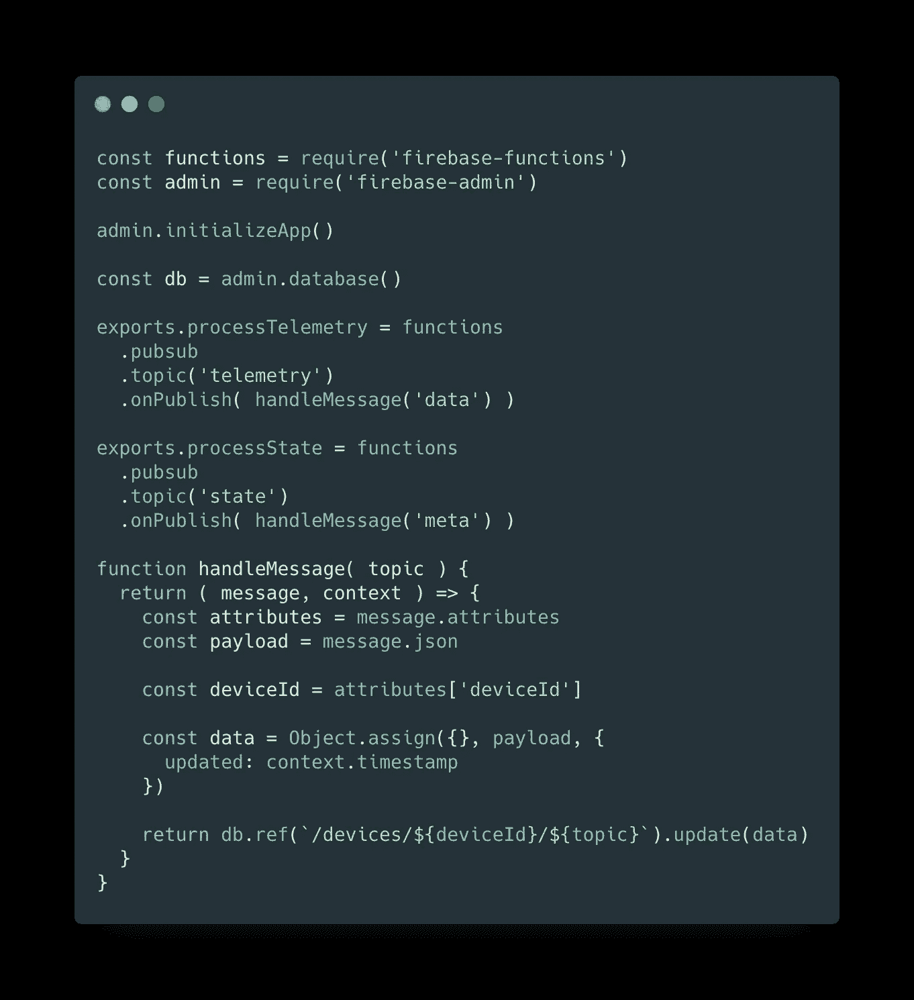

云函数的代码。

同样在我们项目的 **public** 文件夹中，你可以找到我们将要在 **Firebase Hosting** 上发布的 web 界面，并访问存储在 Firebase 中的数据。

为了部署我们的功能和 web 界面，我们需要 *Firebase 命令行工具。*为此，运行以下命令进行安装。

```
npm install -g firebase-tools
```

现在，要用我们的项目配置 firebase，部署功能和 web 界面，首先去[console.firebase.google.com](https://console.firebase.google.com/u/0/)，把你的谷歌云项目关联到 Firebase 上的一个新项目。

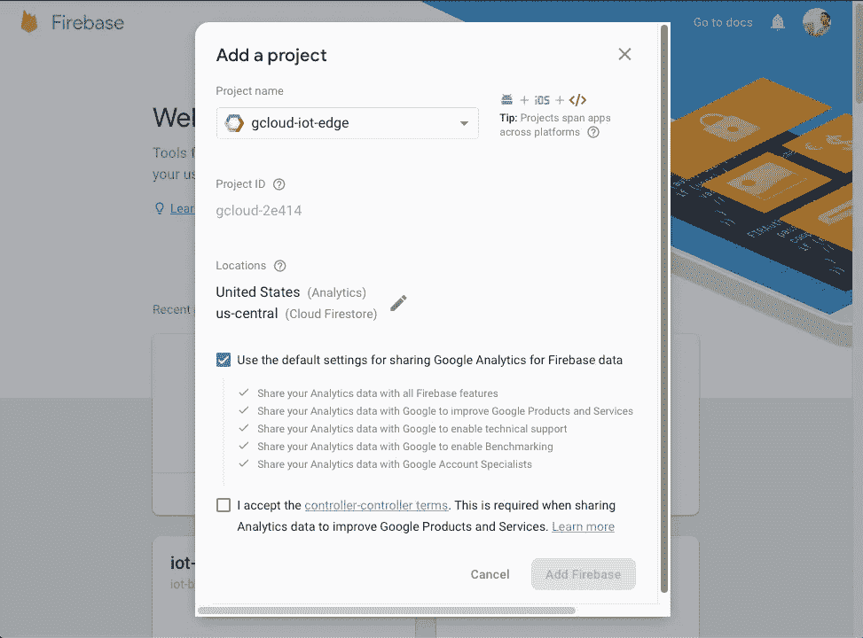

然后，在项目根文件夹中，遵循以下说明:

```
# Authenticate with Google and set up the command line tools.
firebase login# choose your firebase project name, to associate the local project 
firebase user --add# Install all the cloud functions dependencies
cd functions && npm install# Deploy our functions and webapp
firebase deploy
```

使用部署的函数，您已经设置好接收和存储网关发送的所有数据。此外，web 界面将在[https://YOUR _ PROJECT _ name . Firebase app . com 上提供，](https://YOUR_PROJECT_NAME.firebaseapp.com,)您可以访问并查看 Firebase 上的所有数据存储。在我的例子中，网址是 https://gcloud-iot-edge.firebaseapp.com。


在线 Web 界面

现在这个项目的一切都准备好了。我们使用许多令人惊叹的工具创建了一个端到端的边缘计算解决方案，从 Tensorflow 的机器学习，到我们相机的固件，NodeJs 的服务器端代码，以及为我们的最终用户制作的一些精美的 web 界面。

## **结论**

希望通过这篇文章，你在实践中对边缘计算项目所涉及的部分有了一个很好的了解。有很多不同的场景可以应用这些概念，也可以使用相机作为传感器。我添加了一些未来的想法来改善当前的项目，如果你有更多的想法，请告诉我。

*   **使用姿势检测模型**:我们可以识别工作场所可能发生的事故，例如通过对图像进行分类，寻找摔倒的人。

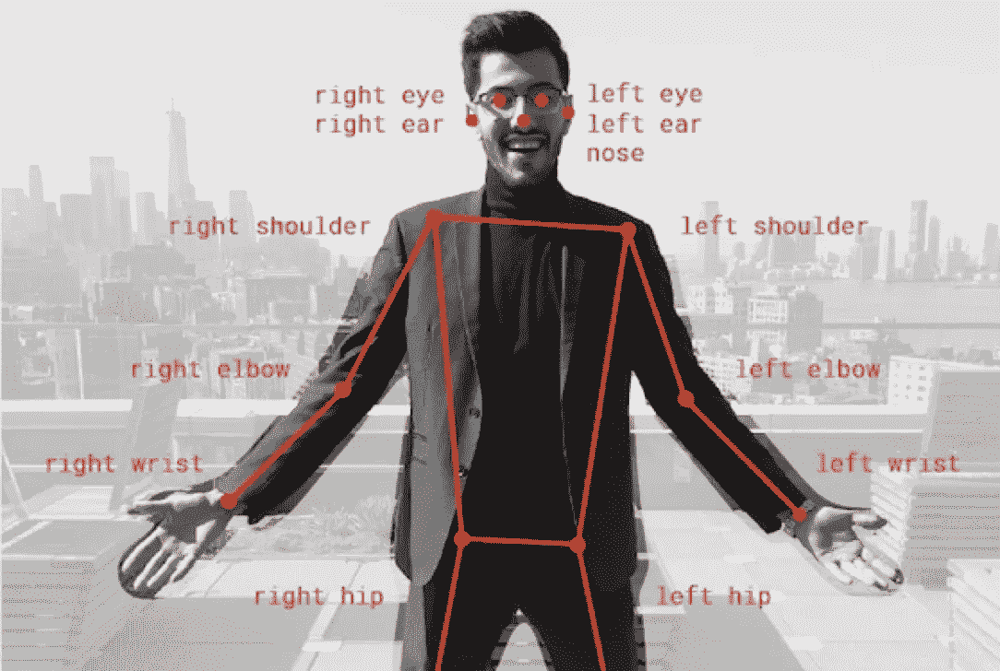

基于张量流的姿态检测模型

*   **触发**和**警报**取决于何时在一个房间中发现一组班级。

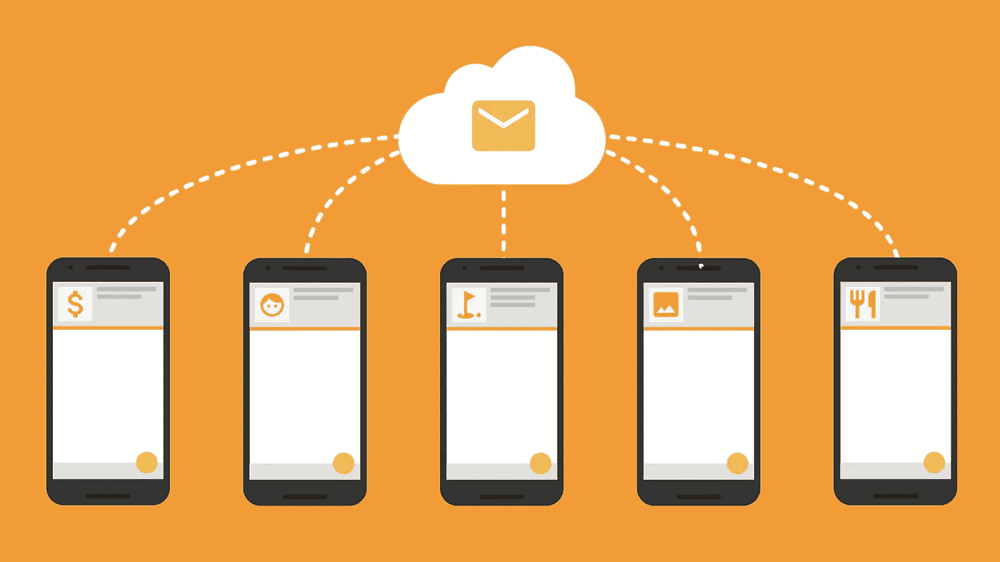

使用 Firebase 消息传送发送警报

*   **训练定制模型:**我们可以使用定制模型来识别建筑物上的特定人，例如，如果在给定的房间中发现未经授权的人，就发送警报。


使用迁移学习来训练自定义模型。

**参考文献:**

*   [我们为什么需要边缘计算？|云计算|面向所有人的物联网](https://www.iotforall.com/edge-computing-benefits/)
*   [https://www . seeed studio . com/ESP32-CAM-Development-Board-with-camer-p-3153 . html](https://www.seeedstudio.com/ESP32-CAM-Development-Board-with-camer-p-3153.html)
*   [https://www . cnx-software . com/2018/09/30/esp32-cam-esp32-camera-board/](https://www.cnx-software.com/2018/09/30/esp32-cam-esp32-camera-board/)
*   [http://jamesthom . as/blog/2018/08/07/machine-learning-in-node-dot-js-with-tensor flow-dot-js/](http://jamesthom.as/blog/2018/08/07/machine-learning-in-node-dot-js-with-tensorflow-dot-js/)

> 你喜欢这个帖子吗？所以不要忘了让你的拍手继续👏下面，推荐一下，分享给你的朋友。
> 
> 你用这个教程做了什么好事吗？显示在下面的评论部分。
> 
> 如果你有任何问题，请在评论中留言，我会尽力帮助你。