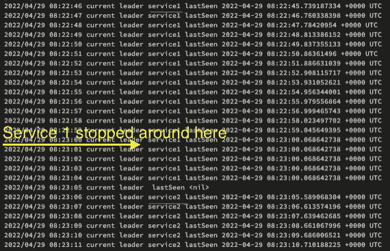

# 使用 Google Cloud Spanner 实现信号量

> 原文：<https://medium.com/google-cloud/implement-a-semaphore-using-google-cloud-spanner-b229ca3d1de5?source=collection_archive---------0----------------------->


在 [Unsplash](https://unsplash.com/s/photos/train-signal?utm_source=unsplash&utm_medium=referral&utm_content=creditCopyText) 上[迪伦·维塞](https://unsplash.com/@dylanveasey?utm_source=unsplash&utm_medium=referral&utm_content=creditCopyText)的旗语照片

对于某些工作负载，您必须考虑如果云区域“停止运行”会发生什么。有各种可能导致这种情况的错误场景。当你有一个无状态的 API 工作负载时，你通常可以决定在多个地区托管你的应用，并使用谷歌云的全球[云负载平衡](https://cloud.google.com/load-balancing)来引导流量。但是当您有消息处理工作负载时，这可能更具挑战性。尤其是当您必须考虑跨多个地区订购或一次性处理保证时。在这种情况下，您可能希望只有一个处理器实例处理一个数据分区。

使用分布式信号量或锁可能很有用。另一种选择可能是采用共识算法，如 [Raft](https://en.wikipedia.org/wiki/Raft_(algorithm)) 或 [Paxos](https://en.wikipedia.org/wiki/Paxos_(computer_science)) 。总的想法是，我们有一个简单的机制来通知哪个处理器实例当前应该处理消息，信号量是一个简单的解决方案。当然还有像 [Zookeeper](https://dzone.com/articles/distributed-lock-using) 或 [Etcd](https://github.com/etcd-io/etcd/blob/main/etcdctl/README.md#lock-options-lockname-command-arg1-arg2-) 这样的工具提供分布式锁。甚至 Cassandra 也使用[轻量级事务](https://www.datastax.com/blog/lightweight-transactions-cassandra-20)来提供领导者选举。这类工具的挑战通常是你需要考虑在 3 个区域托管，以保证法定人数，并避免在[网络分区](https://en.wikipedia.org/wiki/Fallacies_of_distributed_computing)的情况下分裂大脑。

我个人尽量避免托管基础设施服务，因为我想专注于为客户创造价值的代码。因此，我试图找到一个解决方案，如何在谷歌云中创建信号量，这将在多个地区工作。Google Cloud 的一般策略是区域性地托管大多数服务，以限制错误域，只有少数例外。其中一个例外是 [Google Cloud Spanner](https://cloud.google.com/spanner) ，这是一个全球性的、符合 ACID 的、高可用性的数据库服务。它通过[外部一致性](https://cloud.google.com/spanner/docs/true-time-external-consistency#external_consistency)提供多区域甚至全球可用性。

这意味着我们可以用它来创建我们的信号量。想法是，我们将依赖两个 SQL 查询和一个简单的表布局

这个表有 3 列，`anchor`我们信号量的 Id，`service_id`持有信号量的当前领导者的名字，`last_seen`领导者最后一次更新信号量行的时间戳。

第一个查询由系统中的每个服务定期执行。它会尝试在我们的`LeaderElection`中更新首领的`service_id`和`last_seen_active`。这些字段只能由当前作为领导者的服务来更新，或者如果自从任何服务上次更新领导者以来达到了超时。Cloud Spanner 的强大一致性，将确保所有服务接收到相同的`service_id`提供给所有服务。

```
UPDATE LeaderElection 
SET service_id = @serviceId, last_seen_active = CURRENT_TIMESTAMP()
WHERE anchor = 1 
AND ( (service_id != @serviceId AND last_seen_active < TIMESTAMP_SUB(CURRENT_TIMESTAMP(), INTERVAL @timeout SECOND) )
OR (service_id = @serviceId))
```

第二个查询允许我们查询当前的领导者。

```
SELECT service_id, last_seen_active 
FROM LeaderElection 
WHERE anchor = 1 
AND last_seen_active >= TIMESTAMP_SUB(CURRENT_TIMESTAMP(), INTERVAL @timeout SECOND)
```

有了这个简单的设置，我们可以依靠 Spanner 为我们提供一致可靠的信号量。下面是一个完整的例子，用 Go 写的:

用 Go 编写的带云扳手的信号量

该工具提供三种模式:

1.  用`go run main.go init projects/<project_id>/instances/<spanner_instance>/databases/<db>`初始化数据库
2.  用`go run main.go participate projects/<project_id>/instances/<spanner_instance>/databases/<db> <service_id>`参与信号量这将尝试每秒更新一次信号量
3.  获取持有信号量的当前领导者`go run main.go get projects/<project_id>/instances/<spanner_instance>/databases/<db>`

您可以简单地在同一台机器的多个 shell 实例中运行命令 2 和 3，看看信号量是如何变化的。

为了使其正常工作，超时时间应该至少是服务尝试更新信号量时间的两倍。(如果你想知道为什么:[奈奎斯特-香农采样定理](https://en.wikipedia.org/wiki/Nyquist%E2%80%93Shannon_sampling_theorem))



示例中的控制台输出示例

因此，这为我们提供了一种简单而可靠的方法来拥有一个分布式信号量，而不需要我们自己在多个区域托管基础设施。