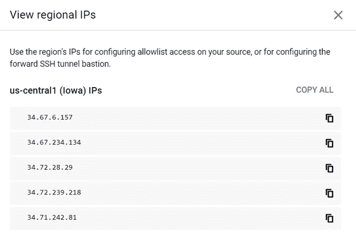

# 使用 GCP 数据流实施变更数据捕获

> 原文：<https://medium.com/google-cloud/implementing-change-data-capture-using-gcp-datastream-c340238b5d2b?source=collection_archive---------1----------------------->

Datastream 是一种无服务器且易于使用的变更数据捕获(CDC)和复制服务。它允许您跨异构数据库和应用程序可靠地同步数据，并且具有最小的延迟和停机时间。

Datastream 支持从 Oracle 和 MySQL 数据库流式传输到云存储。该服务提供了与数据流模板的简化集成，以支持 BigQuery for analytics 中的最新物化视图，将您的数据库复制到 Cloud SQL 或 Cloud Spanner 以实现数据库同步，或者利用直接来自云存储的事件流来实现事件驱动的架构。

数据流的优势包括:

*   无需服务器，因此无需调配或管理资源，服务可根据需要自动扩展和缩减，最大限度减少停机时间。
*   易于使用的设置和监控体验可实现超快速的价值实现。
*   跨最佳 Google 云数据服务组合的集成，用于跨数据流、数据流、云数据融合、发布/订阅、BigQuery 等的数据集成。
*   跨异构数据库和应用程序同步和统一数据流。
*   安全性，具有私有连接选项和您期望从 Google Cloud 获得的安全性。
*   准确可靠，具有透明的状态报告和面对数据和模式变化时强大的处理灵活性。
*   支持多种使用情形，包括迁移和混合云配置的分析、数据库复制和同步，以及构建事件驱动的体系结构。
*   让我们考虑一个用例场景，其中需要从云 SQL (MySQL)复制实时更改。下面是完成设置和管道执行的步骤。
*   步骤 1:设置 GCP 云 SQL (MySQL)实例

如上所示创建实例

*   步骤 2:启用 MySQL 实例的自动恢复

*   a.连接到实例并创建数据流用户—使用以下命令从 gcloud shell 连接
*   gcloud sql 连接实例名—用户=根
*   b.使用以下命令创建用户–

> mysql >创建由“[YOUR_PASSWORD]”标识的用户“数据流”@“%”；
> 
> mysql >授予复制从属、选择、重新加载、复制客户端、锁表、在*上执行。*到“数据流”@“%”；
> 
> mysql >刷新权限；

*   c.验证 mysql 的配置-->
*   通过输入以下 MySQL 命令，确认二进制日志配置正确:
*   显示全局变量，如“% binlog _ format %”；
*   验证 binlog_format 变量的值是否设置为 ROW。
*   通过输入以下 MySQL 命令，确认二进制日志的行格式设置为 FULL:

> mysql >显示‘binlog _ row _ image’这样的全局变量；

*   通过输入以下 MySQL 命令，验证二进制日志的从属更新选项是否设置为 on:

> mysql >显示像‘log _ slave _ updates’这样的全局变量；

*   通过输入以下 MySQL 命令，验证二进制日志的保留期是否设置为 7 天:

> mysql >显示像‘expire _ logs _ days’这样的全局变量；

如果日志天数未设置为 7 天，请使用以下步骤设置为 7 天。

1.  导航到 **/etc/mysql/** 目录。
2.  使用编辑器，打开 **my.cnf** 文件。
3.  将以下几行添加到文件中:

d.[mysqld]

e.log-bin=mysql-bin

f.服务器 id=1

g.binlog_format=ROW

h.日志从属更新=真

一.过期日志天数=7

您正在进入 **expire_logs_days=7** 行代码，因为您希望通过配置系统将二进制日志保留至少 7 天来确保正确的复制。

1.  将您的更改保存到 **my.cnf** 文件，然后关闭该文件。
2.  重新启动您的 MySQL 服务器，以便您所做的更改可以生效。

至此，mysql 配置完成。稍后，我们将添加数据流的 ips，以允许来自 mysql 实例的流量。

步骤 3:使用数据流创建连接配置文件。

需要创建连接作为源、接收器/目标，以便配置创建流式管道。以下是为此用例创建的连接——

a.Mysql 连接配置文件— mysql 源连接

IP 地址需要加入 mysql 的白名单。以下是 IP–

a.存储连接配置文件—作为接收器/目标的 GCS

a.在添加网络中为 Mysql 实例添加 IP 地址，以允许流量

创建流管道

创建连接配置文件后，我们可以创建流并配置变更数据捕获

配置步骤–

继续配置源-

选择连接配置文件并运行测试以检查连接性–

需要通过测试来配置连接-

继续为表/对象/模式配置流–

定义接收器/目标目的地–

配置目的地-

创建流–

一旦流创建，它不会运行，直到这是开始。这也可以使用 create 和 start 来完成。一旦流开始，它将显示如下

GCS 目标–

存储在 GCS 中的流如下——

一旦在 GCS 中捕获到提要，就可以创建并运行一个后续作业，将这些更改加载到 GCP 数据库服务中。一种实现方式是创建数据流作业，从 GCS 中捕获更改，并写入 BQ、Spanner 或 Cloud SQL。谷歌在模板中提供了这些工作，可以快速创建和使用这些模板来建立管道。该作业将像实时作业一样运行，并将更改写入目标表/数据库。

*   了解更多关于 https://cloud.google.com/datastream/docs GCP 数据流的信息
*   **关于我**

> *我是 DWBI 和云师！我一直在处理各种遗留数据仓库、大数据实施、云平台/迁移。我是谷歌认证的专业云架构师。您可以联系我@*[*LinkedIn*](https://www.linkedin.com/in/poojakelgaonkar)*如果您需要任何认证、GCP 实施方面的帮助！*