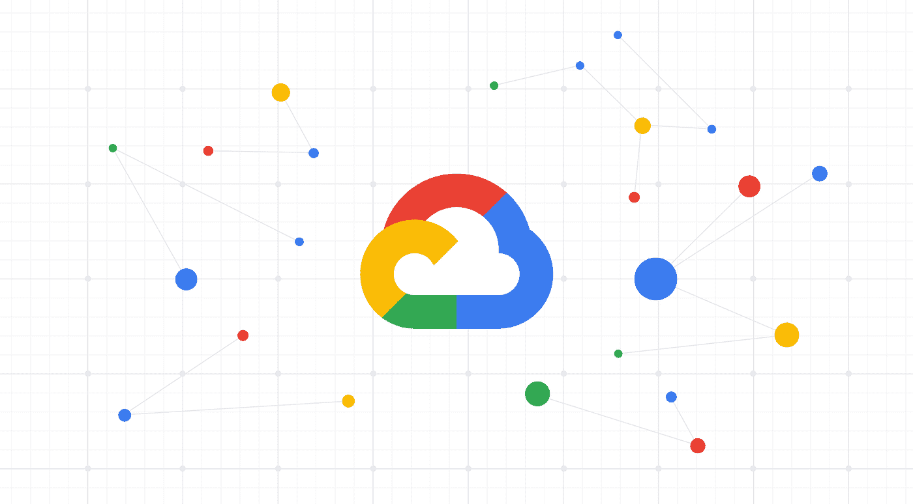
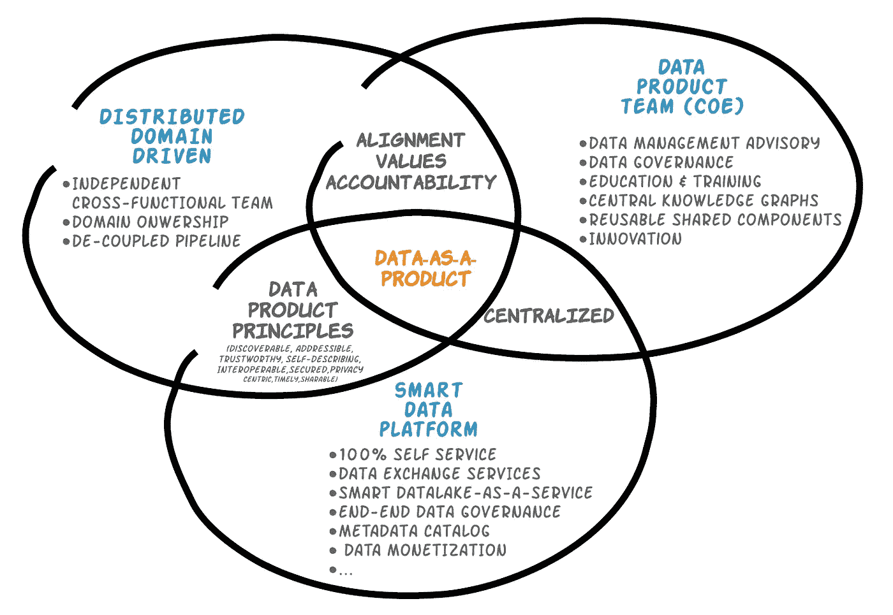
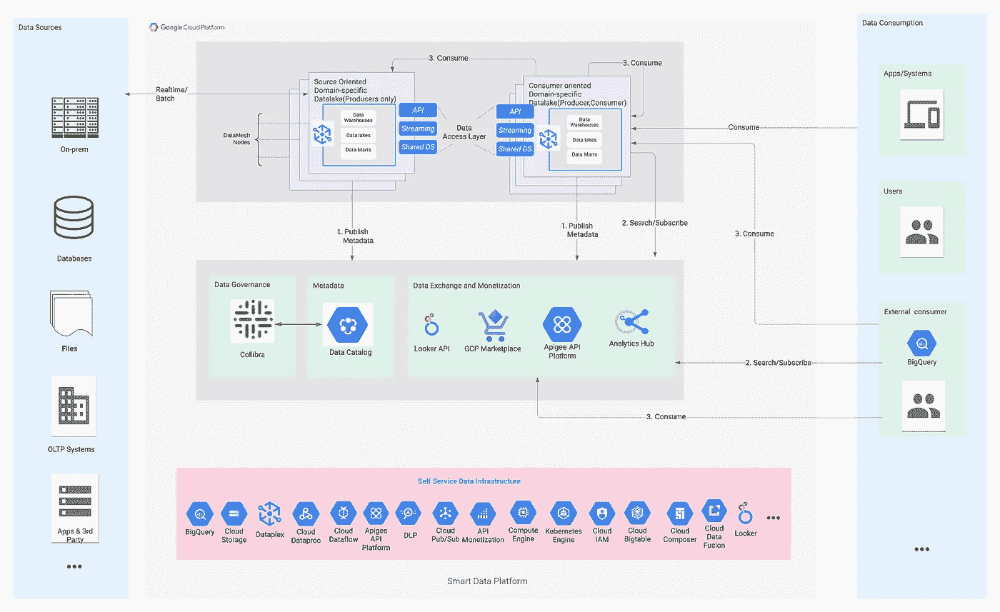
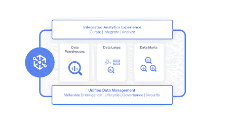
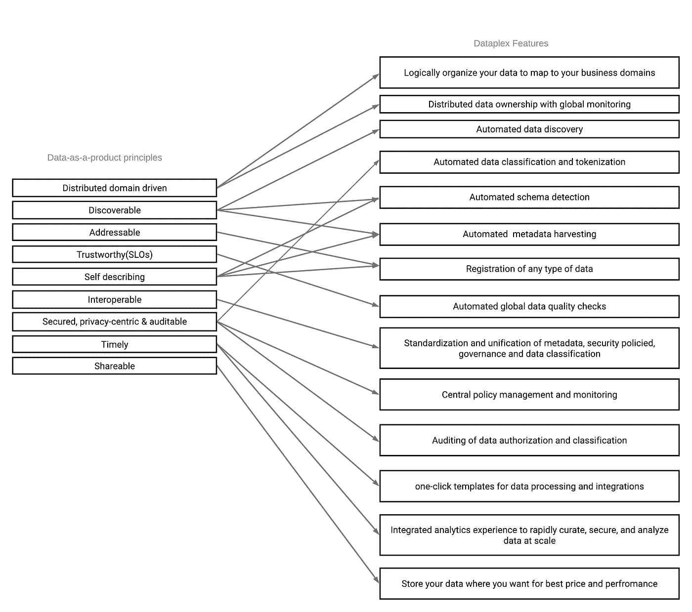
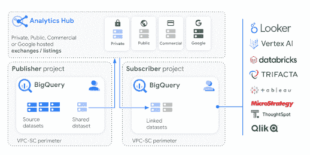
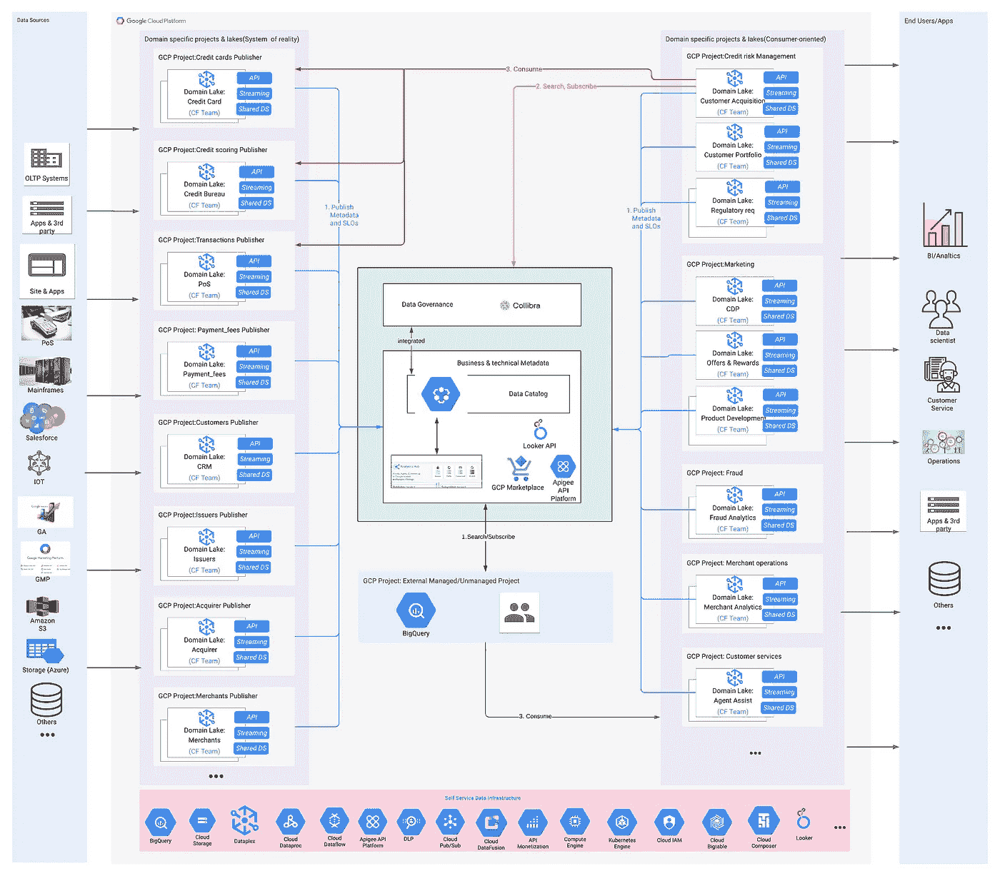

# 在 GCP 使用分布式数据架构和智能数据平台实施数据即产品(DaaP)

> 原文：<https://medium.com/google-cloud/implementing-data-as-a-product-daap-using-distributed-data-architecture-and-smart-data-platform-on-c2fcd64c67d5?source=collection_archive---------0----------------------->

数据以前所未有的速度发展。大数据技术彻底改变了数据的捕获、存储和处理方式。许多组织已经采用大数据平台，该平台结合了数据湖、数据仓库和数据集市的功能以及数据管理功能，作为大规模处理数据的有效方法。然而，对于许多组织来说，利用现有的整体数据平台和现有(或不存在的)数据架构释放数据的价值仍然是一个挑战。

数据平台似乎受到数据集中思想的制约。在数据的生命周期中，它会降低数据的价值。通常情况下，缺乏数据的领域所有权对创造力和商业洞察力构成了障碍。由于非特定领域数据的差异，人工智能/人工智能倡议受到复杂性和不一致性增加的阻碍。集中式核心团队和集中式数据团队如何合作来实施和控制数据操作(包括数据治理、数据质量、法规遵从性、元数据编目等)之间存在脱节。集中式团队的操作和数据团队的操作通常是自治的和分离的，没有公共接口或通信渠道，导致团队之间的许多摩擦以及业务目标和期望的不一致。

现在，要解决这个问题，我们必须改变对数据组织的看法，并改变您的数据架构。采用“数据即产品”的方法是解决这一问题的好方法。

> 通过用 DaaP 理念和智能技术层扩充您的数据平台，您可以使数据大众化，并从中获得更多见解和经济价值

在最基本的层面上，DaaP 涉及一个逻辑管理层，它可以帮助创建一个更易于管理的按域分组的数据单元，而无需物理传输或数据复制。这些可管理的数据单元可以被赋予适当的所有权，其中应该包括域代表，并且可以遵循某些标准原则和策略。它们还应该支持集中管理和治理。

DaaP 的实施在技术和人员层面上都很繁重。因此，DaaP 的采用受益于智能的技术平台。这种智能技术层有利于 DaaP，并应提供逻辑数据管理层，通过自动化减轻跨多个领域和数据产品统一实施原则的痛苦，并通过提供一组通用的工具、服务和界面来帮助减少集中化团队和 data domain 特定团队之间的摩擦。

今天，在这篇文章中，我们将探讨如何通过在 GCP 使用最先进的技术和服务来生动展示“数据即产品”。这个位于 GCP 的下一代数据平台将被称为“智能数据平台”。基于分布式域驱动数据架构的概念  、自助服务基础架构、集中式 CoE 团队以及 DaaP 原则的应用，智能数据平台可以帮助您的企业采用和部署 DaaP。扎马克·德赫加尼的数据网格架构  影响了很多这样的想法。

# 基础构件

我们来分解一下，尽量简单。让我们从实现的角度来看一下基本组件及其属性。

DaaP 实施的关键组件

*   **分布式领域驱动(DDD)架构:**这个概念的灵感来自 [Eric Evans](https://domainlanguage.com/about/) ' [领域驱动设计](https://www.amazon.com/exec/obidos/ASIN/0321125215/domainlanguag-20)。一种数据架构，其中业务或内部运营拥有、处理利用标准分离管道、主机的数据，并以安全且易于使用的方式提供其领域数据集。这种架构允许您将数据分解成更易于管理的块。您的业务或内部运营团队中服务或消费数据的每个逻辑组都可以被视为一个域。
    ***DaaP 和数据域:*** 一个域负责向组织内部或外部的消费者提供高质量的数据产品。每个域可以由一个或多个数据产品组成。数据集、通过 FTP 或共享驱动器传输的文件、基于数据的报告、API 获取或使用的一个或多个数据片段或数据流都是数据产品的示例。域中的每个数据产品都应该遵循 DaaP 原则。
    ***设计您的域:*** 您如何着手设计您的域主要取决于您组织的规模。一个域可以是面向源(靠近数据源和业务)或面向消费者的，或者它可以专注于内部操作。面向源的领域可以是现实系统，靠近数据源，并且可以仅限于生产者。每个领域都应该由自己独立的跨职能团队管理，至少包括一名数据产品所有者、一名数据工程师、一名数据分析师和一名数据管理员。您可以选择为小型企业构建更侧重于用例的领域，跨职能团队可以限制为一两个数据专家。
*   **DaaP 原则:**可以将以下设计原则整合到每个数据产品中，以减轻对一致性的担忧:可发现的  、可寻址的  、可信任的  、可自我描述的  、可互操作的  、安全的  、以隐私为中心的、可审计的、及时的、可版本化的以及可共享的。这将有助于为生产者和消费者开发一流的数据产品。
*   **DaaP 卓越中心(CoE):** 尽管 DaaP 强调权力下放，但仍需要一个核心团队来保持一致性、共享价值观和问责制。可以认为这是联邦政府，而 data domains 是州政府。从高层次来看，职责可能包括确保跨领域统一采用原则、最佳实践和标准，开展教育和培训会议，定义和实施数据治理策略和合规性(尤其是外部数据共享)，创建&维护全球知识图，以及提供与领域无关的可重用组件，如 CI/CD、配置工具、摄取框架、数据连接器、标准 api 接口和文档模板等，最后但同样重要的是为创新铺平道路。这是一个基础组件，但是进一步讨论它超出了本文的范围。
*   **智能数据平台**:选择智能数据平台将有助于 DaaP 的接受和执行。很难构建支持 DaaP 所需的所有工具、服务和框架，尤其是在单一数据平台环境中。例如，数据质量或元数据编目活动和 KPI 经常不清楚，并且缺乏足够的所有权。大多数情况下，开发人员对此负责，作为应用程序或管道开发的一部分。因为他们不是数据专家，这将很难实现，并且这种方法不会随着数据的增长而扩展。智能数据平台可以帮助解决这些问题，方法是提供一个针对数据质量的统包式解决方案，该解决方案可以在数据输入到数据域并集中管理和执行时实施。
    智能数据平台将:1 .提供统一的智能数据结构功能，简化数据管理，无论数据位于何处，无需移动或复制数据。例如，如果您的数据作为数据湖的一部分存储在 GCS、BQ 和其他数据存储中，它们可以保留在那里。2.促进组织内外的数据交换/共享和货币化。3.促进中央协调和治理。
    数据结构将负责提供各种功能，如交钥匙数据质量解决方案、自动化发现和合规性工作、统一数据治理、模式演进和元数据收集等。这些功能将使跨数据域一致地应用 DaaP 原则变得更加容易，而不需要大量的人工工作。

# 智能数据平台:参考架构

既然我们已经建立了重要的组件，让我们进入智能数据平台的技术方面，这是本文的主题。

以下是智能数据平台的关键构建模块:

## 自助式数据基础架构

不用说，云本身就挤满了大量的自助式基础设施服务。谷歌云平台提供[基础设施即服务](https://en.wikipedia.org/wiki/Infrastructure_as_a_service)、[平台即服务](https://en.wikipedia.org/wiki/Platform_as_a_service)、[无服务器](https://en.wikipedia.org/wiki/Serverless_computing)计算。所有这一切都得益于谷歌云值得信赖的[全球](https://cloud.google.com/about/locations)存在、安全高效的[数据中心](https://www.google.com/about/datacenters/)、快速可靠的全球[网络](https://cloud.google.com/products/networking)、[多层](https://cloud.google.com/security/infrastructure)安全性、[高可用性](https://cloud.google.com/vpc/docs/edge-locations)，以及最后但同样重要的[可持续发展](https://cloud.google.com/sustainability)。谷歌云的智能分析解决方案提供了大量数据和分析[产品](https://cloud.google.com/products#section-7)来帮助推动创新和采用 DaaP 架构。下面我们将探讨其中的一些。

## 数据结构——data plex

Dataplex 是一种智能数据结构，使组织能够从单个控制平面管理、监控和监管多个数据存储中的数据。Dataplex 是为分布式数据构建的，允许通过逻辑层实现数据统一，消除了数据迁移或复制的需要。它通过自动数据发现、全局数据质量检查和各种其他功能提供数据智能。它还从一个中心位置管理、监控和审计数据授权和分类策略。

Dataplex 是一个逻辑管理层，可以与您的数据湖、数据仓库和数据集市结合使用，以使 DaaP 原则的实现更容易、更智能。

Dataplex 可以用于在 GCP 项目内部或跨项目构建和组织面向领域的数据湖，可以选择使用 IAM 将所有权授予独立的跨职能团队。虽然 GCP 项目有助于组织，但它们在很大程度上侧重于资源和计费，因此很难将数据与业务领域协调和联系起来。

DaaP 和 Dataplex 特征映射

## 数据交换—分析中心

在不放弃控制权或权力的情况下，analytics hub 允许您跨越组织边界交换数据和见解。它是商业数据和分析货币化的基础。它内置了与数据目录的集成。消费者可以轻松搜索和订阅由 data domains 托管的数据馈送。Analytics Hub 提供外部和内部数据交换、数据货币化、数据访问监控和审计以及数据产品版本控制(由底层存储层支持)，所有这些都是 DaaP 的重要特征。[了解更多](https://cloud.google.com/blog/products/data-analytics/introducing-analytics-hub-for-data-analytics-exchanges)。

## 数据体验—旁观者

Looker 的嵌入式分析，加上所有其他先进的 ML 和 BI 功能，是一种成熟实用的数据商业化和货币化方法..[在这里了解更多](https://info.looker.com/whitepapers/monetizing-data-with-embedded-analytics)。

## API 管理— Apigee

借助可见性和控制，在任何地方设计、保护、分析和扩展 API。还提供构建货币化 API 产品并最大化数字资产的商业价值。[点击此处了解更多](https://cloud.google.com/apigee)。

## 数据治理—数据目录和合作工具

例如，科利布拉和 GCP 为多云和混合系统中的中央联合数据治理提供了一个坚实的框架。通过 [Cloud IAM](https://cloud.google.com/iam) 和 [Cloud DLP](https://cloud.google.com/dlp) ，您可以实施数据安全策略并保持与数据目录的一致性。点击了解更多关于此[的信息。](https://cloud.google.com/data-catalog)

# 样本案例研究

这是一家金融服务公司的 DaaP 部署示例，该公司同时提供信用卡和支付服务。考虑以下业务线和业务线:信用卡、信用评分、交易、客户、发行人、收购方、商家、支付和费用、营销、风险和欺诈。

具有域表示的自治跨职能(CF)团队可以拥有最接近 lob 数据源的面向源的域湖(仅限生产者)。总线可以是更加面向消费者的领域湖，可以驱动外部和内部的最终用户/应用消费。

一旦域准备好托管数据，第一步是发布数据产品的元数据，其中应包括 SLO(数据准确性、置信度得分等)。)、所有权信息、消费机制、技术元数据和业务元数据等。

面向消费者的领域内部或外部的数据消费者可以搜索和订阅他们想要消费的数据。一旦他们获得了必要的访问权限，就可以使用他们域中的数据。

> 如果您要踏上云之旅，想要从现有数据中获得更多价值，或者想要降低数据管理开销，现在是时候重新思考和更新您的数据架构了。

## 包裹

采用现成的智能平台而不是自己动手，将有助于您克服与 DaaP 相关的一些技术和人力问题，让您更快地推进其实施。一旦您弄清楚了智能数据平台等技术可以如何提供帮助，就该踏上数据架构现代化之旅了。

重要的是要记住，这不是重新架构或重新设计您的数据湖，这将是一项艰巨的任务，这是一种更具逻辑性、战略性和前瞻性的数据管理方法。有一些未来的用例可以从 DaaP 中受益，如开放银行、数据和分析货币化以及其他潜在的用例。尽早接受这一点，在不久的将来收获回报。

附:如果做得正确，这可能是一次成功的尝试。在随后的文章中，我们将研究这种架构的谬误以及如何克服它们。我们还将讨论该方法的不同之处，以及如何根据您公司的规模和复杂性进行定制。

我希望这篇文章对你有用。

[1][https://Martin fowler . com/articles/data-monolith-to-mesh . html](https://martinfowler.com/articles/data-monolith-to-mesh.html)