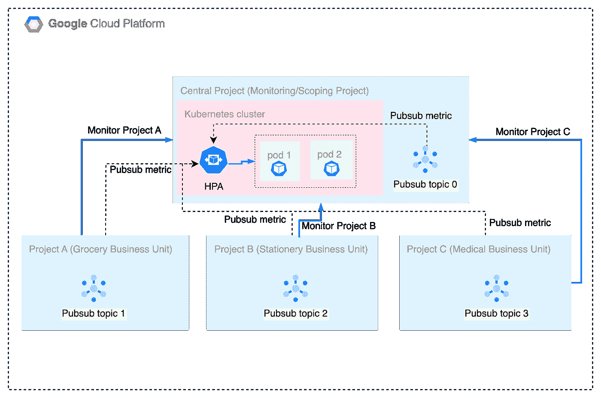
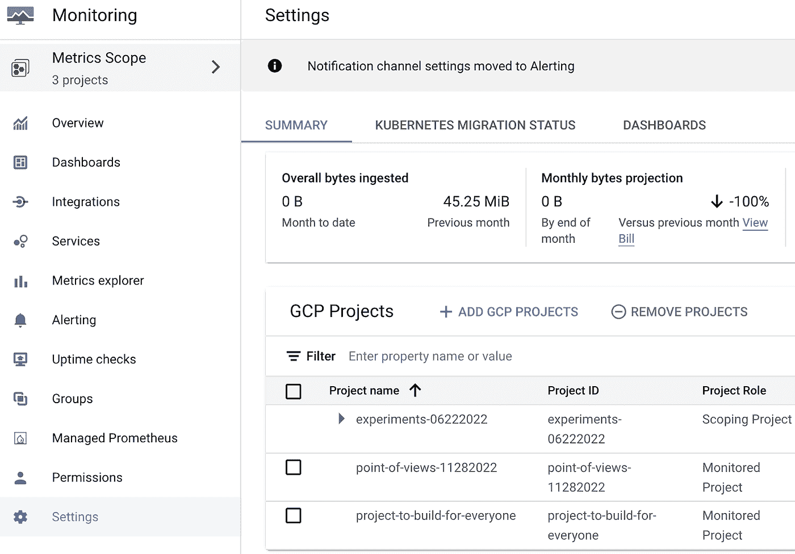
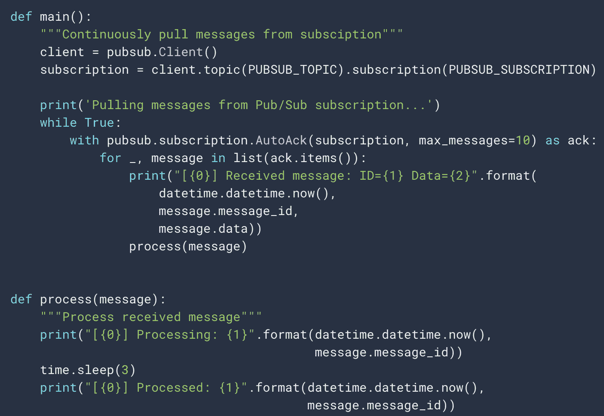
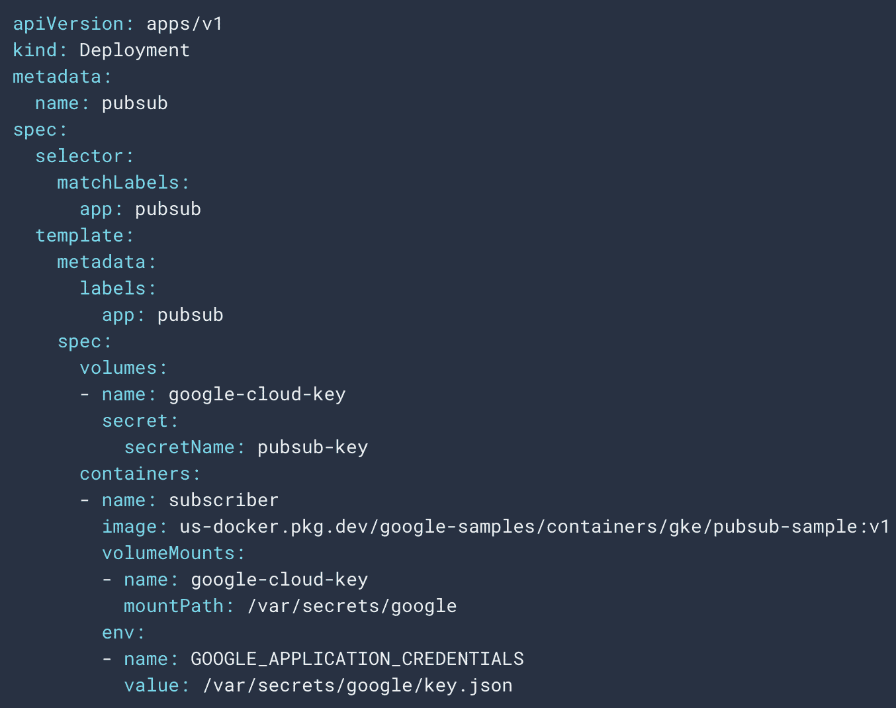
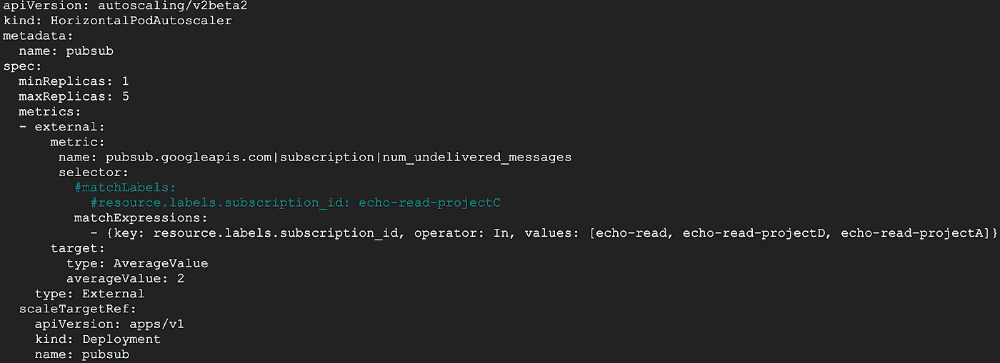
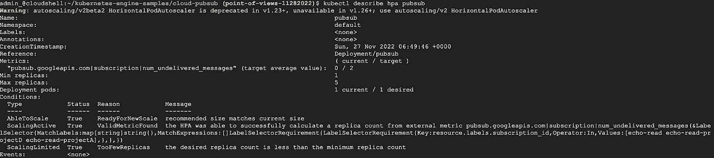
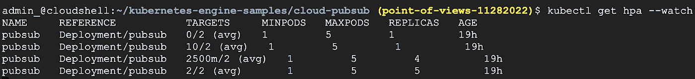
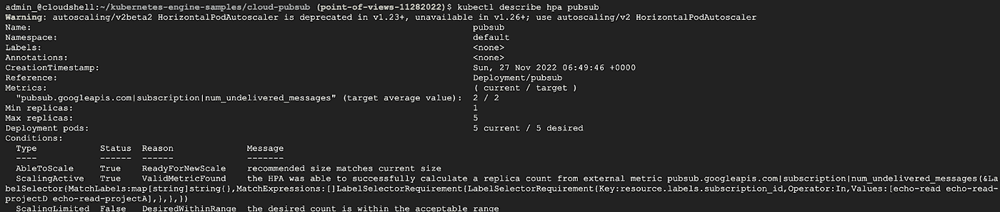

# 为消费品交付行业实施可扩展的微服务

> 原文：<https://medium.com/google-cloud/implementing-scalable-microservices-for-the-consumer-goods-delivery-industry-c675e3654114?source=collection_archive---------9----------------------->

对杂货、蔬菜、文具等消费品进行最后一英里配送的公司面临的一个共同挑战是根据不可预测的需求进行扩展的能力。由于向消费者交付的速度是该行业的一个关键基准，因此扩大和扩大必须在没有任何延迟的情况下进行。

谷歌云平台(GCP)提供了构建、部署和运行可扩展微服务的有效方法来应对这一挑战。最后一英里配送公司是来自多个行业(如食品杂货、文具、医疗等)的各种生产商的消费者。架构的一个方法是让每个业务单元(生产者)在他们自己的 GCP 项目中照顾他们各自的领域过程。中央 GCP 项目将运行应用(计算)集群，并通过监控业务部门使用的每个 GCP 项目的指标来执行扩展。下面的图 1 展示了该架构。

*图 1:利用来自 Pubsub* 的外部指标构建可扩展微服务(pod)的架构图

配置一个 GCP 项目来部署 GKE 集群，然后部署指标适配器，让 GKE 集群通过云监控发送和接收指标。(提示:请参考这个:[*https://cloud . Google . com/kubernetes-engine/docs/tutorials/auto scaling-metrics # step 1*](https://cloud.google.com/kubernetes-engine/docs/tutorials/autoscaling-metrics#step1))使这个 GCP 项目成为 *Monitoring (Scoping)* 项目，以监控 GCP 项目中与其他业务部门相关的指标。被界定范围的单个 GCP 项目通常被称为*监控*项目。这可以使用监控(范围界定)项目的监控工作区的指标范围功能来执行，如下面的示例屏幕截图(图 2)所示:(提示:使用“添加 GCP 项目”选项来添加被监控的项目)

*图 2:将多个受监控项目划分为一个监控项目的示例截图*

确保在相应的 GCP 项目(在监视项目和被监视项目中)中创建了(或已经存在)相关的发布订阅和主题。

(*提示:以下示例命令可用于创建 pubsub 主题和订阅。*

*   *gcloud 发布主题描述 echo-projectD*
*   *gcloud pubsub 订阅创建 echo-read-projectD—topic = echo-projectD—topic-project = point-of-views-11282022)*

在 GCP 监控项目的 GKE 集群中部署微服务(pod)。该应用程序必须使用一个具有“*发布订阅者*角色的*服务帐户*。下面的屏幕截图显示了一个示例应用程序，它轮询 pubsub 主题及其清单文件。

*图 3:可以部署的 Python 应用程序*的样本代码(用于测试)

*图 4:图 3 所示示例应用程序的清单文件*

配置水平 Pod 自动缩放器(HPA)以查找 pubsub 指标。例如，配置一个 HPA 来监听来自资源类型 *pubsub_subscription 的*pubsub.googleapis.com/subscription/num_undelivered_messages*度量。*在下面图 5 的示例截图中，HPA 正在寻找特定的订阅 id。(这可以推断为包括额外的标签，以便根据需要进一步过滤。)

*图 4:监听 pubsub 指标的示例 HPA 的清单文件*

应用清单并描述 HPA 以查看初始状态。*目标*字段显示实际值与期望值的对比。下面的图 5 显示了一个相同的示例截图

*图 5:显示缩放初始状态的 HPA 描述*

设置现在已经完成。当消息被发布到与 HPA 监控的订阅相关联的 pubsub 主题时(在上面的示例中)，在 GKE 集群中运行的 pod 将开始水平扩展。为了测试设置，您可能需要在 pubsub 上生成负载，方法是从每个受监控项目(由单个业务单位处理)以及在监控项目中向 pubsub 主题发布一系列消息。可以观察到，HPA 监听这些外部度量，并通过启动水平 pod 自动缩放来做出反应。观察 HPA 的当前状态。图 6 显示了一个演示向外扩展的示例屏幕截图。

*图 6:显示当前缩放状态的 HPA 描述*

从业务角度来看，在监控项目的 GKE 集群中运行的最后一英里消费品交付应用可以根据从其他业务部门(杂货业务部门、文具业务部门、医疗业务部门等)接收的(外部)指标进行无缝扩展。)，提供自动化、速度和运营效率。

有关更多详细信息，您可以参考 Google 的以下文档:

[1]查看多个项目的指标—[https://cloud.google.com/monitoring/settings](https://cloud.google.com/monitoring/settings)

[2]基于指标优化 Pod 自动缩放—[https://cloud . Google . com/kubernetes-engine/docs/tutorials/auto scaling-metrics # pubsub _ 1](https://cloud.google.com/kubernetes-engine/docs/tutorials/autoscaling-metrics#pubsub_1)