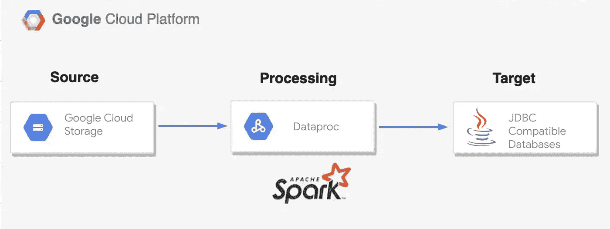

# 使用 Dataproc 无服务器将数据从 GCS 导入 JDBC 数据库

> 原文：<https://medium.com/google-cloud/import-data-from-gcs-to-jdbc-databases-using-dataproc-serverless-c7154b242430?source=collection_archive---------5----------------------->


> Spark 是最**流行的大数据分布式处理框架之一。**如果您希望将现有的 spark 工作负载迁移到云，或者在云上创建新的 spark 作业，您不再需要担心重新调整作业属性或调整集群规模。 [**Dataproc 无服务器**](https://cloud.google.com/dataproc-serverless/docs/overview) 通过运行 spark 工作负载来加速您在 Google Cloud 上的旅程，而无需担心基础设施的供应和管理。

Google Cloud 社区已经建立了一个开源的知识库，其中包含了 Dataproc Serverless 最常见的用例。在这篇博文中，我们浏览了来自资源库的 [GCS 到 JDBC Pyspark 模板](https://github.com/GoogleCloudPlatform/dataproc-templates/blob/main/python/dataproc_templates/gcs/gcs_to_jdbc.py)。



在我们进入任何细节之前，让我们回顾一下使用模板的**主要优势**:

1.  Dataproc 无服务器模板是开源的，可以很容易地为工作负载迁移进行克隆和定制。
2.  无需调配或管理基础架构。
3.  支持多种文件格式，即 JSON、Avro、Parquet 和 CSV。
4.  这些模板是配置驱动的，只需更改连接参数，就可以非常容易地用于类似的用例。

# 先决条件

为了运行这些模板，我们需要:

*   Google Cloud SDK 已安装并通过验证。
*   Python 3.7+已安装。
*   启用了专用 Google 访问的 VPC 子网。默认子网是合适的，只要启用了私有 Google 访问。
*   目标数据库的 JDBC jar。

# 执行 Dataproc 模板的步骤

1.克隆 Dataproc 模板库并导航到 Python 模板文件夹。

```
git clone https://github.com/GoogleCloudPlatform/dataproc-templates.git
cd dataproc-templates/python
```

2.获取身份验证凭据以提交作业。

```
gcloud auth application-default login
```

3.为 jar 文件创建一个 GCS 存储桶和暂存位置。

```
export STAGING_BUCKET=”my-gcs-staging-bucket”
gsutil mb gs://$STAGING_BUCKET
```

4.通过导出提交所需的变量来配置 Dataproc 无服务器作业—

`GCP_PROJECT`:运行 Dataproc 无服务器的 GCP 项目 id

`REGION`:运行 Dataproc 无服务器的区域

`GCS_STAGING_LOCATION` : GCS 暂存桶位置，在步骤 3 中创建

`SUBNET`:运行 Dataproc 无服务器的 VPC 子网，如果不使用默认子网(格式:*projects/<project _ id>/regions/<region>/subnetworks/<子网> )*

`JARS`:作业中使用逗号分隔的罐子。对于这个用例，它应该包括目标数据库的 JDBC 驱动程序 jar。

```
# Project ID to run the Dataproc Serverless Job
export GCP_PROJECT=<project_id># GCP region where the job should be submitted
export REGION=<region># The staging location for Dataproc
export GCS_STAGING_LOCATION=gs://$STAGING_BUCKET/staging
export SUBNET=<subnet> # Optional if default  
export JARS="<gcs_path_to_jdbc_jar_files>/mysql-connector-java-8.0.29.jar,<gcs_path_to_jdbc_jar_files>/postgresql-42.2.6.jar,<gcs_path_to_jdbc_jar_files>/mssql-jdbc-6.4.0.jre8.jar"
```

5.根据环境收集以下参数的值:

*gcs . JDBC . input . location*:输入文件的 GCS 位置

*GCS . JDBC . Input . format*:*输入文件格式(avro、parquet、csv、json 中的一种)*

**GCS . JDBC . output . table*:JDBC 输出表名*

**gcs.jdbc.output.mode* :输出写模式(append、overwrite、ignore、errorifexists 中的一种)，默认为 append*

**GCS . JDBC . output . url*:JDBC 输出 URL。目标数据库的变化。*

**GCS . JDBC . output . driver*:*JDBC 输出驱动名称**

***GCS . JDBC . batch . size*:*JDBC 输出批量大小，决定每次往返要插入多少行。默认为 1000***

***6.现在让我们执行模板。注意有 [*四种方式提交*](https://github.com/GoogleCloudPlatform/dataproc-templates/tree/main/python#run-using-pypi-package) 的作业。在这篇博文中，我们通过存储库中的 [bin/start.sh](https://github.com/GoogleCloudPlatform/dataproc-templates/blob/main/python/bin/start.sh) 文件提交 spark 无服务器作业。***

## **样本执行**

```
**export GCP_PROJECT=<gcp-project-id> 
export REGION=<region>  
export GCS_STAGING_LOCATION=<gcs staging location> 
export SUBNET=<subnet>   
export JARS="<gcs_path_to_jdbc_jar_files>/mysql-connector-java-8.0.29.jar"

./bin/start.sh \
-- --template=GCSTOJDBC \
--gcs.jdbc.input.location="gs://<gcs_bucket>/<path_to_input_files>"
--gcs.jdbc.input.format="<avro/parquet/csv/json>" \
--gcs.jdbc.output.url="jdbc:mysql://<hostname>:<port>/<dbname>?user=<username>&password=<password>" \
--gcs.jdbc.output.driver="com.mysql.cj.jdbc.Driver" \
--gcs.jdbc.output.table="<output table name>" \
--gcs.jdbc.output.mode="<append/overwrite/ignore/errorifexists>" \
--gcs.jdbc.batch.size=5000**
```

**7.监控火花工作。提交作业后，作业指标和日志应在 [Dataproc 批处理 UI](https://console.cloud.google.com/dataproc/batches) 中可用。**

## **附加性能**

*   **如果你想提供[额外的火花属性](https://cloud.google.com/dataproc-serverless/docs/concepts/properties)，可以通过在执行命令中添加下面的代码片段来提供。**

```
**--properties=<spark.something.key>=<value>**
```

*   **如果您需要使用 spark JDBC 编写器支持的[属性](https://spark.apache.org/docs/latest/sql-data-sources-jdbc.html#data-source-option)，您可以相应地克隆和定制代码。**

# **参考**

*   **[Github 库](https://github.com/GoogleCloudPlatform/dataproc-templates)**
*   **[JDBC2GCS 无服务器模板](/google-cloud/importing-data-from-databases-into-gcs-via-jdbc-using-dataproc-serverless-f330cb0160f0)**