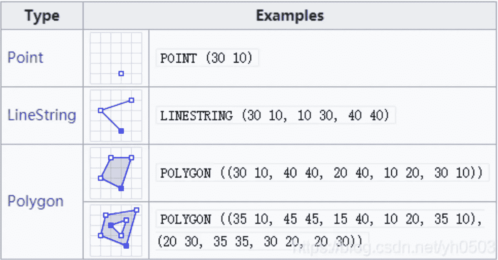
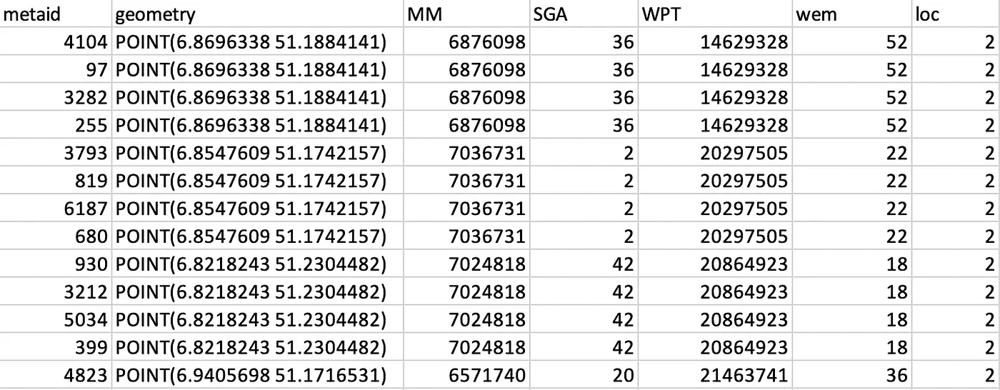
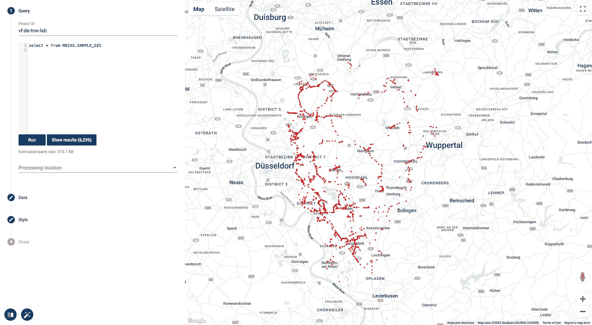
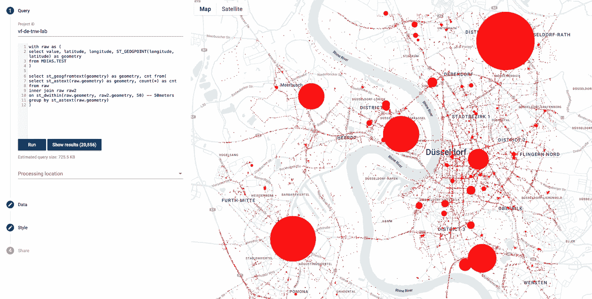

# 将 GIS 数据导入 BigQuery

> 原文：<https://medium.com/google-cloud/import-gis-data-into-bigquery-8217dc370040?source=collection_archive---------1----------------------->

## 您是否想知道如何将地理定位的数据导入 BigQuery？好了，不要再想了。


美国宇航局在 [Unsplash](https://unsplash.com?utm_source=medium&utm_medium=referral) 拍摄的照片

# 介绍

大数据不是很棒吗？确实是...它打开了分析世界的许多大门，设法在我们曾经认为不存在模式的地方找到了模式。关于这个主题已经做了很多工作，但不幸的是，大部分都是关于表格数据的。地理数据呢？是的，我们有许多处理地理数据的方法，但是这些方法真的适合大数据处理吗？答案听起来是否定的。

幸运的是，我们现在可以通过使用 BigQuery 获得基于云的大数据处理的好处。BigQuery 集成了几个 GIS 功能，允许我们以无服务器的方式操作非常大的地理表，优化后台查询，并消除 GeoFunctions 产生的巨大计算开销。

本文将重点关注将地理数据摄取到 BigQuery 环境中。

# 1.使用 CSV 导入

尽管可以轻松地将带有 WKT 编码的几何图形的 csv 导入 BigQuery，然后将其直接转换为*地理*数据类型，但是我们为什么要采取这些额外的步骤呢？

我们需要确保的第一件事是，我们有一个几何列为 WKT(众所周知的文本)的表。WKT 是普遍接受的几何编码方式:



图片提供:www.codetd.com

通常，Python 中的大多数地理空间包，如 *geopandas* 或 *shapely* 都具有将几何图形直接转换为 WKT 格式的功能。请注意，在撰写本文时，BigQuery 中只允许使用 WGS84 坐标，因此，如果需要，您可能需要将数据重新投影到 WGS84 中，但这超出了本文的范围。

这里的技巧是用预定义的模式加载数据。使用自动检测功能将不起作用，因为它会错误地认为几何图形是一个*字符串*而不是一个*地理位置*。

让我们看看我的样本文件:



作者图片

然后，我们转到我们信任的 Google Cloud SDK，在您的终端中运行命令:

```
> bq load --source_format=CSV --skip_leading_rows=1 --schema=metaid:INTEGER,geometry:GEOGRAPHY,MM:INTEGER,SGA:INTEGER,WPT:STRING,wem:INTEGER,loc:INTEGER MDIAS.SAMPLE_GIS ~/Documents/sample_gis.csv
```

*   **bq load** :将数据加载到 BigQuery 中的命令
*   **— source_format=CSV** :表格的格式
*   **— skip_leading_rows=1:** 跳过标题(第一行)
*   **—模式**:表的模式和数据类型，WKT 列为*地理*
*   MDIAS。SAMPLE_GIS :您的{数据库}。BigQuery 中的{table_name}
*   **~/Documents/sample _ GIS . CSV:**我的原始文件存放的地方。

> 在我看来，这是将地理数据导入 BigQuery 并从一开始就准备好地理数据类型的最简单方法。如果您有应该定期刷新的表，并且模式没有变化，那么这是最理想的方法。

现在你知道了。让我们看看 geoviz 中的 is:



谷歌 GeoViz。:作者图片

# 2.使用 GeoJSON 线导入

另一种导入数据的方式是用**GeoJSON Sequential**(GeoJsonSeq)**，**也称为**换行符 GeoJSON** 甚至 **GeoJSON 行** (geojsonl)。

GeoJSON 是交换地理数据的一种非常常见的格式。然而，在 GIS 中，非常大的数据集是常见的，GeoJSON 文件的结构通常需要将整个文件读入内存并一次性解码。此外，GeoJSONL 只能使用 WGS84 投影进行编码。

您可以借助地理操作工具(如 **GDAL)将自己的 shapefile 或地理数据库转换为 geojsonl 文件。**一旦安装了 GDAL，您就可以运行:

```
> ogr2ogr -f "GeoJSONSeq" destination_file.geojsonl source_file.{geojson,shp,etc}
```

请注意{geojson，shp 等}意味着你可以有几种不同的格式，GDAL 会识别并适当转换。这里只有阳光和彩虹。您可以像我们之前看到的那样执行简单的 bq 加载作业，例如:

```
> bq load --source_format=NEWLINE_DELIMITED_JSON --json_extension=GEOJSON --autodetect MDIAS.SAMPLE_GIS ~/Documents/sample_gis.geojsonl
```

*   **bq load** :将数据加载到 BigQuery 中的命令
*   **—source _ format = NEWLINE _ DELIMITED _ JSON**:表格的格式
*   **—JSON _ extension = GEOJSON**:因为我们用的是 geo JSON
*   **—自动检测**:在这种情况下，我们可以只使用自动检测作为模式
*   **MDIAS。SAMPLE_GIS** :您的{数据库}。BigQuery 中的{table_name}
*   **~/Documents/sample _ GIS . geojsonl**:我的原始文件存放的地方。

> 这种方式很好，但是需要做大量的预处理。此外，根据我的经验，geojson lines 虽然是一个优化的 geojson，但它仍然比 WKT 编码的 csv 文件大得多，这将增加加载时间。尽管如此，这也是一个很好的进口。

# 3.数据已经加载，但尚未转换

假设您在 BigQuery 中已经有了纬度和经度的数据，甚至还有 WKT 字符串或 GeoJSON 字符串形式的几何数据。别担心。Google 让你很容易地将其转换成地理数据类型。

## 经纬度

如果您的表中有纬度和经度，您所要做的就是使用 ST_GEOGPOINT( *经度，纬度*)来创建您的几何图形。例如:

```
with raw as (
select value, latitude, longitude, ST_GEOGPOINT(longitude, latitude) as geometry 
from MDIAS.TEST
)-- Let's get the areas with a higher density of datapoints within 50 -- meters.
select st_geogfromtext(geometry), cnt from(
  select st_astext(raw.geometry) as geometry, count(*) as cnt
  from raw
  inner join raw raw2
  on st_dwithin(raw.geometry, raw2.geometry, 50) -- 50meters
  group by st_astext(raw.geometry)
)
```

这里它被视觉化了:



Google GeoViz:作者图片

## 其他字符串

如果您在其他外部格式下定义了几何图形，您所要做的就是使用正确的 ST 函数:

*   **ST_GEOGFROM:** 会尝试弄清楚它是什么哪种格式，然后解析它。
*   **ST_GEOGFROMTEXT:** 将解析普通 WKT 字符串中的数据。例如:“点(52.5244，-110.3823)”
*   **ST_GEOGFROMGEOJSON** :将解析 GEOJSON 几何字符串中的几何图形。例:" *{ "type": "Point "，" coordinates": [6.78204，51.24976] }* "

您还可以使用其他函数，例如地理哈希或众所周知的二进制文件。您可以随时访问 BigQuery GeoFunctions 的文档:[https://cloud . Google . com/big query/docs/reference/standard-SQL/geography _ functions](https://cloud.google.com/bigquery/docs/reference/standard-sql/geography_functions)

# 结论:

*   BigQuery 是进行大规模地理处理的领先工具之一。
*   为了导入地理表，可能需要做一些预处理。
*   目前，可以使用 csv 和 geojson 导入地理数据。尚不支持使用 Shapefile 进行摄取(但它在 Google 的路线图上)。
*   如果在 bigquery 中已经有数据，那么只要有必要的属性(纬度、经度、wkt 等)，就可以将其转换成地理数据。

[](/mlearning-ai/mlearning-ai-submission-suggestions-b51e2b130bfb) [## Mlearning.ai 提交建议

### 如何成为 Mlearning.ai 上的作家

medium.com](/mlearning-ai/mlearning-ai-submission-suggestions-b51e2b130bfb)