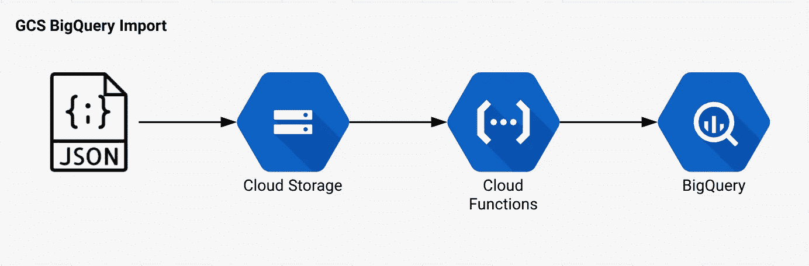

# 用 Google Cloud 函数将 JSON 导入 BigQuery

> 原文：<https://medium.com/google-cloud/import-json-into-bigquery-with-google-cloud-functions-31facea134bf?source=collection_archive---------0----------------------->

[BigQuery](https://cloud.google.com/bigquery/what-is-bigquery) 是构建[数据仓库](https://cloud.google.com/solutions/bigquery-data-warehouse)的强大工具，允许你存储海量数据并执行超快 SQL 查询，而无需构建或管理任何基础设施。

典型的 [ETL](https://en.wikipedia.org/wiki/Extract,_transform,_load) 过程包括三个步骤:

1.  **提取:**从一个数据源中提取数据，比如一个数据库(LDAP、MySQL、MongoDB 等。)或者一个 API (GitHub，Google，Workday 等。)
2.  **转换:**为目的地准备源数据(如有必要)。
3.  **加载:**将准备好的数据导入目的地。

不管您的数据源和准备数据需要采取的步骤是什么，都有几个将数据加载到 BigQuery 的选项。对于这个例子，我们将[从云存储](https://cloud.google.com/bigquery/docs/loading-data-cloud-storage)加载数据，特别是 [JSON](https://cloud.google.com/bigquery/docs/loading-data-cloud-storage-json) 。

一旦你的换行符分隔的 JSON 文件准备好加载，你就可以[将它上传](https://cloud.google.com/storage/docs/uploading-objects)到一个[云存储](https://cloud.google.com/storage/)桶，然后有几个如何将它放入 BigQuery 的选项。

*   [BigQuery 数据传输服务](https://cloud.google.com/bigquery/docs/cloud-storage-transfer)(安排 GCS 的重复数据加载。)
*   创建一个新的[装载任务](https://cloud.google.com/bigquery/docs/loading-data-cloud-storage-json#loading_json_data_into_a_table)。

我们希望能够随时加载新数据，而不是等待下一个计划的作业运行。因此，我们不使用数据传输服务，而是希望在文件上传后立即创建一个[加载作业](https://cloud.google.com/bigquery/docs/reference/rest/v2/jobs#configuration.load)。为了使事情尽可能简单，我们还想启用[模式自动检测](https://cloud.google.com/bigquery/docs/loading-data-cloud-storage-json#loading_json_data_with_schema_auto-detection)。

由于我们希望在每次有新文件上传到 GCS 时创建一个加载作业，所以我们可以简单地创建一个[云函数](https://cloud.google.com/functions/)来响应 [Google 云存储触发器](https://cloud.google.com/functions/docs/calling/storage)。

# 体系结构

使用这种设计，将数据放入 BigQuery 的过程非常简单:

1.  从数据源提取数据。
2.  将数据传输到换行符分隔的 JSON 中。
3.  将 JSON 文件上传到 GCS bucket。

当一个新文件被上传到正确的 GCS bucket 时，Cloud 函数被启动并创建一个新的带有模式自动检测的加载作业，它将数据加载到一个 BigQuery 表中。

# 来源

GitHub 上提供了云函数的源代码:

 [## lukwam/gcs-bigquery-import

### 将 JSON 文件从 GCS 导入 big query-luk wam/GCS-big query-Import 的云函数

github.com](https://github.com/lukwam/gcs-bigquery-import) 

# 装置

目前，这一切都假设您使用单个项目来托管 BigQuery 数据集、云函数和云存储桶，因此计算服务帐户上的默认 IAM 权限应该足够了。如果您的 BigQuery 数据位于不同于 Bucket 和 Cloud 函数的项目中，您将需要授予 BigQuery IAM 对计算服务帐户的访问权限。

1.  如果您还没有 GCP 项目，请创建一个。
2.  在项目中创建一个 GCS Bucket。
3.  更新`deploy.sh`脚本以反映你的`BUCKET`和`PROJECT`。
4.  运行`deploy.sh`将云功能部署到您的项目中。

# 使用

1.  用您的数据创建换行符分隔的 JSON 文件。
2.  将 JSON 文件作为`DATASET/TABLE.json`上传到 GCS bucket，其中`DATASET`和`TABLE`反映了您想要存储数据的 BigQuery 数据集和表的名称。

一旦 JSON 文件被上传到 GCS Bucket，Cloud 函数就会运行，确定数据集和表的名称(基于文件名)，然后创建一个启用了模式自动检测的新加载作业。

如果一切顺利，您可以为您的项目加载 [BigQuery 控制台](https://console.cloud.google.com/bigquery)，您将看到新创建的数据集和包含您的数据的表。

现在，开始编写一些 SQL 查询，尽情享受吧！