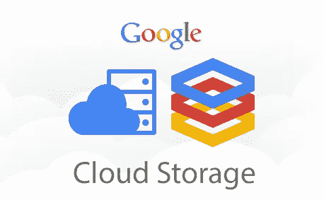

# 使用 Dataproc 无服务器将数据从数据库导入 GCS(通过 JDBC)

> 原文：<https://medium.com/google-cloud/importing-data-from-databases-into-gcs-via-jdbc-using-dataproc-serverless-f330cb0160f0?source=collection_archive---------1----------------------->


在运行 Spark 作业的同时管理服务器始终是一项挑战。对 Spark 作业使用完全托管的按需服务器是当今时代的需要。它帮助开发人员专注于核心应用程序逻辑，而不是花时间管理框架。Dataproc Serverless 就是 Google 云平台提供的一个这样的产品。


大多数事务数据仍然驻留在关系数据库服务器上，可以通过使用 JDBC 驱动程序来连接。MySQL、PostgreSQL 和 SQL Server 主要用于此目的。



当今世界正在转向基于云的存储服务来存储数据。它引发了谷歌云存储桶的使用。

这篇文章是关于通过 Dataproc 无服务器将数据从 JDBC 数据库传输到 GCS 桶。

# 主要优势

1.  使用 **Dataproc 无服务器**运行 Spark 批处理工作负载，无需管理 Spark 框架。批量大小也可以在该模板中配置。
2.  [**JDBCTOGCS**](https://github.com/GoogleCloudPlatform/dataproc-templates/tree/main/python/dataproc_templates/jdbc#2-jdbc-to-gcs) 模板是开源的，配置驱动的，随时可以使用。执行代码只需要 JDBC 和 GCS 证书。
3.  支持的文件格式有 csv、Avro、Parquet 和 ORC。
4.  [**GCSTOJDBC**](https://github.com/GoogleCloudPlatform/dataproc-templates/tree/main/python/dataproc_templates/gcs#gcs-to-jdbc) 模板可以反过来使用，即通过 JDBC 将数据从 GCS 导出到数据库。

# 使用

1.  如果你要使用“默认的”由 GCP 生成的 VPC 网络，请确保你已经启用了私有谷歌访问子网。您仍然需要启用如下的私人访问。


```
gcloud compute networks subnets update default --region=us-central1 --enable-private-ip-google-access
```

2.为 jar 文件创建一个 GCS 存储桶和暂存位置。

3.在预装了[各种工具](https://cloud.google.com/shell/docs/how-cloud-shell-works)的云壳中克隆 git repo。或者使用任何预装 python 和 Git 的机器。

```
git clone [https://github.com/GoogleCloudPlatform/dataproc-templates.git](https://github.com/GoogleCloudPlatform/dataproc-templates.git)
cd dataproc-templates/python
```

4.获取身份验证凭据(以提交作业)。

```
gcloud auth application-default login
```

5.先决条件

**所需的 JAR 文件**

这些模板要求 JDBC jar 文件在 Dataproc 集群中可用。用户必须下载所需的 jar 文件，并将其存放在 GCS Bucket 中，以便在代码执行期间可以引用它。

下载 JDBC jar 文件的 wget 命令如下

*   关系型数据库

```
wget [http://dev.mysql.com/get/Downloads/Connector-J/mysql-connector-java-5.1.30.tar.gz](http://dev.mysql.com/get/Downloads/Connector-J/mysql-connector-java-5.1.30.tar.gz)
```

*   一种数据库系统

```
wget [https://jdbc.postgresql.org/download/postgresql-42.2.6.jar](https://jdbc.postgresql.org/download/postgresql-42.2.6.jar)
```

*   Microsoft SQL Server

```
wget [https://repo1.maven.org/maven2/com/microsoft/sqlserver/mssql-jdbc/6.4.0.jre8/mssql-jdbc-6.4.0.jre8.jar](https://repo1.maven.org/maven2/com/microsoft/sqlserver/mssql-jdbc/6.4.0.jre8/mssql-jdbc-6.4.0.jre8.jar)
```

下载完 jar 文件后，请将文件上传到 GCS Bucket 中，并导出下面的变量

```
export JARS=<gcs-bucket-location-containing-jar-file>
```

## JDBC URL 语法

*   关系型数据库

```
jdbc:mysql://<hostname>:<port>/<dbname>?user=<username>&password=<password>
```

*   一种数据库系统

```
jdbc:postgresql://<hostname>:<port>/<dbname>?user=<username>&password=<password>
```

*   Microsoft SQL Server

```
jdbc:sqlserver://<hostname>:<port>;databaseName=<dbname>;user=<username>;password=<password>
```

**其他重要属性**

**驱动程序类**

1.关系型数据库

```
jdbctogcs.input.driver="com.mysql.cj.jdbc.Driver"
```

2.一种数据库系统

```
jdbctogcs.input.driver="org.postgresql.Driver"
jdbctogcs.input.driver="org.postgresql.Driver"
```

3.Microsoft SQL Server

```
jdbctogcs.input.driver="com.microsoft.sqlserver.jdbc.SQLServerDriver"
jdbctogcs.input.driver="com.microsoft.sqlserver.jdbc.SQLServerDriver"
```

*   您可以指定源表名，也可以用双引号将 SQL 查询括起来。例子，

```
jdbctogcs.input.table="employees"
jdbctogcs.input.table="(select * from employees where dept_id>10) as employees"
```

*   partitionColumn、lowerBound、upperBound 和 numPartitions 必须一起使用。如果指定了一个，则需要指定所有。
*   附加执行细节[参考 spark jdbc 文档](https://spark.apache.org/docs/latest/sql-data-sources-jdbc.html)

6.使用

```
$ python main.py --template JDBCTOGCS --helpusage: main.py --template JDBCTOGCS \
    --jdbctogcs.input.url JDBCTOGCS.INPUT.URL \
    --jdbctogcs.input.driver JDBCTOGCS.INPUT.DRIVER \
    --jdbctogcs.input.table JDBCTOGCS.INPUT.TABLE \
    --jdbctogcs.output.location JDBCTOGCS.OUTPUT.LOCATION \
    --jdbctogcs.output.format {avro,parquet,csv,json} \optional arguments:
    -h, --help            show this help message and exit
    --jdbctogcs.input.partitioncolumn JDBCTOGCS.INPUT.PARTITIONCOLUMN \
    --jdbctogcs.input.lowerbound JDBCTOGCS.INPUT.LOWERBOUND \
    --jdbctogcs.input.upperbound JDBCTOGCS.INPUT.UPPERBOUND \
    --jdbctogcs.numpartitions JDBCTOGCS.NUMPARTITIONS \
    --jdbctogcs.output.mode {overwrite,append,ignore,errorifexists} \
    --jdbctogcs.output.partitioncolumn JDBCTOGCS.OUTPUT.PARTITIONCOLUMN \
```

**论据**

*   `jdbctogcs.input.url` : JDBC 输入网址
*   `jdbctogcs.input.driver` : JDBC 输入司机姓名
*   `jdbctogcs.input.table` : JDBC 输入表格名称
*   `jdbctogcs.output.location`:输出文件的 GCS 位置(格式:`gs://BUCKET/...`)
*   `jdbctogcs.output.format`:输出文件格式(avro、parquet、csv、json 之一)
*   `jdbctogcs.input.partitioncolumn`(可选):JDBC 输入表分区的列名
*   `jdbctogcs.input.lowerbound`(可选):JDBC 输入表分区列的下限，用来决定分区步距
*   `jdbctogcs.input.upperbound`(可选):JDBC 输入表分区列的上界，用来决定分区步距
*   `jdbctogcs.numpartitions`(可选):表读写中可用于并行的最大分区数。相同的值将用于输入和输出 jdbc 连接。默认设置为 10
*   `jdbctogcs.output.mode`(可选):输出写入模式(追加、覆盖、忽略、错误存在中的一种)(默认为追加)
*   `jdbctogcs.output.partitioncolumn`(可选):输出分区列名

## 一般执行:

```
export GCP_PROJECT=<gcp-project-id> 
export REGION=<region>  
export GCS_STAGING_LOCATION=<gcs staging location> 
export SUBNET=<subnet>   
export JARS="<gcs_path_to_jdbc_jar_files>/mysql-connector-java-8.0.29.jar,<gcs_path_to_jdbc_jar_files>/postgresql-42.2.6.jar,<gcs_path_to_jdbc_jar_files>/mssql-jdbc-6.4.0.jre8.jar"./bin/start.sh \
-- --template=JDBCTOGCS \
--jdbctogcs.input.url="jdbc:mysql://<hostname>:<port>/<dbname>?user=<username>&password=<password>" \
--jdbctogcs.input.driver=<jdbc-driver-class-name> \
--jdbctogcs.input.table=<input table name or subquery with where clause filter> \
--jdbctogcs.input.partitioncolumn=<optional-partition-column-name> \
--jdbctogcs.input.lowerbound=<optional-partition-start-value>  \
--jdbctogcs.input.upperbound=<optional-partition-end-value>  \
--jdbctogcs.numpartitions=<optional-partition-number> \
--jdbctogcs.output.location=<gcs-output-location> \
--jdbctogcs.output.mode=<optional-write-mode> \
--jdbctogcs.output.format=<output-write-format> \
--jdbctogcs.output.partitioncolumn=<optional-output-partition-column-name>
```

## 示例执行:

```
export GCP_PROJECT=my-gcp-proj
export REGION=us-central1 
export GCS_STAGING_LOCATION=gs://my-gcp-proj/staging
export SUBNET=projects/my-gcp-proj/regions/us-central1/subnetworks/default   
export JARS="gs://my-gcp-proj/jars/mysql-connector-java-8.0.29.jar,gs://my-gcp-proj/jars/postgresql-42.2.6.jar,gs://my-gcp-proj/jars/mssql-jdbc-6.4.0.jre8.jar"
```

*   MySQL 到 GCS

```
./bin/start.sh \
-- --template=JDBCTOGCS \
--jdbctogcs.input.url="jdbc:mysql://1.1.1.1:3306/mydb?user=root&password=password123" \
--jdbctogcs.input.driver="com.mysql.cj.jdbc.Driver" \
--jdbctogcs.input.table="(select * from employees where id <10) as employees" \
--jdbctogcs.input.partitioncolumn="id" \
--jdbctogcs.input.lowerbound="11" \
--jdbctogcs.input.upperbound="20" \
--jdbctogcs.numpartitions="4" \
--jdbctogcs.output.location="gs://output_bucket/output/" \
--jdbctogcs.output.mode="overwrite" \
--jdbctogcs.output.format="csv" \
--jdbctogcs.output.partitioncolumn="department_id"
```

*   PostgreSQL 到 GCS

```
./bin/start.sh \
-- --template=JDBCTOGCS \
--jdbctogcs.input.url="jdbc:postgresql://1.1.1.1:5432/postgres?user=postgres&password=password123" \
--jdbctogcs.input.driver="org.postgresql.Driver" \
--jdbctogcs.input.table="(select * from employees) as employees" \
--jdbctogcs.input.partitioncolumn=id \
--jdbctogcs.input.lowerbound="11" \
--jdbctogcs.input.upperbound="20" \
--jdbctogcs.numpartitions="4" \
--jdbctogcs.output.location="gs://output_bucket/output/" \
--jdbctogcs.output.mode="overwrite" \
--jdbctogcs.output.format="csv" \
--jdbctogcs.output.partitioncolumn="department_id"
```

*   Microsoft SQL Server 到 GCS

```
./bin/start.sh \
-- --template=JDBCTOGCS \
--jdbctogcs.input.url="jdbc:sqlserver://1.1.1.1:1433;databaseName=mydb;user=sqlserver;password=password123" \
--jdbctogcs.input.driver="com.microsoft.sqlserver.jdbc.SQLServerDriver" \
--jdbctogcs.input.table="employees" \
--jdbctogcs.input.partitioncolumn=id \
--jdbctogcs.input.lowerbound="11" \
--jdbctogcs.input.upperbound="20" \
--jdbctogcs.numpartitions="4" \
--jdbctogcs.output.location="gs://output_bucket/output/" \
--jdbctogcs.output.mode="overwrite" \
--jdbctogcs.output.format="csv" \
--jdbctogcs.output.partitioncolumn="department_id"
```

**注意**:如果尚未启用，它会要求您启用 Dataproc Api。

# 设置附加火花属性

如果您需要[指定 Dataproc 无服务器支持的 spark 属性](https://cloud.google.com/dataproc-serverless/docs/concepts/properties)，如调整驱动程序、内核、执行器等的数量。

您可以编辑 start.sh 文件中的 [OPT_PROPERTIES](https://github.com/GoogleCloudPlatform/dataproc-templates/blob/main/python/bin/start.sh) 值。

**参考文献**

*   [Dataproc 无服务](https://cloud.google.com/dataproc-serverless/docs/overview)
*   [Dataproc 模板库](https://github.com/GoogleCloudPlatform/dataproc-templates)