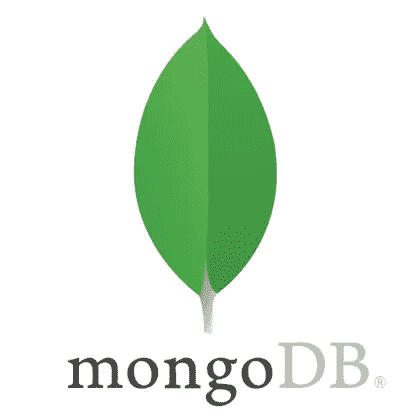

# 使用 Dataproc Serverless 将数据从 GCS 导入 MongoDB

> 原文：<https://medium.com/google-cloud/importing-data-from-gcs-to-mongodb-using-dataproc-serverless-fed58904633a?source=collection_archive---------0----------------------->


在运行 Spark 作业的同时管理服务器始终是一项挑战。对 Spark 作业使用完全托管的按需服务器是当今时代的需要。它帮助开发人员专注于核心应用程序逻辑，而不是花时间管理框架。Dataproc Serverless 就是 Google 云平台提供的一个这样的产品。


当今世界正在转向基于云的存储服务来存储数据。它引发了谷歌云存储桶的使用。不管数据的文件格式如何，都可以很容易地将数据存储在 GCS 桶中。这是一种非常经济高效的存储大型数据文件的方式，尤其是当数据以 TB 为单位时。



NoSQL 数据库目前需求量很大。其中 MongoDB 非常有名。MongoDB 基本上是一个面向文档的数据库，以 BSON(二进制 JSON)的形式写数据。

使用 MongoDB 的一个主要原因是为了处理大规模的非结构化数据。因此，从基于云的技术向 MongoDB 导入数据是一个非常常见的用例。但是，如果，输入格式和 JSON 结构不一样。在这种情况下，本文将帮助您通过 Dataproc Serverless 将数据从 GCS Buckets 导入 MongoDB 集合，而不管它们的文件格式。

# 主要优势

1.  使用 **Dataproc 无服务器**运行 Spark 批处理工作负载，无需管理 Spark 框架。批量大小也可以在该模板中配置。
2.  [**GCSToMONGO**](https://github.com/GoogleCloudPlatform/dataproc-templates/blob/main/python/dataproc_templates/gcs/README.md) 模板是开源的，配置驱动的，随时可以使用。执行代码只需要 MongoDB 和 GCS 凭证。
3.  支持的文件格式有 JSON、Avro、Parquet 和 CSV。

# 使用

1.为 jar 文件创建一个 GCS 存储桶和暂存位置。

2.在预装了[各种工具](https://cloud.google.com/shell/docs/how-cloud-shell-works)的云壳中克隆 git repo。或者使用任何预装 JDK 8+，Maven 和 Git 的机器。

```
git clone [https://github.com/GoogleCloudPlatform/dataproc-templates.git](https://github.com/GoogleCloudPlatform/dataproc-templates.git)
cd dataproc-templates/python
```

3.获取身份验证凭据(以提交作业)。

```
gcloud auth application-default login
```

4.执行 GCSToJDBC 模板。
例如:

```
export GCP_PROJECT=my-gcp-project
export REGION=us-central1
export GCS_STAGING_LOCATION=gs://staging-bucket
export JARS="gs://jar_location/mongo-java-driver-3.9.1.jar,gs://jar_location/mongo-spark-connector_2.12-2.4.0.jar"./bin/start.sh \
-- --template=GCSTOMONGO \
--gcs.mongo.input.format="avro" \
--gcs.mongo.input.location="gs://GCS_Bucket_Name/empavro" \
--gcs.mongo.output.uri="mongodb://1.2.3.45:27017" \
--gcs.mongo.output.database="demo" \
--gcs.mongo.output.collection="analysis" \
--gcs.mongo.output.mode="overwrite"
```

**注意**:如果尚未启用，它会要求您启用 Dataproc Api。

# 计划批处理作业

GCP 原生提供云调度器+云功能，可用于提交 spark 批处理作业。或者自我管理的软件，如 linux cron tab，Jenkins 等。也可以使用。

# 利用大规模数据优化性能

对于数据工程师来说，处理大规模数据(以 TB 为单位)无疑是一个挑战。但是，这个编码模板也提供了解决方案。有一个可选参数“批处理大小”，可以根据数据大小进行调整。批处理大小是驱动程序一次从服务器请求的文档数量。默认情况下，MongoDB 提供的批量大小是 512。

```
--gcs.mongo.batch.size=512
```

# 设置附加火花属性

如果您需要[指定 Dataproc 无服务器支持的 spark 属性](https://cloud.google.com/dataproc-serverless/docs/concepts/properties),比如调整驱动程序、内核、执行器等的数量。

您可以编辑 start.sh 文件中的 [OPT_PROPERTIES](https://github.com/GoogleCloudPlatform/dataproc-templates/blob/main/java/bin/start.sh#L50) 值。

**参考资料**
[https://medium . com/Google-cloud/importing-data-from-GCS-to-databases-via-JDBC-using-data proc-server less-7ed 75 eab 93 ba](/google-cloud/importing-data-from-gcs-to-databases-via-jdbc-using-dataproc-serverless-7ed75eab93ba)
[https://github.com/GoogleCloudPlatform/dataproc-templates](https://github.com/GoogleCloudPlatform/dataproc-templates)