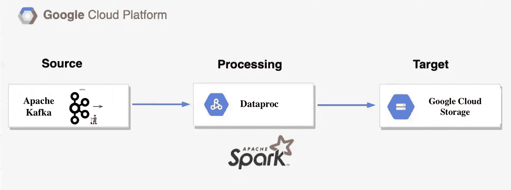
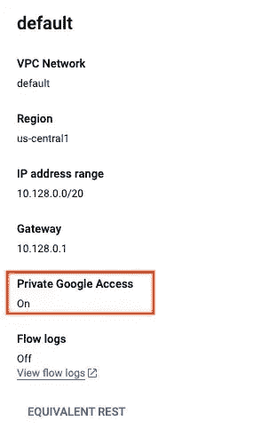

# 使用 Dataproc 无服务器将数据从 Kafka 导入 GCS

> 原文：<https://medium.com/google-cloud/importing-data-from-kafka-to-gcs-using-dataproc-serverless-38e449d559f9?source=collection_archive---------7----------------------->

数据，现代每个行业都在说的新语言。

*问:数据为什么或如何在任何业务中发挥重要作用？*

*答:因为数据有助于你做出决策，了解你的业务健康状况，推动你的业务等等。*

因此，在形成有意义的状态之前，数据在数据管道中经历了不同的阶段。

*今天我们将讨论如何将数据从 Apache kafka 传输到 GCS。*

为了实现这一点，我们在 GCP 上运行了一个 dataproc 模板。就这样，简单？没错。现在，让我们简单了解一下所有组件的构成，让它看起来简单而强大。



> Dataproc 是一个完全托管和高度可伸缩的服务，用于运行 Apache Hadoop、Spark、Flink、Presto 和 30 多个开源工具和框架。

今天我们将在 Dataproc 上运行 Apache spark，现在让我们看看什么是 Apache Spark。

> Apache Spark 是一个用于大规模数据处理的开源统一分析引擎。Spark 提供了一个接口，用于编程具有隐式数据并行和容错的集群

到目前为止，我们已经定义并理解了我们的处理引擎，现在让我们看看源和目的地。我们的消息来源是阿帕奇卡夫卡。

> Apache Kafka 是一个分布式事件存储和流处理平台。它是由 Apache 软件基金会开发的开源系统，用 Java 和 Scala 编写。该项目旨在为处理实时数据馈送提供一个统一的、高吞吐量、低延迟的平台

我们的目的地是谷歌云存储(GCS)

> GCS 是一个 RESTful 在线文件存储 web 服务，用于在 Google 云平台基础设施上存储和访问数据。该服务将谷歌云的性能和可扩展性与先进的安全和共享功能结合在一起

因此，要将数据从 kafka 转移到 GCS，只需运行一个模板，它已经就位。[Google 云平台开发的 Dataproc 模板](https://github.com/GoogleCloudPlatform/dataproc-templates/blob/main/java/src/main/java/com/google/cloud/dataproc/templates/kafka/KafkaToGCS.java)。

# 执行 Dataproc 模板的步骤

1.克隆 Dataproc 模板库并导航到 java 模板文件夹。

```
git clone https://github.com/GoogleCloudPlatform/dataproc-templates.git
cd dataproc-templates/java
```

2.获取身份验证凭据以提交作业。

```
gcloud auth application-default login
```

3.请确保您已经启用了带有专用 Google 访问的子网。如果您使用的是 GCP 创建的“默认”VPC，您仍然需要启用如下的私人访问。



4.通过导出提交所需的变量来配置 Dataproc 无服务器作业—

`GCP_PROJECT`:运行 Dataproc 无服务器的 GCP 项目 id

`REGION`:运行 Dataproc 无服务器的区域

`GCS_STAGING_LOCATION` : GCS 暂存桶位置，在步骤 3 中创建

`SUBNET`:运行 Dataproc 无服务器的 VPC 子网，如果不使用默认子网的话(格式:*projects/<project _ id>/regions/<region>/subnetworks/<子网> )*

`HISTORY_SERVER_CLUSTER`:作为 Spark 历史服务器的现有 Dataproc 集群。该属性可用于指定专用服务器，您可以在其中查看正在运行和已完成的 Spark 作业的状态

```
export GCP_PROJECT=<project_id>
export REGION=<region>
export GCS_STAGING_LOCATION=<gcs-staging-bucket-folder>
export SUBNET=<vpc-subnet>
export HISTORY_SERVER_CLUSER=projects/<project_id>/regions/<region>/clusters/<cluster_name>
```

6.现在运行 KafkaToGCS 模板

示例执行命令:

```
export GCP_PROJECT=dp-test-project
export REGION=us-central1
export SUBNET=test-subnet
export GCS_STAGING_LOCATION=gs://dp-templates-kakfatogcs/stg
export GCS_SCHEMA_FILE=gs://dp-templates-kafkatogcs/schema/msg_schema.json
export GCS_OUTPUT_PATH=gs://dp-templates-kafkatogcs/output/
bin/start.sh \
-- --template KAFKATOGCS \
--templateProperty project.id=$GCP_PROJECT \
--templateProperty kafka.bootstrap.servers=102.1.1.20:9092 \
--templateProperty kafka.topic=events-topic \
--templateProperty kafka.starting.offset=latest \
--templateProperty kafka.schema.url=$GCS_SCHEMA_FILE \
--templateProperty kafka.gcs.await.termination.timeout.ms=1200000 \
--templateProperty kafka.gcs.output.location=$GCS_OUTPUT_PATH \
--templateProperty kafka.gcs.output.format=parquet
```

[更多](https://github.com/GoogleCloudPlatform/dataproc-templates/blob/main/java/src/main/java/com/google/cloud/dataproc/templates/kafka/README.md#2-kafka-to-gcs)信息运行模板

7.监控 Spark 批处理作业

提交作业后，您将能够在 Dataproc 批处理 UI 中查看作业。从那里，我们可以查看作业的指标和日志。

# 参考

*   [Dataproc 无服务器文档](https://cloud.google.com/dataproc-serverless/docs/overview)
*   [Dataproc 模板 GitHub 库](https://github.com/GoogleCloudPlatform/dataproc-templates)
*   [结构化流媒体+ Kafka 集成指南](https://spark.apache.org/docs/2.2.0/structured-streaming-kafka-integration.html#structured-streaming-kafka-integration-guide-kafka-broker-versio)