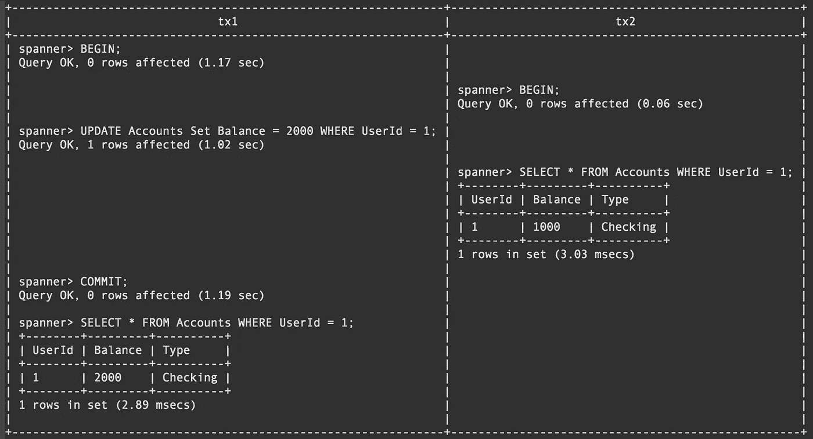
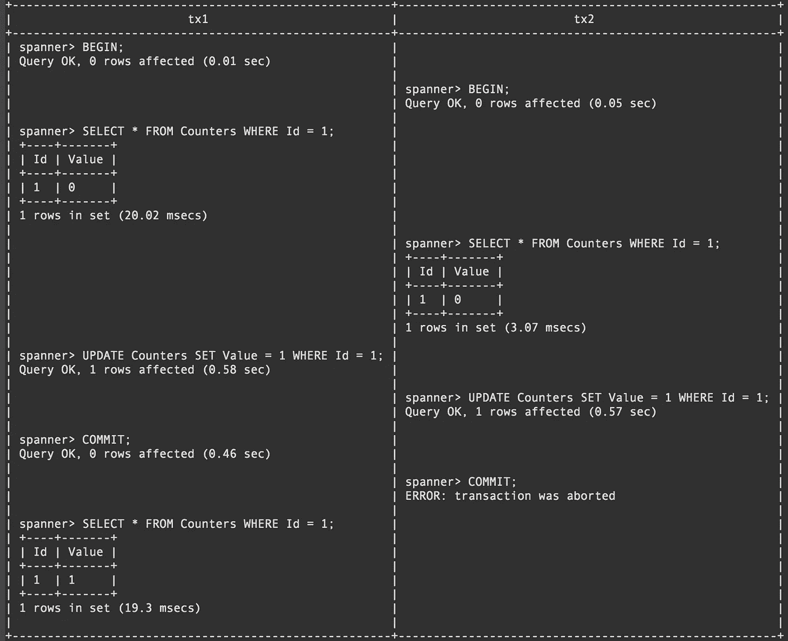
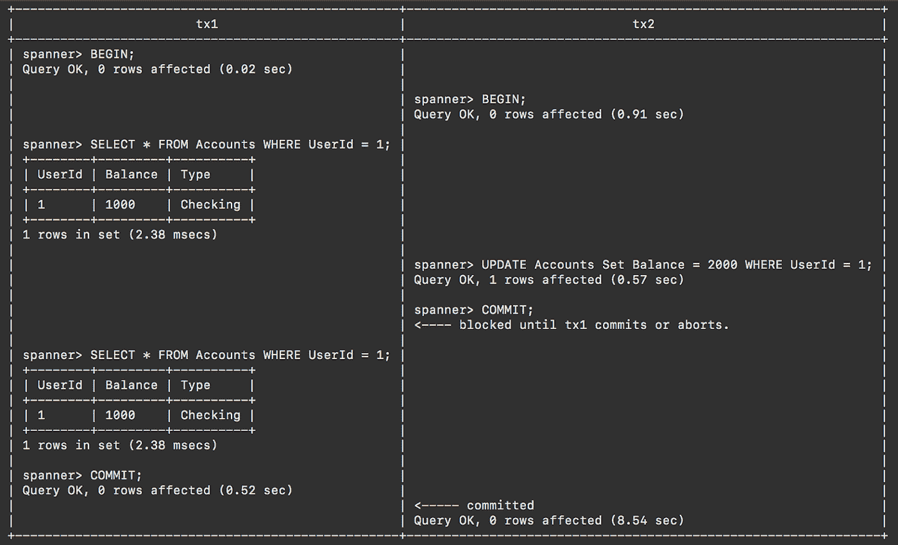
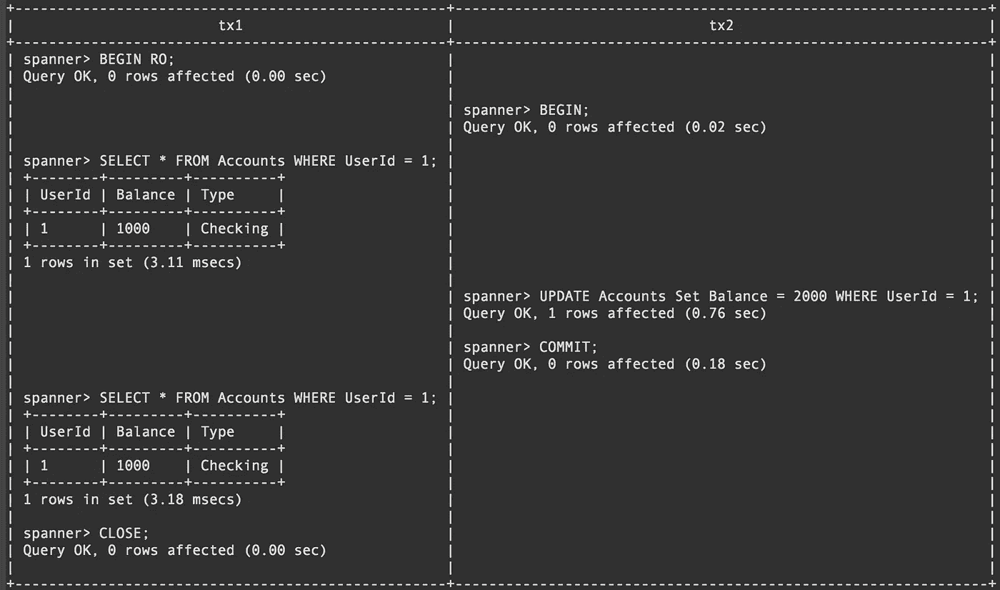
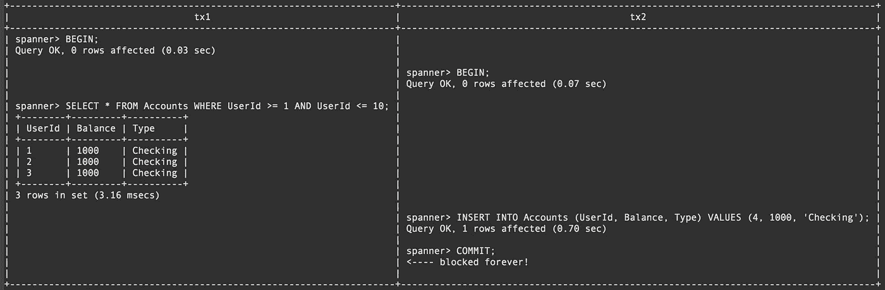
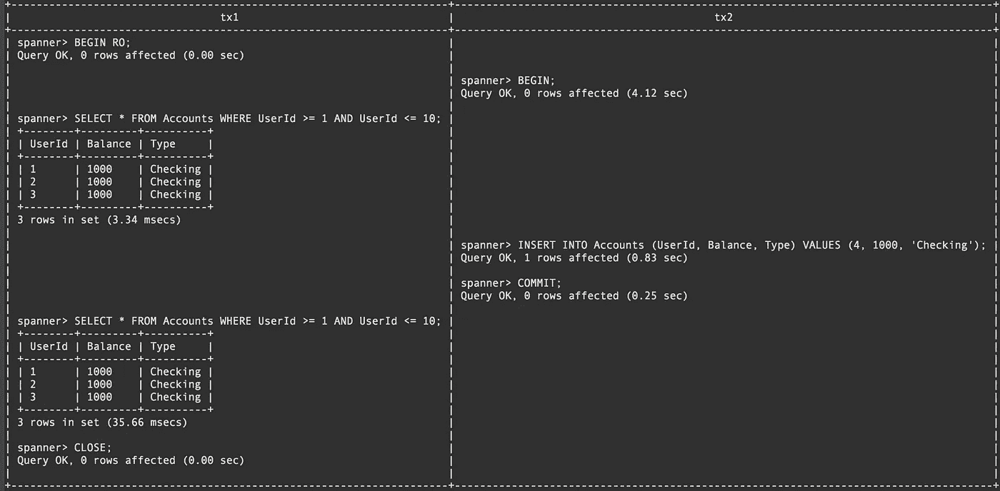
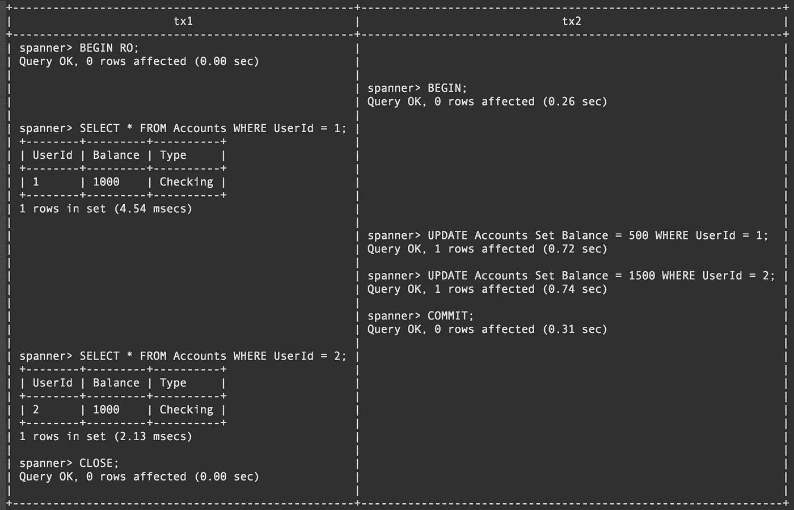
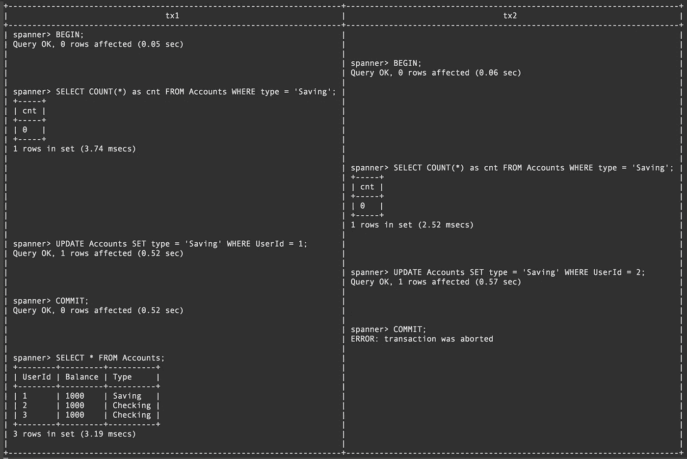

# 云扳手不可能出现读写隔离现象

> 原文：<https://medium.com/google-cloud/impossible-read-and-write-isolation-phenomena-with-cloud-spanner-8aee06bb6e70?source=collection_archive---------0----------------------->


# 介绍

Cloud Spanner 通过[外部一致性](https://cloud.google.com/spanner/docs/true-time-external-consistency#external_consistency)提供最严格的并发控制。这保证了多个事务同时运行，而没有不一致的可能性。

在本文中，我将演示以下 6 种事务隔离现象是如何在 Cloud Spanner 中不被允许的。

1.  脏读
2.  丢失的更新
3.  不可重复读取
4.  幻像读取
5.  读取偏斜
6.  写入偏斜

# 测试工具

我们将使用名为[的交互式 CLI 工具 spanner-cli](https://github.com/yfuruyama/spanner-cli) 来运行多个事务。使用 spanner-cli，我们可以交互式地运行任意 SQL 语句，类似于使用 mysql 命令。

你可以在 https://github.com/yfuruyama/spanner-cli[的 GitHub 上找到源代码](https://github.com/yfuruyama/spanner-cli)

[](https://github.com/yfuruyama/spanner-cli) [## yfuruyama/spanner-cli

### 扳手-cli，云扳手命令行界面。- yfuruyama/spanner-cli

github.com](https://github.com/yfuruyama/spanner-cli) 

1.  为我们的测试准备数据库:

```
$ spanner-cli -p $PROJECT -i $INSTANCE -d $DATABASE
```

2.在您的 CLI 会话中复制并粘贴以下 DML 和 DDL。

```
CREATE TABLE Accounts (
  UserId INT64 NOT NULL,
  Balance INT64 NOT NULL,
  Type STRING(16) NOT NULL
) PRIMARY KEY (UserId);

CREATE TABLE Counters (
  Id INT64 NOT NULL,
  Value Int64 NOT NULL
) PRIMARY KEY (Id);

INSERT INTO Accounts (UserId, Balance, Type) VALUES (1, 1000, 'Checking'), (2, 1000, 'Checking'), (3, 1000, 'Checking');INSERT INTO Counters (Id, Value) VALUES (1, 0);
```

让我们打开两个终端控制台，用 spanner-cli 连接到我们的云 Spanner 数据库。

# 1.脏读

首先，我们将演示在 Cloud Spanner 中不允许脏读。脏读发生在一个事务可以读取正在被另一个事务修改的未提交记录的情况下。这可能发生在允许 READ UNCOMMITTED 隔离级别的关系数据库中。

在下面的例子中，我们展示了当 tx1 将*余额*更改为 2000 时，tx2 只能读取原始值 1000，直到 tx1 提交。



[https://gist . github . com/yfuruyama/1d 24d 503 ab 0 DFA 1 f 16 E0 C2 e 62 a 479 c4e](https://gist.github.com/yfuruyama/1d24d503ab0dfa1f16e0c2e62a479c4e)

在 Cloud Spanner 中，使用 DML(插入/更新/删除)语句执行的所有突变都在服务器端进行[缓冲，这些突变不会应用于记录，除非它们被提交。](https://cloud.google.com/spanner/docs/dml-best-practices#dml-and-mutation)

# 2.丢失的更新

更新丢失描述了一个事务中的修改被另一个事务覆盖的情况，这导致原始修改消失。

让我们以递增计数器为例。

1.  获取计数器的*当前值*
2.  用*当前值+ 1* 更新计数器

如果两个事务相继执行上述操作，我们预计最终结果为 *old_counter_value* +2。然而，如果操作#1 在两个事务中同时发生，并且两个事务都成功提交，则最终结果将是 *old_counter_value* +1，因为最后提交的事务获胜。

让我们检查丢失的更新不会发生在云扳手。



[https://gist . github . com/yfuruyama/a2 Fe F5 CFA BF 7 f 94 b 8 c 4869943783242d](https://gist.github.com/yfuruyama/a2fef5cfabf7f94b8c4869943783242d)

您可以看到 tx1 能够成功提交，但是 tx2 在提交时被中止。这是因为此时调用了名为[wind-wait](https://stackoverflow.com/questions/32794142/what-is-the-difference-between-wait-die-and-wound-wait)的死锁预防机制，该机制中止了较新的事务，并让较旧的事务成功。

在读写事务期间，Cloud Spanner 试图获取要读取的记录上的共享读锁，并试图在更新(写入)期间获取记录上的独占锁。为了获得该记录的排他锁，不允许任何其他事务持有共享锁。如果一个事务已经获得了记录上的共享锁，而另一个事务需要同一记录上的独占锁，则 Cloud Spanner 会比较事务时间戳并中止较新的事务，以将独占锁授予较旧的事务。

在上面的示例中，虽然 tx1 和 tx2 都有一个记录上的共享锁，但是由于 tx1 已经在之前运行了 SELECT 语句(在获取事务年龄时间戳的时候)，Cloud Spanner 中止 tx2 以获取 tx1 的独占锁。

在一些 RDBMS 中，比如 MySQL，通常通过用[锁读](https://dev.mysql.com/doc/refman/8.0/en/innodb-locking-reads.html) ( *SELECT FOR UPDATE* )显式锁定记录来防止更新丢失。

注意:中止的事务会在所有 Google 维护的客户端库中自动重试(例如 [Go 客户端](https://godoc.org/cloud.google.com/go/spanner#hdr-Aborted_transactions)。如果在 Cloud Spanner 事务中进行非 Spanner 操作，让整个函数幂等以确保不会出现副作用是一个很好的实践。

# 3.不可重复读取

当在一个事务中对同一条记录的重复读取导致从数据库返回不同的值时，就会发生不可重复读取。这可能发生在允许 READ COMMITTED 隔离级别的关系数据库中。

让我们检查一下在 Cloud Spanner 中不可重复的读取不会发生。在本演示中，tx1 尝试多次读取记录，tx2 在多次读取过程中向记录写入新值。



[https://gist . github . com/yfuruyama/3a 5668 cc 1322 DC 5 ed 2 f1 ee 5 f 59d 07 DCD](https://gist.github.com/yfuruyama/3a5668cc1322dc5ed2f1ee5f59d07dcd)

在上面的场景中，由于 tx1 在 tx2 获得排他锁之前已经获得了记录上的共享锁，所以 tx2 必须等待获得排他锁，直到 tx1 释放共享锁。因此，tx2 一直被阻塞，直到 tx1 提交或中止事务。

这就是[只读事务](https://cloud.google.com/spanner/docs/transactions#read-only_transactions)发挥作用的地方。在只读事务中，只允许使用 SELECT 语句，这些语句不会阻塞读写事务，因为它们不获取任何锁。

让我们看看如果 tx1 使用只读事务会发生什么。您可以使用 BEGIN RO 语句在 spanner-cli 中运行只读事务。



[https://gist . github . com/yfuruyama/2 EC 4 e 05 c 7 ed 54 aae 787 cbbc 52 FDD 8271](https://gist.github.com/yfuruyama/2ec4e05c7ed54aae787cbbc52fdd8271)

如您所见，tx1 在 tx2 更新记录之前和之后都读取了相同的值。没有发生不可重复的读取。

只读事务通过第一个 SELECT 语句的执行时间戳获得一致的数据库视图。所有后续查询都将在事务时间戳读取数据。这是通过 [TrueTime](https://cloud.google.com/spanner/docs/true-time-external-consistency) 和 Cloud Spanner 使用仅附加存储实现的，这允许对过去进行一致的查看。

# 4.幻像读取

幻像读取描述了当另一个事务插入符合读取查询的新记录时，事务中重复读取的结果集发生变化的情况。

假设有三条记录( *UserID=1~3)* ，一个事务正在重复执行查询 SELECT * FROM Accounts，其中 UserID>= 1&&UserID<= 10。在这种情况下，如果另一个事务插入一个新记录( *UserId=4)* ，它将导致第一个事务读取一个新的*幻影*记录。

让我们看看云扳手是如何不允许幻影读取的。首先，让我们看看如果使用读写事务会发生什么。



[https://gist . github . com/yfuruyama/CBA 2b 942 c 89 fc00 d 228511 a 01d 3336d 1](https://gist.github.com/yfuruyama/cba2b942c89fc00d228511a01d3336d1)

与不可重复读取的情况类似，tx2 在提交时阻塞。这表明不仅满足 WHERE 条件的 *UserID=1~3* 之间的记录，而且 *UserId=4~10* 之间的记录都包含在共享锁中。这类似于 MySQL 中的[间隙锁](https://dev.mysql.com/doc/refman/8.0/en/innodb-locking.html#innodb-gap-locks)机制。

如果 tx1 使用只读事务，tx2 可以成功提交，并且 tx1 中不会发生幻像读取。



[https://gist . github . com/yfuruyama/3 AC 84 E0 C5 D2 a3 a 7 a 02 cf 8738 b 24 e 35 ca](https://gist.github.com/yfuruyama/3ac84e0c5d2a3a7a02cf8738b24e35ca)

# 5.读取偏斜

读取偏斜是指一个事务正在读取多条记录，而同时另一个事务更新了其中一条记录，这将导致不可序列化的事务，因为第二个事务交叉在第一个事务中。

这类似于不可重复读取，但相反，读取偏斜指的是在读取多个不同记录时交叉多个事务的冲突。

让我们想象以下场景。我们有两个账户，两个账户都有 1000 英镑的余额。有两个事务正在运行，其中一个事务读取两个账户的*余额*，另一个事务以交错的方式更新它们。在这种情况下，如果执行 SELECT 语句的事务获得第一个帐户的 *Balance=1000* ，而获得第二个帐户的 *Balance=1500* ，则认为是不一致的读取。

让我们检查一下在 Cloud Spanner 中没有发生读偏斜。以下示例显示了 tx1 读取 *UserId=1* 和 *UserId=2* 的记录，而 tx2 更新这两个记录的情况。



[https://gist . github . com/yfuruyama/68 b8f 166 ffba 273 c 665482832 cf 9 fc 2 e](https://gist.github.com/yfuruyama/68b8f166ffba273c665482832cf9fc2e)

如您所见，tx1 获得了一致的读取，而不受 tx2 的影响。请注意，tx1 使用了一个只读事务来阻止 tx2 中的更新。

# 6.写入偏斜

当两个事务并发运行，并在读取相同记录时尝试更新不同记录时，会发生写入偏斜，从而导致不一致的写入。

例如，假设*账户*表有一定的规则:最多只有一条记录有*类型=保存*。根据该规则，如果两个事务同时执行以下操作，

1.  通过选择 COUNT(*)FROM Accounts WHERE type = " Saving "检查当前的储蓄账户数；
2.  如果储蓄账户的数量为零，则将其中一个记录更改为储蓄账户。

那么这两个交易就有可能同时执行，结果两个账户就变成了储蓄账户。这违反了规则。

让我们检查一下，在上面的场景中，Cloud Spanner 中没有发生写偏斜。



[https://gist . github . com/yfuruyama/4516 Fe 4c 9 b 94 C1 ceae 34 f 8332 DC 4 F5 CD](https://gist.github.com/yfuruyama/4516fe4c9b94c1ceae34f8332dc4f5cd)

如您所见，当 tx1 成功提交时，tx2 在提交阶段被中止。出现这种情况的原因是 tx1 试图获取独占锁，但该记录的共享锁已被 tx2 获取，因此 Cloud Spanner 中止 tx2 为 tx1 获取独占锁。因此，只有一个事务可以成功提交。

# 摘要

正如所见，Cloud Spanner 不允许任何上述隔离现象，因为它只提供了具有外部一致性的最高级别的事务隔离。

*   感谢 [@hostirosti](/@hostirosti) 帮我写这篇文章！